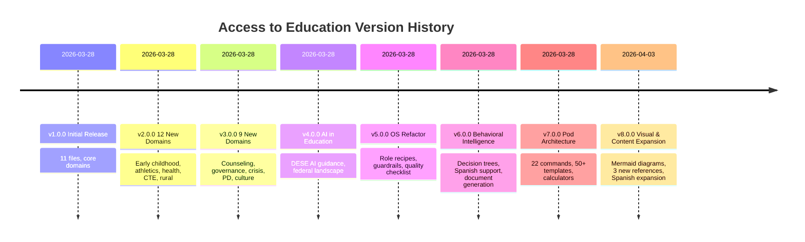

# Changelog — Access to Education

## v8.0.0 (2026-04-03) — Visual & Content Expansion
### Added
- Mermaid diagrams added to 80+ markdown files (flowcharts, timelines, Gantt charts)
- `references/special-needs/gifted-education.md` — 307 lines, gifted education guide
- `references/compliance/title-ix.md` — 410 lines, Title IX reference
- `references/special-needs/504-decision-tree.md` — 480 lines, 504 decision tree guide
- `templates/parent/cartas-padres-espanol.md` — 5 Spanish parent letter templates
- 3 new staff templates: paraprofessional, transportation, food service safety
- Quick-start role cards, printable checklists, keyword index, root `INDEX.md` site map
- 15 new glossary terms with Spanish translations
- GitHub Actions CI workflow, link checker and Mermaid validator scripts
- Worked examples added to FBA, AI policy, graduation audit, ELL planning templates
### Changed
- `references/guia-padres-espanol.md` expanded from 161 → 428 lines (+9 sections, 15 FAQs)
- `SKILL.md` expanded from 814 → 1,015 lines (counselor recipe, guardrails, 4 decision trees, cross-skill handoffs)
- `scripts/calculators.md` expanded from 212 → 565 lines (completed Decision Engine, IEP Progress Tracker)
- `references/scenario-walkthroughs.md` expanded from 10 → 22 scenarios
- `evals/test-cases.json` expanded from 30 → 95 test cases
- Cross-reference links added across 12 high-traffic files
- TOCs added to 19 long files, heading standardization across 8 templates

## v7.0.0 (2026-03-28) — Pod Architecture + Commands + Templates
### Added
- Pod-based directory structure (roles/, operations/, compliance/, programs/)
- `commands/COMMANDS.md` — 22 slash commands
- `templates/parent/letters.md` — 5 parent letter templates
- `templates/specialist/plans-and-forms.md` — 504 plan + FBA templates
- `templates/admin/plans-and-reports.md` — DSIP + equity audit + board presentation
- `templates/teacher/plans.md` — PD growth plan + lesson plan framework
- `templates/counselor/checklists.md` — college planning + crisis screening
- `templates/staff/checklists.md` — mandated reporter + new employee orientation
- `references/glossary.md` — 150+ education acronyms and terms
- `references/faq.md` — top 10 pre-built answers per role (parent, teacher, specialist, principal, admin)
- `scripts/` directory — calculators and generators
- `examples/` directory — sample outputs
- `CHANGELOG.md`
- Spanish parent rights guide
### Changed
- SKILL.md §4 routing updated to pod-level fast path
- SKILL.md §5 template routing expanded (6 → 12+ files, ~20 templates)
- CANONICAL_OWNERS.md rebuilt with v7 pod paths
- MANIFEST.json rebuilt with v7 structure
- Template organization: flat → role-based subdirectories
### Fixed
- CANONICAL_OWNERS.md had v5 flat paths (0 pod references)
- MANIFEST.json had v5 file paths

## v6.0.0 (2026-03-28) — Behavioral Intelligence
### Added
- SKILL.md §8: 5 decision trees (learning disability, discipline, IEP vs 504, A+ troubleshooting, complaint mechanism)
- SKILL.md §9: 12 follow-up anticipation rules
- SKILL.md §10: document generation routing (11 document types + 3 letter templates)
- SKILL.md §11: Spanish/bilingual response guidance (20-entry translation table, rights statement)
- `references/scenario-walkthroughs.md` — 10 complete journey narratives
- `references/mo-data-tables.md` — 17 structured lookup tables

## v5.0.0 (2026-03-28) — Operating System Refactor
### Added
- SKILL.md rewritten from index → operating system (13 sections)
- 7 role-adaptive response recipes with concrete structure templates
- 35+ quick-answer entries for instant factual responses
- 11 guardrail rules (6 stop-and-redirect + 5 tread-carefully)
- 5 cross-skill handoff rules
- 14-item response quality checklist
- `CANONICAL_OWNERS.md` — topic ownership map
- `LAST_VERIFIED.md` — data verification log
- `references/links-and-resources.md` — 70+ URLs
- `evals/test-cases.json` — 30 eval test cases
- `MANIFEST.json` — machine-readable skill index
### Changed
- Split `ai-in-education.md` (692 lines) → INDEX + 3 sub-files (all under 340)
- Split `curriculum-instruction.md` (546 lines) → INDEX + 2 sub-files (all under 290)
- SKILL.md description tightened from 2,579 → 811 characters
- SB 68 (device ban) added to technology-digital-learning.md
- AI section in technology-digital-learning.md replaced with canonical cross-reference
### Fixed
- All files now under 500-line threshold
- Zero orphan files
- Content fragmentation identified and canonical owners assigned

## v4.0.0 (2026-03-28) — AI in Education
### Added
- `references/ai-in-education.md` — 692 lines, 20 sections
- DESE AI Guidance (V1.0, 2025-26) grounded
- Federal AI landscape (DOE DCL, supplemental priority, DOL framework)
- AI for teaching, learning/reinforcement, communication, special populations
- AI literacy K-12 curriculum, policy development, academic integrity, data privacy, equity
- 15 AI-specific routing rules in SKILL.md

## v3.0.0 (2026-03-28) — 9 New Domains
### Added
- `curriculum-instruction.md`, `school-counseling.md`, `special-populations.md`
- `governance-policy.md`, `crisis-emergency.md`, `professional-learning.md`
- `compliance-calendar.md`, `mo-districts-regions.md`, `school-culture-climate.md`
- 6 templates (CSIP, AI policy, graduation audit, IEP checklist, safety plan, threat assessment)

## v2.0.0 (2026-03-28) — 12 New Domains
### Added
- `early-childhood.md`, `alternative-education.md`, `athletics-activities.md`
- `health-wellness.md`, `technology-digital-learning.md`, `educator-workforce.md`
- `facilities-operations.md`, `career-pathways.md`, `family-community.md`
- `discipline-behavior.md`, `data-reporting.md`, `rural-education.md`

## v1.0.0 (2026-03-28) — Initial Release
### Added
- 11 files: SKILL.md + 10 reference files
- Core domains: students, teachers, specialists, building-leaders, school-staff, administrators, assessments, funding-programs, equity-access, mo-education-law
