# Site Map -- Access to Education

**A visual index of every file in the Missouri K-12 Education Navigator repository.**

---

## Quick Navigation

- [Repository Structure Diagram](#repository-structure-diagram)
- [Root Files](#root-files)
- [Commands](#commands)
- [References: Roles](#references--roles)
- [References: Operations](#references--operations)
- [References: Compliance](#references--compliance)
- [References: Programs](#references--programs)
- [References: AI in Education](#references--ai-in-education)
- [References: Curriculum and Instruction](#references--curriculum-and-instruction)
- [References: Special Needs](#references--special-needs)
- [References: General](#references--general)
- [Templates: Parent](#templates--parent)
- [Templates: Admin](#templates--admin)
- [Templates: Specialist](#templates--specialist)
- [Templates: Teacher](#templates--teacher)
- [Templates: Counselor](#templates--counselor)
- [Templates: Staff](#templates--staff)
- [Templates: General](#templates--general)
- [Scripts](#scripts)
- [Examples](#examples)
- [Evals](#evals)
- [CI / Config](#ci--config)

---

## Repository Structure Diagram

```mermaid
graph LR
    ROOT["access-to-education/"]

    ROOT --> CORE["Core Files"]
    ROOT --> CMD["commands/"]
    ROOT --> REF["references/"]
    ROOT --> TPL["templates/"]
    ROOT --> SCR["scripts/"]
    ROOT --> EX["examples/"]
    ROOT --> EV["evals/"]
    ROOT --> GH[".github/"]
    ROOT --> CONF["Config Files"]

    CORE --> SKILL["SKILL.md"]
    CORE --> CLAUDE["CLAUDE.md"]
    CORE --> MANIFEST["MANIFEST.json"]
    CORE --> README["README.md"]
    CORE --> GETTING["GETTING_STARTED.md"]
    CORE --> CANON["CANONICAL_OWNERS.md"]
    CORE --> LAST["LAST_VERIFIED.md"]
    CORE --> CHANGE["CHANGELOG.md"]

    CMD --> CMDS["COMMANDS.md -- 22 slash commands"]

    REF --> ROLES["roles/"]
    REF --> OPS["operations/"]
    REF --> COMP["compliance/"]
    REF --> PROG["programs/"]
    REF --> AI["ai-in-education/"]
    REF --> CI["curriculum-instruction/"]
    REF --> SN["special-needs/"]
    REF --> GEN["General reference files"]

    ROLES --> R1["students.md"]
    ROLES --> R2["teachers.md"]
    ROLES --> R3["specialists.md"]
    ROLES --> R4["building-leaders.md"]
    ROLES --> R5["school-staff.md"]
    ROLES --> R6["administrators.md"]
    ROLES --> R7["school-counseling.md"]
    ROLES --> R8["substitute-teachers.md"]

    OPS --> O1["assessments.md"]
    OPS --> O2["crisis-emergency.md"]
    OPS --> O3["discipline-behavior.md"]
    OPS --> O4["health-wellness.md"]
    OPS --> O5["technology-digital-learning.md"]
    OPS --> O6["athletics-activities.md"]
    OPS --> O7["career-pathways.md"]
    OPS --> O8["data-reporting.md"]
    OPS --> O9["facilities-operations.md"]
    OPS --> O10["school-culture-climate.md"]

    COMP --> C1["mo-education-law.md"]
    COMP --> C2["compliance-calendar.md"]
    COMP --> C3["governance-policy.md"]
    COMP --> C4["funding-programs.md"]
    COMP --> C5["equity-access.md"]
    COMP --> C6["title-ix.md"]

    PROG --> P1["special-populations.md"]
    PROG --> P2["early-childhood.md"]
    PROG --> P3["alternative-education.md"]
    PROG --> P4["family-community.md"]
    PROG --> P5["educator-workforce.md"]
    PROG --> P6["professional-learning.md"]
    PROG --> P7["rural-education.md"]
    PROG --> P8["mo-districts-regions.md"]
    PROG --> P9["english-learners.md"]
    PROG --> P10["gifted-education.md"]

    AI --> A1["INDEX.md"]
    AI --> A2["ai-teaching-learning.md"]
    AI --> A3["ai-policy-governance.md"]
    AI --> A4["ai-literacy-career.md"]

    CI --> CI1["INDEX.md"]
    CI --> CI2["mo-learning-standards.md"]
    CI --> CI3["instructional-practice.md"]

    SN --> SN1["INDEX.md"]
    SN --> SN2["vision-impairment.md"]
    SN --> SN3["hearing-impairment.md"]
    SN --> SN4["motor-impairment.md"]

    GEN --> G1["glossary.md"]
    GEN --> G2["faq.md"]
    GEN --> G3["mo-data-tables.md"]
    GEN --> G4["links-and-resources.md"]
    GEN --> G5["scenario-walkthroughs.md"]
    GEN --> G6["guia-padres-espanol.md"]
    GEN --> G7["quick-start-cards.md"]
    GEN --> G8["keyword-index.md"]

    TPL --> TP["parent/"]
    TPL --> TA["admin/"]
    TPL --> TS["specialist/"]
    TPL --> TT["teacher/"]
    TPL --> TC["counselor/"]
    TPL --> TST["staff/"]
    TPL --> TGEN["General templates"]

    TP --> TP2["cartas-padres-espanol.md"]
    TS --> TS2["504-decision-tree.md"]
    TST --> TST2["paraprofessional-guide.md"]
    TST --> TST3["transportation-safety.md"]
    TST --> TST4["food-service-safety.md"]
    TGEN --> TG1["printable-checklists.md"]

    SCR --> SC1["calculators.md"]
    SCR --> SC2["run-evals.sh"]
    SCR --> SC3["check-links.sh"]
    SCR --> SC4["validate-mermaid.sh"]

    EX --> EX1["sample-outputs.md"]
    EV --> EV1["test-cases.json"]

    GH --> GHW["workflows/"]
    GHW --> GHW1["validate.yml"]
    CONF --> CONF1[".markdownlint.jsonc"]
```

---

## Root Files

| File | Description |
|------|-------------|
| [README.md](README.md) | Project overview, quick start guide, and repository structure summary |
| [SKILL.md](SKILL.md) | Core behavioral system -- the "operating system" with all rules (SS1-SS13) |
| [CLAUDE.md](CLAUDE.md) | Auto-activates the skill when opened in Claude Code |
| [MANIFEST.json](MANIFEST.json) | Machine-readable index mapping every topic to its canonical reference file |
| [GETTING_STARTED.md](GETTING_STARTED.md) | Step-by-step setup guide for new users (no coding required) |
| [CANONICAL_OWNERS.md](CANONICAL_OWNERS.md) | Defines which file owns which topic to prevent duplication |
| [LAST_VERIFIED.md](LAST_VERIFIED.md) | Data verification log tracking when facts were last checked and sourced |
| [CHANGELOG.md](CHANGELOG.md) | Version history from v1.0.0 through v7.1.0 |
| [LICENSE](LICENSE) | MIT license |

---

## Commands

| File | Description |
|------|-------------|
| [commands/COMMANDS.md](commands/COMMANDS.md) | Definitions for all 22 slash commands (`/start`, `/rights`, `/letter`, `/graduation`, `/iep-check`, `/policy`, `/csip`, `/safety-plan`, `/threat`, `/comply`, `/crisis`, `/lookup`, `/retire`, `/a-plus`, `/translate`, `/compare`, `/district`, `/enroll`, `/data`, `/pd`, `/walkthrough`, `/evaluate`) |

---

## References -- Roles

One file per audience, covering the topics most relevant to that role.

| File | Description |
|------|-------------|
| [references/roles/students.md](references/roles/students.md) | Graduation requirements, A+ program, discipline rights, FERPA, attendance |
| [references/roles/teachers.md](references/roles/teachers.md) | Certification, MEES evaluation, tenure, professional development, salary schedules |
| [references/roles/specialists.md](references/roles/specialists.md) | IEP process, 504 plans, IDEA disability categories, ELL, FBA, transition planning |
| [references/roles/building-leaders.md](references/roles/building-leaders.md) | CSIP development, staff evaluation, school safety, Title I operations |
| [references/roles/school-staff.md](references/roles/school-staff.md) | Paraprofessionals, school nurses, bus drivers, mandated reporting requirements |
| [references/roles/administrators.md](references/roles/administrators.md) | MSIP 6 accreditation, funding formulas, board governance, ESSA, charter schools |
| [references/roles/school-counseling.md](references/roles/school-counseling.md) | ASCA model, caseload management, college advising, crisis screening |
| [references/roles/substitute-teachers.md](references/roles/substitute-teachers.md) | Quick-reference guide for substitute teachers walking into any Missouri school |

---

## References -- Operations

How schools run day-to-day.

| File | Description |
|------|-------------|
| [references/operations/assessments.md](references/operations/assessments.md) | MAP, EOC, ACT, WIDA ACCESS, testing accommodations and scheduling |
| [references/operations/crisis-emergency.md](references/operations/crisis-emergency.md) | Emergency Operations Plans, active threat protocols, drills, reunification |
| [references/operations/discipline-behavior.md](references/operations/discipline-behavior.md) | PBIS frameworks, restorative practices, bullying policy, seclusion/restraint rules |
| [references/operations/health-wellness.md](references/operations/health-wellness.md) | Mental health services, SEL programs, suicide prevention protocols |
| [references/operations/technology-digital-learning.md](references/operations/technology-digital-learning.md) | 1:1 device programs, CIPA compliance, SB 68 device ban, digital citizenship |
| [references/operations/athletics-activities.md](references/operations/athletics-activities.md) | MSHSAA eligibility, concussion protocols, Title IX in athletics |
| [references/operations/career-pathways.md](references/operations/career-pathways.md) | CTE programs, dual credit, apprenticeships, industry certifications |
| [references/operations/data-reporting.md](references/operations/data-reporting.md) | MOSIS cycles, Core Data submissions, Annual Performance Report (APR) |
| [references/operations/facilities-operations.md](references/operations/facilities-operations.md) | ADA compliance, capital planning, lead/asbestos testing, facility maintenance |
| [references/operations/school-culture-climate.md](references/operations/school-culture-climate.md) | Climate surveys, belonging initiatives, equity audits |

---

## References -- Compliance

Law, policy, funding, and deadlines.

| File | Description |
|------|-------------|
| [references/compliance/mo-education-law.md](references/compliance/mo-education-law.md) | RSMo 160-178, DESE administrative rules, relevant case law |
| [references/compliance/compliance-calendar.md](references/compliance/compliance-calendar.md) | Month-by-month compliance requirements and reporting deadlines |
| [references/compliance/governance-policy.md](references/compliance/governance-policy.md) | Board policy development, Sunshine Law, superintendent evaluation |
| [references/compliance/funding-programs.md](references/compliance/funding-programs.md) | State funding formula, Title I-IV, Perkins grants, E-Rate |
| [references/compliance/equity-access.md](references/compliance/equity-access.md) | McKinney-Vento (homeless), foster care, migrant students, Title IX |
| [references/compliance/title-ix.md](references/compliance/title-ix.md) | Title IX compliance procedures, sexual harassment policies, athletics equity, grievance processes |

---

## References -- Programs

Populations and programs across Missouri K-12.

| File | Description |
|------|-------------|
| [references/programs/special-populations.md](references/programs/special-populations.md) | Military-connected, immigrant, teen parents, LGBTQ+ students |
| [references/programs/early-childhood.md](references/programs/early-childhood.md) | Pre-K programs, Head Start, First Steps, Parents as Teachers (PAT) |
| [references/programs/alternative-education.md](references/programs/alternative-education.md) | Virtual/MOCAP, homebound instruction, GED, credit recovery |
| [references/programs/family-community.md](references/programs/family-community.md) | Family engagement strategies, community schools, volunteer management |
| [references/programs/educator-workforce.md](references/programs/educator-workforce.md) | PSRS/PEERS retirement, teacher shortages, loan forgiveness programs |
| [references/programs/professional-learning.md](references/programs/professional-learning.md) | PLCs, instructional coaching, micro-credentials |
| [references/programs/rural-education.md](references/programs/rural-education.md) | Consolidation, 4-day school weeks, shared services models |
| [references/programs/mo-districts-regions.md](references/programs/mo-districts-regions.md) | District lookup, RPDC regions, enrollment demographics |
| [references/programs/english-learners.md](references/programs/english-learners.md) | ELL/ESL instruction, WIDA proficiency levels, sheltered instruction, Title III |
| [references/programs/gifted-education.md](references/programs/gifted-education.md) | Gifted & talented education, identification criteria, programming models, Missouri GTE requirements |

---

## References -- AI in Education

| File | Description |
|------|-------------|
| [references/ai-in-education/INDEX.md](references/ai-in-education/INDEX.md) | Router file -- read first, then load the relevant sub-file |
| [references/ai-in-education/ai-teaching-learning.md](references/ai-in-education/ai-teaching-learning.md) | AI-enhanced instruction, prompt engineering for educators, adaptive learning, AI tutoring |
| [references/ai-in-education/ai-policy-governance.md](references/ai-in-education/ai-policy-governance.md) | DESE AI guidance, academic integrity, AI data privacy, responsible AI frameworks |
| [references/ai-in-education/ai-literacy-career.md](references/ai-in-education/ai-literacy-career.md) | K-12 AI literacy curriculum, AI professional development, AI career readiness |

---

## References -- Curriculum and Instruction

| File | Description |
|------|-------------|
| [references/curriculum-instruction/INDEX.md](references/curriculum-instruction/INDEX.md) | Router file -- read first, then load the relevant sub-file |
| [references/curriculum-instruction/mo-learning-standards.md](references/curriculum-instruction/mo-learning-standards.md) | Missouri Learning Standards for ELA, math, science, social studies, fine arts, CS |
| [references/curriculum-instruction/instructional-practice.md](references/curriculum-instruction/instructional-practice.md) | Science of Reading, differentiation, co-teaching, standards-based grading, PBL |

---

## References -- Special Needs

Disability-specific depth guides.

| File | Description |
|------|-------------|
| [references/special-needs/INDEX.md](references/special-needs/INDEX.md) | Router file -- read first for any disability-specific question |
| [references/special-needs/vision-impairment.md](references/special-needs/vision-impairment.md) | Braille, TVI services, O&M, CVI, Missouri School for the Blind (MSB), ECC |
| [references/special-needs/hearing-impairment.md](references/special-needs/hearing-impairment.md) | ASL, cochlear implants, interpreters, Missouri School for the Deaf (MSD), audiology |
| [references/special-needs/motor-impairment.md](references/special-needs/motor-impairment.md) | OT/PT in schools, adaptive PE, assistive technology, wheelchair accessibility |

---

## References -- General

Standalone reference files at the top level of `references/`.

| File | Description |
|------|-------------|
| [references/glossary.md](references/glossary.md) | 150+ education acronyms and terms defined for non-specialist audiences |
| [references/faq.md](references/faq.md) | Top 10 pre-built FAQ answers per role for speed and consistency |
| [references/mo-data-tables.md](references/mo-data-tables.md) | 17 structured lookup tables with Missouri education facts, numbers, and dates |
| [references/links-and-resources.md](references/links-and-resources.md) | 70+ verified URLs to DESE portals, federal resources, and Missouri-specific tools |
| [references/scenario-walkthroughs.md](references/scenario-walkthroughs.md) | 10 complete step-by-step journey narratives for common education scenarios |
| [references/guia-padres-espanol.md](references/guia-padres-espanol.md) | Full parent rights guide in Spanish with English legal terms preserved |
| [references/quick-start-cards.md](references/quick-start-cards.md) | Quick-start role cards for all 7 roles with key tasks and first steps |
| [references/keyword-index.md](references/keyword-index.md) | Searchable keyword-to-file mapping for fast topic lookups across the repository |

---

## Templates -- Parent

| File | Description |
|------|-------------|
| [templates/parent/letters.md](templates/parent/letters.md) | 5 letter templates: evaluation request, records request, IEP meeting, dispute, 504 request |
| [templates/parent/cartas-padres-espanol.md](templates/parent/cartas-padres-espanol.md) | Spanish parent letter templates for evaluation requests, IEP meetings, records requests |

---

## Templates -- Admin

| File | Description |
|------|-------------|
| [templates/admin/csip-template.md](templates/admin/csip-template.md) | Comprehensive School Improvement Plan (CSIP) template |
| [templates/admin/ai-policy-template.md](templates/admin/ai-policy-template.md) | District AI Acceptable Use Policy template |
| [templates/admin/safety-plan-outline.md](templates/admin/safety-plan-outline.md) | School Emergency Operations Plan (EOP) outline |
| [templates/admin/threat-assessment-form.md](templates/admin/threat-assessment-form.md) | Threat assessment documentation form aligned to CSTAG |
| [templates/admin/plans-and-reports.md](templates/admin/plans-and-reports.md) | District School Improvement Plan (DSIP) and related reporting templates |
| [templates/admin/operational-forms.md](templates/admin/operational-forms.md) | Behavior contracts, administrative operational forms |

---

## Templates -- Specialist

| File | Description |
|------|-------------|
| [templates/specialist/iep-compliance-checklist.md](templates/specialist/iep-compliance-checklist.md) | IEP compliance audit checklist with all required components |
| [templates/specialist/iep-meeting-prep.md](templates/specialist/iep-meeting-prep.md) | IEP meeting preparation guide and progress monitoring templates |
| [templates/specialist/plans-and-forms.md](templates/specialist/plans-and-forms.md) | 504 accommodation plans, FBA templates, and specialist forms |

---

## Templates -- Teacher

| File | Description |
|------|-------------|
| [templates/teacher/plans.md](templates/teacher/plans.md) | PD growth plans and instructional planning templates |
| [templates/teacher/observation-prep.md](templates/teacher/observation-prep.md) | Observation and MEES evaluation preparation templates |
| [templates/teacher/classroom-admin.md](templates/teacher/classroom-admin.md) | Attendance trackers, classroom administration time-savers |
| [templates/teacher/classroom-communication.md](templates/teacher/classroom-communication.md) | Parent email templates and classroom communication tools |
| [templates/teacher/ell-planning.md](templates/teacher/ell-planning.md) | ELL lesson planning templates and student profile forms |
| [templates/teacher/sub-binder.md](templates/teacher/sub-binder.md) | Substitute teacher binder -- everything a sub needs for 1 day or 1 week |

---

## Templates -- Counselor

| File | Description |
|------|-------------|
| [templates/counselor/graduation-audit.md](templates/counselor/graduation-audit.md) | Student graduation credit audit worksheet |
| [templates/counselor/checklists.md](templates/counselor/checklists.md) | College planning checklists for juniors and seniors |
| [templates/counselor/caseload-management.md](templates/counselor/caseload-management.md) | Caseload management, needs assessment intake, and student support templates |

---

## Templates -- Staff

| File | Description |
|------|-------------|
| [templates/staff/checklists.md](templates/staff/checklists.md) | Mandated reporter reference, new employee orientation, and staff checklists |

---

## Scripts

| File | Description |
|------|-------------|
| [scripts/calculators.md](scripts/calculators.md) | 5 calculators: PSRS retirement, A+ eligibility, graduation credits, SPED timelines, funding estimates |
| [scripts/run-evals.sh](scripts/run-evals.sh) | Shell script to run eval test cases against the Claude API |

---

## Examples

| File | Description |
|------|-------------|
| [examples/sample-outputs.md](examples/sample-outputs.md) | 8 example responses showing target quality across all 7 roles plus parent audience |

---

## Evals

| File | Description |
|------|-------------|
| [evals/test-cases.json](evals/test-cases.json) | 30 test cases across all roles for validation and quality assurance |

---

*This index covers all 71+ files in the repository. For machine-readable routing, see [MANIFEST.json](MANIFEST.json). For topic ownership, see [CANONICAL_OWNERS.md](CANONICAL_OWNERS.md).*
