# Commands

Slash commands provide quick entry points into common workflows. When a user types a command (or describes the intent), execute the corresponding workflow.

```mermaid
graph TD
    CMD[22 Slash Commands]
    CMD --> INTAKE[Intake & Navigation]
    CMD --> PARENT[Parent Tools]
    CMD --> COMPLIANCE[Compliance & Policy]
    CMD --> SPECIALIST[Specialist Tools]
    CMD --> CALC[Calculators & Lookup]
    CMD --> OTHER[Scenarios & Language]

    INTAKE --> s1["/start"]
    INTAKE --> s2["/walkthrough"]
    INTAKE --> s3["/evaluate"]

    PARENT --> p1["/rights"]
    PARENT --> p2["/letter"]
    PARENT --> p3["/enroll"]

    COMPLIANCE --> c1["/comply"]
    COMPLIANCE --> c2["/policy"]
    COMPLIANCE --> c3["/csip"]
    COMPLIANCE --> c4["/safety-plan"]
    COMPLIANCE --> c5["/crisis"]
    COMPLIANCE --> c6["/threat"]

    SPECIALIST --> sp1["/iep-check"]
    SPECIALIST --> sp2["/graduation"]
    SPECIALIST --> sp3["/compare"]

    CALC --> ca1["/retire"]
    CALC --> ca2["/a-plus"]
    CALC --> ca3["/lookup"]
    CALC --> ca4["/district"]
    CALC --> ca5["/data"]

    OTHER --> o1["/translate"]
    OTHER --> o2["/pd"]
```

## Command Index

| Command | Description | Workflow |
|---------|-------------|---------|
| `/start` | New user intake — detect role, explain capabilities | Ask role → give 3-sentence overview of what this skill can do for that role → ask "What can I help you with?" |
| `/rights` | Parent rights lookup | Ask: "What topic? (IEP, discipline, records, enrollment, 504, other)" → load appropriate reference → deliver rights-first response |
| `/graduation [student name]` | Graduation audit | Load `templates/counselor/graduation-audit.md` → walk through credit tracker section by section |
| `/iep-check` | IEP compliance check | Load `templates/specialist/iep-compliance-checklist.md` → walk through each requirement |
| `/evaluate [topic]` | Quick evaluation request | Identify the topic → route to appropriate reference → deliver answer with the role recipe |
| `/letter [type]` | Generate a parent letter | Types: evaluation-request, records-request, iep-meeting, dispute, 504-request, attendance-excuse → load from `templates/parent/` |
| `/policy [type]` | Draft a district policy | Types: ai, discipline, bullying, attendance, device → load from `templates/admin/` |
| `/csip` | Build a school improvement plan | Load `templates/admin/csip-template.md` → guide through each section |
| `/safety-plan` | Build an emergency operations plan | Load `templates/admin/safety-plan-outline.md` → guide through each annex |
| `/threat` | Document a threat assessment | Load `templates/admin/threat-assessment-form.md` → guide through CSTAG steps |
| `/comply [month]` | Compliance check for a given month | Load `references/compliance/compliance-calendar.md` → show that month's requirements |
| `/lookup [statute]` | Look up a Missouri education statute | Load `references/mo-data-tables.md` Table 6 → find the statute → provide details |
| `/compare [IEP vs 504]` | Compare two processes or programs | Walk the decision tree from SKILL.md §8 |
| `/translate [text]` | Translate education content to Spanish | Apply §11 bilingual guidance → translate with English legal terms in parentheses |
| `/district [name or code]` | Look up a Missouri school district | Load `references/programs/mo-districts-regions.md` → provide available data |
| `/a-plus [check]` | A+ eligibility check | Walk the A+ troubleshooting decision tree from SKILL.md §8 |
| `/retire` | Retirement eligibility check | Ask age + years of service → calculate Rule of 80 → present options |
| `/crisis [type]` | Crisis response protocol | Load `references/operations/crisis-emergency.md` → deliver immediate action steps FIRST |
| `/enroll [special situation]` | Enrollment for special situations | Types: homeless, foster, military, immigrant, no-records → load `references/compliance/equity-access.md` + `references/programs/special-populations.md` |
| `/data [report]` | Data reporting help | Load `references/operations/data-reporting.md` → identify the cycle and requirements |
| `/pd [topic]` | Professional development guidance | Load `references/programs/professional-learning.md` → suggest PD aligned to the topic |
| `/walkthrough [journey]` | Step-by-step scenario walkthrough | Load `references/scenario-walkthroughs.md` → walk the matching journey |

## Command Behavior

- Commands are **shortcuts, not requirements** — users don't need to type the slash command. If someone says "can you help me write a letter to the school about getting my child tested," that's a `/letter evaluation-request`.
- Commands **always apply the role recipe** from §3 — detect the role first.
- Commands that generate documents should produce actual files when possible (see §10).
- If a command doesn't match exactly, find the closest match and confirm: "It sounds like you want to [X] — is that right?"
