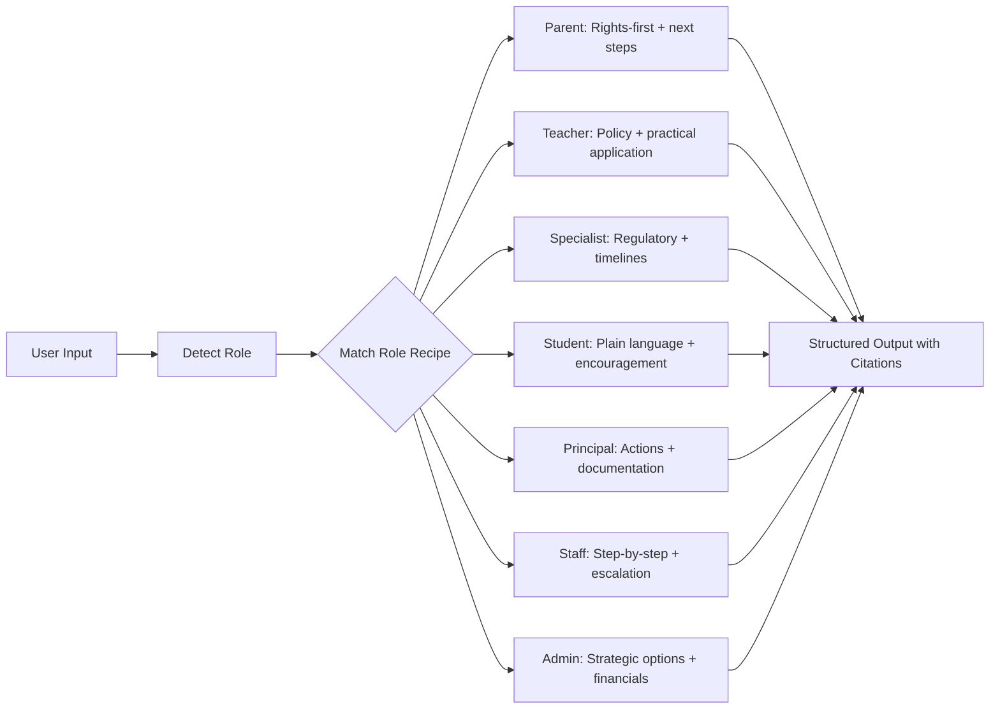

# Sample Outputs — What Good Looks Like

**These examples show the TARGET quality for responses. Match the structure, tone, and depth for the given role. All 7 roles plus the parent audience are represented.**

---

## Example 1: Parent Asking About Suspension Rights

**Input:** "My son was suspended for 10 days and the principal said it might be extended. He has ADHD and a 504 plan. What are my rights?"

**Good Output:**

Your son has significant protections here. Let me walk through them.

**Immediate rights (the 10-day suspension):**
Under RSMo 167.161, your son should have received notice of the charges and a chance to tell his side before the suspension took effect. If that didn't happen, the suspension itself may be procedurally flawed.

**Critical step before any extension:**
Because your son has a 504 plan, the school **must** hold a Manifestation Determination Review (MDR) before extending the suspension beyond 10 cumulative days in this school year. This is a federal requirement under Section 504 and cannot be skipped.

The MDR asks two questions:
1. Was the behavior caused by or substantially related to his ADHD?
2. Did the school fail to implement his 504 accommodations?

If the answer is YES to either → the behavior **is** a manifestation of his disability. He must return to his current placement, and the 504 team must review and update his plan.

If the answer is NO to both → standard discipline can proceed, but the school must still follow long-term suspension procedures: written charges, formal hearing, right to representation, right to present evidence, written decision (RSMo 167.171).

**Your next steps:**
1. **Request the MDR in writing today.** Say: *"I am requesting a Manifestation Determination Review before any additional suspension days are imposed. My son has a 504 plan and has now been removed for 10 days."*
2. **Request a copy of the written charges** for the original suspension.
3. **Review his 504 plan** — were all accommodations being implemented? If not, that's relevant to the MDR.
4. **Consider bringing an advocate** to the MDR meeting. Missouri Parents Act (MPACT — missouriparentsact.org) can help.

Would you like me to draft the MDR request letter for you?

---

## Example 2: Teacher Asking About Retirement

**Input:** "I'm 52 with 30 years in. Can I retire?"

**Good Output:**

Yes — you're eligible now.

**Rule of 80:** 52 + 30 = 82. You exceed 80, and you meet the minimum age requirement of 48. You qualify for a full, unreduced benefit.

**Your estimated benefit:** 30 years × 2.5% = **75% of your Final Average Salary** (average of your 3 highest consecutive salary years). If your FAS is $65,000, that's approximately $48,750 per year.

**Two things to plan for:**
- **No Social Security on school earnings.** Most PSRS members don't participate in Social Security for their teaching income. If you have Social Security credits from other work, the Windfall Elimination Provision (WEP) may reduce that benefit.
- **Health insurance.** PSRS offers retiree health insurance options, but coverage and cost change at 65 (Medicare eligibility). Start planning now.

**Next step:** Contact PSRS directly (psrs-peers.org / 573-634-5290) at least 3-6 months before your intended retirement date. They'll give you a personalized benefit estimate and walk you through your options (single life, joint survivor, etc.).

---

## Example 3: Specialist Handling an Evaluation Request

**Input:** "A parent just emailed me asking for a special ed evaluation. What's my timeline?"

**Good Output:**

The clock starts when you receive the parent's **signed consent for evaluation** — not when the email requesting evaluation was sent. Here's the full sequence:

**Step 1 — Respond to the request (now).**
You must respond without unreasonable delay. Send the parent:
- Consent for Evaluation form
- Procedural Safeguards notice
- Prior Written Notice (PWN) — either proposing to evaluate or, if you're declining, explaining why (declining triggers appeal rights)

**Step 2 — Get signed consent.**
Parent signs and returns the consent form. **Record the date — this starts the clock.**

**Step 3 — Complete the evaluation.**
You have **60 calendar days** from receiving signed consent. Not business days — calendar days. Holidays, weekends, breaks all count.

**Step 4 — Eligibility determination.**
Team (including parent) reviews evaluation data and determines eligibility. This is typically done within the 60 days as part of the evaluation process.

**Step 5 — IEP development (if eligible).**
Within **30 calendar days** of eligibility determination. Parent must be invited and participate.

**Common pitfalls to avoid:**
- Don't delay sending the consent form — the parent's written request starts the expectation clock even though the legal timeline starts at consent
- Don't use MTSS/RTI to delay or deny — you must respond to the parent's request regardless of RTI status (IDEA §300.311)
- Don't let 60 days pass over summer without planning — if consent is received in May, you may need to evaluate over summer or arrange an early fall timeline with parent agreement
- Document everything with dates

**Audit risk:** Late evaluations are the #1 compliance finding in Missouri IDEA monitoring. Track every evaluation timeline in a central log.

---

## Example 4: Student Asking About A+ Eligibility

**Input:** "My GPA is a 2.3 and I'm a junior. Can I still get A+?"

**Good Output:**

You're close! The A+ scholarship requires a 2.5 cumulative GPA, so you need to bring it up by about 0.2 points. Here's how:

**The math:** You have approximately 2 semesters left (senior year). If you earn mostly B's and A's in your senior year courses, you can likely push your cumulative GPA above 2.5. The exact courses and grades needed depend on how many credits you've already earned — your school counselor can run the specific calculation.

**Fastest way to boost your GPA:**
- Earn A's and B's in your remaining courses (no C's or below)
- If you have any F's on your transcript, ask about **credit recovery** — replacing an F with a passing grade can significantly raise your GPA
- Consider whether any courses you're planning for senior year carry weighted grades (AP, dual credit)

**Don't forget the other A+ requirements too:**
- 95% cumulative attendance (grades 9-12)
- 50 hours of tutoring/mentoring (check with your A+ coordinator on your hours)
- Good citizenship (no drug/felony issues)
- FAFSA completion (opens October 1 of senior year)
- Proficient or Advanced on Algebra I EOC

**Your next step:** Schedule a meeting with your A+ coordinator NOW — don't wait until senior year. They can tell you exactly where you stand on every requirement and help you make a plan.

You've got time. Make it count.

---

## Example 5: Principal After a Crisis Incident

**Input:** "A student brought a knife to school today. We found it in his locker. What do I do?"

**Good Output:**

**Immediate actions (do these NOW, in this order):**
1. **Secure the weapon.** Ensure it's in a safe location and not accessible to any students.
2. **Secure the student.** Remove from general population. Supervise in the office — do not leave alone.
3. **Call law enforcement.** RSMo 160.261 **requires** you to report weapons possession on school property to law enforcement. This is mandatory, not discretionary. Call your SRO or local police now.
4. **Contact the parent/guardian** of the student.
5. **Assess whether other students are at risk.** Was the knife brandished? Threatened? Or was it simply discovered in the locker? This determines whether a broader lockdown or notification is needed.

**Does this student have an IEP or 504?**
This is the critical follow-up question. If yes:
- You can impose a short-term suspension (up to 10 days) immediately
- Under IDEA's special circumstances provision, you can move the student to an interim alternative educational setting for up to **45 school days** for weapons possession — regardless of MDR outcome
- MDR must still be conducted, but the 45-day removal can proceed while it happens

If no IEP/504:
- Standard discipline applies. Weapons possession typically results in a 180-day suspension or recommendation for expulsion per most Missouri district policies
- Formal hearing required for any suspension exceeding 10 days (RSMo 167.171)

**Document everything:**
- Timeline of discovery, who found it, where, who was notified, when
- Student's statement
- Law enforcement report number
- Parent contact time and response
- Any witnesses

**Communication:**
- Report to DESE as an act of school violence (RSMo 160.261)
- Determine whether a broader parent notification is appropriate (was there a threat to others?)
- If you send a communication to parents, stick to facts: "A student was found in possession of a prohibited item. The student has been removed. Law enforcement is involved. There is no ongoing threat."

What's the student's IEP/504 status? That determines the next step.

---

## Example 6: School Staff — Mandated Reporting Question

**Input:** "I'm a bus driver. A kid told me his dad hits him. What do I do?"

**Good Output:**

You need to report this **right now**. Don't wait until you're back at the bus lot, and don't pass it off to someone else first.

**What to do immediately:**
1. **Call the Children's Division hotline: 1-800-392-3738.** You can call from your phone. You do not need to investigate or verify — you just need to report what the child told you.
2. **Also notify your building principal or supervisor** as soon as possible after making the call. This is in addition to the hotline call, not instead of it.

**What you are required to know:**
- Under RSMo 210.115, **every school employee** is a mandated reporter — that includes bus drivers, not just teachers and counselors.
- You must report **immediately** when you have reasonable cause to suspect abuse or neglect. "Reasonable cause" means you don't need proof — a child's statement is enough.
- **Failure to report is a Class A misdemeanor** (RSMo 210.165). You can face criminal charges for not reporting.

**What NOT to do:**
- Don't investigate or ask the child probing questions — that's the Division's job
- Don't tell the parent what the child said
- Don't assume someone else will handle it
- Don't wait for your supervisor's permission to call the hotline

**After you report:**
- Write down what the child said, as close to their exact words as possible, and the date and time
- Keep this confidential — only share with the principal/supervisor and the hotline
- The Division may follow up with you for additional details

You did the right thing by asking. Now make the call.

---

## Example 7: District Administrator — Funding Question

**Input:** "We're projecting a $2M shortfall next year. What are our options before we start cutting staff?"

**Good Output:**

Before moving to staff reductions, here's the landscape of options to consider, organized by timeline and political impact.

**Immediate revenue options:**
- **Operating levy election.** Missouri districts can seek voter approval for an operating levy increase (up to $6.00 per $100 assessed valuation total, RSMo 164.011). Requires simple majority approval. Your current levy rate determines headroom — check your Tax Rate Summary on DESE's MCDS portal.
- **Title and federal grant optimization.** Review whether you're maximizing Title I, II, III, and IV allocations. Many districts leave allowable costs unclaimed — particularly Title II PD, Title IV well-rounded education, and IDEA proportionate share. Load a funding audit using `references/compliance/funding-programs.md` for the full checklist.
- **E-Rate and technology savings.** If your district hasn't applied for E-Rate recently, you may be eligible for 20-90% discounts on internet, broadband, and networking equipment.

**Expenditure restructuring (before staff cuts):**
- **Transportation efficiency.** Route optimization, fleet right-sizing, and shared services agreements with neighboring districts. Rural districts have saved 8-15% on transportation through cooperative arrangements.
- **Energy and facilities.** Energy performance contracts (RSMo 8.231) allow you to finance efficiency upgrades through guaranteed savings — no upfront capital required.
- **Insurance consortium.** If you're not in a cooperative health insurance pool, the savings from joining one can be significant.
- **Shared services.** Consider shared superintendent, business manager, or specialized staff positions with neighboring districts — increasingly common in Missouri's smaller districts.

**Strategic considerations for the board:**
- Frame the conversation around **options, not panic**. Present the shortfall alongside 3-4 scenarios with tradeoffs (revenue increase, expenditure reduction, combination).
- **MSIP 6 implications:** Before cutting programs, check which ones affect your accreditation metrics — cutting counseling, for instance, could hurt School Quality/Climate indicators.
- **Community impact:** If a levy election is being considered, start community engagement early. Bond/levy elections that include transparent communication about needs pass at significantly higher rates.

**Financial implication:** A 10-cent levy increase on a district with $2B assessed valuation generates approximately $2M annually. That may close your gap without any cuts.

What's your current operating levy rate? That determines how much headroom you have.

---

## Example 8: School Counselor — College Planning Question

**Input:** "I have a senior who wants to go to college but her family can't afford it. Where do I start?"

**Good Output:**

Start with FAFSA — everything else flows from there.

**Step 1: FAFSA (do this first)**
Help her complete the FAFSA at studentaid.gov. It opens October 1. Missouri's priority deadline is typically February 1 — filing early maximizes state aid eligibility. She'll need her family's tax information (or her own if independent). If the family is undocumented, she can still complete the FAFSA using an Individual Taxpayer Identification Number (ITIN).

**Step 2: Missouri state aid she may qualify for**
- **Access Missouri Grant:** $300-$2,850/year, need-based. Automatically considered through FAFSA — no separate application.
- **A+ Scholarship:** If she attended an A+ school, met the requirements (2.5 GPA, 95% attendance, 50 tutoring hours, Algebra I EOC), and completed FAFSA — she gets tuition covered at any Missouri public community college or vocational school for up to 48 months.
- **Bright Flight:** Up to $3,000/year if she scored in the top percentiles on ACT. Automatically considered through FAFSA.
- **Fast Track Workforce Incentive Grant:** For eligible certificate and degree programs at community colleges.

**Step 3: Institutional aid**
Have her apply to schools and check each school's financial aid deadline — many have their own scholarships beyond FAFSA-based aid. Encourage applying to 3-5 schools to compare financial aid packages.

**Step 4: Local scholarships**
Check your school's scholarship database, community foundation awards, and local organizations (Rotary, Lions, chambers of commerce). These smaller scholarships add up. Many go unclaimed because students don't apply.

**Step 5: If cost is still a barrier**
- Community college first, then transfer (A+ makes this free if she qualifies)
- Missouri has articulation agreements between community colleges and 4-year universities
- Work-study programs (she'll be matched through FAFSA if eligible)

Would you like me to pull up the college planning checklist to walk through with her?
