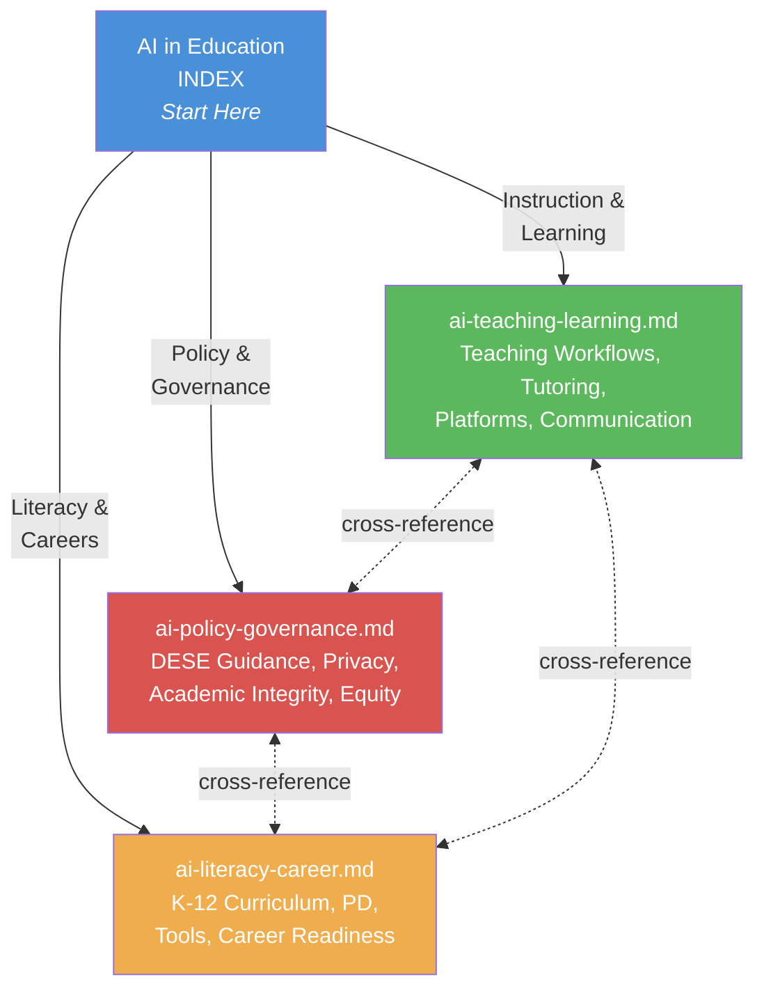

# AI in Education — Index

**Read this file first when any AI-in-education question arises. Then load the specific sub-file.**

## Sub-File Router

| Sub-File | When to Read |
|----------|-------------|
| `ai-in-education/ai-teaching-learning.md` | AI for instruction, lesson planning, differentiation, prompt engineering, AI tutoring, adaptive platforms, reinforcement, student-facing AI by grade band, AI for special populations/accessibility, AI for communication/administration |
| `ai-in-education/ai-policy-governance.md` | DESE AI guidance, federal AI landscape, district AI policy development, academic integrity, AI and student data privacy (FERPA/COPPA), AI and equity, responsible AI framework, AI governance, SB 68 device ban interaction |
| `ai-in-education/ai-literacy-career.md` | AI literacy curriculum K-12 (Five Big Ideas, CS Standards connection, grade-band progressions), AI professional development for educators, AI tools inventory, AI-resistant/AI-enhanced assessment design, AI and SEL, AI career readiness, parent communication about AI, emerging applications |

## Canonical Ownership

This domain owns the deep-dive on ALL AI-in-education topics. Other files may mention AI in passing but should cross-reference here for detail:
- `technology-digital-learning.md` → mentions AI tools, CIPA, data privacy → for AI-specific depth, come here
- `curriculum-instruction.md` → mentions CS standards → for AI literacy curriculum, come here
- `career-pathways.md` → mentions AI career credentials → for AI career readiness depth, come here
- `professional-learning.md` → mentions AI PD → for AI PD framework, come here
- `discipline-behavior.md` → mentions academic integrity → for AI-specific integrity, come here
- `governance-policy.md` → mentions AI policy → for AI policy development process, come here

## Key Quick-Reference Facts

- **DESE guidance:** Version 1.0 released 2025 for 2025-26 school year; developed by CS Advisory Council
- **Core principle:** AI enhances, never replaces, teacher work and human relationships
- **Local control:** each Missouri district develops its own AI policies
- **SB 68 (2025):** statewide ban on electronic communication devices in public schools — interacts with AI tool deployment
- **Federal:** U.S. DOE Dear Colleague Letter (2025) affirms federal funds may support responsible AI integration; AI designated as supplemental grantmaking priority
- **Data privacy:** never enter student PII into public AI tools; FERPA, COPPA, RSMo 161.096 all apply
