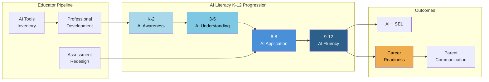

# AI Literacy, Professional Development & Career Readiness

<!-- Canonical source for: AI literacy K-12 curriculum, AI PD for educators, AI tools inventory, AI assessment design, AI and SEL, AI career readiness, parent communication, emerging applications -->
<!-- Last content review: 2026-03 -->

## Table of Contents
1. AI Literacy Curriculum (K-12)
2. AI Professional Development for Educators
3. AI Tools Commonly Used in Missouri Schools
4. AI-Resistant & AI-Enhanced Assessment
5. AI and Social-Emotional Learning
6. AI and Career Readiness
7. Parent & Community Communication About AI
8. Emerging AI Applications

---

## 7. AI Literacy Curriculum (K-12)

### Missouri Computer Science Standards Connection
Missouri's CS Standards (2019) include "Impacts of Computing" strand covering culture, social interactions, safety, law, and ethics — AI literacy maps directly to these standards.

### AI Literacy by Grade Band

**K-2: AI Awareness**
- What is a robot? What is a computer?
- Computers follow instructions (algorithms) — they don't "think" like humans
- AI in everyday life (voice assistants, recommendation systems, photo filters)
- Humans make the rules that computers follow
- Identifying "smart" devices vs. regular devices

**3-5: AI Understanding**
- How do machines "learn"? (training data, patterns, predictions)
- AI strengths (speed, pattern recognition, consistency) vs. human strengths (creativity, empathy, judgment)
- Bias in AI (if training data is biased, AI outputs are biased)
- AI and privacy (what data do AI tools collect about you?)
- Evaluating AI-generated content (is it accurate? is it fair?)
- Hands-on: train a simple AI model (Teachable Machine by Google)

**6-8: AI Application**
- How generative AI works (large language models, training data, probability)
- Prompt engineering basics (how to ask AI good questions)
- AI ethics scenarios (deepfakes, AI art, automated decisions)
- Bias and fairness in AI systems (facial recognition, hiring algorithms, criminal justice)
- Data privacy and AI (what happens to your data when you use an AI tool?)
- AI in careers (how is AI changing jobs in different industries?)
- Hands-on: use AI tools for research, writing, and coding with critical evaluation

**9-12: AI Fluency**
- Technical foundations (neural networks, machine learning, natural language processing — conceptual level)
- Ethical frameworks for AI (fairness, accountability, transparency, explainability)
- AI and society (labor market impact, surveillance, autonomous systems, environmental cost)
- AI policy and regulation (who governs AI? what laws apply?)
- AI and creative work (copyright, attribution, originality)
- AI career pathways (data science, ML engineering, AI ethics, prompt engineering, AI product management)
- Hands-on: build AI-powered projects, evaluate AI tools critically, develop AI use policies
- AP Computer Science and CTE connections

### AI Literacy Resources
| Resource | Type | Cost |
|----------|------|------|
| **AI for Education (aiforeducation.io)** | Frameworks, prompts, policy guidance | Free |
| **Google Teachable Machine** | Train a simple AI model (image, sound, pose) | Free |
| **MIT App Inventor + AI extensions** | Build AI-powered apps | Free |
| **AI4K12 (ai4k12.org)** | AI literacy framework (Five Big Ideas in AI) | Free |
| **Code.org AI modules** | Curriculum modules on AI ethics, bias, ML | Free |
| **Elements of AI (elementsofai.com)** | Intro to AI course (good for high school / PD) | Free |
| **Scratch + AI extensions** | Block-based programming with AI features | Free |
| **TeachAI (teachai.org)** | Policy toolkit, guidance, resources | Free |

### Five Big Ideas in AI (AI4K12)
1. **Perception:** computers perceive the world using sensors
2. **Representation & reasoning:** agents maintain representations of the world and use them for reasoning
3. **Learning:** computers can learn from data
4. **Natural interaction:** intelligent agents require many kinds of knowledge to interact naturally with humans
5. **Societal impact:** AI can impact society in both positive and negative ways

---

## 12. AI Professional Development for Educators

### PD Priority Areas
1. **AI literacy fundamentals** — what AI is, how it works, what it can and cannot do
2. **Prompt engineering** — how to get effective results from AI tools (Five S model)
3. **AI for lesson planning and differentiation** — practical workflow integration
4. **AI for assessment and feedback** — creating and evaluating AI-assisted assessments
5. **Academic integrity in the AI era** — assignment design, disclosure requirements, detection limitations
6. **Data privacy and AI** — what data can/cannot be entered, FERPA compliance
7. **Evaluating AI outputs** — accuracy, bias, appropriateness, quality
8. **Teaching AI literacy to students** — integrating AI concepts into curriculum
9. **Equity and AI** — access, bias, fairness
10. **Subject-specific AI integration** — AI in ELA, math, science, social studies, CTE, arts

### PD Delivery Models
- **DESE workshops** — DESE is providing professional development workshops on AI
- **RPDC training** — regional professional development centers offering AI integration PD
- **District-led PD** — building-level training on approved tools and policies
- **Peer learning** — teacher AI "champions" sharing practices with colleagues
- **Online self-paced** — AI for Education courses, ISTE AI courses, Google AI training
- **Conference sessions** — METC, MSTA, MSBA conferences increasingly include AI tracks

### MEES Connection
AI professional development connects to multiple MEES standards:
- Standard 1 (Content Knowledge): deepening content through AI-enhanced resources
- Standard 3 (Curriculum Implementation): using AI to differentiate and align
- Standard 4 (Critical Thinking): teaching students to critically evaluate AI
- Standard 7 (Assessment): using AI for formative assessment and feedback
- Standard 8 (Professionalism): continuous professional learning about emerging technology

---

## 13. AI Tools Commonly Used in Missouri Schools

### Generative AI (Teacher Use)
| Tool | Primary Use | Notes |
|------|-----------|-------|
| **ChatGPT (OpenAI)** | Lesson planning, content creation, brainstorming, differentiation | Requires age 13+; free tier available; privacy review needed |
| **Claude (Anthropic)** | Writing support, analysis, coding, lesson design | Requires age 13+; privacy review needed |
| **Google Gemini** | Integrated with Google Workspace; content creation, analysis | Google Workspace for Education integration |
| **Microsoft Copilot** | Integrated with Microsoft 365; content creation, analysis | Microsoft 365 Education integration |
| **Magic School AI** | Education-specific AI tools (lesson planning, IEP drafting, rubric creation) | Designed for educators; privacy-focused |
| **Canva AI** | Visual content creation with AI features | Education accounts available |
| **Diffit** | Generate differentiated reading materials at multiple levels from any source | Education-focused; free tier |

### Adaptive Learning Platforms (Student Use)
See Section 4 table for comprehensive list (Khan Academy, Waggle, DreamBox, Lexia, iReady, ALEKS, IXL, etc.)

### AI Assessment Tools
| Tool | Use |
|------|-----|
| **Formative (GoFormative)** | AI-enhanced formative assessment with real-time feedback |
| **Gradescope** | AI-assisted grading (primarily higher ed, growing in high school AP) |
| **Turnitin** | AI writing detection (use with caution — false positive risk) |

---

## 14. AI-Resistant & AI-Enhanced Assessment

### The Assessment Redesign Imperative
AI fundamentally challenges traditional assessment (take-home essays, worksheet-based homework, research reports written independently). Schools must redesign assessment rather than simply banning AI.

### Assessment Design Principles for the AI Era
1. **Assess process, not just product** — require evidence of thinking (drafts, annotations, recorded think-alouds)
2. **Assess in observable conditions** — in-class writing, oral exams, live demonstrations
3. **Assess uniquely personal content** — personal reflection, connections to classroom experiences, local context
4. **Assess higher-order thinking** — analysis, evaluation, synthesis, creation (harder for AI)
5. **Assess AI literacy itself** — evaluating AI outputs, prompt engineering, critical analysis of AI
6. **Assess collaboration** — group projects with individual accountability components
7. **Use portfolio-based assessment** — longitudinal evidence of growth and learning
8. **Embed conferencing** — student-teacher conferences to verify understanding

### Standards-Based Grading and AI
Standards-based grading (see `references/curriculum-instruction.md`) is well-suited to the AI era because it:
- Focuses on what students know and can demonstrate (not what they produced at home)
- Values multiple forms of evidence (not just written products)
- Emphasizes growth and mastery (multiple opportunities to demonstrate)
- Separates work habits from academic achievement (AI use is a work habit question, not an achievement question)

---

## 16. AI and Social-Emotional Learning

### Opportunities
- AI-powered SEL check-ins (mood tracking, social-emotional screeners)
- Personalized SEL content recommendations
- AI chatbots for low-stakes social skills practice
- Data analysis of climate surveys for SEL programming

### Risks
- Students forming emotional attachments to AI chatbots
- AI replacing human connection and counseling relationships
- Privacy concerns with emotional/behavioral data
- AI unable to recognize genuine crisis situations
- Over-reliance on AI for emotional regulation

### Guidelines
- AI should never replace human relationships for SEL
- Mental health screening and crisis intervention must involve trained humans
- Social-emotional data collected by AI tools is highly sensitive — highest privacy protections apply
- Students should understand the difference between talking to AI and talking to a trusted adult

---

## 17. AI and Career Readiness

### AI Skills as Career Readiness
Workforce demand for AI literacy is growing across all sectors. Schools should prepare students by:
- Integrating AI literacy into CTE pathways (all 16 career clusters)
- Teaching prompt engineering as a professional skill
- Connecting AI to Missouri Connections career planning
- Exposing students to AI career pathways (data science, ML engineering, AI ethics, AI product management)
- Work-based learning with employers using AI

### DOL AI Literacy Framework Connection
The U.S. Department of Labor's AI Literacy Framework (2026) identifies foundational knowledge areas for all workers — directly relevant to CTE and career readiness programs.

### Industry-Recognized Credentials in AI
- **Google AI Essentials Certificate**
- **Microsoft AI Fundamentals (AI-900)**
- **IBM AI Foundations for Everyone**
- **CompTIA Data+ / DataSys+**
- Growing list of AI-related IRCs relevant to CTE accountability

---

## 18. Parent & Community Communication About AI

### What Parents Need to Know
1. What AI tools are being used in their child's classroom (and why)
2. What data is collected and how it's protected
3. How academic integrity is maintained with AI
4. What their child is learning about AI literacy
5. How to talk to their child about AI use at home
6. What the district's AI policy is and how they can provide input
7. How to opt out of specific AI tools if available

### Communication Strategies
- Annual notification of AI tools used (similar to technology notification)
- Parent information sessions on AI in education
- FAQ on district website
- Include AI information in student/parent handbooks
- Parent advisory council input on AI policy
- Multilingual communication about AI (translated materials)

---

## 19. Emerging AI Applications

### Near-Term (Currently Deploying)
- Generative AI for teacher productivity
- Adaptive learning platforms with AI tutoring
- AI-powered formative assessment
- Translation and accessibility tools

### Medium-Term (1-3 Years)
- AI-powered individualized learning pathways (fully personalized curriculum)
- AI classroom assistants (real-time student engagement monitoring)
- AI-enhanced simulations and virtual labs
- AI-powered career counseling and college matching
- AI-generated interactive content (custom textbooks, dynamic simulations)

### Long-Term (3-5+ Years)
- AI learning companions (persistent, relationship-aware educational AI)
- AI-powered competency-based progression (AI manages the pace, teacher manages the learning)
- Multimodal AI tutors (voice, video, text, AR/VR)
- AI-assisted school design (facility planning, scheduling, resource allocation)
- AI-powered equity monitoring (real-time disparate impact analysis)

### Caution
Predictions about educational technology frequently overestimate speed of adoption and underestimate implementation challenges. Ground all AI planning in current research, student needs, and practical constraints.

---

---

→ For AI-enhanced teaching workflows, tutoring, and communication: see ai-in-education/ai-teaching-learning.md
→ For AI policy, academic integrity, data privacy, and governance: see ai-in-education/ai-policy-governance.md
