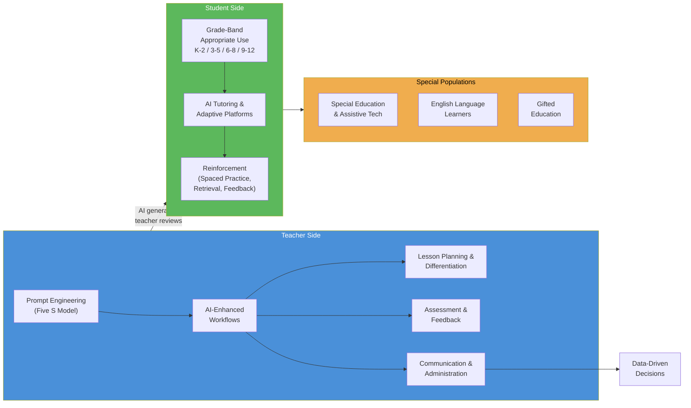

# AI for Teaching, Learning & Communication

<!-- Canonical source for: AI-enhanced teaching workflows, prompt engineering for educators, AI tutoring, adaptive learning, student-facing AI by grade band, AI for special populations, AI for communication/administration -->
<!-- Last content review: 2026-03 -->

## Table of Contents
1. AI-Enhanced Teaching Workflows
2. Prompt Engineering for Educators
3. What AI Should NOT Do in Instruction
4. AI for Student Learning & Reinforcement
5. Student-Facing AI by Grade Band
6. AI-Powered Learning Platforms
7. AI for Reinforcement (Learning Science)
8. AI for Communication & Administration
9. AI for School Counselor Workflows
10. AI for Data-Driven Decision Making
11. AI for Special Populations & Accessibility

---

## 3. AI for Teaching & Instruction

### AI-Enhanced Teaching Workflows
| Workflow | How AI Helps | Human Role |
|----------|-------------|-----------|
| **Lesson planning** | Generate lesson outlines, suggest activities, align to Missouri Learning Standards, create warm-ups and exit tickets | Teacher reviews, customizes, selects what fits their students |
| **Differentiation** | Create tiered materials at different reading levels, generate scaffolded questions, produce multilingual versions | Teacher assigns appropriate materials to students, monitors understanding |
| **Assessment creation** | Generate quiz questions, rubrics, multiple-choice items, constructed-response prompts aligned to standards | Teacher reviews for accuracy, rigor, and alignment; selects and edits items |
| **Feedback** | Draft narrative feedback on student writing, suggest revision strategies, identify common errors in student work | Teacher reviews, personalizes, and delivers feedback with relationship context |
| **Curriculum mapping** | Identify standards gaps, suggest pacing, cross-reference resources to standards | Teacher makes final decisions on scope, sequence, and pacing |
| **Resource discovery** | Find articles, videos, primary sources, simulations at appropriate levels | Teacher evaluates quality, appropriateness, and alignment |
| **Accommodation support** | Generate modified materials, alternative assignments, simplified texts, visual supports | Teacher/specialist reviews for accuracy and alignment with IEP/504 |
| **Communication** | Draft parent emails, newsletter content, conference notes, IEP meeting summaries | Teacher reviews for accuracy, tone, and FERPA compliance |

### AI as Co-Teacher (Not Replacement)
The research and policy consensus is clear: AI enhances teaching when it handles routine cognitive tasks (generating practice problems, providing initial feedback, organizing information) so teachers can focus on high-value human tasks (building relationships, motivating students, facilitating discussion, addressing social-emotional needs, making professional judgments).

### Prompt Engineering for Educators
DESE's guidance references the **"Five S" model** (from AI for Education):
1. **Situation** — define the context (grade level, subject, student characteristics)
2. **Specific task** — state exactly what you want the AI to produce
3. **Style** — specify format, tone, reading level, length
4. **Safeguards** — set constraints (avoid certain topics, align to specific standards, include only factual information)
5. **Share** — plan for how the output will be reviewed, edited, and shared

### What AI Should NOT Do in Instruction
- Replace teacher-student relationships
- Make high-stakes decisions about student placement, grades, or discipline without human review
- Serve as the sole source of instruction (students need human interaction)
- Grade subjective work without teacher review
- Generate IEP goals, 504 accommodations, or evaluation reports without specialist input
- Provide counseling, mental health support, or crisis intervention
- Communicate with parents without teacher review

---

## 4. AI for Student Learning & Reinforcement

### AI as Personalized Tutor
AI tutoring tools can provide:
- **Adaptive practice:** adjusts difficulty based on student performance in real time
- **Immediate feedback:** tells students what they got wrong and why, with hints and scaffolds
- **Spaced repetition:** surfaces previously missed concepts at optimal intervals
- **Multiple representations:** explains concepts in different ways (text, visual, step-by-step)
- **Unlimited patience:** students can ask the same question repeatedly without stigma

### Student-Facing AI Use Cases by Grade Band
| Grade Band | Appropriate AI Uses | Guardrails |
|-----------|-------------------|-----------|
| **K-2** | AI-powered reading tools (phonics practice, leveled readers with audio), math fact fluency games, adaptive learning apps under teacher supervision | No generative AI chatbot use; all AI tools teacher-selected and monitored; no student data collection beyond what's educationally necessary |
| **3-5** | Adaptive practice platforms (math, reading), AI-assisted research (with teacher guidance on evaluating sources), writing revision tools for grammar/mechanics, educational simulations | AI tools embedded in curriculum; teacher reviews AI suggestions before students see them; explicit instruction on "AI is not always right" |
| **6-8** | AI writing assistants for drafting and revision (not final product), research tools, math problem-solving assistants, coding platforms with AI support, career exploration | Students learn to verify AI outputs; academic integrity expectations explicit; assignments designed to be AI-enhanced (not AI-completed) |
| **9-12** | Generative AI as a thinking partner (brainstorming, outlining, debugging code, analyzing data), college application essay revision, career pathway exploration, AP/dual credit study support | Students demonstrate understanding independently; AI use disclosed per policy; critical evaluation of AI outputs is a learning objective; original thinking valued over AI-polished output |

### AI-Powered Learning Platforms in Missouri Schools
| Platform | Type | Use |
|----------|------|-----|
| **Khan Academy / Khanmigo** | Adaptive tutoring | Math, science, test prep — AI tutor provides hints and explanations |
| **Waggle** | Adaptive practice | ELA and math practice with AI-driven recommendations |
| **Curipod** | Interactive presentations | AI-generated discussion prompts, formative assessment |
| **DreamBox** | Adaptive math | K-8 adaptive math with intelligent sequencing |
| **Lexia Core5 / PowerUp** | Adaptive reading | AI-driven reading instruction and intervention |
| **iReady** | Diagnostic + instruction | AI-adaptive diagnostic and personalized learning paths |
| **ALEKS** | Adaptive math | AI-powered assessment and learning for math |
| **IXL** | Adaptive practice | AI-powered recommendations across subjects |
| **Duolingo** | Language learning | AI-adaptive language instruction |
| **Grammarly / ProWritingAid** | Writing support | AI-powered grammar, style, and clarity suggestions |

### AI for Reinforcement & Practice
Effective AI-powered reinforcement follows learning science principles:
- **Spaced practice:** AI schedules review of previously learned material at optimal intervals
- **Interleaving:** AI mixes problem types rather than blocking by topic
- **Retrieval practice:** AI prompts students to recall information (not just re-read)
- **Immediate corrective feedback:** AI provides feedback during practice (not days later)
- **Metacognition prompts:** AI asks students to rate their confidence, explain their reasoning, or predict their performance

---

## 5. AI for Communication & Administration

### Administrative AI Use Cases
| Function | AI Application | Human Oversight Required |
|----------|---------------|------------------------|
| **Parent communication** | Draft newsletters, email updates, event announcements, translation of communications into multiple languages | Review for accuracy, tone, FERPA compliance before sending |
| **IEP/504 documentation** | Draft present levels, summarize evaluation data, suggest goal language based on data | Specialist must review, customize, and own all final IEP/504 content |
| **Scheduling** | Optimize master schedules, identify conflicts, generate course recommendation sequences | Human review for equity, student needs, teacher preferences |
| **Data analysis** | Identify patterns in attendance, grades, behavior; generate early warning flags | Educators interpret data in context; AI identifies patterns, humans make decisions |
| **Report writing** | Draft school improvement plan sections, board reports, grant narratives | Administrator reviews, edits, and takes ownership of all content |
| **Professional development** | Personalize PD recommendations based on teacher evaluation data and goals | PD coordinator reviews recommendations; teacher chooses learning path |
| **Substitute plans** | Generate emergency sub plans from curriculum documents and lesson plan archives | Teacher reviews before filing; substitute follows teacher-approved plans |
| **Translation/interpretation** | Real-time translation for parent communication, document translation | Professional interpreter for high-stakes meetings (IEP, discipline); AI translation for routine communication |
| **Social media** | Draft posts, suggest content calendar, monitor mentions | Staff reviews all posts before publishing; FERPA awareness |

### AI for School Counselor Workflows
| Task | AI Support | Counselor Role |
|------|-----------|---------------|
| **College list generation** | Suggest college matches based on student profile (GPA, interests, geography, cost) | Counselor validates matches, discusses with student and family |
| **Scholarship search** | Identify potential scholarships based on student demographics and interests | Counselor verifies eligibility, helps with applications |
| **FAFSA support** | Answer common FAFSA questions, walk through form fields | Counselor handles sensitive financial conversations, verifies completion |
| **Career exploration** | Generate career profiles, compare pathways, suggest CTE connections | Counselor facilitates deeper exploration, considers student context |
| **Communication drafts** | Draft recommendation letters (teacher provides specific details), parent outreach emails | Counselor reviews and personalizes all communications |

### AI for Data-Driven Decision Making
- **Early warning systems:** AI analyzes attendance, behavior, and course performance (ABC) data to flag at-risk students earlier than manual review
- **Assessment analysis:** AI identifies item-level patterns, misconceptions, and standards gaps across classrooms
- **Enrollment forecasting:** AI models predict enrollment trends for budget and staffing planning
- **Resource allocation:** AI identifies where resources (interventionists, tutoring, supplies) would have the greatest impact

---

## 6. AI for Special Populations & Accessibility

### AI and Special Education
| Application | How AI Helps | Cautions |
|------------|-------------|---------|
| **Assistive technology** | Text-to-speech, speech-to-text, word prediction, image description, sign language translation | AT decisions must be made by the IEP team, not AI |
| **Progress monitoring** | AI analyzes IEP goal progress data, identifies trends, suggests instructional adjustments | Specialists interpret data in context; AI supplements, not replaces, professional judgment |
| **Material modification** | Generate simplified text, visual supports, graphic organizers, alternate formats | Specialist reviews modifications for accuracy and alignment to IEP goals |
| **Communication supports** | AAC devices with AI-enhanced language prediction; AI-powered communication boards | Selection and programming by qualified SLP or AT specialist |
| **Behavior analysis** | Pattern recognition in behavioral data (ABC data analysis) | FBA must be conducted by trained professional; AI assists with data organization |

### AI and English Language Learners
- Real-time translation of instructional materials
- AI-powered language practice (pronunciation, vocabulary, grammar)
- Scaffolded content at multiple proficiency levels
- Multilingual parent communication
- Caution: AI translation quality varies; professional translation for high-stakes documents (IEP, discipline, enrollment)

### AI and Gifted Education
- AI-powered enrichment and acceleration platforms
- Complex problem generation at advanced levels
- Research assistance for independent projects
- Creative writing and coding partners
- Caution: gifted students may over-rely on AI; emphasize original thinking

### AI Accessibility Features
- Screen readers enhanced by AI (better image descriptions, document understanding)
- AI-powered captioning for deaf/hard of hearing students
- AI voice generation for students with speech impairments
- AI text simplification for students with cognitive disabilities
- AI-powered visual aids for students with vision impairments

---

---

→ For AI policy, academic integrity, data privacy, and governance: see ai-in-education/ai-policy-governance.md
→ For AI literacy curriculum, PD, tools inventory, and career readiness: see ai-in-education/ai-literacy-career.md
