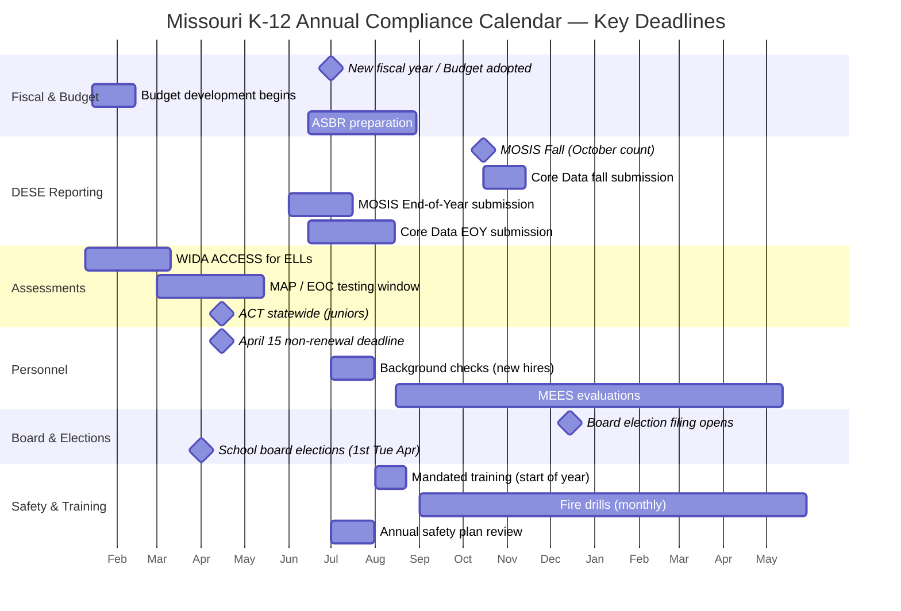

# Compliance Calendar & Checklists — Missouri K-12 Education Reference

## Table of Contents
1. Annual Compliance Calendar (Month-by-Month)
2. DESE Reporting Deadlines
3. Federal Compliance Requirements
4. Special Education Compliance Checklist
5. Title I Compliance Checklist
6. FERPA Annual Compliance
7. Safety & Health Compliance
8. Board Governance Compliance
9. Human Resources Compliance
10. Financial Compliance
11. OCR / Civil Rights Self-Assessment
12. Audit Preparation Guide

---

## 1. Annual Compliance Calendar (Month-by-Month)

### July
- New fiscal year begins (July 1)
- Board adopts annual budget
- New employee onboarding and background checks (RSMo 168.133)
- Verify all teacher certifications are current
- Review and update school safety plans (RSMo 160.660)
- Update student/parent handbooks
- Post annual FERPA notice

### August
- Begin-of-year mandated training (mandated reporter, bloodborne pathogens, emergency procedures, FERPA)
- Kindergarten readiness assessment planning
- Home Language Surveys for new enrollees (ELL identification)
- Post annual non-discrimination notice (Title VI, Title IX, Section 504, ADA)
- Parents as Teachers home visiting begins
- Open enrollment / transfer deadline verification

### September
- McKinney-Vento liaison identifies homeless students
- Free/reduced meal applications processed
- 504 plan reviews for returning students
- IEP reviews for returning students (verify annual review dates)
- First fire drill of the year
- Title I Annual Parent Meeting
- Distribute procedural safeguards to parents of students with IEPs

### October
- **October count date** (MOSIS fall data submission — enrollment, demographics, programs)
- Core Data fall submission
- MSIP 6 data review (APR indicators)
- FAFSA opens (October 1) — begin FAFSA completion events for seniors
- National Bullying Prevention Month
- Red Ribbon Week (drug awareness)
- First tornado drill

### November
- Veterans Day — military-connected student recognition
- Parent-teacher conferences (fall)
- Review A+ student eligibility progress
- First earthquake drill
- Pre-holiday safety communications
- Review CSIP progress (mid-year check)

### December
- School board election filing period opens
- Semester exam administration
- First semester grade reporting
- Review IEP annual review schedule for spring
- Grant deadlines (various — check DESE, federal, foundation calendars)

### January
- WIDA ACCESS for ELLs testing window opens
- MAP Alternate Assessment planning
- MLK Jr. Day — equity and inclusion programming
- A+ student progress reports (mid-year GPA, attendance, tutoring hours check)
- Budget development process begins for next fiscal year
- School board filing deadline (typically late January)

### February
- Missouri FAFSA priority deadline (typically February 1)
- Black History Month programming
- School counselor week
- Continue ACCESS testing
- Accreditation review preparation (if in review year)
- Spring assessment preparation (MAP, EOC)

### March
- MAP testing window begins (typically March)
- EOC exams administered upon course completion
- Spring parent-teacher conferences
- **April 15 notification deadline** approaching — prepare non-renewal notices for non-tenured teachers (RSMo 168.126)
- School board candidate forums/elections in April — preparation
- Title I program review

### April
- **School board elections** (first Tuesday in April)
- **April 15: Non-renewal notification deadline** for non-tenured teachers (RSMo 168.126)
- MAP/EOC testing continues
- ACT statewide administration for juniors
- Special education child count verification
- Teacher appreciation week (typically first week of May — plan ahead)
- Earth Day / environmental education programming

### May
- MAP/EOC testing closes
- Teacher Appreciation Week
- End-of-year IEP reviews and transition meetings
- Kindergarten registration/enrollment for next year
- Senior graduation ceremonies
- A+ eligibility verification for graduating seniors
- End-of-year MOSIS data preparation

### June
- **End-of-year MOSIS submission** (attendance, discipline, grades, assessment, exit codes)
- Core Data end-of-year submission
- Annual financial audit preparation
- Personnel contracts for next year
- Summer school / extended school year (ESY) services begin
- DESE compliance reports due (various deadlines)
- Budget finalization for next fiscal year
- ASBR (Annual Secretary of the Board Report) preparation

---

## 2. DESE Reporting Deadlines

| Report | Approximate Deadline | Description |
|--------|---------------------|-------------|
| **MOSIS Fall** | October (count date) | Enrollment, demographics, program participation |
| **MOSIS EOY** | June-July | Attendance, discipline, grades, credits, assessment, exits |
| **Core Data Fall** | October-November | Staffing, financial, facilities, programs |
| **Core Data EOY** | June-August | Updated staffing, financial data |
| **ASBR** | August-September | Annual Secretary of the Board Report (financial) |
| **CSIP** | Varies (typically fall) | Comprehensive School Improvement Plan submission |
| **Perkins V CLNA** | Biennial (every 2 years) | Comprehensive Local Needs Assessment for CTE |
| **IDEA Annual Report** | Varies | Special education performance data |
| **Title I-IV Plans** | Varies (typically summer/fall) | Consolidated federal program plans |
| **Safety Plan** | Annual update | Building-level safety plan on file |

---

## 3. Federal Compliance Requirements

### Annual Federal Compliance Actions
| Action | Basis | Responsible Party |
|--------|-------|------------------|
| Post FERPA notice | 20 U.S.C. §1232g | District administration |
| Post non-discrimination notice | Title VI, IX, 504, ADA | District administration |
| Distribute teacher qualification info to parents | ESSA | Building administration |
| Publish school report cards | ESSA | District / DESE |
| File CRDC data | OCR | District data coordinator |
| Submit EDFacts data | ESSA | DESE (via MOSIS) |
| Single Audit (if >$750K federal expenditures) | 2 CFR Part 200 | District CFO / auditor |
| Conduct annual FRPM verification | USDA | Food service |
| Update Title I parent engagement policy | ESSA | Title I coordinator |
| Ensure ELL identification for new enrollees | Title VI / EEOA / Title III | Building enrollment staff |

---

## 4. Special Education Compliance Checklist

### Annual / Ongoing
- [ ] IEP annual reviews conducted within 365 days of previous IEP
- [ ] Triennial reevaluations conducted within 3 years (or waived by agreement)
- [ ] Evaluations completed within 60 calendar days of receiving parent consent
- [ ] IEPs in effect at the start of the school year
- [ ] Prior Written Notice (PWN) provided for all proposed/refused actions
- [ ] Procedural safeguards distributed (at initial referral, first complaint, annually upon request)
- [ ] Transition services in IEPs by age 16 (at latest)
- [ ] Age of majority notification at least 1 year before student turns 18
- [ ] LRE data accurate (placement settings reported correctly)
- [ ] Related services delivered per IEP (documentation maintained)
- [ ] Discipline procedures followed for students with IEPs (MDR at 10+ cumulative days)
- [ ] ESY considered for all students (documented in IEP)
- [ ] Assistive technology considered for all students (documented in IEP)
- [ ] Child Find activities conducted (public awareness, screening)
- [ ] Private school proportionate share services provided
- [ ] IDEA Part B maintenance of effort (MOE) maintained
- [ ] Significant disproportionality data reviewed (CCEIS if identified)

---

## 5. Title I Compliance Checklist

- [ ] Needs assessment completed and documented
- [ ] Title I schools identified and served by poverty rank-order
- [ ] Schoolwide or Targeted Assistance model correctly implemented
- [ ] Supplement-not-supplant requirement met
- [ ] Comparability demonstrated (state/local funding comparable across schools)
- [ ] 1% parent engagement set-aside (if allocation >$500K)
- [ ] Homeless student set-aside provided
- [ ] Annual Title I parent meeting held
- [ ] School-parent compacts jointly developed and distributed
- [ ] Parent engagement policy developed with parent input
- [ ] Teacher qualification notifications sent to parents
- [ ] CSI/TSI schools identified; improvement plans developed
- [ ] Evidence-based interventions documented (ESSA Tier 1-4)
- [ ] Expenditures properly coded and documented
- [ ] Time-and-effort documentation for Title I-funded staff

---

## 6. FERPA Annual Compliance

- [ ] Annual FERPA notification distributed to parents/eligible students
- [ ] Directory information categories defined and opt-out provided
- [ ] Staff trained on FERPA (especially new staff)
- [ ] Vendor agreements include FERPA-compliant data privacy language
- [ ] Records access requests responded to within 45 days
- [ ] Amendment request procedures in place
- [ ] Complaint procedures documented
- [ ] Technology vendor privacy review completed for all new tools
- [ ] Data breach response plan in place

---

## 7. Safety & Health Compliance

- [ ] Building safety plan reviewed and updated annually (RSMo 160.660)
- [ ] Fire drills conducted monthly (State Fire Marshal)
- [ ] Tornado drills conducted 2x/year
- [ ] Earthquake drills conducted 2x/year
- [ ] Lockdown drills conducted 2x/year
- [ ] Bus evacuation drill conducted 1x/year
- [ ] AED inspected monthly
- [ ] First aid kits inspected and restocked
- [ ] Immunization records current for all enrolled students (RSMo 167.181)
- [ ] Asbestos Management Plan on file and accessible (AHERA)
- [ ] Asbestos re-inspection (every 3 years by accredited inspector)
- [ ] Lead in drinking water tested (per EPA/state guidance)
- [ ] Mandated reporter training for all staff (annual recommended)
- [ ] Concussion information distributed to athletes and parents (RSMo 167.765)
- [ ] Bloodborne pathogen training for all staff (OSHA)
- [ ] Fire inspection passed (annual)
- [ ] Playground inspected (routine + annual comprehensive)

---

## 8. Board Governance Compliance

- [ ] Board meetings posted with 24-hour notice (RSMo 610.020)
- [ ] Minutes taken at all open meetings and available for public inspection
- [ ] Closed sessions properly motioned with specific RSMo 610.021 citation
- [ ] Votes recorded by roll call
- [ ] Conflict of interest disclosures made (RSMo 162.215)
- [ ] Financial disclosures filed (if applicable — RSMo 105.483)
- [ ] Policies reviewed on cycle (3-5 years; critical policies annually)
- [ ] Superintendent evaluated annually
- [ ] Board self-assessment conducted
- [ ] New board member orientation completed

---

## 9. Human Resources Compliance

- [ ] Background checks completed for all new employees BEFORE employment begins (RSMo 168.133)
- [ ] Teaching certificates verified as current for all certified staff
- [ ] Non-renewal notices sent by April 15 for non-tenured teachers (RSMo 168.126)
- [ ] Tenure determinations made after 5 consecutive years (RSMo 168.104)
- [ ] MEES evaluations completed per schedule (non-tenured: annually; tenured: per district schedule)
- [ ] Mentoring program provided for new teachers (RSMo 168.028)
- [ ] Substitute certificates verified (60+ credit hours; background check)
- [ ] Paraprofessional qualifications verified (ESSA requirements for Title I schools)
- [ ] Workers' compensation coverage maintained
- [ ] FMLA procedures in place (districts with 50+ employees)
- [ ] Equal Employment Opportunity (EEO) posting displayed

---

## 10. Financial Compliance

- [ ] Annual budget adopted before July 1
- [ ] Public budget hearing held
- [ ] Independent financial audit completed annually (RSMo 165.121)
- [ ] Single Audit completed if federal expenditures exceed $750,000
- [ ] ASBR submitted to DESE
- [ ] Tax levy set and certified
- [ ] Bond compliance (if applicable — arbitrage, continuing disclosure, use of proceeds)
- [ ] Prevailing wage compliance for construction projects over $75,000 (RSMo 290.210)
- [ ] Purchasing procedures followed (competitive bidding for amounts exceeding board threshold)
- [ ] Fund accounting maintained properly (Fund 1-4+)
- [ ] Federal grant expenditures documented and allowable

---

## 11. OCR / Civil Rights Self-Assessment

### Areas to Self-Audit
- [ ] Discipline data disaggregated by race, gender, disability — disparities identified and addressed
- [ ] Access to advanced coursework (AP, IB, dual credit, gifted) equitable across subgroups
- [ ] Special education identification rates reviewed for disproportionality
- [ ] ELL services provided to all identified English Learners
- [ ] Title IX compliance: equitable athletic opportunities; sexual harassment procedures in place
- [ ] Section 504 procedures in place: identification, evaluation, plan development, annual review
- [ ] Facilities accessible (ADA compliance)
- [ ] Non-discrimination policy posted and distributed
- [ ] Complaint/grievance procedures accessible and well-known
- [ ] Staff trained on civil rights obligations (Title VI, IX, 504, ADA)

---

## 12. Audit Preparation Guide

### Preparing for Financial Audit
1. Reconcile all bank accounts and funds
2. Ensure all journal entries are documented with supporting evidence
3. Verify payroll records and tax filings
4. Compile federal grant documentation (expenditures, time-and-effort, match)
5. Prepare list of fixed assets and depreciation schedules
6. Review accounts payable and receivable aging
7. Compile board meeting minutes and financial approvals
8. Organize contracts and MOUs
9. Prepare management letter responses from prior year audit
10. Designate audit liaison and prepare work space for auditors

### Preparing for DESE Compliance Review
1. Compile all required policies (current board-adopted versions)
2. Organize special education files (IEPs, evaluations, PWN, procedural safeguards distribution)
3. Prepare Title I documentation (needs assessment, parent engagement, expenditures, evidence-base for interventions)
4. Compile ELL documentation (HLS, screening, program placement, parent notification, ACCESS results)
5. Prepare discipline data reports (disaggregated by subgroup)
6. Organize safety plan documentation (plans, drill logs, training records)
7. Compile PD documentation (training records, agendas, sign-in sheets)
8. Prepare CSIP/DSIP documentation (plans, progress monitoring, stakeholder input evidence)
9. Designate point of contact for each compliance area
