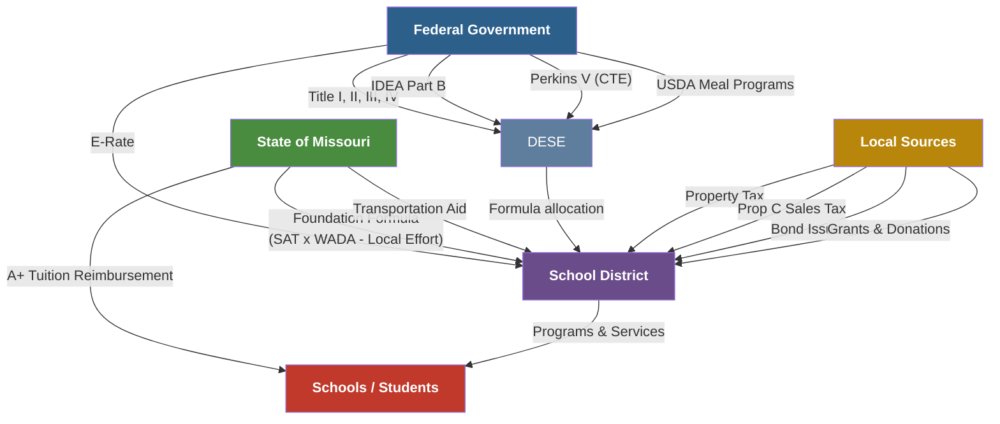

# Funding & Programs — Missouri K-12 Education Reference

## Table of Contents
1. State Funding Formula (Overview)
2. Title I — Improving Basic Programs
3. Title II — Supporting Effective Instruction
4. Title III — English Language Acquisition
5. Title IV — Student Support and Academic Enrichment
6. IDEA Part B — Special Education Funding
7. Perkins V — Career and Technical Education
8. A+ Schools Program Funding
9. School Meal Programs
10. E-Rate and Technology Funding
11. Transportation Funding
12. Bond Issues and Capital Funding
13. Grants and Supplemental Funding Sources



---

## 1. State Funding Formula (Overview)

### Foundation Formula (SB 287)
Missouri's education funding formula calculates state aid based on the difference between what a district needs to spend (based on SAT × WADA) and what it can raise locally.

**Simplified calculation:**
```
State Aid = (SAT × WADA) − Local Effort
```

### Key Terms
| Term | Definition |
|------|-----------|
| **SAT (State Adequacy Target)** | Per-pupil funding target set by the legislature; represents the cost of an adequate education |
| **ADA (Average Daily Attendance)** | Average number of students attending school daily |
| **WADA (Weighted ADA)** | ADA adjusted by weighting factors for special populations |
| **Local Effort** | Revenue generated from local property taxes and Proposition C sales tax |

### Weighting Factors
Additional weights increase WADA for districts serving:
- **Free/Reduced Lunch eligible students** — additional weight reflects the higher cost of serving economically disadvantaged students
- **Students with IEPs** — reflects cost of special education services
- **English Language Learners** — reflects cost of ELL services
- **Transportation-eligible students** — reflects transportation costs

### Hold Harmless
Districts cannot receive less state aid than they received in a designated base year. This prevents sudden funding drops when formula changes would otherwise reduce a district's allocation.

### Adequacy vs. Equity
The formula attempts to balance:
- **Adequacy:** ensuring every district has enough funding for an adequate education
- **Equity:** providing more state aid to districts with less local wealth

---

## 2. Title I — Improving Basic Programs

### Purpose
Provide supplemental academic support to students in high-poverty schools to help all students meet state academic standards.

### Allocation Method
- Formula-based: Census poverty data (number of children ages 5-17 in poverty)
- Flows: Federal → DESE → Districts → Schools
- Districts allocate to schools based on poverty rank-ordering

### Allowable Uses
- Supplemental instruction and tutoring (before/after school, summer, extended day)
- Instructional materials and technology
- Professional development for Title I staff
- Parent and family engagement activities
- Preschool programs (Title I may fund pre-K)
- Salaries for Title I-funded positions (interventionists, instructional coaches, paraprofessionals)

### Key Compliance Rules
| Rule | Description |
|------|-----------|
| **Supplement, not supplant** | Title I funds must supplement (add to), not replace, state and local funds |
| **Comparability** | District must demonstrate that state/local funding across schools is comparable before adding Title I |
| **Set-asides** | 1% of allocation for parent engagement (if district >$500K); reasonable set-aside for homeless students |
| **Schoolwide vs. Targeted** | 40%+ poverty → may operate schoolwide; <40% → targeted assistance to identified students |
| **Evidence-based interventions** | Strategies must meet ESSA evidence standards (Tier 1-4) |

### CSI and TSI Schools
Title I schools identified for Comprehensive Support and Improvement (CSI) or Targeted Support and Improvement (TSI) must use a portion of Title I funds for improvement activities.

---

## 3. Title II — Supporting Effective Instruction

### Purpose
Improve teacher and principal quality through professional development, recruitment, retention, and leadership development.

### Allowable Uses
- Professional development (must be evidence-based, sustained, and job-embedded)
- Class-size reduction
- Teacher recruitment and retention strategies
- Mentoring and induction programs for new teachers
- Teacher leadership development
- Principal leadership development
- STEM professional development
- Literacy coaching
- Advanced certification support (e.g., National Board Certification)

### Key Requirements
- Must be based on a comprehensive needs assessment
- Must align to district/school improvement goals
- PD must be sustained, intensive, and classroom-focused (not one-off workshops)

---

## 4. Title III — English Language Acquisition

### Purpose
Supplement state and local ELL services to improve English language proficiency and academic achievement of English Learners.

### Allocation
- Formula-based: number of English Learners in the district
- Small districts may participate through consortia

### Allowable Uses
- Supplemental ELL instruction (beyond what's provided with state/local funds)
- PD for teachers of ELLs (SIOP, co-teaching, language acquisition strategies)
- Parent outreach and engagement (in languages families understand)
- Translation and interpretation services (supplemental)
- Supplemental materials and technology for ELL instruction

### Key Rules
- **Supplement, not supplant** — district must first provide a base ELL program with state/local funds
- Must serve identified English Learners (not general population)
- Must report ELL performance on ACCESS for ELLs annually
- Recently exited ELLs (within 2 years) may be counted for funding but must be monitored

---

## 5. Title IV — Student Support and Academic Enrichment

### Purpose
Provide students with access to a well-rounded education, improve school conditions for student learning, and improve the use of technology.

### Three Pillars
| Pillar | Focus Areas | Minimum Spend (>$30K) |
|--------|------------|----------------------|
| **Well-Rounded Education** | STEM, arts, civics, social studies, AP/IB, college/career readiness, music, foreign language | At least 20% |
| **Safe & Healthy Students** | Mental health services, drug/violence prevention, school-based counseling, bullying prevention, physical education, nutrition | At least 20% |
| **Effective Use of Technology** | Devices, infrastructure, digital literacy, PD for technology integration, blended learning | Remaining (no minimum for technology for devices if under 15% of allocation) |

### Key Rules
- Districts receiving >$30,000 must conduct a needs assessment and address all three pillars
- Districts receiving <$30,000 may focus on one or more pillars
- No more than 15% of allocation may be used to purchase technology infrastructure (devices, equipment)

---

## 6. IDEA Part B — Special Education Funding

### Purpose
Federal funding to states to support the provision of FAPE for students with disabilities ages 3-21.

### Flow of Funds
Federal → DESE → Districts (formula based on child count + poverty data)

### Key Requirements
- **Maintenance of Effort (MOE):** districts must maintain at least the same level of state/local spending on special education from year to year
- **Excess Cost:** IDEA funds may only be used for costs that exceed what the district spends on the average regular education student
- **Supplement, not supplant** (with some allowable flexibility for CEIS)
- **Coordinated Early Intervening Services (CEIS):** up to 15% of IDEA funds may be used for general education students who need additional support but have not been identified for special education (preventive)

### Allowable Uses
- Special education teacher salaries (supplemental)
- Related services providers
- Assistive technology
- Professional development for special education staff
- Evaluation and assessment materials
- Transition services

---

## 7. Perkins V — Career and Technical Education

### Purpose
Federal funding to develop and strengthen CTE programs and improve student achievement in career and technical areas.

### Key Elements
- **Comprehensive Local Needs Assessment (CLNA):** required every 2 years
- **Program of Study:** sequence of CTE courses leading to a recognized postsecondary credential
- **Size, Scope, and Quality:** programs must be sufficient to develop student competency
- **Work-Based Learning:** encouraged (internships, apprenticeships, cooperative education)
- **Special Populations:** equitable access for students who are members of special populations (disability, ELL, economically disadvantaged, single parents, out-of-workforce, homeless, foster, military)

### Allowable Uses
- CTE curriculum development and equipment
- PD for CTE teachers
- Career guidance and counseling
- Supplemental support for special populations in CTE
- Articulation agreements with postsecondary institutions

---

## 8. A+ Schools Program Funding

### State Funding
- A+ tuition reimbursement is funded through the Missouri Department of Higher Education & Workforce Development (MDHEWD)
- Reimbursement is "last dollar" — applied after all other non-loan aid
- Funding is subject to annual state appropriation
- Historical trend: A+ has been fully funded in most recent years, but appropriation is not guaranteed

### School Designation
- Schools apply to DESE for A+ designation
- Must meet criteria including: written agreement with DESE, designated A+ coordinator, established tutoring program, documentation system for student eligibility tracking

---

## 9. School Meal Programs

### National School Lunch Program (NSLP) / School Breakfast Program (SBP)
- Administered by USDA through DESE School Food Services
- Reimbursement rates for meals served at free, reduced, and paid levels
- Districts must follow USDA meal patterns (whole grains, fruits/vegetables, protein, milk, sodium/fat limits)

### Free and Reduced Price Meal (FRPM) Eligibility
| Category | Income Threshold (approximate, updated annually) |
|----------|------------|
| **Free** | ≤130% Federal Poverty Level |
| **Reduced** | 131-185% Federal Poverty Level |
| **Paid** | >185% Federal Poverty Level |

### Community Eligibility Provision (CEP)
- Schools with ≥40% identified students (directly certified for free meals) may provide free meals to ALL students without individual applications
- Simplifies administration and reduces stigma
- Reimbursement calculated based on the Identified Student Percentage (ISP) × 1.6

### Other Nutrition Programs
- **Fresh Fruit and Vegetable Program (FFVP):** supplemental produce for selected elementary schools
- **Summer Food Service Program (SFSP):** free meals at community sites during summer months
- **Child and Adult Care Food Program (CACFP):** meals in before/after school programs, childcare

---

## 10. E-Rate and Technology Funding

### E-Rate Program
- Federal program (Universal Service Fund) subsidizing internet and telecommunications for schools
- **Category 1:** Internet access and data transport (eligible for 20-90% discount)
- **Category 2:** Internal networking (switches, Wi-Fi access points, cabling, UPS)
- Discount rate based on percentage of FRPM-eligible students and urban/rural status

### Application Process
1. Technology planning (integrated into district strategic plan)
2. File FCC Form 470 (request for services — competitive bidding)
3. Competitive bidding period (28 days minimum)
4. Select service provider
5. File FCC Form 471 (application for discount)
6. USAC review and funding decision
7. Receive services and file for reimbursement/discount

### CIPA Compliance
Districts receiving E-Rate must comply with the Children's Internet Protection Act:
- Internet filtering (block visual content that is obscene, child pornography, or harmful to minors)
- Internet safety policy adopted by the board
- At least one public hearing on the policy
- Technology protection measure (filter) in place

---

## 11. Transportation Funding

### State Transportation Aid
- Missouri reimburses districts for a portion of student transportation costs
- Reimbursement formula considers: route miles, pupil miles, cost per mile, bus fleet, and district size
- Reimbursement typically covers a fraction of actual transportation costs (historically 30-50%)

### Eligibility
- Students living more than 3.5 miles from school are generally eligible for state-reimbursed transportation (RSMo 167.231)
- Districts may (and many do) transport students living closer than 3.5 miles, but state reimbursement may be limited
- IEP-mandated transportation is a related service obligation regardless of distance

---

## 12. Bond Issues and Capital Funding

### General Obligation Bonds
- Used for capital projects: building construction/renovation, technology infrastructure, buses, equipment
- Require **4/7 voter approval** (57.14%) at a regular or special election
- Bonded indebtedness limits: generally 15% of assessed valuation (RSMo 164.011)
- Repaid through debt service property tax levy

### Lease Purchase Agreements
- Alternative financing for equipment, technology, buses
- Board approval required; does not require voter approval
- Limited by annual payment capacity and board policy

---

## 13. Grants and Supplemental Funding Sources

### DESE Competitive Grants (Examples — availability varies by year)
- Missouri Preschool Program (MPP) grants
- Trauma-Informed Schools grants
- School Safety grants
- Literacy grants (K-3 reading)
- STEM grants
- After-school program grants (21st CCLC)

### Federal Competitive Grants
- 21st Century Community Learning Centers (21st CCLC) — after-school programs
- Magnet Schools Assistance Program
- Charter Schools Program
- Education Innovation and Research (EIR) grants
- Full-Service Community Schools grants

### Other Funding Sources
- **Missouri Foundation for Education** and local education foundations
- **Corporate and community partnerships**
- **Parent-Teacher Organizations (PTO/PTA)** fundraising
- **Alumni and donor giving** (more common in larger districts)
- **Medicaid reimbursement** for school-based health services (districts can bill Medicaid for IEP-related health services provided to Medicaid-eligible students)
