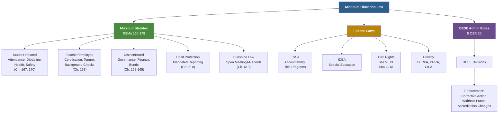

# Missouri Education Law — Reference

## Table of Contents
1. Missouri Revised Statutes — Education Chapters
2. Key Statutes by Topic
3. DESE Administrative Rules (5 CSR 20)
4. Federal Laws Applicable to Missouri Schools
5. Key Legal Concepts
6. DESE Organizational Structure
7. Complaint & Enforcement Mechanisms
8. Recent Legislative Trends

---

## 1. Missouri Revised Statutes — Education Chapters

Missouri education law is primarily contained in RSMo Chapters 160-178:

| Chapter | Subject |
|---------|---------|
| **160** | Schools — General Provisions (MSIP, charter schools, safety, A+ program, curriculum requirements) |
| **161** | Department of Elementary and Secondary Education (DESE powers, data collection, student privacy) |
| **162** | School Districts — Organization and Governance (boards, boundary changes, consolidation, superintendent) |
| **163** | School Finance (state aid, foundation formula, tax rates, Proposition C) |
| **164** | School District Bonds and Debt |
| **165** | School District Budget and Fiscal Management |
| **166** | Community Education |
| **167** | Pupils — Attendance, Admission, Discipline, Transfers |
| **168** | Teachers and School Employees (tenure, certification, employment, background checks, evaluation) |
| **170** | Curriculum Requirements (personal finance, CPR, health education, sex education) |
| **171** | School Libraries |
| **172** | University of Missouri |
| **173-178** | Higher Education (various) |

### Other Relevant Chapters
| Chapter | Subject |
|---------|---------|
| **210** | Child Protection (mandated reporting — RSMo 210.115) |
| **610** | Sunshine Law (open meetings, open records) |
| **213** | Missouri Human Rights Act (anti-discrimination) |

---

## 2. Key Statutes by Topic

### Student-Related
| Statute | Topic | Summary |
|---------|-------|---------|
| RSMo 160.053 | Kindergarten entry age | Child must turn 5 by August 1 |
| RSMo 160.261 | Discipline policy | Districts must adopt written discipline code; mandatory reporting for weapons/drugs/assault |
| RSMo 160.263 | Corporal punishment | No statewide prohibition; district policy governs |
| RSMo 160.400-425 | Charter schools | Authorization, governance, funding for charter schools |
| RSMo 160.526 | School improvement plans | CSIP requirement for every school |
| RSMo 160.545 | A+ Schools Program | Eligibility criteria, benefits, school designation requirements |
| RSMo 160.660 | School safety plans | Building-level crisis plans, drills, active threat protocols |
| RSMo 167.031 | Compulsory attendance | Ages 7-17; homeschool exemptions |
| RSMo 167.131 | Transfer from unaccredited district | Student transfer rights when district is unaccredited |
| RSMo 167.161 | Suspension — short-term | Up to 10 days; due process requirements |
| RSMo 167.171 | Suspension/expulsion — long-term | Hearing rights for suspensions >10 days and expulsions |
| RSMo 167.181 | Immunization requirements | Required immunizations for school enrollment; exemptions |
| RSMo 167.231 | Transportation | 3.5-mile eligibility for state-funded transportation |
| RSMo 167.621 | Diabetes management in schools | Student self-management and school support requirements |
| RSMo 167.627 | Self-administration of medications | Rescue inhalers and EpiPens; student self-carry policy |
| RSMo 167.950 | Dyslexia screening | Screening and intervention requirements |
| RSMo 170.013 | Personal finance instruction | Required for graduation |
| RSMo 170.015 | Health/sex education opt-out | Parent right to opt child out |
| RSMo 170.048 | Suicide prevention | School employee training on youth suicide awareness and prevention |
| RSMo 170.310 | CPR instruction | Required before graduation |

### Teacher/Employee-Related
| Statute | Topic | Summary |
|---------|-------|---------|
| RSMo 168.021 | Teacher certification | Certificate types, requirements, DESE authority |
| RSMo 168.028 | Mentoring program | Required for new teachers |
| RSMo 168.102-130 | Teacher Tenure Act | Probationary period, permanent status, termination procedures |
| RSMo 168.104 | Probationary teacher | 5-year probationary period for tenure |
| RSMo 168.114 | Tenure teacher termination | Termination for cause with due process; enumerated grounds |
| RSMo 168.126 | Non-renewal notice | April 15 deadline for notifying non-tenured teachers |
| RSMo 168.133 | Background checks | Required for all employees and volunteers with unsupervised child access |
| RSMo 168.345 | National Board Certification | Salary supplement for NBCTs |

### District/Board-Related
| Statute | Topic | Summary |
|---------|-------|---------|
| RSMo 162.081 | Lapse of corporate organization | State authority when district fails to meet standards |
| RSMo 162.215 | Conflict of interest | Board member conflict disclosure requirements |
| RSMo 162.1010-1060 | Voluntary transfer | Interdistrict student transfer provisions |
| RSMo 163.011-191 | Foundation formula / state aid | State adequacy target, WADA, local effort, hold harmless |
| RSMo 164.011 | Bond issue limits | Bonded indebtedness caps |
| RSMo 165.121 | Annual audit | Required independent financial audit |

### Child Protection
| Statute | Topic | Summary |
|---------|-------|---------|
| RSMo 210.115 | Mandated reporting | All persons (including all school employees) must report suspected child abuse/neglect |
| RSMo 210.135 | Immunity for reporters | Good-faith reporters are immune from civil and criminal liability |
| RSMo 210.150 | Reporter confidentiality | Identity of reporter is confidential |
| RSMo 210.165 | Failure to report | Class A misdemeanor |

---

## 3. DESE Administrative Rules (5 CSR 20)

DESE promulgates rules under Title 5 of the Code of State Regulations (CSR), Division 20:

| Division | Subject |
|----------|---------|
| **5 CSR 20-100** | General Administration (MSIP, accreditation, school calendar, data reporting) |
| **5 CSR 20-200** | School Finance (state aid calculations, budgeting, reporting) |
| **5 CSR 20-300** | Special Education (Missouri's IDEA State Plan rules, evaluation procedures, IEP requirements, discipline of students with disabilities, procedural safeguards) |
| **5 CSR 20-400** | Educator Certification (certificate types, requirements, assessments, reciprocity, renewal) |
| **5 CSR 20-500** | Vocational/Career Education (CTE program standards, certification, Perkins) |
| **5 CSR 20-600** | Curriculum/Assessment (Missouri Learning Standards, MAP, EOC, graduation requirements) |
| **5 CSR 20-700** | Student Services (attendance, discipline, transportation, health) |
| **5 CSR 20-800** | Adult and Community Education |

### Accessing Rules
- Missouri Secretary of State website: sos.mo.gov/adrules/csr/current/5csr/5csr.asp
- DESE website: dese.mo.gov (guidance documents, handbooks, and FAQ supplements to formal rules)

---

## 4. Federal Laws Applicable to Missouri Schools

### Major Federal Education Laws
| Law | Citation | Key Provisions |
|-----|----------|---------------|
| **ESSA (Every Student Succeeds Act)** | P.L. 114-95 | State accountability plans, assessments, Title programs, teacher quality, school improvement |
| **IDEA (Individuals with Disabilities Education Act)** | 20 U.S.C. §1400 et seq. | FAPE, LRE, IEP, procedural safeguards, discipline protections, transition |
| **Section 504 (Rehabilitation Act)** | 29 U.S.C. §794 | Disability accommodation in federally funded programs |
| **ADA (Americans with Disabilities Act)** | 42 U.S.C. §12101 et seq. | Accessibility of public entities and programs |
| **Title VI (Civil Rights Act)** | 42 U.S.C. §2000d | Prohibits race, color, national origin discrimination |
| **Title IX (Education Amendments)** | 20 U.S.C. §1681 | Prohibits sex discrimination in education |
| **FERPA** | 20 U.S.C. §1232g | Student records privacy |
| **PPRA (Protection of Pupil Rights)** | 20 U.S.C. §1232h | Consent/opt-out for surveys and data collection |
| **McKinney-Vento** | 42 U.S.C. §11431-11435 | Homeless student protections |
| **CIPA (Children's Internet Protection Act)** | 47 U.S.C. §254(h)(5) | Internet filtering and safety policy for E-Rate recipients |

### Implementing Regulations
| Regulation | Law | Content |
|-----------|-----|---------|
| 34 CFR Part 300 | IDEA | Special education regulations |
| 34 CFR Part 104 | Section 504 | Nondiscrimination on the basis of handicap |
| 34 CFR Part 99 | FERPA | Student records privacy regulations |
| 34 CFR Part 106 | Title IX | Sex discrimination regulations |
| 2 CFR Part 200 | Uniform Guidance | Federal grant management and audit requirements |

---

## 5. Key Legal Concepts

### Due Process
The constitutional guarantee (5th and 14th Amendments) that government cannot deprive a person of life, liberty, or property without fair procedures. In education:
- **Substantive due process:** government action must be reasonable and not arbitrary
- **Procedural due process:** affected individuals must receive notice and an opportunity to be heard before significant actions (e.g., suspension, expulsion, termination)

### In Loco Parentis
Schools act "in the place of parents" during school hours — granting authority over student conduct and safety, but also imposing duty of care.

### Qualified Immunity
Government officials (including educators) may be shielded from personal liability for discretionary actions performed in good faith, unless they violated clearly established constitutional rights.

### Search and Seizure in Schools
- **New Jersey v. T.L.O. (1985):** school officials may search students based on **reasonable suspicion** (lower standard than probable cause required of law enforcement)
- Reasonable suspicion requires: (1) the search is justified at its inception, and (2) the search is reasonable in scope
- SROs conducting searches in their law enforcement capacity may be held to the higher probable cause standard (jurisdiction varies)

### Free Speech in Schools
- **Tinker v. Des Moines (1969):** students retain First Amendment rights in school, subject to limitation when speech would cause substantial disruption or infringe on the rights of others
- **Bethel v. Fraser (1986):** schools may restrict lewd or vulgar student speech
- **Hazelwood v. Kuhlmeier (1988):** schools may exercise editorial control over school-sponsored expression
- **Mahanoy v. B.L. (2021):** schools have limited authority to regulate off-campus speech (including social media)

### Mandatory Reporting Law
RSMo 210.115 makes ALL persons (not just professionals) mandated reporters. In practice, school employees are primary reporters due to daily contact with children. Key: reasonable suspicion triggers the duty to report — not certainty.

---

## 6. DESE Organizational Structure

### Commissioner of Education
- Appointed by the State Board of Education
- Leads DESE; oversees all divisions
- Implements policies set by the State Board

### State Board of Education
- 8 members appointed by the Governor (confirmed by Senate)
- Sets education policy for Missouri
- Approves state standards, assessment policies, accreditation decisions, and educator certification rules

### Key DESE Divisions/Offices
| Division/Office | Responsibilities |
|----------------|-----------------|
| Office of Quality Schools | MSIP, school improvement, accountability |
| Office of Special Education | IDEA compliance, Part B, Part C (First Steps), dispute resolution |
| Office of Educator Quality | Certification, educator preparation, professional development |
| Office of College and Career Readiness | CTE, postsecondary readiness, A+, career pathways |
| Office of Data and Accountability | MOSIS, Core Data, APR, data reporting |
| Office of Financial and Administrative Services | School finance, state aid, audits, facilities |
| Office of Childhood | Early childhood education, Missouri Preschool Program |

---

## 7. Complaint & Enforcement Mechanisms

### Where to File Complaints

| Issue | File With | Process |
|-------|----------|---------|
| Special education (IDEA) | DESE Office of Special Education | State complaint (60-day resolution) or due process hearing |
| Section 504 / ADA / Title VI / Title IX | U.S. Dept. of Education, Office for Civil Rights (OCR) | Investigation within 180 days of alleged violation |
| FERPA violation | U.S. Dept. of Education, FPCO (Family Policy Compliance Office) | Written complaint |
| Missouri Sunshine Law | Missouri Attorney General | Investigation and enforcement |
| Teacher certification / misconduct | DESE Office of Educator Quality | Investigation, possible certification action |
| School safety concern | DESE Office of Quality Schools | Investigation per statute/rule |
| Child abuse/neglect | Children's Division (1-800-392-3738) AND/OR local law enforcement | Immediate report required |
| Employment discrimination | EEOC and/or Missouri Commission on Human Rights | Investigation per Title VII / Missouri Human Rights Act |

### DESE Authority
- DESE can require corrective action for districts found in noncompliance
- DESE can withhold federal or state funds for persistent noncompliance
- DESE can direct special education compensatory services
- DESE can change accreditation status (with consequences including student transfer and governance changes)

---

## 8. Recent Legislative Trends

**Note:** This section reflects general trends in Missouri education legislation. Specific bills and enacted laws should be verified through the Missouri General Assembly website (house.mo.gov / senate.mo.gov) and DESE guidance.

### Common Legislative Areas
- **School choice:** voucher proposals, education savings accounts, charter school expansion
- **Curriculum:** restrictions or requirements around certain topics; transparency in curriculum materials
- **School safety:** resource officer funding, mental health funding, threat assessment teams
- **Teacher workforce:** alternative certification pathways, recruitment incentives, pension reform
- **Special education:** funding adequacy, service delivery, parental rights
- **Assessment:** testing reform, opt-out proposals, accountability adjustments
- **Technology/AI:** student data privacy, AI in education policy, digital citizenship
- **Early childhood:** universal pre-K proposals, Missouri Preschool Program expansion

### Staying Current
- DESE publishes legislative summaries and guidance after each session
- Missouri School Boards Association (MSBA) tracks legislation and provides analysis
- Missouri National Education Association (MNEA) and Missouri State Teachers Association (MSTA) monitor legislation affecting educators
- Missouri General Assembly website provides bill text, status, and hearing schedules
