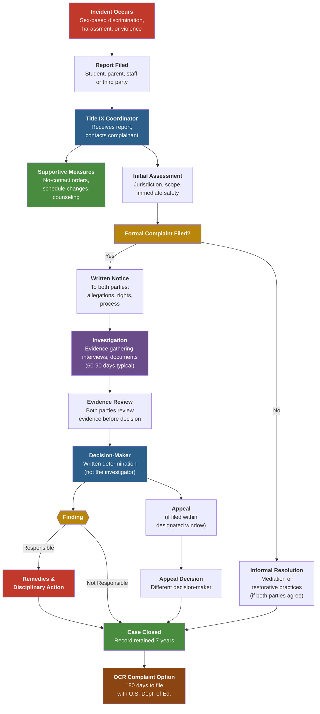

# Title IX Compliance in Missouri K-12 Schools

## Table of Contents

1. [What Title IX Covers](#1-what-title-ix-covers)
2. [Title IX Coordinator](#2-title-ix-coordinator)
3. [Reporting Procedures](#3-reporting-procedures)
4. [Investigation Process](#4-investigation-process)
5. [Grievance Procedures](#5-grievance-procedures)
6. [Supportive Measures](#6-supportive-measures)
7. [Retaliation Protections](#7-retaliation-protections)
8. [Athletics Equity](#8-athletics-equity)
9. [Pregnant and Parenting Students](#9-pregnant-and-parenting-students)
10. [Training Requirements](#10-training-requirements)
11. [Record-Keeping](#11-record-keeping)
12. [OCR Complaint Process](#12-ocr-complaint-process)
13. [Related Resources](#13-related-resources)

---

## 1. What Title IX Covers

Title IX of the Education Amendments of 1972 (20 U.S.C. SS 1681) states: **"No person in the United States shall, on the basis of sex, be excluded from participation in, be denied the benefits of, or be subjected to discrimination under any education program or activity receiving Federal financial assistance."**

Title IX protections in Missouri K-12 schools cover:

| Category | Examples |
|---|---|
| **Sex-based discrimination** | Unequal treatment in academics, activities, or discipline based on sex |
| **Sexual harassment** | Unwelcome conduct of a sexual nature that is severe, pervasive, or objectively offensive; quid pro quo harassment by employees |
| **Sexual violence** | Sexual assault, dating violence, domestic violence, stalking |
| **Pregnancy discrimination** | Exclusion or penalization of pregnant or parenting students |
| **LGBTQ+ protections** | Under current federal guidance, discrimination based on sexual orientation or gender identity is covered as sex-based discrimination |
| **Retaliation** | Adverse action against anyone who reports, participates in, or opposes sex discrimination |

> **Missouri note:** Missouri does not have a state-level equivalent statute that mirrors Title IX for K-12. Districts rely on federal Title IX and local board policies (typically Board Policy AC -- Prohibition Against Discrimination, Harassment, and Retaliation).

---

## 2. Title IX Coordinator

### Required Designation

Every Missouri school district receiving federal funds **must** designate at least one Title IX Coordinator. This is not optional -- it is a regulatory requirement under 34 C.F.R. SS 106.8(a).

### Responsibilities

- Receive and respond to all reports and formal complaints of sex discrimination
- Coordinate the district's compliance efforts, including policy development
- Oversee investigations and ensure procedural fairness
- Arrange supportive measures for complainants and respondents
- Monitor outcomes and track patterns of sex-based misconduct
- Ensure the district's grievance procedures comply with federal regulations
- Serve as the primary point of contact for students, parents, staff, and OCR

### Training Requirements for the Coordinator

The Title IX Coordinator must receive training on:
- The definition of sexual harassment under Title IX
- The scope of the district's education programs and activities
- How to conduct an investigation and grievance process
- How to serve impartially, avoiding prejudgment and conflicts of interest
- Technology used in any live hearing or virtual proceedings
- Relevance of evidence and questions (including rape shield protections)

### Contact Information Posting

Districts must prominently display the Title IX Coordinator's name (or title), office address, email, and phone number in:
- Student and employee handbooks
- The district website
- Enrollment and employment application materials
- Any notification of the district's nondiscrimination policy

---

## 3. Reporting Procedures

### Who Can Report

Any person may report sex discrimination, whether or not the person is the alleged victim. Reports can be made by:
- **Students** (of any age)
- **Parents or guardians**
- **School employees** (teachers, counselors, aides, coaches, administrators)
- **Third parties** (community members, witnesses, anonymous sources)

### How to Report

| Method | Details |
|---|---|
| **In person** | To the Title IX Coordinator, any school administrator, counselor, or teacher |
| **In writing** | Letter or email to the Title IX Coordinator |
| **By phone** | Call the Title IX Coordinator's published number |
| **Online** | Many Missouri districts offer online reporting forms on their websites |
| **Anonymous** | Districts should accept anonymous reports, though investigation may be limited |

### Mandatory Reporters

Under Missouri law (RSMo 210.115) and most district policies:
- **All school employees** are mandatory reporters of child abuse and neglect, which includes sexual abuse
- Reports involving potential criminal conduct must also be referred to **law enforcement**
- Employees who receive a report of sexual harassment or violence **must** promptly notify the Title IX Coordinator -- failure to do so may result in disciplinary action
- Only confidential resources (licensed counselors acting in a counseling capacity) may be exempt from mandatory reporting to the Title IX Coordinator, depending on district policy

---

## 4. Investigation Process

### Written Notice

Upon receiving a formal complaint, the district must provide **written notice** to both the complainant and respondent that includes:
- The specific allegations, including the identities of parties involved (if known), the date and location of the alleged incident, and the conduct alleged to constitute sexual harassment
- A statement that the respondent is presumed not responsible until a determination is made
- Notice of the right to an advisor (who may be an attorney)
- Notice of the right to inspect and review evidence
- Notice of the district's prohibition against knowingly making false statements

### Evidence Gathering

- The **burden of proof** rests with the district, not the parties
- The investigator must gather evidence from both parties and relevant witnesses
- The district cannot access, consider, or disclose medical records without voluntary, written consent
- Both parties must have equal opportunity to present witnesses and evidence

### Interview Procedures

- Interviews should be conducted individually with complainant, respondent, and witnesses
- Questions must be relevant and not designed to harass or intimidate
- Rape shield protections apply: questions about a complainant's prior sexual history are generally not relevant unless offered to prove consent or that someone other than the respondent committed the alleged conduct
- Both parties may have an advisor present during interviews

### Timeline

- Districts should complete investigations within **60 to 90 business days** from the filing of a formal complaint
- Extensions are permitted for good cause (complexity, school breaks, law enforcement involvement) with written notice to both parties
- Delays should be documented with reasons

### Interim Measures

During the investigation, the district may implement:
- Interim suspension of the respondent (with due process)
- Classroom or schedule reassignments
- Increased monitoring or supervision
- Restrictions on contact between parties

---

## 5. Grievance Procedures

### Formal vs. Informal Resolution

| Feature | Formal Resolution | Informal Resolution |
|---|---|---|
| **Trigger** | Formal complaint filed | Both parties voluntarily agree |
| **Process** | Full investigation and determination | Mediation, restorative practices, or agreement |
| **Decision-maker** | Independent decision-maker (not the investigator or coordinator) | Facilitator or mediator |
| **Available for** | All complaints | Not available when an employee is the respondent accused of harassing a student |
| **Withdrawal** | Either party may withdraw from informal and proceed to formal at any time |

### Decision-Maker Independence

- The person making the final determination **must not** be the same person who investigated the complaint or the Title IX Coordinator
- The decision-maker must be trained and free from conflicts of interest or bias
- The decision-maker applies the district's chosen standard of evidence (preponderance of the evidence is most common in K-12)

### Written Determination

The decision-maker must issue a written determination that includes:
- Identification of the allegations
- A description of the procedural steps taken
- Findings of fact
- Conclusions regarding the application of the district's code of conduct
- A statement and rationale for each allegation (responsible or not responsible)
- Any disciplinary sanctions and remedies
- Notice of appeal rights and procedures

---

## 6. Supportive Measures

Supportive measures are **non-disciplinary, non-punitive** individualized services offered as appropriate to either party, regardless of whether a formal complaint is filed. They must be designed to restore or preserve equal access to education without unreasonably burdening the other party.

| Measure | Description |
|---|---|
| **No-contact orders** | Mutual or one-sided directives prohibiting direct or indirect communication between parties |
| **Schedule changes** | Adjusting class schedules, lunch periods, or extracurricular assignments to minimize contact |
| **Counseling referrals** | Connecting students to school counselors, community mental health services, or crisis resources |
| **Academic accommodations** | Extended deadlines, tutoring, permission to retake exams, or alternative assignments |
| **Transportation changes** | Modified bus routes or pick-up/drop-off arrangements |
| **Campus escorts** | Supervised movement between classes or buildings |
| **Increased monitoring** | Enhanced supervision of common areas, hallways, or other locations |
| **Leave of absence** | For employees, administrative leave (with or without pay) pending investigation |

> Supportive measures should be kept **confidential** to the extent that maintaining confidentiality does not impair the district's ability to provide them.

---

## 7. Retaliation Protections

### Prohibited Actions

Title IX prohibits retaliation against any person for:
- Making a report or formal complaint of sex discrimination
- Participating in an investigation, hearing, or grievance process (as a witness, advisor, or party)
- Opposing conduct that the person reasonably believes constitutes sex discrimination

Retaliation includes but is not limited to:
- Intimidation, threats, coercion, or harassment
- Adverse academic actions (grade reductions, exclusion from activities)
- Adverse employment actions (demotion, reassignment, termination)
- Peer retaliation that the district knew about and failed to address

### Reporting Retaliation

- Retaliation complaints should be filed with the Title IX Coordinator
- Retaliation is treated as a separate Title IX violation and investigated independently
- Districts must include anti-retaliation language in all Title IX notices and training materials

---

## 8. Athletics Equity

Title IX requires **equal opportunity** in athletics, not necessarily identical programs. Missouri districts must provide equitable access across the following factors:

| Factor | What Equity Looks Like |
|---|---|
| **Participation opportunities** | The number of athletic opportunities for each sex should be substantially proportionate to enrollment, or the district must show a history of expanding opportunities for the underrepresented sex |
| **Equipment and supplies** | Comparable quality, quantity, and availability |
| **Scheduling** | Equitable game and practice times, including access to prime-time slots |
| **Travel and per diem** | Comparable transportation arrangements and meal allowances |
| **Coaching** | Equivalent quality, availability, and compensation of coaches |
| **Locker rooms and facilities** | Comparable quality, size, and maintenance |
| **Publicity** | Equitable media coverage, promotion, and awards |
| **Recruitment** | For high schools with athletic recruitment, equitable outreach |
| **Medical and training services** | Equal access to athletic trainers and medical support |

> **MSHSAA note:** Missouri State High School Activities Association policies must also align with Title IX. Districts should audit their athletics programs annually using an equity checklist.

---

## 9. Pregnant and Parenting Students

### Core Protections

- Schools **cannot** exclude a student from any program or activity (including extracurriculars) based on pregnancy, childbirth, false pregnancy, termination of pregnancy, or recovery therefrom
- Schools **cannot** require a pregnant student to produce a doctor's note unless the same is required of all students with medical conditions
- Teachers and staff **cannot** penalize a student academically for pregnancy-related absences

### Required Accommodations

| Accommodation | Details |
|---|---|
| **Excused absences** | Absences for pregnancy, childbirth, and related medical conditions must be excused for as long as the student's doctor deems medically necessary |
| **Make-up work** | Students must be allowed to make up missed assignments and tests |
| **Homebound instruction** | If a student voluntarily chooses to participate in an alternative program, it must be comparable in quality to the regular program |
| **Lactation rooms** | Districts should provide a private, clean space (not a restroom) for nursing students to express milk, along with reasonable break time |
| **Parking and mobility** | Accommodations for physical limitations during pregnancy (elevator access, closer parking) |
| **Return to school** | Students must be readmitted to the same status held before medical leave |

---

## 10. Training Requirements

### Staff Training

- **All school employees** must receive training on recognizing and reporting sex discrimination, sexual harassment, and sexual violence
- Training should cover the district's Title IX grievance procedures, mandatory reporting obligations, and how to respond to student disclosures
- Recommended frequency: **annually**, with refresher modules for returning staff

### Student Education

- Age-appropriate education on sexual harassment, consent, and healthy relationships
- Information about how to report Title IX concerns and where to find support
- Notification of Title IX rights during orientation or at the start of each school year

### Title IX Team Training

The Title IX Coordinator, investigators, decision-makers, and informal resolution facilitators must receive specialized training on:
- The definition and scope of sexual harassment
- How to conduct investigations and hearings fairly
- How to use any technology required for proceedings
- Issues of relevance, including rape shield protections
- How to create an investigative report that fairly summarizes relevant evidence
- How to apply the standard of evidence (preponderance of the evidence)
- Impartiality, avoiding bias, and conflicts of interest

> **Training materials must be publicly available** on the district's website or available upon request.

---

## 11. Record-Keeping

Districts must maintain records related to Title IX compliance for a minimum of **seven (7) years**. Required records include:

| Record Type | Details |
|---|---|
| **Formal complaints and investigations** | Every investigation, determination, disciplinary sanction, remedy, and appeal |
| **Informal resolutions** | Documentation of the process and any agreement reached |
| **Supportive measures** | Records of all measures offered and the basis for the district's response |
| **Training materials** | All materials used to train the Title IX Coordinator, investigators, decision-makers, and facilitators |
| **Reports without formal complaints** | Documentation of the district's response to each report, including the supportive measures offered and the rationale if no investigation was initiated |
| **Retaliation complaints** | Any complaints of retaliation and their resolution |
| **Athletics equity assessments** | Annual or periodic reviews of athletic program equity |

> Records must be sufficient to demonstrate that the district's response was not deliberately indifferent and was reasonably calculated to end harassment, prevent recurrence, and remedy effects.

---

## 12. OCR Complaint Process

If a student, parent, or employee believes the district has not adequately addressed a Title IX violation, they may file a complaint with the **U.S. Department of Education, Office for Civil Rights (OCR)**.

### Filing Deadline

- Complaints must be filed within **180 calendar days** of the last act of discrimination
- OCR may waive the deadline in certain circumstances (e.g., ongoing harassment, the complainant was a minor)

### How to File

| Method | Details |
|---|---|
| **Online** | OCR Complaint Form at [https://ocrcas.ed.gov](https://ocrcas.ed.gov) |
| **Email** | OCR.KansasCity@ed.gov (Kansas City regional office covers Missouri) |
| **Mail** | Office for Civil Rights, Kansas City Office, U.S. Department of Education, 8930 Ward Parkway, Suite 2037, Kansas City, MO 64114 |
| **Phone** | (816) 268-0550 |

### What Happens After Filing

1. **Intake review** -- OCR determines whether the complaint falls within its jurisdiction
2. **Notification** -- The district is notified of the complaint and the allegations
3. **Investigation** -- OCR gathers evidence, conducts interviews, and reviews district records
4. **Resolution** -- OCR may:
   - Negotiate a voluntary resolution agreement with the district
   - Issue a letter of findings (compliance or non-compliance)
   - Refer the case to the U.S. Department of Justice for enforcement
5. **Monitoring** -- OCR monitors compliance with any resolution agreement

> **Tip:** Filing an OCR complaint does not require an attorney. Complainants may also file simultaneously with the district's internal grievance process.

---

## 13. Related Resources

### Federal Resources
- **U.S. Department of Education, Office for Civil Rights** -- [www2.ed.gov/ocr](https://www2.ed.gov/ocr)
- **Title IX Regulations** -- 34 C.F.R. Part 106
- **Know Your Rights: Title IX** -- ED.gov resource page for students and families

### Missouri Resources
- **Missouri Department of Elementary and Secondary Education (DESE)** -- [dese.mo.gov](https://dese.mo.gov)
- **Missouri Commission on Human Rights** -- handles state-level discrimination complaints
- **Missouri School Boards' Association (MSBA)** -- model policies (Board Policy AC, AC-R)
- **MSHSAA** -- athletics equity guidance and compliance resources

### Within This Knowledge Base
- `references/compliance/mo-education-law.md` -- federal laws applicable to Missouri schools, including civil rights statutes
- `references/compliance/equity-access.md` -- broader equity and access guidance
- `references/roles/role-parent.md` -- parent rights, including how to advocate around Title IX
- `references/roles/role-principal.md` -- building-level compliance responsibilities
- `references/operations/school-safety.md` -- safety protocols related to sexual violence and threat assessment
- `templates/` -- letter templates for parent complaints, due process requests, and formal grievances

---

*Last updated: April 2026. This reference reflects Title IX regulations as currently enforced. Districts should monitor OCR guidance and federal rulemaking for updates. This document is for informational purposes and does not constitute legal advice. Consult your district's legal counsel for case-specific guidance.*
