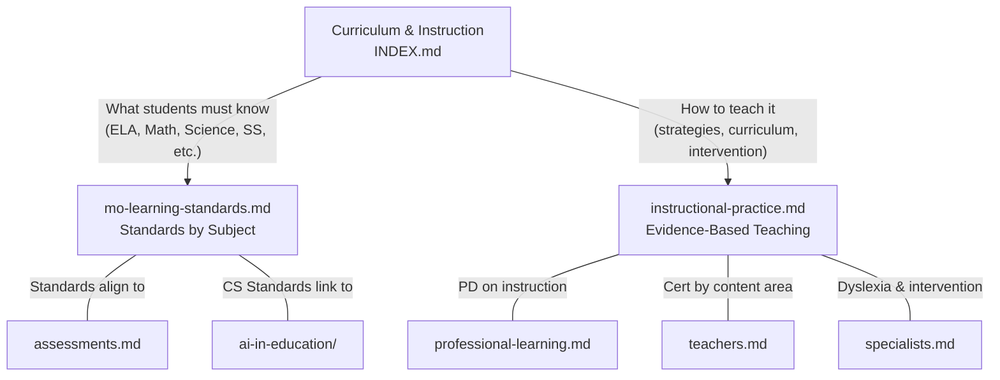

# Curriculum & Instruction — Index

**Read this file first, then load the specific sub-file.**

## Sub-File Router

| Sub-File | When to Read |
|----------|-------------|
| `curriculum-instruction/mo-learning-standards.md` | Missouri Learning Standards by subject (ELA strands, math domains, science core ideas, social studies, fine arts, health/PE, computer science, world languages), standards code formats, priority standards |
| `curriculum-instruction/instructional-practice.md` | Science of Reading, dyslexia screening, structured literacy, curriculum design and adoption, evidence-based instructional strategies, differentiated instruction, UDL, co-teaching models, formative assessment, textbook adoption, culturally responsive teaching, PBL, standards-based grading, reading/math intervention programs, ESSA evidence tiers |

## Canonical Ownership

This domain owns:
- All Missouri Learning Standards content (ELA, Math, Science, SS, Fine Arts, PE, CS, World Languages)
- Instructional strategy guidance (evidence-based practices, Hattie effect sizes)
- Curriculum design and adoption processes
- Science of Reading / structured literacy
- Standards-based grading
- Intervention program inventories (reading and math)

Cross-references:
- `teachers.md` → certification by content area; for standards detail, come here
- `assessments.md` → tests aligned to standards; for standards themselves, come here
- `ai-in-education/` → AI literacy maps to CS Standards; for CS Standards detail, come here
- `professional-learning.md` → PD on instruction; for instructional strategies, come here
- `specialists.md` → dyslexia, intervention; for Science of Reading depth, come here
