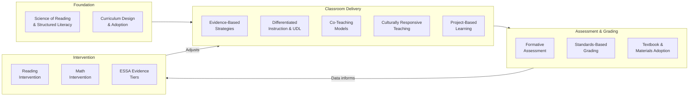

# Instructional Practice — Evidence-Based Teaching

<!-- Canonical source for: Science of Reading, curriculum design, instructional strategies, differentiation, co-teaching, formative assessment, textbook adoption, culturally responsive teaching, PBL, standards-based grading, intervention programs -->
<!-- Last content review: 2026-03 -->

## Table of Contents
- [10. Science of Reading / Structured Literacy](#10-science-of-reading-structured-literacy)
  - [Missouri's Reading Initiative](#missouris-reading-initiative)
  - [Key Components of Structured Literacy](#key-components-of-structured-literacy)
  - [RSMo 167.950 — Dyslexia Screening](#rsmo-167950-dyslexia-screening)
  - [Evidence-Based Reading Programs Common in Missouri](#evidence-based-reading-programs-common-in-missouri)
  - [Reading Intervention (MTSS Context)](#reading-intervention-mtss-context)
- [11. Curriculum Design & Adoption](#11-curriculum-design-adoption)
  - [Curriculum vs. Standards](#curriculum-vs-standards)
  - [Curriculum Development Process](#curriculum-development-process)
  - [Curriculum Mapping](#curriculum-mapping)
- [12. Instructional Strategies (Evidence-Based)](#12-instructional-strategies-evidence-based)
  - [High-Leverage Teaching Practices (Based on Research)](#high-leverage-teaching-practices-based-on-research)
- [13. Differentiated Instruction](#13-differentiated-instruction)
  - [Framework (Carol Ann Tomlinson)](#framework-carol-ann-tomlinson)
  - [Universal Design for Learning (UDL)](#universal-design-for-learning-udl)
- [14. Co-Teaching Models](#14-co-teaching-models)
  - [Six Models (Marilyn Friend)](#six-models-marilyn-friend)
  - [Co-Teaching in Special Education](#co-teaching-in-special-education)
- [15. Formative Assessment Practices](#15-formative-assessment-practices)
  - [Formative vs. Summative](#formative-vs-summative)
  - [Formative Assessment Techniques](#formative-assessment-techniques)
- [16. Textbook & Materials Adoption](#16-textbook-materials-adoption)
  - [Missouri Law](#missouri-law)
  - [Selection Process (Best Practice)](#selection-process-best-practice)
  - [Open Educational Resources (OER)](#open-educational-resources-oer)
- [17. Culturally Responsive Teaching](#17-culturally-responsive-teaching)
  - [Framework (Geneva Gay, Gloria Ladson-Billings)](#framework-geneva-gay-gloria-ladson-billings)
  - [Core Practices](#core-practices)
- [18. Project-Based Learning](#18-project-based-learning)
  - [Key Elements (Buck Institute / PBLWorks)](#key-elements-buck-institute-pblworks)
  - [PBL vs. "Doing a Project"](#pbl-vs-doing-a-project)
- [19. Standards-Based Grading](#19-standards-based-grading)
  - [Principles](#principles)
  - [Proficiency Scale Example](#proficiency-scale-example)
  - [Missouri Context](#missouri-context)
- [20. Intervention Programs (Academic)](#20-intervention-programs-academic)
  - [Reading Intervention Programs (Common in Missouri)](#reading-intervention-programs-common-in-missouri)
  - [Math Intervention Programs](#math-intervention-programs)
  - [ESSA Evidence Tiers](#essa-evidence-tiers)

## 10. Science of Reading / Structured Literacy

### Missouri's Reading Initiative
Missouri has increasingly emphasized evidence-based reading instruction aligned to the Science of Reading.

### Key Components of Structured Literacy
| Component | What It Is | Grade Emphasis |
|-----------|-----------|---------------|
| **Phonological awareness** | Ability to recognize and manipulate sounds in spoken language | Pre-K–1 |
| **Phonics** | Systematic instruction in letter-sound relationships | K–3 |
| **Fluency** | Reading with accuracy, speed, and expression | K–5 |
| **Vocabulary** | Word knowledge (explicit instruction + wide reading) | K–12 |
| **Comprehension** | Understanding and analyzing text (strategies, background knowledge, text structure) | K–12 |

### RSMo 167.950 — Dyslexia Screening
- Districts must screen students for dyslexia risk indicators
- Screening in kindergarten and first grade (some districts expand)
- Students identified at risk must receive evidence-based intervention
- DESE provides guidance on approved screeners and intervention programs
- Professional development on dyslexia awareness required

### Evidence-Based Reading Programs Common in Missouri
| Program | Type | Grades |
|---------|------|--------|
| **Fundations** | Phonics/word study | K-3 |
| **UFLI Foundations** | Phonics intervention | K-3 |
| **Heggerty** | Phonological awareness | Pre-K–2 |
| **LETRS** | Teacher professional development (Science of Reading) | Teacher PD |
| **Orton-Gillingham** | Structured literacy intervention (multisensory) | Intervention |
| **Wilson Reading System** | Intensive intervention for older struggling readers | 2-12 |
| **Lexia Core5 / PowerUp** | Adaptive technology-based reading | K-12 |
| **Benchmark Advance / Benchmark Universe** | Core ELA curriculum | K-6 |
| **EL Education** | Core ELA curriculum (knowledge-building) | K-8 |
| **Amplify CKLA** | Core Knowledge Language Arts (knowledge-rich) | K-5 |
| **Read 180 / System 44** | Intervention for adolescent struggling readers | 4-12 |

### Reading Intervention (MTSS Context)
- **Tier 1:** High-quality core reading instruction using evidence-based curriculum (all students)
- **Tier 2:** Small-group intervention (targeted; 3-5 students; 30 minutes daily additional; evidence-based program)
- **Tier 3:** Intensive individualized intervention (1:1 or 1:2; diagnostic-prescriptive; possible special education evaluation referral)

---

## 11. Curriculum Design & Adoption

### Curriculum vs. Standards
- **Standards** define WHAT students should know and be able to do (set by DESE)
- **Curriculum** defines HOW the standards are taught (developed or adopted by the district)
- Districts have local control over curriculum selection within the framework of state standards

### Curriculum Development Process
1. **Standards review** — identify what students must learn
2. **Scope and sequence** — organize standards into units across the school year and across grade levels
3. **Unit design** — develop units with learning targets, assessments, instructional activities, and resources (Understanding by Design / backward design model recommended)
4. **Resource selection** — choose textbooks, materials, technology, and supplementary resources
5. **Assessment alignment** — ensure assessments measure the intended standards
6. **Pilot and feedback** — test curriculum with teachers, gather feedback, revise
7. **Board adoption** — present curriculum to the board for formal adoption
8. **Implementation** — professional development, materials distribution, monitoring
9. **Review cycle** — periodic review (typically 5-7 year cycle per subject area)

### Curriculum Mapping
A curriculum map documents:
- Which standards are taught in which grade/course
- The sequence and pacing of instruction
- Common assessments and benchmarks
- Cross-curricular connections
- Vertical alignment (K-12 progression)

---

## 12. Instructional Strategies (Evidence-Based)

### High-Leverage Teaching Practices (Based on Research)
| Strategy | Effect Size (Hattie) | Description |
|----------|---------------------|-------------|
| **Collective teacher efficacy** | 1.57 | Teachers' shared belief that they can positively impact students |
| **Self-reported grades / self-assessment** | 1.33 | Students predict and monitor their own performance |
| **Teacher credibility** | 0.90 | Students perceive teacher as competent, trustworthy, caring |
| **Formative evaluation** | 0.48 | Ongoing assessment used to adjust instruction |
| **Classroom discussion** | 0.82 | Structured dialogue about content |
| **Feedback** | 0.70 | Specific, timely, actionable feedback to students |
| **Spaced practice** | 0.60 | Distributing practice over time (vs. massed) |
| **Metacognitive strategies** | 0.60 | Teaching students to think about their thinking |
| **Direct instruction** | 0.59 | Explicit, structured, teacher-led instruction (I do / We do / You do) |
| **Mastery learning** | 0.57 | Students must demonstrate mastery before moving on |
| **Cooperative learning** | 0.40 | Structured student collaboration toward shared goals |

---

## 13. Differentiated Instruction

### Framework (Carol Ann Tomlinson)
Differentiation modifies instruction based on student readiness, interest, and learning profile:

| Dimension | What to Differentiate | Examples |
|-----------|----------------------|---------|
| **Content** | What students learn | Tiered reading materials, varied complexity levels, pre-assessment to identify gaps |
| **Process** | How students learn | Flexible grouping, learning centers, varied graphic organizers, scaffolding |
| **Product** | How students demonstrate learning | Choice boards, tiered assignments, varied assessment formats |
| **Environment** | Where and how students learn | Flexible seating, quiet/collaborative zones, technology access |

### Universal Design for Learning (UDL)
| Principle | Description | Examples |
|-----------|-----------|---------|
| **Multiple Means of Engagement** | Motivate and sustain effort | Choice, relevance, self-assessment, collaborative work |
| **Multiple Means of Representation** | Present content in varied ways | Text, audio, video, graphic, hands-on, multilingual |
| **Multiple Means of Action & Expression** | Allow varied ways to demonstrate learning | Written, oral, multimedia, portfolio, performance |

---

## 14. Co-Teaching Models

### Six Models (Marilyn Friend)
| Model | Description | Best For |
|-------|-----------|---------|
| **One Teach, One Observe** | One teacher leads; one collects data on student engagement, behavior, or understanding | Data gathering, early in co-teaching relationship |
| **One Teach, One Assist** | One teacher leads; one circulates and provides individual support | Providing immediate help, managing behavior |
| **Station Teaching** | Students rotate through stations; each teacher leads a station | Active learning, small-group instruction, diverse activities |
| **Parallel Teaching** | Class split in half; each teacher teaches the same content to a smaller group | Lower student-teacher ratio, more participation |
| **Alternative Teaching** | One teacher works with a small group (pre-teach, reteach, enrich); other teaches the rest | Targeted intervention, enrichment, pre-teaching |
| **Team Teaching** | Both teachers co-lead instruction simultaneously | High collaboration, modeling dialogue, content integration |

### Co-Teaching in Special Education
Co-teaching is a common service delivery model for students with IEPs in general education settings:
- General education teacher provides content expertise
- Special education teacher provides specially designed instruction, accommodations, and modifications
- Both are responsible for all students in the classroom
- IEP goals are addressed within the co-taught class
- Requires common planning time (critical for effectiveness)

---

## 15. Formative Assessment Practices

### Formative vs. Summative
| Feature | Formative | Summative |
|---------|-----------|-----------|
| **Purpose** | Adjust instruction; identify gaps | Evaluate achievement; assign grades |
| **Timing** | During learning | After learning |
| **Frequency** | Continuous / frequent | Periodic (unit, semester, annual) |
| **Stakes** | Low (not graded or low weight) | High (graded, counts toward final) |
| **Examples** | Exit tickets, thumbs up/down, whiteboard responses, think-pair-share, observations | Unit tests, projects, MAP/EOC, final exams |

### Formative Assessment Techniques
- Exit tickets / entrance tickets
- Whiteboards / response cards
- Think-Pair-Share / Turn and Talk
- Questioning strategies (cold calling, wait time, probing questions)
- Checking for understanding protocols (fist-to-five, stoplight, emoji response)
- Student self-assessment / goal setting
- Learning logs / journals
- Quick writes
- Gallery walks
- Digital tools (Kahoot, Pear Deck, Nearpod, Google Forms)

---

## 16. Textbook & Materials Adoption

### Missouri Law
- Missouri does not have a state textbook adoption list (unlike some states)
- Local school boards have authority to select instructional materials (RSMo 170.051)
- Boards may establish textbook selection committees (teachers, administrators, parents, community members)
- Materials must support the Missouri Learning Standards
- Materials should be free from bias and represent diverse perspectives

### Selection Process (Best Practice)
1. Form a selection committee with diverse representation
2. Establish evaluation criteria (alignment to standards, rigor, engagement, accessibility, cultural responsiveness, cost)
3. Review candidate materials using a rubric
4. Pilot top candidates in classrooms
5. Gather teacher and student feedback
6. Committee recommendation to administration
7. Board approval
8. Professional development on new materials
9. Implementation and monitoring

### Open Educational Resources (OER)
- Free, openly licensed instructional materials
- Examples: Khan Academy, OpenStax, CK-12, OER Commons, EngageNY/Eureka Math
- Quality varies; must be vetted for alignment, rigor, and accuracy
- Can supplement or replace commercial materials
- Reduce costs but require curation effort

---

## 17. Culturally Responsive Teaching

### Framework (Geneva Gay, Gloria Ladson-Billings)
Culturally responsive teaching uses students' cultural references as a vehicle for learning:

### Core Practices
1. **High expectations for all students** — reject deficit thinking
2. **Cultural competence** — learn about students' cultural backgrounds; integrate cultural knowledge into curriculum
3. **Critical consciousness** — help students analyze social inequities and take action
4. **Student-centered instruction** — build on students' prior knowledge, interests, and lived experiences
5. **Inclusive curriculum** — represent diverse voices, histories, and perspectives in course content
6. **Relationship building** — know students as individuals; create classroom community
7. **Asset-based language** — frame student differences as strengths, not deficits

---

## 18. Project-Based Learning

### Key Elements (Buck Institute / PBLWorks)
1. Challenging problem or question (driving question)
2. Sustained inquiry (not one-day project)
3. Authenticity (real-world relevance and audience)
4. Student voice and choice
5. Reflection (on process and learning)
6. Critique and revision (iterative improvement)
7. Public product (presentation, exhibition, publication)

### PBL vs. "Doing a Project"
PBL is a teaching method where the project IS the learning (not an add-on after direct instruction). Students learn content and skills through the process of investigating and responding to the driving question.

---

## 19. Standards-Based Grading

### Principles
- Grades reflect what students know and can do relative to standards (not behavior, effort, or compliance)
- Separate academic achievement from work habits
- Use a proficiency scale (4-point or similar) rather than percentage/letter grades
- Allow reassessment and revision (most recent evidence of learning counts)
- Report by standard, not by assignment

### Proficiency Scale Example
| Score | Level | Description |
|-------|-------|-------------|
| 4 | Exceeding | Demonstrates understanding beyond grade-level expectations |
| 3 | Meeting | Demonstrates proficiency on grade-level standards |
| 2 | Approaching | Demonstrates partial understanding; progressing toward proficiency |
| 1 | Beginning | Demonstrates minimal understanding; significant gaps remain |

### Missouri Context
Standards-based grading is not mandated by DESE but is adopted by some Missouri districts (more common in elementary, growing in middle school). Traditional letter grades remain standard for high school transcripts and GPA calculation. Districts adopting SBG must communicate clearly with families.

---

## 20. Intervention Programs (Academic)

### Reading Intervention Programs (Common in Missouri)
| Program | Grades | Type |
|---------|--------|------|
| Leveled Literacy Intervention (LLI) | K-6 | Small group (Tier 2) |
| Wilson Reading System | 2-12 | Intensive (Tier 3) |
| Orton-Gillingham approaches | K-12 | Structured literacy (Tier 2-3) |
| Read 180 | 4-12 | Blended (Tier 2) |
| System 44 | 3-12 | Foundational skills (Tier 3) |
| UFLI Foundations | K-3 | Phonics intervention (Tier 2) |
| Lexia Core5 | K-5 | Adaptive technology (Tier 1-2) |
| Lexia PowerUp | 6-12 | Adaptive technology (Tier 1-2) |

### Math Intervention Programs
| Program | Grades | Type |
|---------|--------|------|
| Do The Math | K-5 | Targeted (Tier 2) |
| Number Worlds | Pre-K–8 | Intensive (Tier 2-3) |
| TransMath | 5-10 | Intensive (Tier 3) |
| ST Math | K-8 | Visual/adaptive (Tier 1-2) |
| DreamBox | K-8 | Adaptive technology (Tier 1-2) |
| iReady Mathematics | K-8 | Adaptive diagnostic + instruction (Tier 1-2) |
| ALEKS | 3-12 | Adaptive math (Tier 1-2) |

### ESSA Evidence Tiers
Federal funding increasingly requires evidence-based programs:
| Tier | Evidence Level | Definition |
|------|---------------|-----------|
| 1 | Strong | Supported by at least 1 well-designed experimental study (RCT) |
| 2 | Moderate | Supported by at least 1 well-designed quasi-experimental study |
| 3 | Promising | Supported by at least 1 correlational study with statistical controls |
| 4 | Demonstrates a rationale | Includes a well-defined logic model informed by research |

→ For Missouri Learning Standards by subject: see curriculum-instruction/mo-learning-standards.md
