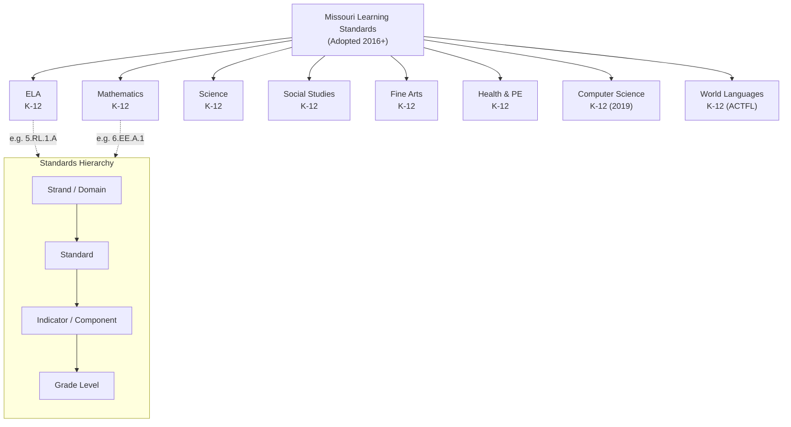

# Missouri Learning Standards — Complete Reference

<!-- Canonical source for: all Missouri Learning Standards by subject area -->
<!-- Last content review: 2026-03 -->

## Table of Contents
- [1. Missouri Learning Standards (Complete Overview)](#1-missouri-learning-standards-complete-overview)
  - [History](#history)
  - [Subject Areas with State Standards](#subject-areas-with-state-standards)
  - [Standards Organization](#standards-organization)
- [2. ELA Standards & Strands](#2-ela-standards-strands)
  - [ELA Strands (K-12)](#ela-strands-k-12)
  - [ELA Code Format](#ela-code-format)
  - [Key ELA Shifts in Missouri](#key-ela-shifts-in-missouri)
  - [Priority Reading Standards by Band](#priority-reading-standards-by-band)
- [3. Mathematics Standards & Domains](#3-mathematics-standards-domains)
  - [Math Domains by Grade Band](#math-domains-by-grade-band)
  - [Math Code Format](#math-code-format)
  - [Mathematical Practices (Cross-Cutting)](#mathematical-practices-cross-cutting)
- [4. Science Standards (Missouri Science Standards)](#4-science-standards-missouri-science-standards)
  - [Organization](#organization)
  - [Disciplinary Core Ideas](#disciplinary-core-ideas)
  - [Science and Engineering Practices](#science-and-engineering-practices)
  - [Crosscutting Concepts](#crosscutting-concepts)
  - [Science Assessment](#science-assessment)
- [5. Social Studies Standards](#5-social-studies-standards)
  - [Strands](#strands)
  - [Key Course Requirements](#key-course-requirements)
  - [Civic Education](#civic-education)
- [6. Fine Arts Standards](#6-fine-arts-standards)
  - [Missouri Fine Arts Standards (2007)](#missouri-fine-arts-standards-2007)
  - [Fine Arts Graduation Requirement](#fine-arts-graduation-requirement)
  - [Fine Arts in Assessment](#fine-arts-in-assessment)
- [7. Health & Physical Education Standards](#7-health-physical-education-standards)
  - [Missouri Health & PE Standards (2007)](#missouri-health-pe-standards-2007)
  - [Graduation Requirements](#graduation-requirements)
  - [Controversial Topic: Sex Education](#controversial-topic-sex-education)
- [8. Computer Science Standards](#8-computer-science-standards)
  - [Missouri CS Standards (2019)](#missouri-cs-standards-2019)
  - [CS Education in Missouri](#cs-education-in-missouri)
- [9. World Languages](#9-world-languages)
  - [Missouri World Language Standards](#missouri-world-language-standards)
  - [Proficiency Levels (ACTFL)](#proficiency-levels-actfl)
  - [Common Languages Offered in Missouri](#common-languages-offered-in-missouri)
  - [World Language Certification](#world-language-certification)

## 1. Missouri Learning Standards (Complete Overview)

### History
Missouri adopted Missouri Learning Standards (MLS) in 2016, replacing the previous Missouri Show-Me Standards and aligning to college-and-career readiness expectations. Missouri did NOT adopt Common Core wholesale but developed state-specific standards with comparable rigor.

### Subject Areas with State Standards
| Subject | Grade Span | Current Version | Standards Body |
|---------|-----------|----------------|---------------|
| English Language Arts | K-12 | 2016 | DESE |
| Mathematics | K-12 | 2016 | DESE |
| Science | K-12 | 2016 (Missouri Science Standards) | DESE |
| Social Studies | K-12 | 2016 | DESE |
| Fine Arts | K-12 | 2007 | DESE |
| Health & Physical Education | K-12 | 2007 | DESE |
| Computer Science | K-12 | 2019 | DESE |
| World Languages | K-12 | Guidance document (ACTFL-aligned) | DESE |

### Standards Organization
Standards are organized hierarchically:
- **Strand/Domain** → broad content area
- **Standard** → specific learning expectation within a strand
- **Indicator/Component** → measurable sub-skill or knowledge element
- **Grade level** → developmental progression K-12

---

## 2. ELA Standards & Strands

### ELA Strands (K-12)
| Strand | Code | Focus |
|--------|------|-------|
| **Reading — Literary Text** | RL | Comprehension, analysis, interpretation of fiction, poetry, drama |
| **Reading — Informational Text** | RI | Comprehension, analysis of nonfiction, functional text, arguments |
| **Reading — Foundational Skills** | RF | Print concepts (K-1), phonological awareness (K-1), phonics/word recognition (K-5), fluency (K-5) |
| **Writing** | W | Types of writing (narrative, informational/explanatory, argumentative), writing process, research |
| **Speaking & Listening** | SL | Comprehension and collaboration, presentation of knowledge |
| **Language** | L | Conventions (grammar, usage, mechanics), vocabulary acquisition and use |

### ELA Code Format
`{Grade}.{Strand}.{Standard}.{Indicator}` — e.g., `5.RL.1.A` = Grade 5, Reading Literary Text, Standard 1, Indicator A

### Key ELA Shifts in Missouri
1. **Text complexity:** grade-level expectations for increasing text difficulty (Lexile bands)
2. **Evidence-based reading and writing:** emphasis on citing textual evidence
3. **Informational text:** balanced reading of literary and informational text
4. **Academic vocabulary:** systematic vocabulary instruction through content-area reading
5. **Research:** integrated research skills across grade levels
6. **Writing from sources:** writing informed by reading and research (not just personal narrative)

### Priority Reading Standards by Band
**K-2:** Phonological awareness, phonics, fluency, vocabulary, comprehension of literary and informational text
**3-5:** Text-dependent analysis, comparing texts, summarizing, determining theme/main idea, using context for vocabulary
**6-8:** Analysis of author's craft, argument evaluation, synthesis across texts, literary elements analysis
**9-12:** Critical analysis, rhetorical analysis, evaluation of complex arguments, literary criticism, research synthesis

---

## 3. Mathematics Standards & Domains

### Math Domains by Grade Band
**K-5 (Elementary)**
| Domain | Code | Focus |
|--------|------|-------|
| Counting & Cardinality | CC | K only — counting, number recognition |
| Operations & Algebraic Thinking | OA | Addition, subtraction, multiplication, division, patterns |
| Number & Operations in Base Ten | NBT | Place value, multi-digit arithmetic |
| Number & Operations — Fractions | NF | Grades 3-5 — fraction concepts, operations |
| Measurement & Data | MD | Units, measurement, data representation |
| Geometry | G | Shapes, spatial reasoning, coordinate plane (grade 5) |

**6-8 (Middle School)**
| Domain | Code | Focus |
|--------|------|-------|
| Ratios & Proportional Relationships | RP | 6-7 — ratios, unit rates, proportional reasoning |
| The Number System | NS | Integers, rational numbers, operations |
| Expressions & Equations | EE | Variables, expressions, equations, inequalities |
| Functions | F | Grade 8 — function concept, linear functions |
| Geometry | G | Transformations, congruence, Pythagorean theorem, volume |
| Statistics & Probability | SP | Data distributions, probability, inference |

**9-12 (High School)**
| Category | Domains |
|----------|---------|
| Number & Quantity | Real number system, complex numbers, quantities |
| Algebra | Creating equations, reasoning, structure in expressions, polynomial/rational expressions |
| Functions | Interpreting, building, linear/quadratic/exponential models, trigonometric functions |
| Geometry | Congruence, similarity, circles, coordinates, modeling |
| Statistics & Probability | Interpreting data, inference, conditional probability, probability rules |

### Math Code Format
`{Grade}.{Domain}.{Cluster}.{Standard}` — e.g., `6.EE.A.1` = Grade 6, Expressions & Equations, Cluster A, Standard 1

### Mathematical Practices (Cross-Cutting)
1. Make sense of problems and persevere in solving them
2. Reason abstractly and quantitatively
3. Construct viable arguments and critique reasoning of others
4. Model with mathematics
5. Use appropriate tools strategically
6. Attend to precision
7. Look for and make use of structure
8. Look for and express regularity in repeated reasoning

---

## 4. Science Standards (Missouri Science Standards)

### Organization
Missouri Science Standards (2016) are organized by:
- **Core Ideas** aligned to disciplinary areas
- **Science and Engineering Practices** (cross-cutting)
- **Crosscutting Concepts** (cross-cutting)

### Disciplinary Core Ideas
| Area | Grade Bands |
|------|------------|
| **Physical Science** | Properties of matter, forces and interactions, energy, waves |
| **Life Science** | Structure/function, growth/development, ecosystems, heredity, evolution |
| **Earth and Space Science** | Earth's systems, weather/climate, Earth's place in the universe, human impacts |
| **Engineering, Technology, Applications of Science** | Design process, links to science concepts |

### Science and Engineering Practices
1. Asking questions and defining problems
2. Developing and using models
3. Planning and carrying out investigations
4. Analyzing and interpreting data
5. Using mathematics and computational thinking
6. Constructing explanations and designing solutions
7. Engaging in argument from evidence
8. Obtaining, evaluating, and communicating information

### Crosscutting Concepts
1. Patterns
2. Cause and effect
3. Scale, proportion, and quantity
4. Systems and system models
5. Energy and matter
6. Structure and function
7. Stability and change

### Science Assessment
- MAP Science: grades 5 and 8
- EOC Biology
- Assessment aligned to Missouri Science Standards

---

## 5. Social Studies Standards

### Strands
| Strand | Focus |
|--------|-------|
| **History** | World and American history; historical thinking skills; chronological reasoning |
| **Government/Civics** | Principles of democracy, Constitution, rights/responsibilities, civic participation |
| **Geography** | Physical and human geography, maps, spatial thinking, human-environment interaction |
| **Economics** | Economic systems, supply/demand, personal finance, global economics |

### Key Course Requirements
- American History (graduation requirement)
- American Government (graduation requirement; EOC exam)
- World History (graduation requirement)
- RSMo 170.011: instruction in the U.S. and Missouri Constitutions required
- RSMo 170.013: Personal Finance instruction required for graduation

### Civic Education
Missouri has emphasized civic education:
- U.S. and Missouri Constitution exam requirement (historically a graduation component — verify current DESE guidance)
- Civic engagement projects encouraged
- Student government and mock elections as applied learning

---

## 6. Fine Arts Standards

### Missouri Fine Arts Standards (2007)
Four arts disciplines:
| Discipline | Content |
|-----------|---------|
| **Visual Art** | Creating, presenting, responding, connecting |
| **Music** | Creating, performing, responding, connecting |
| **Theatre** | Creating, performing, responding, connecting |
| **Dance** | Creating, performing, responding, connecting |

### Fine Arts Graduation Requirement
1.0 credit in Fine Arts is required for Missouri high school graduation.

### Fine Arts in Assessment
Fine arts are not assessed via MAP/EOC but are included in MSIP 6 school quality indicators (access to arts coursework).

---

## 7. Health & Physical Education Standards

### Missouri Health & PE Standards (2007)
- **Health Education:** nutrition, substance abuse prevention, disease prevention, mental/emotional health, personal safety, human growth and development, community health
- **Physical Education:** motor skills, fitness, responsible behavior, physical activity participation

### Graduation Requirements
- 1.0 credit Physical Education
- 0.5 credit Health Education

### Controversial Topic: Sex Education
RSMo 170.015: if a district offers sex education, it must be abstinence-focused. Parents have the right to opt their child out in writing. Districts must provide the curriculum for parental review.

---

## 8. Computer Science Standards

### Missouri CS Standards (2019)
Adopted in 2019, covering K-12:
| Strand | Focus |
|--------|-------|
| **Computing Systems** | Hardware, software, troubleshooting |
| **Networks and the Internet** | Networking, cybersecurity |
| **Data and Analysis** | Data collection, visualization, transformation |
| **Algorithms and Programming** | Variables, control, modularity, program development |
| **Impacts of Computing** | Culture, social interactions, safety, law, ethics |

### CS Education in Missouri
- CS is not a graduation requirement (but RSMo 170.018 encourages CS instruction)
- CS qualification for teachers: see `roles/teachers.md` (CS certification)
- Missouri CS Education Grant (RSMo 160.520): funding for schools to develop CS programs (deadline and availability varies by appropriation)
- Computer Science counts toward math, science, or practical arts graduation credit (per DESE guidance)

---

## 9. World Languages

### Missouri World Language Standards
Missouri aligns to **ACTFL (American Council on the Teaching of Foreign Languages)** World-Readiness Standards:
- Communication (interpersonal, interpretive, presentational)
- Cultures (relating practices and products to perspectives)
- Connections (connecting with other disciplines and acquiring information)
- Comparisons (language and cultural comparisons)
- Communities (school and global communities)

### Proficiency Levels (ACTFL)
Novice → Intermediate → Advanced → Superior → Distinguished (each with Low/Mid/High sub-levels)

### Common Languages Offered in Missouri
Spanish (most widely offered), French, German, Chinese (Mandarin), Latin, American Sign Language, Japanese, Arabic (limited)

### World Language Certification
Teachers must hold Missouri certification in the specific language. Shortage area in many districts.

---

→ For instructional practice, curriculum design, and intervention programs: see curriculum-instruction/instructional-practice.md
