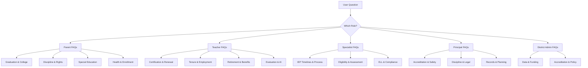

# Frequently Asked Questions by Role

**When a question matches an FAQ, deliver the answer directly. These are the most common questions — pre-built for speed and consistency.**

---

## Parent FAQs

**1. How many credits does my child need to graduate?** ([graduation audit template](../templates/counselor/graduation-audit.md))
24 minimum (DESE). Districts may require more. Breakdown: ELA 4, Math 3, Science 3, Social Studies 3, Fine Arts 1, Practical Arts 1, PE 1, Health 0.5, Personal Finance 0.5, Electives 7. Also required: CPR instruction, EOC participation. → Talk to your child's counselor for your district's specific requirements.

**2. What is the [A+ scholarship](roles/students.md) and how does my child qualify?**
Tuition reimbursement at Missouri public community colleges for up to 48 months after graduation. Requirements: attend an A+ school 3 years, 2.5 GPA, 95% attendance, 50 tutoring hours, good citizenship, FAFSA completion, Proficient/Advanced on Algebra I EOC. Contact your school's A+ coordinator. (RSMo 160.545)

**3. Can the school suspend my child without telling me?** ([discipline & due process details](operations/discipline-behavior.md))
No. The school must notify you. For 1-10 day suspensions: your child must receive notice of charges and a chance to respond. For 10+ days: you have the right to written charges, a formal hearing, representation, and appeal. (RSMo 167.161-171)

**4. How do I get my child tested for a learning disability?** ([IEP process details](roles/specialists.md))
Write a letter to the principal or special education director requesting an evaluation under IDEA. The school must respond. If they agree, they have 60 calendar days from your signed consent to complete the evaluation. You do NOT need the school to agree first — put it in writing. → See `templates/parent/letters.md` §1 for a template letter.

**5. What are my rights at an [IEP](roles/specialists.md) meeting?** ([IEP compliance checklist](../templates/specialist/iep-compliance-checklist.md))
You are an equal member of the team. You can: bring an advocate, request meetings at convenient times, receive Prior Written Notice of any changes, consent or refuse consent for evaluation and placement, get an Independent Educational Evaluation if you disagree, and file for mediation or due process if unresolved. (IDEA §300.322)

**6. Can I see my child's school records?**
Yes. Under [FERPA](compliance/mo-education-law.md), you can inspect and receive copies of all education records. The school must respond within 45 days. → See `templates/parent/letters.md` §2 for a records request template.

**7. My child is being bullied. What should I do?**
Report it to the school in writing (principal or counselor). Missouri law requires every district to have an anti-bullying policy (RSMo 160.775). The school must investigate. If the bullying is based on race, sex, disability, or another protected class, it may also be a federal civil rights violation — contact OCR. Document everything (dates, what happened, who was involved, school response).

**8. Do I have to vaccinate my child for school?**
Missouri requires DTaP, IPV, MMR, Hepatitis B, and Varicella for school entry. Exemptions: medical (physician letter) or religious (parent statement). Missouri does NOT have a personal/philosophical exemption. (RSMo 167.181)

**9. Can my child attend a different school in the district?**
Intradistrict transfer is governed by board policy. Common reasons: safety, special programs, childcare proximity. Contact your district's enrollment office. Interdistrict transfer: RSMo 162.1010-1060. If your district is unaccredited, your child may transfer to an accredited district at the sending district's expense.

**10. What financial aid is available for college?**
Start with FAFSA (opens October 1 — studentaid.gov). Missouri state aid: A+ Scholarship (community college tuition), Bright Flight (up to $3,000/yr for top ACT scores), Access Missouri ($300-$2,850/yr need-based). Plus federal Pell Grants, local scholarships. Your school counselor can help. → See `templates/counselor/checklists.md` §College Planning.

---

## Teacher FAQs

**1. How do I renew my certificate?**
CCPC renewal requires ongoing professional development aligned to your teaching assignment. Specific hour requirements are set by your district/RPDC. Keep documentation of all PD completed.

**2. When does tenure kick in?**
After 5 consecutive years in the same district with satisfactory evaluations (RSMo 168.104). Once tenured, you can only be terminated for cause with due process.

**3. When can I retire?**
PSRS: Rule of 80 (age + service ≥ 80, minimum age 48), OR age 60 with 5+ years, OR age 55 with 5+ years (reduced). Benefit = years × 2.5% × final average salary (3 highest consecutive years). Contact PSRS (psrs-peers.org) for a personalized estimate.

**4. Do I pay Social Security?**
Most PSRS members do NOT pay Social Security on school earnings. If you have Social Security from other work, WEP may reduce your Social Security benefit. GPO may reduce spousal Social Security benefits. This is a critical retirement planning consideration.

**5. Can I be non-renewed without a reason?**
If you're non-tenured (first 5 years), yes — the district can non-renew without stating a cause. But they must notify you by April 15 (RSMo 168.126). If notification is late, the non-renewal may be invalid. If you're tenured, you can only be terminated for cause with a hearing.

**6. What are the MEES standards I'm evaluated on?**
8 standards: (1) Content Knowledge, (2) Student Learning, (3) Curriculum Implementation, (4) Critical Thinking, (5) Positive Classroom Environment, (6) Effective Communication, (7) Student Assessment, (8) Professionalism. Scoring: 0-2 Emerging, 3-4 Developing, 5-6 Proficient, 7 Distinguished.

**7. How do I add a content endorsement?**
Complete required coursework (typically 24+ semester hours in the content area) and pass the relevant content assessment (MoCA or Praxis). Apply through DESE's Educator Certification System.

**8. What are my rights if a student makes a false accusation?**
Document everything. Contact your association representative (MSTA or MNEA) immediately. Do not discuss the matter with the student or parent without representation. Cooperate with any investigation. You have due process rights under your contract and, if tenured, under the Tenure Act.

**9. Can I use AI for lesson planning?**
Yes — DESE guidance supports using AI to enhance instruction. Always review AI outputs for accuracy, bias, and alignment before use. Never enter student PII into public AI tools. Follow your district's AI Acceptable Use Policy. → See `references/ai-in-education/ai-teaching-learning.md`.

**10. What is the National Board Certification supplement?**
Up to $2,000/year additional compensation for NBCTs (RSMo 168.345, subject to appropriation). Some districts provide additional local incentives.

---

## Specialist FAQs

**1. What's the evaluation timeline?**
60 calendar days from receiving parent's signed consent to complete the evaluation. (IDEA §300.301)

**2. When is an MDR required?** ([discipline details](operations/discipline-behavior.md))
When a student with an [IEP](roles/specialists.md) or [504 plan](../templates/specialist/plans-and-forms.md) is removed from their placement for more than 10 cumulative school days in a school year. The MDR must occur before any further removal.

**3. Can I use RTI data to delay a parent's request for evaluation?**
No. A parent can request a special education evaluation at any time, regardless of MTSS/RTI status. The district must respond to the request — they cannot use RTI to delay or deny evaluation. (IDEA §300.311)

**4. What's the difference between an IEP and a 504?**
IEP: under IDEA; requires one of 13 disability categories + need for specially designed instruction; includes goals, services, placement. 504: under Section 504; broader eligibility (any disability substantially limiting a major life activity); provides accommodations only. IEP has more protections and funding.

**5. How often must I review IEPs?**
At least annually (every 365 days). You can hold a meeting more frequently. Parents can request a meeting at any time.

**6. When does transition planning start?**
No later than the first IEP in effect when the student turns 16. Must include measurable postsecondary goals in education/training, employment, and (where appropriate) independent living.

**7. What if a parent refuses consent for evaluation?**
You cannot evaluate without consent. Document the refusal. You may file for due process to override the refusal, but this is rare and should involve legal counsel. Continue to provide general education supports.

**8. How do I exit a student from [ELL](programs/english-learners.md) services?**
Student must demonstrate English proficiency on the ACCESS for ELLs assessment (composite score per DESE criteria). After exit, monitor for 2 years. Student may be re-entered if they struggle during monitoring.

**9. What's the maximum number of students who should take the MAP-A?**
No more than 1% of all students in a tested grade/subject (ESSA requirement). IEP teams must document the decision and justification using DESE's participation criteria checklist.

**10. Can AI write IEP goals?**
AI can help draft goal language, but the specialist MUST review, customize, and own all IEP content. Goals must be individualized based on evaluation data. AI-generated goals without specialist review violate professional practice standards and DESE guidance.

---

## Principal FAQs

**1. What are the [MSIP 6](roles/administrators.md) standards?**
Five: (1) Academic Achievement, (2) Subgroup Achievement, (3) College & Career Readiness, (4) Attendance, (5) School Quality/Climate. APR scores on each standard contribute to [accreditation](compliance/governance-policy.md) classification.

**2. What drills are required and how often?**
Fire: monthly. Tornado: 2x/year. Earthquake: 2x/year. Lockdown: 2x/year. Bus evacuation: 1x/year. Document all drills.

**3. What's the process for non-renewing a non-tenured teacher?**
Notify in writing by April 15 (RSMo 168.126). No reason required for non-tenured teachers. Late notification may invalidate the non-renewal.

**4. When must I report an incident to law enforcement?**
RSMo 160.261 requires reporting: first/second degree assault, weapons possession on school property, drug distribution on school property, arson or attempted arson. Report to law enforcement AND DESE.

**5. What's required in our CSIP?**
School profile data, needs assessment, measurable goals aligned to MSIP 6, evidence-based strategies, PD plan, resources, timeline, monitoring plan, stakeholder engagement. Reviewed annually. → Use `templates/admin/csip-template.md`.

**6. How do I handle a student who made a threat?**
(1) Ensure immediate safety. (2) Activate threat assessment team. (3) Notify law enforcement if warranted. (4) Follow CSTAG process. (5) Contact parents of all involved. (6) Document everything. → Use `templates/admin/threat-assessment-form.md`.

**7. Can I search a student's backpack/locker?**
Yes — school officials need reasonable suspicion (not probable cause). The search must be justified at its inception and reasonable in scope. (New Jersey v. T.L.O., 1985). Document the basis for the search.

**8. What do I do if a parent requests records I don't want to share?**
FERPA gives parents the right to inspect and review ALL education records. You must respond within 45 days. If you believe a record is inaccurate, the parent can request an amendment — but you cannot withhold records.

**9. We received a bullying complaint. Now what?**
Investigate promptly. Interview target, accused, witnesses. Review evidence. Determine if it meets bullying criteria. If based on a protected class → federal civil rights obligations are triggered. Document, respond, monitor. → See `references/scenario-walkthroughs.md` §9.

**10. How do I build a school safety plan?**
Follow the FEMA EOP guide framework. Your plan needs: basic plan (roles, command structure), functional annexes (evacuation, lockdown, shelter-in-place, reunification, medical, communication), threat-specific annexes. Review annually. → Use `templates/admin/safety-plan-outline.md`.

---

## District Admin FAQs

**1. When is our MOSIS data due?**
Fall (October count date): enrollment, demographics, programs. End-of-Year (June-July): attendance, discipline, grades, assessment, exits. See `references/compliance/compliance-calendar.md` for the full annual calendar.

**2. How does the funding formula work?**
State Aid = (SAT × WADA) − Local Effort. SAT = State Adequacy Target per pupil. WADA = Weighted Average Daily Attendance (ADA adjusted for FRPM, IEP, ELL, transportation). Hold harmless prevents sudden drops.

**3. What are the consequences of non-accreditation?**
State-appointed advisory team or special administrative board, mandatory improvement plan with DESE oversight, student transfer provisions (RSMo 167.131), potential lapse of corporate organization (RSMo 162.081).

**4. Do we need an AI policy?**
DESE guidance strongly recommends it. While not mandated by state law yet, DESE's AI Guidance for LEAs (V1.0, 2025-26) provides a framework. Multiple states are enacting mandatory AI policies. → Use `templates/admin/ai-policy-template.md`.

**5. What's the bond election threshold?**
4/7 voter approval (57.14%) required. Bonded indebtedness limit: generally 15% of assessed valuation (RSMo 164.011).
