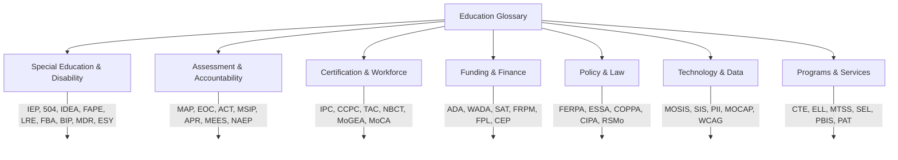

# Education Glossary — Acronyms & Terms
# Glosario Educativo — Siglas y Términos

**Use this file when a user asks "what does ___ mean?" or uses an acronym you need to define for a non-specialist audience.**
**Use este archivo cuando un usuario pregunte "qué significa ___" o use una sigla que necesite definir para una audiencia no especializada.**

## A
| Term | Spanish | Definition |
|------|---------|-----------|
| **504 Plan** | *Plan 504* | Accommodation plan under Section 504 of the Rehabilitation Act for students with disabilities who don't need an IEP but need accommodations to access education |
| **A+** | *Programa A+* | Missouri A+ Schools Program — tuition reimbursement at community colleges for eligible graduates (RSMo 160.545) |
| **AAC** | *Comunicación Aumentativa y Alternativa (CAA)* | Augmentative and Alternative Communication — devices and strategies for people who cannot rely on speech |
| **ABC Data** | *Datos ABC (Antecedente-Comportamiento-Consecuencia)* | Antecedent-Behavior-Consequence — data collection method for understanding why a behavior occurs |
| **ACE** | *Experiencia Adversa en la Infancia* | Adverse Childhood Experience — traumatic events in childhood linked to long-term health and education outcomes |
| **ACT** | *ACT (examen de preparación universitaria)* | College readiness test administered to all Missouri juniors; composite score 1-36 |
| **ADA** | *Asistencia Diaria Promedio / Ley de Estadounidenses con Discapacidades* | Average Daily Attendance (funding context) OR Americans with Disabilities Act (accessibility context) |
| **AEL** | *Educación y Alfabetización para Adultos* | Adult Education and Literacy |
| **AHERA** | *Ley de Respuesta a Emergencias por Asbesto* | Asbestos Hazard Emergency Response Act — requires asbestos management plans in schools |
| **AP** | *Colocación Avanzada* | Advanced Placement — college-level courses in high school |
| **APR** | *Informe Anual de Desempeño* | Annual Performance Report — DESE's annual accountability report for each district/school |
| **ASCA** | *Asociación Americana de Consejeros Escolares* | American School Counselor Association |
| **ASQ** | *Cuestionario de Edades y Etapas* | Ages and Stages Questionnaire — developmental screening tool |
| **AT** | *Tecnología de Asistencia* | Assistive Technology |

## B-C
| Term | Spanish | Definition |
|------|---------|-----------|
| **BIP** | *Plan de Intervención de Comportamiento* | Behavior Intervention Plan — individualized plan based on an FBA to address challenging behavior |
| **BID** | *Determinación del Mejor Interés* | Best Interest Determination — process for deciding school placement for foster care students |
| **CAPS** | *Sistema de Planificación Universitaria y Profesional* | College and Career Planning System |
| **CASEL** | *Colaboración para el Aprendizaje Académico, Social y Emocional* | Collaborative for Academic, Social, and Emotional Learning |
| **CCPC** | *Certificado Profesional de Carrera Continua* | Career Continuous Professional Certificate — Missouri's career teaching certificate (lifetime with renewal) |
| **CCSS** | *Estándares Estatales Comunes* | Common Core State Standards — Missouri developed its own Missouri Learning Standards (not Common Core) |
| **CEP** | *Provisión de Elegibilidad Comunitaria* | Community Eligibility Provision — allows high-poverty schools to serve free meals to all students |
| **CIPA** | *Ley de Protección de Internet para Niños* | Children's Internet Protection Act — requires internet filtering for E-Rate recipients |
| **CLD** | *Culturalmente y Lingüísticamente Diverso* | Culturally and Linguistically Diverse |
| **CLNA** | *Evaluación Integral de Necesidades Locales* | Comprehensive Local Needs Assessment — required under Perkins V for CTE programs |
| **COPPA** | *Ley de Protección de la Privacidad en Línea de los Niños* | Children's Online Privacy Protection Act — protects data of children under 13 online |
| **CSIP** | *Plan Integral de Mejora Escolar* | Comprehensive School Improvement Plan — required for every Missouri school (RSMo 160.526) |
| **CSTAG** | *Guías Integrales de Evaluación de Amenazas Escolares* | Comprehensive School Threat Assessment Guidelines — based on Dr. Dewey Cornell's research at University of Virginia |
| **CTE** | *Educación Técnica y Profesional* | Career and Technical Education |
| **CTSO** | *Organización Estudiantil de Carreras Técnicas* | Career and Technical Student Organization (FFA, FBLA, DECA, HOSA, etc.) |
| **CVI** | *Impedimento Visual Cortical* | Cortical Visual Impairment — visual processing difficulty in the brain rather than the eye |

## D-E
| Term | Spanish | Definition |
|------|---------|-----------|
| **DESE** | *Departamento de Educación Primaria y Secundaria de Missouri* | Missouri Department of Elementary and Secondary Education |
| **DSIP** | *Plan de Mejora Escolar del Distrito* | District School Improvement Plan |
| **Dyslexia** | *Dislexia* | Specific learning disability affecting reading fluency and comprehension |
| **ECS** | *Sistema de Certificación de Educadores* | Educator Certification System — DESE's online certification portal |
| **ECSE** | *Educación Especial para la Primera Infancia* | Early Childhood Special Education (ages 3-5, IDEA Part B/619) |
| **ELL** | *Estudiante de Inglés como Segundo Idioma* | English Language Learner |
| **EOC** | *Examen de Fin de Curso* | End-of-Course exam — state assessment given upon completing English II, Algebra I, Biology, American Government |
| **EOP** | *Plan de Operaciones de Emergencia* | Emergency Operations Plan |
| **ESL** | *Inglés como Segundo Idioma* | English as a Second Language |
| **ESSA** | *Ley Cada Estudiante Triunfa* | Every Student Succeeds Act (2015) — federal education law replacing No Child Left Behind |
| **ESY** | *Año Escolar Extendido* | Extended School Year — special education services during summer for students who would regress significantly |
| **EWS** | *Sistema de Alerta Temprana* | Early Warning System — data dashboard tracking attendance, behavior, and course performance to flag at-risk students |

## F-G
| Term | Spanish | Definition |
|------|---------|-----------|
| **FAPE** | *Educación Pública Gratuita y Apropiada* | Free Appropriate Public Education — the right of every student with a disability under IDEA |
| **FBA** | *Evaluación Funcional de Comportamiento* | Functional Behavior Assessment — systematic process to determine WHY a behavior occurs |
| **FERPA** | *Ley de Derechos Educativos y Privacidad Familiar* | Family Educational Rights and Privacy Act — federal law protecting student education records |
| **First-Generation College Student** | *Estudiante Universitario de Primera Generación* | Student whose parents did not complete a 4-year degree |
| **FPL** | *Nivel Federal de Pobreza* | Federal Poverty Level — income threshold used for program eligibility (free lunch ≤130%, reduced ≤185%) |
| **FRPM** | *Comidas Gratuitas o a Precio Reducido* | Free and Reduced Price Meals |
| **FTE** | *Equivalente de Tiempo Completo* | Full-Time Equivalent — staffing measurement (1.0 FTE = one full-time position) |
| **GAL** | *Tutor Ad Litem* | Guardian Ad Litem (family court context) |
| **GED** | *Desarrollo Educativo General* | General Educational Development (Missouri uses HiSET, not GED) |
| **GPA (Weighted vs. Unweighted)** | *Promedio de Calificaciones* | Grade Point Average — weighted includes bonus points for AP/honors; unweighted does not |
| **GPO** | *Compensación de Pensión Gubernamental* | Government Pension Offset — may reduce Social Security spousal benefits for PSRS members |

## H-I
| Term | Spanish | Definition |
|------|---------|-----------|
| **HiSET** | *Examen de Equivalencia de Escuela Secundaria* | High School Equivalency Test — Missouri's approved HSE exam (replaced GED in 2014) |
| **HLS** | *Encuesta del Idioma del Hogar* | Home Language Survey — enrollment questionnaire identifying potential ELLs |
| **IDEA** | *Ley de Educación para Individuos con Discapacidades* | Individuals with Disabilities Education Act — federal special education law |
| **IEE** | *Evaluación Educativa Independiente* | Independent Educational Evaluation — parent's right to get an outside evaluation at public expense |
| **IEP** | *Programa de Educación Individualizada* | Individualized Education Program — legally binding plan for students with disabilities under IDEA |
| **IFSP** | *Plan de Servicio Familiar Individualizado* | Individualized Family Service Plan — plan for infants/toddlers under IDEA Part C (First Steps) |
| **IHP** | *Plan de Atención Médica Individualizado* | Individualized Healthcare Plan — school nurse-developed plan for students with chronic health conditions |
| **ILP** | *Plan de Aprendizaje Individual* | Individual Learning Plan — student career and academic planning document |
| **IPC** | *Certificado Profesional Inicial* | Initial Professional Certificate — Missouri's first teaching certificate (4-year) |
| **IRC** | *Credencial Reconocida por la Industria* | Industry-Recognized Credential |
| **ISS** | *Suspensión Dentro de la Escuela* | In-School Suspension |

## L-M
| Term | Spanish | Definition |
|------|---------|-----------|
| **LEA** | *Agencia de Educación Local (distrito escolar)* | Local Education Agency — school district |
| **LLM** | *Modelo de Lenguaje Grande* | Large Language Model — AI system trained on text data (e.g., ChatGPT, Claude) |
| **LRE** | *Ambiente Menos Restrictivo* | Least Restrictive Environment — IDEA principle that students with disabilities should be educated with non-disabled peers to the maximum extent appropriate |
| **MAP** | *Programa de Evaluación de Missouri* | Missouri Assessment Program — state academic assessments (grades 3-8) |
| **MAP-A** | *Evaluación Alternativa MAP* | MAP Alternate Assessment — for students with the most significant cognitive disabilities |
| **MCDS** | *Sistema Integral de Datos de Missouri* | Missouri Comprehensive Data System — DESE's public data portal |
| **MDR** | *Revisión de Determinación de Manifestación* | Manifestation Determination Review — required before removing a student with an IEP/504 for more than 10 cumulative days |
| **MEES** | *Sistema de Evaluación de Educadores de Missouri* | Missouri Educator Evaluation System — 8 standards, 36 quality indicators |
| **MIC3** | *Comisión del Pacto Interestatal Militar para Niños* | Military Interstate Children's Compact Commission |
| **MLS** | *Estándares de Aprendizaje de Missouri* | Missouri Learning Standards |
| **MOCAP** | *Programa de Acceso a Cursos de Missouri* | Missouri Course Access Program — virtual course access for K-12 students |
| **MoGEA** | *Evaluación de Educación General de Missouri* | Missouri General Education Assessment — basic skills test for teacher certification |
| **MOSIS** | *Sistema de Información Estudiantil de Missouri* | Missouri Student Information System — student-level data reporting to DESE |
| **MPACT** | *Acción de Padres de Missouri (defensoría de educación especial)* | Missouri Parents Act — parent advocacy organization for special education |
| **MSBA** | *Asociación de Juntas Escolares de Missouri* | Missouri School Boards Association |
| **MSHSAA** | *Asociación de Actividades de Escuelas Secundarias de Missouri* | Missouri State High School Activities Association |
| **MSIP** | *Programa de Mejora Escolar de Missouri* | Missouri School Improvement Program — state accreditation system (currently MSIP 6) |
| **MTSS** | *Sistema de Apoyos de Múltiples Niveles* | Multi-Tiered System of Supports — framework integrating academic and behavioral support |

## N-P
| Term | Spanish | Definition |
|------|---------|-----------|
| **NAEP** | *Evaluación Nacional del Progreso Educativo ("Boleta de la Nación")* | National Assessment of Educational Progress (the "Nation's Report Card") |
| **NBCT** | *Maestro Certificado por la Junta Nacional* | National Board Certified Teacher |
| **OCR** | *Oficina de Derechos Civiles* | Office for Civil Rights (U.S. Department of Education) |
| **OT** | *Terapia Ocupacional / Terapeuta Ocupacional* | Occupational Therapy / Occupational Therapist |
| **OSS** | *Suspensión Fuera de la Escuela* | Out-of-School Suspension |
| **PAT** | *Padres como Maestros* | Parents as Teachers — Missouri's home visiting program |
| **PBIS** | *Intervenciones y Apoyos de Comportamiento Positivo* | Positive Behavioral Interventions and Supports |
| **PBL** | *Aprendizaje Basado en Proyectos* | Project-Based Learning |
| **PEERS** | *Sistema de Jubilación para Empleados de Educación Pública* | Public Education Employee Retirement System (non-certificated staff) |
| **PII** | *Información de Identificación Personal* | Personally Identifiable Information |
| **PLAAFP** | *Niveles Actuales de Rendimiento Académico y Desempeño Funcional* | Present Levels of Academic Achievement and Functional Performance (IEP section) |
| **PLC** | *Comunidad de Aprendizaje Profesional* | Professional Learning Community |
| **Prompt Engineering** | *Ingeniería de Indicaciones* | Crafting effective instructions for AI tools |
| **PSLF** | *Condonación de Préstamos por Servicio Público* | Public Service Loan Forgiveness |
| **PSRS** | *Sistema de Jubilación de Escuelas Públicas de Missouri* | Public School Retirement System of Missouri (certificated staff) |
| **PT** | *Terapia Física / Terapeuta Físico* | Physical Therapy / Physical Therapist |
| **PWN** | *Aviso Previo por Escrito* | Prior Written Notice — required notification from school to parent before any IEP/504 change |

## R-S
| Term | Spanish | Definition |
|------|---------|-----------|
| **Restorative Justice** | *Justicia Restaurativa* | Discipline approach focused on repairing harm rather than punishment |
| **RPDC** | *Centro Regional de Desarrollo Profesional* | Regional Professional Development Center |
| **RTI** | *Respuesta a la Intervención* | Response to Intervention — predecessor framework to MTSS |
| **SAT** | *Meta de Suficiencia Estatal / Examen de Evaluación Escolar* | State Adequacy Target (funding formula context) OR Scholastic Assessment Test (college readiness context) |
| **SBG** | *Calificación Basada en Estándares* | Standards-Based Grading |
| **SBHC** | *Centro de Salud Escolar* | School-Based Health Center |
| **SEL** | *Aprendizaje Socioemocional* | Social-Emotional Learning — skills for managing emotions, relationships, and decision-making |
| **SIFE** | *Estudiantes con Educación Formal Interrumpida* | Students with Interrupted Formal Education |
| **SIOP** | *Protocolo de Observación de Instrucción Protegida* | Sheltered Instruction Observation Protocol — framework for teaching content to ELLs |
| **SIS** | *Sistema de Información Estudiantil* | Student Information System (e.g., PowerSchool, Tyler SIS) |
| **SLD** | *Discapacidad Específica de Aprendizaje* | Specific Learning Disability (dyslexia, dyscalculia, dysgraphia) |
| **SLP** | *Patólogo del Habla y Lenguaje* | Speech-Language Pathologist |
| **SRO** | *Oficial de Recursos Escolares* | School Resource Officer |
| **SRM** | *Método Estándar de Reunificación* | Standard Reunification Method |
| **SW-PBS** | *Apoyo de Comportamiento Positivo a Nivel Escolar* | Missouri Schoolwide Positive Behavior Support |

## T-W
| Term | Spanish | Definition |
|------|---------|-----------|
| **TAC** | *Certificado de Autorización Temporal* | Temporary Authorization Certificate — interim teaching certificate |
| **TVI** | *Maestro de Estudiantes con Discapacidad Visual* | Teacher of the Visually Impaired |
| **UDL** | *Diseño Universal para el Aprendizaje* | Universal Design for Learning |
| **WADA** | *Asistencia Diaria Promedio Ponderada* | Weighted Average Daily Attendance — ADA adjusted for special populations (funding formula) |
| **WBL** | *Aprendizaje Basado en el Trabajo* | Work-Based Learning |
| **WCAG** | *Pautas de Accesibilidad para el Contenido Web* | Web Content Accessibility Guidelines |
| **WEP** | *Provisión de Eliminación por Ganancias Inesperadas* | Windfall Elimination Provision — may reduce Social Security for PSRS members with other covered employment |
| **WIDA** | *Diseño y Evaluación Instruccional de Clase Mundial* | World-class Instructional Design and Assessment — consortium for ELL assessment (ACCESS test) |
| **WIOA** | *Ley de Innovación y Oportunidad de la Fuerza Laboral* | Workforce Innovation and Opportunity Act |
| **YC-DD** | *Niño Pequeño con Retraso en el Desarrollo* | Young Child with a Developmental Delay — IDEA eligibility category for ages 3-5 |

## Additional Terms from Guía de Padres / Additional Terms from Parent Guide
| Term | Spanish | Definition |
|------|---------|-----------|
| **Accommodation** | *Acomodación* | A change in how instruction or assessment is delivered that allows a student to access the curriculum without altering content expectations (e.g., extended time, preferential seating) |
| **Due Process** | *Debido Proceso* | A formal legal procedure under IDEA allowing parents to resolve disputes with the school district about identification, evaluation, placement, or services for a student with a disability |
| **Enrollment** | *Inscripción / Matrícula* | The process of registering a student in a school; schools cannot ask about immigration status (Plyler v. Doe, 1982) |
| **Expulsion** | *Expulsión* | Long-term removal of a student from school, typically for serious disciplinary violations; requires formal hearing and written decision (RSMo 167.171) |
| **Formal Hearing** | *Audiencia Formal* | A due process proceeding in which evidence is presented, typically regarding long-term suspension or expulsion; parents have the right to representation |
| **Mandated Reporter** | *Reportero Obligatorio* | A person required by law to report suspected child abuse or neglect to the Children's Division hotline (1-800-392-3738) |
| **McKinney-Vento** | *McKinney-Vento (Ley de Asistencia para Personas sin Hogar)* | Federal law ensuring homeless students have immediate enrollment, transportation to school of origin, free meals, and Title I services |
| **Parent-Teacher Conference** | *Conferencia de Padres y Maestros* | A scheduled meeting between parents and teachers to discuss a student's academic progress, behavior, and goals |
| **Procedural Safeguards** | *Salvaguardas Procesales* | The set of rights guaranteed to parents under IDEA, including prior written notice, consent, access to records, and dispute resolution options |
| **Report Card** | *Boleta de Calificaciones* | A periodic document summarizing a student's academic grades and performance |
| **School Counselor** | *Consejero Escolar* | A certified professional who supports students' academic, social-emotional, and career development |
| **Suspension** | *Suspensión* | Temporary removal of a student from school; short-term (1-10 days) requires notice and opportunity to respond; long-term (10+ days) requires formal hearing |
