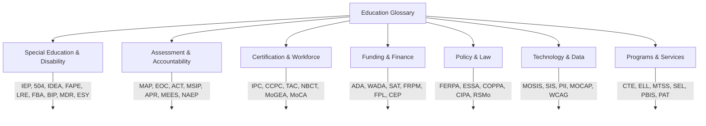

# Education Glossary — Acronyms & Terms

**Use this file when a user asks "what does ___ mean?" or uses an acronym you need to define for a non-specialist audience.**

## A
| Term | Definition |
|------|-----------|
| **504 Plan** | Accommodation plan under Section 504 of the Rehabilitation Act for students with disabilities who don't need an IEP but need accommodations to access education |
| **A+** | Missouri A+ Schools Program — tuition reimbursement at community colleges for eligible graduates (RSMo 160.545) |
| **AAC** | Augmentative and Alternative Communication — devices and strategies for people who cannot rely on speech |
| **ABC Data** | Antecedent-Behavior-Consequence — data collection method for understanding why a behavior occurs |
| **ACE** | Adverse Childhood Experience — traumatic events in childhood linked to long-term health and education outcomes |
| **ACT** | College readiness test administered to all Missouri juniors; composite score 1-36 |
| **ADA** | Average Daily Attendance (funding context) OR Americans with Disabilities Act (accessibility context) |
| **AEL** | Adult Education and Literacy |
| **AHERA** | Asbestos Hazard Emergency Response Act — requires asbestos management plans in schools |
| **AP** | Advanced Placement — college-level courses in high school |
| **APR** | Annual Performance Report — DESE's annual accountability report for each district/school |
| **ASCA** | American School Counselor Association |
| **ASQ** | Ages and Stages Questionnaire — developmental screening tool |
| **AT** | Assistive Technology |

## B-C
| Term | Definition |
|------|-----------|
| **BIP** | Behavior Intervention Plan — individualized plan based on an FBA to address challenging behavior |
| **BID** | Best Interest Determination — process for deciding school placement for foster care students |
| **CASEL** | Collaborative for Academic, Social, and Emotional Learning |
| **CCPC** | Career Continuous Professional Certificate — Missouri's career teaching certificate (lifetime with renewal) |
| **CCSS** | Common Core State Standards — Missouri developed its own Missouri Learning Standards (not Common Core) |
| **CEP** | Community Eligibility Provision — allows high-poverty schools to serve free meals to all students |
| **CIPA** | Children's Internet Protection Act — requires internet filtering for E-Rate recipients |
| **CLD** | Culturally and Linguistically Diverse |
| **CLNA** | Comprehensive Local Needs Assessment — required under Perkins V for CTE programs |
| **COPPA** | Children's Online Privacy Protection Act — protects data of children under 13 online |
| **CSIP** | Comprehensive School Improvement Plan — required for every Missouri school (RSMo 160.526) |
| **CSTAG** | Comprehensive School Threat Assessment Guidelines (Dr. Dewey Cornell) |
| **CTE** | Career and Technical Education |
| **CTSO** | Career and Technical Student Organization (FFA, FBLA, DECA, HOSA, etc.) |

## D-E
| Term | Definition |
|------|-----------|
| **DESE** | Missouri Department of Elementary and Secondary Education |
| **DSIP** | District School Improvement Plan |
| **ECS** | Educator Certification System — DESE's online certification portal |
| **ECSE** | Early Childhood Special Education (ages 3-5, IDEA Part B/619) |
| **ELL** | English Language Learner |
| **EOC** | End-of-Course exam — state assessment given upon completing English II, Algebra I, Biology, American Government |
| **EOP** | Emergency Operations Plan |
| **ESL** | English as a Second Language |
| **ESSA** | Every Student Succeeds Act (2015) — federal education law replacing No Child Left Behind |
| **ESY** | Extended School Year — special education services during summer for students who would regress significantly |
| **EWS** | Early Warning System — data dashboard tracking attendance, behavior, and course performance to flag at-risk students |

## F-G
| Term | Definition |
|------|-----------|
| **FAPE** | Free Appropriate Public Education — the right of every student with a disability under IDEA |
| **FBA** | Functional Behavior Assessment — systematic process to determine WHY a behavior occurs |
| **FERPA** | Family Educational Rights and Privacy Act — federal law protecting student education records |
| **FPL** | Federal Poverty Level — income threshold used for program eligibility (free lunch ≤130%, reduced ≤185%) |
| **FRPM** | Free and Reduced Price Meals |
| **FTE** | Full-Time Equivalent — staffing measurement (1.0 FTE = one full-time position) |
| **GAL** | Guardian Ad Litem (family court context) |
| **GED** | General Educational Development (Missouri uses HiSET, not GED) |
| **GPO** | Government Pension Offset — may reduce Social Security spousal benefits for PSRS members |

## H-I
| Term | Definition |
|------|-----------|
| **HiSET** | High School Equivalency Test — Missouri's approved HSE exam (replaced GED in 2014) |
| **HLS** | Home Language Survey — enrollment questionnaire identifying potential ELLs |
| **IDEA** | Individuals with Disabilities Education Act — federal special education law |
| **IEE** | Independent Educational Evaluation — parent's right to get an outside evaluation at public expense |
| **IEP** | Individualized Education Program — legally binding plan for students with disabilities under IDEA |
| **IFSP** | Individualized Family Service Plan — plan for infants/toddlers under IDEA Part C (First Steps) |
| **IHP** | Individualized Healthcare Plan — school nurse-developed plan for students with chronic health conditions |
| **ILP** | Individual Learning Plan — student career and academic planning document |
| **IPC** | Initial Professional Certificate — Missouri's first teaching certificate (4-year) |
| **IRC** | Industry-Recognized Credential |
| **ISS** | In-School Suspension |

## L-M
| Term | Definition |
|------|-----------|
| **LEA** | Local Education Agency — school district |
| **LRE** | Least Restrictive Environment — IDEA principle that students with disabilities should be educated with non-disabled peers to the maximum extent appropriate |
| **MAP** | Missouri Assessment Program — state academic assessments (grades 3-8) |
| **MAP-A** | MAP Alternate Assessment — for students with the most significant cognitive disabilities |
| **MCDS** | Missouri Comprehensive Data System — DESE's public data portal |
| **MDR** | Manifestation Determination Review — required before removing a student with an IEP/504 for more than 10 cumulative days |
| **MEES** | Missouri Educator Evaluation System — 8 standards, 36 quality indicators |
| **MIC3** | Military Interstate Children's Compact Commission |
| **MLS** | Missouri Learning Standards |
| **MOCAP** | Missouri Course Access Program — virtual course access for K-12 students |
| **MoGEA** | Missouri General Education Assessment — basic skills test for teacher certification |
| **MOSIS** | Missouri Student Information System — student-level data reporting to DESE |
| **MPACT** | Missouri Parents Act — parent advocacy organization for special education |
| **MSBA** | Missouri School Boards Association |
| **MSHSAA** | Missouri State High School Activities Association |
| **MSIP** | Missouri School Improvement Program — state accreditation system (currently MSIP 6) |
| **MTSS** | Multi-Tiered System of Supports — framework integrating academic and behavioral support |

## N-P
| Term | Definition |
|------|-----------|
| **NAEP** | National Assessment of Educational Progress (the "Nation's Report Card") |
| **NBCT** | National Board Certified Teacher |
| **OCR** | Office for Civil Rights (U.S. Department of Education) |
| **OT** | Occupational Therapy / Occupational Therapist |
| **OSS** | Out-of-School Suspension |
| **PAT** | Parents as Teachers — Missouri's home visiting program |
| **PBIS** | Positive Behavioral Interventions and Supports |
| **PBL** | Project-Based Learning |
| **PEERS** | Public Education Employee Retirement System (non-certificated staff) |
| **PII** | Personally Identifiable Information |
| **PLAAFP** | Present Levels of Academic Achievement and Functional Performance (IEP section) |
| **PLC** | Professional Learning Community |
| **PSLF** | Public Service Loan Forgiveness |
| **PSRS** | Public School Retirement System of Missouri (certificated staff) |
| **PT** | Physical Therapy / Physical Therapist |
| **PWN** | Prior Written Notice — required notification from school to parent before any IEP/504 change |

## R-S
| Term | Definition |
|------|-----------|
| **RPDC** | Regional Professional Development Center |
| **RTI** | Response to Intervention — predecessor framework to MTSS |
| **SAT** | State Adequacy Target (funding formula context) OR Scholastic Assessment Test (college readiness context) |
| **SBG** | Standards-Based Grading |
| **SBHC** | School-Based Health Center |
| **SEL** | Social-Emotional Learning |
| **SIFE** | Students with Interrupted Formal Education |
| **SIS** | Student Information System (e.g., PowerSchool, Tyler SIS) |
| **SLD** | Specific Learning Disability (dyslexia, dyscalculia, dysgraphia) |
| **SLP** | Speech-Language Pathologist |
| **SRO** | School Resource Officer |
| **SRM** | Standard Reunification Method |
| **SW-PBS** | Missouri Schoolwide Positive Behavior Support |

## T-W
| Term | Definition |
|------|-----------|
| **TAC** | Temporary Authorization Certificate — interim teaching certificate |
| **TVI** | Teacher of the Visually Impaired |
| **UDL** | Universal Design for Learning |
| **WADA** | Weighted Average Daily Attendance — ADA adjusted for special populations (funding formula) |
| **WBL** | Work-Based Learning |
| **WCAG** | Web Content Accessibility Guidelines |
| **WEP** | Windfall Elimination Provision — may reduce Social Security for PSRS members with other covered employment |
| **WIDA** | World-class Instructional Design and Assessment — consortium for ELL assessment (ACCESS test) |
| **WIOA** | Workforce Innovation and Opportunity Act |
| **YC-DD** | Young Child with a Developmental Delay — IDEA eligibility category for ages 3-5 |
