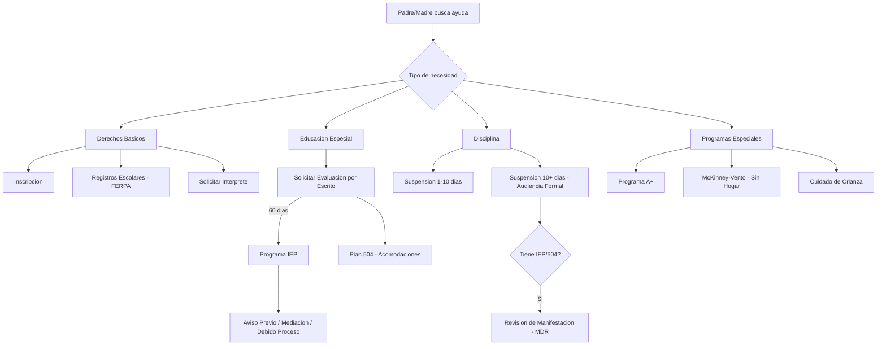

# Guía de Derechos para Padres — Missouri K-12
# Parent Rights Guide (Spanish) — Missouri K-12

*Esta guía proporciona información educativa. No es asesoramiento legal. / This guide provides educational information. It is not legal advice.*

---

## Sus Derechos Básicos / Your Basic Rights

**Inscripción / Enrollment:**
Su hijo tiene derecho a asistir a la escuela pública gratuita. La escuela NO puede preguntar sobre su estatus migratorio (Plyler v. Doe, 1982). No necesita un número de Seguro Social para inscribir a su hijo.

**Registros escolares / School Records (FERPA):**
Usted tiene derecho a revisar y recibir copias de los registros educativos de su hijo. La escuela debe responder dentro de 45 días.

**Comunicación / Communication:**
Usted tiene derecho a recibir información de la escuela en un idioma que pueda entender (en la medida de lo posible). Puede solicitar un intérprete para reuniones escolares.

**Participación / Participation:**
Usted tiene derecho a participar en las decisiones educativas de su hijo, incluyendo reuniones de IEP, reuniones de 504, y conferencias de padres y maestros.

---

## Educación Especial / Special Education (IDEA)

**Si cree que su hijo tiene una discapacidad de aprendizaje:**
Usted puede solicitar una evaluación (evaluation) por escrito en cualquier momento. La escuela debe responder. Si aceptan evaluar, tienen 60 días calendario después de recibir su consentimiento firmado.

**Sus derechos en el proceso de IEP (Programa de Educación Individualizada):**
- Ser miembro igual del equipo de IEP
- Recibir Aviso Previo por Escrito (Prior Written Notice / PWN) antes de cualquier cambio
- Dar o negar consentimiento para evaluación y colocación
- Obtener una Evaluación Educativa Independiente (Independent Educational Evaluation / IEE) a costo público si no está de acuerdo con la evaluación de la escuela
- Solicitar mediación, presentar una queja estatal, o solicitar una audiencia de debido proceso
- Traer un defensor o abogado a las reuniones

**Si su hijo es suspendido y tiene un IEP o plan 504:**
La escuela debe realizar una Revisión de Determinación de Manifestación (Manifestation Determination Review / MDR) antes de remover a su hijo por más de 10 días acumulativos en el año escolar.

---

## Plan 504 / Section 504 Plan

Si su hijo tiene una condición médica o discapacidad que afecta su aprendizaje pero no necesita instrucción especializada, puede calificar para un plan 504 (accommodation plan) que proporciona acomodaciones como:
- Tiempo adicional en exámenes (extended time)
- Asientos preferenciales (preferential seating)
- Modificaciones en tareas (modified assignments)
- Apoyo de salud (health accommodations)

Solicite una evaluación 504 por escrito al director o coordinador 504 de la escuela.

---

## Disciplina / Discipline

**Suspensión de 1-10 días:**
Su hijo debe recibir notificación de los cargos y oportunidad de responder. Usted debe ser notificado.

**Suspensión de más de 10 días o expulsión:**
Usted tiene derecho a: cargos por escrito, audiencia formal (formal hearing), representación, presentar evidencia, decisión por escrito, y apelación. (RSMo 167.171)

**Si su hijo tiene un IEP/504:** → Se requiere una MDR antes de la suspensión extendida. (Ver sección de Educación Especial arriba.)

---

## Asistencia / Attendance

La asistencia escolar es obligatoria para niños de 7 a 17 años (RSMo 167.031). Si su hijo tiene problemas de asistencia, la escuela debe ofrecer intervenciones antes de referir a la corte juvenil.

---

## Comidas Escolares / School Meals

Su hijo puede calificar para comidas gratuitas o a precio reducido (free or reduced-price meals). Complete la solicitud al inicio del año escolar. En escuelas con CEP (Community Eligibility Provision), TODOS los estudiantes reciben comidas gratis sin solicitud.

---

## Programas Especiales / Special Programs

**Programa A+:** becas para universidades comunitarias. Requisitos: 2.5 GPA, 95% asistencia, 50 horas de tutoría, buena ciudadanía, FAFSA completada. Hable con el coordinador A+ de su escuela.

**Estudiantes sin hogar / Homeless Students (McKinney-Vento):**
Si su familia no tiene vivienda fija, su hijo tiene derecho a inscripción inmediata, transporte a la escuela de origen, comidas gratuitas, y servicios de Título I. Contacte al enlace McKinney-Vento del distrito.

**Estudiantes en cuidado de crianza / Foster Care:**
Su hijo tiene derecho a permanecer en su escuela de origen y a inscripción inmediata si cambia de escuela.

---

## Números Importantes / Important Numbers

| Servicio | Número |
|----------|--------|
| Línea de abuso/negligencia infantil (Children's Division) | **1-800-392-3738** |
| Línea de crisis (988 Suicide & Crisis Lifeline) | Llame o envíe texto al **988** |
| DESE (Departamento de Educación de Missouri) | 573-751-4212 |
| MPACT (defensoría de padres para educación especial) | missouriparentsact.org |
| FAFSA (ayuda financiera universitaria) | studentaid.gov |

---

## Cómo Solicitar un Intérprete / How to Request an Interpreter

Diga o escriba a la escuela:
> "Necesito un intérprete en español para la reunión de mi hijo. Por favor proporcione uno."
> *"I need a Spanish interpreter for my child's meeting. Please provide one."*

Bajo la ley federal (Title VI), la escuela debe hacer esfuerzos razonables para comunicarse con usted en un idioma que entienda. Si no lo hacen, puede presentar una queja ante la Oficina de Derechos Civiles (OCR) del Departamento de Educación de los Estados Unidos.

---

## Vocabulario Clave / Key Vocabulary

| Español | English |
|---------|---------|
| Inscripción / Matrícula | Enrollment |
| Evaluación | Evaluation |
| Programa de Educación Individualizada | Individualized Education Program (IEP) |
| Educación pública gratuita y apropiada | Free Appropriate Public Education (FAPE) |
| Acomodación | Accommodation |
| Suspensión | Suspension |
| Expulsión | Expulsion |
| Audiencia | Hearing |
| Derechos | Rights |
| Debido proceso | Due process |
| Queja | Complaint |
| Consejero escolar | School counselor |
| Educación especial | Special education |
| Boleta de calificaciones | Report card |
| Conferencia de padres y maestros | Parent-teacher conference |
| Almuerzo gratuito o a precio reducido | Free or reduced-price lunch |
| Requisitos de graduación | Graduation requirements |
| Reportero obligatorio | Mandated reporter |
| Línea de ayuda para abuso/negligencia | Abuse/neglect hotline |
| Aviso previo por escrito | Prior Written Notice (PWN) |
| Salvaguardas procesales | Procedural safeguards |
| Ambiente menos restrictivo | Least Restrictive Environment (LRE) |
| Determinación de manifestación | Manifestation Determination Review (MDR) |
| Aceleración | Acceleration |
| Acoso escolar | Bullying |
| Acoso cibernético | Cyberbullying |
| Crédito doble | Dual credit |
| Derechos lingüísticos | Language rights |
| Educación dotada | Gifted education |
| Estudiante de primera generación | First-generation college student |
| Evaluación independiente (IEE) | Independent Educational Evaluation |
| Familia migrante | Migrant family |
| Justicia restaurativa | Restorative justice |
| Mediación | Mediation |
| Plan de seguridad | Safety plan |
| Salud mental | Mental health |
| Servicio de intérprete | Interpreter services |
| Título IX | Title IX |
| Transición | Transition |
| Tutoría | Tutoring |

---

## 11. Graduación — Requisitos (Graduation Requirements)

Su hijo necesita **24 créditos** para graduarse de una escuela secundaria de Missouri:

| Área | Créditos Requeridos |
|------|-------------------|
| Artes del Lenguaje (English Language Arts) | 4.0 |
| Estudios Sociales (Social Studies) | 3.0 |
| Matemáticas (Mathematics) | 3.0 |
| Ciencias (Science) | 3.0 |
| Bellas Artes (Fine Arts) | 1.0 |
| Educación Práctica (Practical Arts) | 1.0 |
| Educación Física (Physical Education) | 1.0 |
| Salud (Health) | 0.5 |
| Finanzas Personales (Personal Finance) | 0.5 |
| Electivos (Electives) | 7.0 |
| **Total** | **24.0** |

Los estudiantes también deben completar los exámenes **EOC (End-of-Course)** en las materias requeridas por el estado. Hable con el consejero escolar (school counselor) de su hijo para crear un plan de graduación.

---

## 12. Orientación Universitaria y Profesional (College & Career Readiness)

### Programa A+ (A+ Scholarship Program)

Si su escuela es designada A+, su hijo puede recibir **matrícula gratuita** en universidades comunitarias de Missouri. Requisitos:

- Asistencia del **95%** o más
- GPA de **2.5** o más (sin ponderar / unweighted)
- **50 horas** de tutoría no remunerada
- Buen ciudadano escolar (ciudadanía / good citizenship)
- Completar el **FAFSA** cada año
- Puntaje de competencia en un examen EOC de Álgebra I o superior

### FAFSA — Ayuda Financiera Federal

La **FAFSA** (Free Application for Federal Student Aid) es la solicitud para recibir ayuda financiera para la universidad. Su hijo debe completarla a partir del **1 de octubre** de su último año. Necesitará:

- Número de Seguro Social (SSN) del estudiante y de los padres
- Declaración de impuestos del año anterior
- Información bancaria

Hable con el consejero escolar para asistir a una **Noche de FAFSA** en su escuela.

### Crédito Doble (Dual Credit)

Su hijo puede tomar cursos universitarios mientras está en la escuela secundaria y recibir crédito para ambos — la escuela y la universidad. Pregunte al consejero sobre las opciones disponibles.

---

## 13. Bullying y Acoso Cibernético (Bullying & Cyberbullying)

Cada distrito escolar de Missouri debe tener una política contra el acoso escolar (RSMo 160.775).

**Señales de que su hijo puede ser víctima de bullying:**
- No quiere ir a la escuela
- Cambios en el comportamiento o estado de ánimo
- Pérdida de pertenencias o ropa dañada
- Quejas de dolor de cabeza o estómago
- Disminución en las calificaciones

**Qué hacer:**
1. Escuche a su hijo y documente lo que pasó (fechas, lugares, nombres)
2. Contacte al maestro o al consejero escolar por escrito
3. Si no se resuelve, presente una queja formal al director (principal)
4. El distrito debe investigar y tomar acción
5. Si involucra discriminación (raza, sexo, discapacidad), puede presentar una queja ante la **OCR** (Office for Civil Rights)

**Acoso cibernético (cyberbullying):** Si el acoso ocurre en línea, guarde capturas de pantalla como evidencia. La escuela puede intervenir si el acoso afecta el ambiente escolar.

---

## 14. Derechos Lingüísticos (Language Rights)

Bajo el **Título VI** de la Ley de Derechos Civiles y la **Orden Ejecutiva 13166**, su escuela debe:

- Comunicarse con usted en su idioma preferido
- Proporcionar un **intérprete calificado** en reuniones escolares (IEP, disciplina, inscripción) — **sin costo para usted**
- Traducir documentos importantes (boletas, notificaciones de disciplina, formularios de inscripción)
- **Nunca** usar a su hijo ni a un menor de edad como intérprete para asuntos escolares oficiales

**Cómo solicitar servicios de idioma:**
1. Envíe una carta escrita a la escuela pidiendo comunicación en su idioma
2. Solicite un intérprete con anticipación para cada reunión
3. Si la escuela se niega, presente una queja ante la **OCR**: 1-800-421-3481

→ Ver [cartas-padres-espanol.md](../templates/parent/cartas-padres-espanol.md) para una carta modelo de solicitud de intérprete.

---

## 15. Inscripción Especial (Special Enrollment Situations)

### Familias Inmigrantes

Bajo **Plyler v. Doe** (1982), su hijo tiene derecho a inscribirse en la escuela pública **sin importar** su estatus migratorio. La escuela:

- **NO puede** preguntar sobre estatus migratorio
- **NO puede** pedir número de Seguro Social como requisito
- **Debe** inscribir a su hijo con cualquier documento de identidad disponible
- Ofrece un período de gracia para vacunas (immunizations)

**Qué llevar a la inscripción:**
- Prueba de edad (acta de nacimiento, pasaporte, o declaración de los padres)
- Registro de vacunas (o solicitar el período de gracia)
- Prueba de dirección (contrato de alquiler, factura de servicios, o carta de la persona con quien vive)

Después de la inscripción, la escuela realizará una **Encuesta de Idioma del Hogar** (Home Language Survey) y una prueba **WIDA** para determinar si su hijo necesita servicios de inglés como segundo idioma (ELL).

### Familias Migrantes (Migrant Families)

Los estudiantes de familias migrantes tienen derechos adicionales bajo el **Programa de Educación Migrante (Title I, Part C)**:

- Continuidad educativa al mudarse entre distritos o estados
- Transferencia de créditos y registros escolares
- Servicios de apoyo suplementarios
- Ayuda con la graduación si los requisitos varían entre estados

### Cuidado de Crianza (Foster Care)

Si su hijo entra en cuidado de crianza, tiene derecho a:

- Permanecer en su **escuela de origen** si es en su mejor interés
- Inscripción inmediata en otra escuela si cambia de ubicación
- Transporte a la escuela de origen (el distrito debe coordinarlo)
- Todos los servicios de Título I
- Un enlace de educación de cuidado de crianza en el distrito

---

## 16. Evaluación de Educación Especial — Proceso Detallado

Si usted sospecha que su hijo tiene una discapacidad que afecta su aprendizaje:

**Paso 1:** Escriba una carta al director o al equipo de educación especial solicitando una evaluación. Use la carta modelo en [cartas-padres-espanol.md](../templates/parent/cartas-padres-espanol.md).

**Paso 2:** La escuela tiene **60 días calendario** desde que usted firma el consentimiento para completar la evaluación.

**Paso 3:** Durante la evaluación, profesionales calificados evaluarán a su hijo en las áreas de preocupación (lectura, matemáticas, habla, comportamiento, etc.).

**Paso 4:** Se convocará una reunión de elegibilidad. Usted es un miembro igual del equipo. Se revisarán los resultados y se determinará si su hijo califica para servicios.

**Paso 5:** Si su hijo califica, el equipo desarrollará un **IEP** (Programa de Educación Individualizada) con metas y servicios específicos.

**Paso 6:** Si usted no está de acuerdo con los resultados, tiene derecho a solicitar una **Evaluación Educativa Independiente (IEE)** a costo del distrito.

**Sus derechos durante este proceso:**
- Recibir **Aviso Previo por Escrito** (Prior Written Notice) de todas las decisiones
- Participar en todas las reuniones
- Solicitar un intérprete
- Revisar todos los registros de evaluación
- Presentar una queja ante DESE o solicitar mediación si no está de acuerdo

---

## 17. Disciplina Extendida — Suspensiones de 10+ Días

Cuando un estudiante es suspendido por **más de 10 días** (o acumulados), tiene derechos adicionales:

**Audiencia Formal (Formal Hearing):**
- Debe recibir notificación **por escrito** de los cargos
- Tiene derecho a un **abogado** o representante
- Puede presentar **evidencia** y testigos
- Puede cuestionar a los testigos de la escuela
- Puede apelar la decisión ante la junta escolar (Board of Education)

**Si su hijo tiene un IEP o Plan 504:**
- La escuela debe realizar una **Revisión de Determinación de Manifestación (MDR)** antes del día 10 de la suspensión
- El MDR determina si el comportamiento fue causado por la discapacidad
- Si **sí** fue manifestación: el estudiante regresa a su colocación, y el IEP se revisa
- Si **no** fue manifestación: la disciplina procede, pero los servicios educativos continúan

**Lenguaje para usar:** "Estoy solicitando una audiencia formal y notificación por escrito de los cargos contra mi hijo/a, según RSMo 167.171."

---

## 18. Salud Mental y Crisis (Mental Health & Crisis)

### Señales de Alerta en su Hijo
- Cambios extremos en el comportamiento o estado de ánimo
- Aislamiento de amigos y familia
- Disminución en el rendimiento académico
- Hablar sobre sentirse sin esperanza o ser una carga
- Autolesiones o mencionar la muerte

### Qué Hacer
1. Hable con su hijo — escuche sin juzgar
2. Contacte al **consejero escolar** — pueden conectar a su hijo con servicios
3. Si hay riesgo inmediato, llame al **988** (Línea de Prevención del Suicidio, disponible en español)
4. Si es una emergencia, llame al **911**

### Servicios Disponibles
- Consejería escolar (gratuita, en la escuela)
- Referencia a servicios de salud mental comunitarios
- Plan de seguridad desarrollado con el consejero
- Acomodaciones académicas temporales (Plan 504 o modificaciones informales)

La escuela **no puede** negar servicios de salud mental por falta de seguro médico.

---

## 19. Preguntas Frecuentes (Frequently Asked Questions)

**1. ¿Cuántos créditos necesita mi hijo para graduarse?**
24 créditos. Vea la Sección 11 para el desglose completo.

**2. ¿Qué es FAFSA y cuándo debe completarse?**
Es la solicitud de ayuda financiera federal. Se abre el 1 de octubre del último año. Vea la Sección 12.

**3. ¿Puede la escuela preguntar sobre nuestro estatus migratorio?**
No. Bajo Plyler v. Doe, la escuela no puede preguntar ni negar la inscripción por estatus migratorio.

**4. Mi hijo está siendo acosado. ¿Qué debo hacer primero?**
Documente todo y contacte al maestro o consejero por escrito. Vea la Sección 13.

**5. ¿Cómo solicito una evaluación de educación especial?**
Envíe una carta escrita a la escuela. Tienen 60 días desde su consentimiento. Vea la Sección 16.

**6. ¿Cuál es la diferencia entre un IEP y un Plan 504?**
El IEP es para estudiantes que necesitan instrucción especializada (bajo IDEA). El 504 es para acomodaciones (bajo Sección 504). Ambos son gratuitos.

**7. Mi hijo fue suspendido por más de 10 días. ¿Tenemos derechos?**
Sí. Tiene derecho a una audiencia formal, representación, y apelar. Si tiene IEP/504, se requiere un MDR. Vea la Sección 17.

**8. ¿La escuela tiene que hablarme en español?**
Sí. Bajo el Título VI, la escuela debe comunicarse en su idioma y proporcionar intérpretes. Vea la Sección 14.

**9. ¿Qué es el programa A+ y cómo califica mi hijo?**
Es una beca para universidades comunitarias. Requiere 95% asistencia, 2.5 GPA, 50 horas de tutoría. Vea la Sección 12.

**10. Mi hijo necesita servicios de salud mental. ¿Puede ayudar la escuela?**
Sí. El consejero escolar puede proporcionar apoyo y referir a servicios comunitarios. Vea la Sección 18.

**11. ¿Puedo ver los registros escolares de mi hijo?**
Sí. Bajo FERPA, ambos padres tienen derecho a ver los registros, a menos que una orden judicial lo restrinja.

**12. ¿Qué hago si no estoy de acuerdo con la evaluación de educación especial?**
Puede solicitar una Evaluación Educativa Independiente (IEE) a costo del distrito. Vea la Sección 16.

**13. ¿Mi hijo puede llevar su medicamento a la escuela?**
Sí, con la autorización del médico y los formularios del distrito completados. Missouri permite auto-administración de ciertos medicamentos.

**14. ¿Cómo solicito un intérprete para una reunión escolar?**
Envíe una solicitud por escrito con anticipación. Vea la Sección 14 y la carta modelo en [cartas-padres-espanol.md](../templates/parent/cartas-padres-espanol.md).

**15. ¿Qué opciones tiene mi hijo si quiere trabajar después de graduarse?**
Programas CTE (Career and Technical Education), crédito doble, aprendizaje basado en el trabajo. Hable con el consejero sobre las opciones en su escuela.
