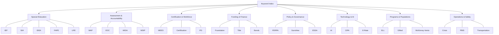

# Keyword Index — Missouri K-12 Education Navigator

A searchable keyword-to-file mapping for quick navigation. Each entry lists the keyword, which files cover it, and brief context.

---

## A

| Keyword | File(s) | Context |
|---------|---------|---------|
| 504 Plan | [specialists.md](roles/specialists.md), [plans-and-forms.md](../templates/specialist/plans-and-forms.md) | Section 504 accommodations for disabilities |
| A+ Scholarship | [students.md](roles/students.md), [graduation-audit.md](../templates/counselor/graduation-audit.md) | Missouri scholarship for community college |
| Accreditation | [administrators.md](roles/administrators.md), [mo-education-law.md](compliance/mo-education-law.md) | MSIP 6 district accreditation standards |
| ADA | [equity-access.md](compliance/equity-access.md), [mo-education-law.md](compliance/mo-education-law.md) | Americans with Disabilities Act compliance |
| Adaptive PE | [motor-impairment.md](special-needs/motor-impairment.md) | Physical education for students with disabilities |
| Alternative Certification | [teachers.md](roles/teachers.md), [educator-workforce.md](programs/educator-workforce.md) | Non-traditional pathways to teaching |
| Alternative Education | [alternative-education.md](programs/alternative-education.md) | Virtual, GED, homebound, detention programs |
| AP Courses | [career-pathways.md](operations/career-pathways.md) | Advanced Placement college-level courses |
| Assessment | [assessments.md](operations/assessments.md) | MAP, EOC, WIDA ACCESS, ACT testing |
| Assistive Technology | [motor-impairment.md](special-needs/motor-impairment.md), [vision-impairment.md](special-needs/vision-impairment.md) | AT devices and services for students with disabilities |
| Athletics | [athletics-activities.md](operations/athletics-activities.md) | MSHSAA eligibility, sports safety |
| Attendance | [students.md](roles/students.md), [discipline-behavior.md](operations/discipline-behavior.md) | Truancy, compulsory attendance, A+ requirement |

## B

| Keyword | File(s) | Context |
|---------|---------|---------|
| Background Check | [school-staff.md](roles/school-staff.md), [mo-education-law.md](compliance/mo-education-law.md) | RSMo 168.133 requirements for school employees |
| BIP (Behavior Intervention Plan) | [specialists.md](roles/specialists.md), [discipline-behavior.md](operations/discipline-behavior.md) | Behavioral support plan following FBA |
| Board of Education | [governance-policy.md](compliance/governance-policy.md), [administrators.md](roles/administrators.md) | School board governance, elections, Sunshine Law |
| Bonds | [funding-programs.md](compliance/funding-programs.md), [facilities-operations.md](operations/facilities-operations.md) | Capital improvement bond elections |
| Braille | [vision-impairment.md](special-needs/vision-impairment.md) | RSMo 162.1120 presumption in favor of braille |
| Bullying | [discipline-behavior.md](operations/discipline-behavior.md), [school-culture-climate.md](operations/school-culture-climate.md) | Anti-bullying policies, reporting, intervention |

## C

| Keyword | File(s) | Context |
|---------|---------|---------|
| Career Pathways | [career-pathways.md](operations/career-pathways.md) | CTE, dual credit, work-based learning |
| Certification (Teacher) | [teachers.md](roles/teachers.md), [educator-workforce.md](programs/educator-workforce.md) | IPC, CCPC, certification renewal |
| Child Abuse Reporting | [school-staff.md](roles/school-staff.md), [mo-education-law.md](compliance/mo-education-law.md) | RSMo 210.115 mandated reporter duties |
| CIPA | [technology-digital-learning.md](operations/technology-digital-learning.md) | Children's Internet Protection Act |
| Civil Rights | [equity-access.md](compliance/equity-access.md), [mo-education-law.md](compliance/mo-education-law.md) | Title VI, Title IX, Section 504, ADA |
| Cochlear Implant | [hearing-impairment.md](special-needs/hearing-impairment.md) | Classroom accommodations for CI users |
| Compliance Calendar | [compliance-calendar.md](compliance/compliance-calendar.md) | Monthly deadlines and reporting dates |
| Concussion Protocol | [athletics-activities.md](operations/athletics-activities.md) | Return-to-play and return-to-learn protocols |
| Consolidation | [rural-education.md](programs/rural-education.md), [administrators.md](roles/administrators.md) | District merger/reorganization under RSMo 162 |
| Core Data | [data-reporting.md](operations/data-reporting.md) | District-level data reporting to DESE |
| Crisis Response | [crisis-emergency.md](operations/crisis-emergency.md), [safety-plan-outline.md](../templates/admin/safety-plan-outline.md) | Emergency operations, threat assessment |
| CSIP | [building-leaders.md](roles/building-leaders.md), [csip-template.md](../templates/admin/csip-template.md) | Comprehensive School Improvement Plan |
| CTE | [career-pathways.md](operations/career-pathways.md) | Career and Technical Education programs |
| Curriculum | [mo-learning-standards.md](curriculum-instruction/mo-learning-standards.md), [instructional-practice.md](curriculum-instruction/instructional-practice.md) | Missouri Learning Standards, instruction |
| Custody | [students.md](roles/students.md), [mo-education-law.md](compliance/mo-education-law.md) | FERPA rights, court orders, records access |
| CVI | [vision-impairment.md](special-needs/vision-impairment.md) | Cortical Visual Impairment accommodations |

## D

| Keyword | File(s) | Context |
|---------|---------|---------|
| DESE | [administrators.md](roles/administrators.md), [compliance-calendar.md](compliance/compliance-calendar.md) | Dept. of Elementary and Secondary Education |
| Discipline | [discipline-behavior.md](operations/discipline-behavior.md), [students.md](roles/students.md) | Suspension, expulsion, due process rights |
| Dual Credit | [career-pathways.md](operations/career-pathways.md), [students.md](roles/students.md) | College credit earned in high school |
| Due Process | [specialists.md](roles/specialists.md), [mo-education-law.md](compliance/mo-education-law.md) | IDEA dispute resolution, hearing rights |

## E

| Keyword | File(s) | Context |
|---------|---------|---------|
| Early Childhood | [early-childhood.md](programs/early-childhood.md) | PAT, Head Start, MPP, First Steps |
| ELL / English Learners | [english-learners.md](programs/english-learners.md), [ell-planning.md](../templates/teacher/ell-planning.md) | ELL identification, WIDA, program models |
| E-Rate | [technology-digital-learning.md](operations/technology-digital-learning.md) | Federal broadband/telecom funding |
| ESSA | [mo-education-law.md](compliance/mo-education-law.md), [assessments.md](operations/assessments.md) | Every Student Succeeds Act requirements |
| Evaluation (Special Ed) | [specialists.md](roles/specialists.md) | 60-day timeline, eligibility determination |
| Expulsion | [discipline-behavior.md](operations/discipline-behavior.md), [students.md](roles/students.md) | RSMo 167.161, formal hearing required |

## F

| Keyword | File(s) | Context |
|---------|---------|---------|
| Facilities | [facilities-operations.md](operations/facilities-operations.md) | Capital planning, ADA, maintenance |
| FAPE | [specialists.md](roles/specialists.md), [mo-education-law.md](compliance/mo-education-law.md) | Free Appropriate Public Education under IDEA |
| FBA | [specialists.md](roles/specialists.md), [plans-and-forms.md](../templates/specialist/plans-and-forms.md) | Functional Behavior Assessment process |
| FERPA | [students.md](roles/students.md), [mo-education-law.md](compliance/mo-education-law.md) | Student privacy and records access rights |
| First Steps | [early-childhood.md](programs/early-childhood.md) | Missouri birth-3 early intervention (Part C) |
| Foundation Formula | [funding-programs.md](compliance/funding-programs.md), [administrators.md](roles/administrators.md) | Missouri school funding formula |
| Free/Reduced Lunch | [funding-programs.md](compliance/funding-programs.md), [health-wellness.md](operations/health-wellness.md) | NSLP eligibility, CEP |
| Funding | [funding-programs.md](compliance/funding-programs.md) | Federal, state, local revenue sources |

## G

| Keyword | File(s) | Context |
|---------|---------|---------|
| GED | [alternative-education.md](programs/alternative-education.md) | HiSET/GED equivalency pathways |
| Gifted Education | [specialists.md](roles/specialists.md), [special-populations.md](programs/special-populations.md) | Gifted identification and programming |
| Governance | [governance-policy.md](compliance/governance-policy.md) | Board policy, superintendent, authority chain |
| Graduation | [students.md](roles/students.md), [graduation-audit.md](../templates/counselor/graduation-audit.md) | 24 credit requirements, EOC, A+ eligibility |

## H

| Keyword | File(s) | Context |
|---------|---------|---------|
| Head Start | [early-childhood.md](programs/early-childhood.md) | Federal preschool program for low-income families |
| Health / Wellness | [health-wellness.md](operations/health-wellness.md) | Nursing, mental health, immunizations, prevention |
| Hearing Impairment | [hearing-impairment.md](special-needs/hearing-impairment.md) | DHH services, ASL, cochlear implants, TOD |
| Homeschool | [mo-education-law.md](compliance/mo-education-law.md), [alternative-education.md](programs/alternative-education.md) | RSMo 167.031, 1000 hours requirement |
| Homeless Students | [special-populations.md](programs/special-populations.md), [equity-access.md](compliance/equity-access.md) | McKinney-Vento immediate enrollment rights |

## I

| Keyword | File(s) | Context |
|---------|---------|---------|
| IDEA | [specialists.md](roles/specialists.md), [mo-education-law.md](compliance/mo-education-law.md) | Individuals with Disabilities Education Act |
| IEE | [specialists.md](roles/specialists.md) | Independent Educational Evaluation at public expense |
| IEP | [specialists.md](roles/specialists.md), [iep-compliance-checklist.md](../templates/specialist/iep-compliance-checklist.md) | Individualized Education Program |
| Immunizations | [health-wellness.md](operations/health-wellness.md) | Required vaccinations, exemptions |
| Inclusion | [specialists.md](roles/specialists.md), [equity-access.md](compliance/equity-access.md) | LRE, inclusive practices |
| Instructional Practice | [instructional-practice.md](curriculum-instruction/instructional-practice.md) | Differentiation, co-teaching, PBL |
| Interstate Compact | [special-populations.md](programs/special-populations.md) | Military family transfer protections |

## K–L

| Keyword | File(s) | Context |
|---------|---------|---------|
| Kindergarten | [early-childhood.md](programs/early-childhood.md), [assessments.md](operations/assessments.md) | Readiness assessment, enrollment age |
| LRE | [specialists.md](roles/specialists.md) | Least Restrictive Environment under IDEA |

## M

| Keyword | File(s) | Context |
|---------|---------|---------|
| Mandated Reporter | [school-staff.md](roles/school-staff.md), [mo-education-law.md](compliance/mo-education-law.md) | RSMo 210.115, child abuse reporting duty |
| MAP | [assessments.md](operations/assessments.md) | Missouri Assessment Program (grades 3-8) |
| McKinney-Vento | [special-populations.md](programs/special-populations.md), [equity-access.md](compliance/equity-access.md) | Homeless student rights and protections |
| MDR | [specialists.md](roles/specialists.md), [discipline-behavior.md](operations/discipline-behavior.md) | Manifestation Determination Review |
| MEES | [teachers.md](roles/teachers.md) | Missouri Educator Evaluation System |
| Mental Health | [health-wellness.md](operations/health-wellness.md), [school-counseling.md](roles/school-counseling.md) | 3-tier model, screening, crisis response |
| Missouri Learning Standards | [mo-learning-standards.md](curriculum-instruction/mo-learning-standards.md) | State academic standards by subject |
| MOCAP | [alternative-education.md](programs/alternative-education.md), [technology-digital-learning.md](operations/technology-digital-learning.md) | Missouri Course Access and Virtual School Program |
| MOSIS | [data-reporting.md](operations/data-reporting.md), [compliance-calendar.md](compliance/compliance-calendar.md) | Missouri Student Information System |
| Motor Impairment | [motor-impairment.md](special-needs/motor-impairment.md) | OT, PT, AT, adaptive PE, accessibility |
| MSHSAA | [athletics-activities.md](operations/athletics-activities.md) | Missouri State High School Activities Association |
| MSIP 6 | [administrators.md](roles/administrators.md), [mo-education-law.md](compliance/mo-education-law.md) | Missouri School Improvement Program standards |
| MTSS | [discipline-behavior.md](operations/discipline-behavior.md), [instructional-practice.md](curriculum-instruction/instructional-practice.md) | Multi-Tiered System of Supports |

## N–O

| Keyword | File(s) | Context |
|---------|---------|---------|
| National Board Certification | [teachers.md](roles/teachers.md), [professional-learning.md](programs/professional-learning.md) | Advanced certification pathway |
| Newcomer Program | [english-learners.md](programs/english-learners.md) | Intensive support for newly arrived ELLs |
| O&M (Orientation & Mobility) | [vision-impairment.md](special-needs/vision-impairment.md) | Travel training for students with vision loss |
| OT / PT | [motor-impairment.md](special-needs/motor-impairment.md), [specialists.md](roles/specialists.md) | Occupational/physical therapy in schools |

## P

| Keyword | File(s) | Context |
|---------|---------|---------|
| Paraprofessional | [school-staff.md](roles/school-staff.md) | ESSA qualifications, supervision requirements |
| Parent Letters | [letters.md](../templates/parent/letters.md) | Evaluation request, IEP dispute, records request |
| Parent Rights | [students.md](roles/students.md), [guia-padres-espanol.md](guia-padres-espanol.md) | FERPA, IDEA, participation rights |
| PAT | [early-childhood.md](programs/early-childhood.md) | Parents as Teachers home visiting |
| PBIS | [discipline-behavior.md](operations/discipline-behavior.md) | Positive Behavioral Interventions and Supports |
| PLC | [professional-learning.md](programs/professional-learning.md), [building-leaders.md](roles/building-leaders.md) | Professional Learning Communities |
| Plyler v. Doe | [special-populations.md](programs/special-populations.md), [equity-access.md](compliance/equity-access.md) | Right to education regardless of immigration status |
| Professional Development | [professional-learning.md](programs/professional-learning.md) | RPDCs, PLCs, mentoring, coaching |
| PSRS/PEERS | [teachers.md](roles/teachers.md), [educator-workforce.md](programs/educator-workforce.md) | Public School Retirement System |
| PWN | [specialists.md](roles/specialists.md) | Prior Written Notice requirement under IDEA |

## R

| Keyword | File(s) | Context |
|---------|---------|---------|
| Restorative Justice | [discipline-behavior.md](operations/discipline-behavior.md), [school-culture-climate.md](operations/school-culture-climate.md) | Alternative to exclusionary discipline |
| Retirement | [teachers.md](roles/teachers.md), [educator-workforce.md](programs/educator-workforce.md) | Rule of 80, PSRS benefits, WEP/GPO |
| RPDC | [professional-learning.md](programs/professional-learning.md) | Regional Professional Development Centers |
| Rural Education | [rural-education.md](programs/rural-education.md) | Shared services, 4-day weeks, teacher shortage |

## S

| Keyword | File(s) | Context |
|---------|---------|---------|
| Safety | [crisis-emergency.md](operations/crisis-emergency.md), [safety-plan-outline.md](../templates/admin/safety-plan-outline.md) | EOP, drills, threat assessment |
| School Board | [governance-policy.md](compliance/governance-policy.md) | Elections, open meetings, policy adoption |
| School Counselor | [school-counseling.md](roles/school-counseling.md) | Academic, career, social-emotional domains |
| Section 504 | [specialists.md](roles/specialists.md), [plans-and-forms.md](../templates/specialist/plans-and-forms.md) | Accommodation plans for disabilities |
| Service Animal | [equity-access.md](compliance/equity-access.md) | ADA Title II, two-question verification |
| SLP | [specialists.md](roles/specialists.md) | Speech-Language Pathologist services |
| Spanish / Bilingual | [guia-padres-espanol.md](guia-padres-espanol.md), [glossary.md](glossary.md) | Spanish parent guide, translated glossary |
| Special Populations | [special-populations.md](programs/special-populations.md) | Military, homeless, foster, migrant, etc. |
| SRO | [school-staff.md](roles/school-staff.md), [crisis-emergency.md](operations/crisis-emergency.md) | School Resource Officer role and protocols |
| Standards | [mo-learning-standards.md](curriculum-instruction/mo-learning-standards.md) | Missouri Learning Standards by subject |
| Substitute Teacher | [substitute-teachers.md](roles/substitute-teachers.md), [sub-binder.md](../templates/teacher/sub-binder.md) | Sub requirements, classroom management |
| Suicide Prevention | [health-wellness.md](operations/health-wellness.md), [crisis-emergency.md](operations/crisis-emergency.md) | Screening, C-SSRS, 988 Lifeline, safety plans |
| Sunshine Law | [governance-policy.md](compliance/governance-policy.md), [mo-education-law.md](compliance/mo-education-law.md) | Open meetings/records, RSMo 610 |
| Suspension | [discipline-behavior.md](operations/discipline-behavior.md), [students.md](roles/students.md) | Short-term (<10 days), long-term, due process |

## T

| Keyword | File(s) | Context |
|---------|---------|---------|
| Teacher Certification | [teachers.md](roles/teachers.md) | IPC, CCPC, alternative pathways |
| Technology | [technology-digital-learning.md](operations/technology-digital-learning.md) | 1:1 devices, LMS, digital citizenship |
| Tenure | [teachers.md](roles/teachers.md), [mo-education-law.md](compliance/mo-education-law.md) | RSMo 168.102-168.130, permanent status |
| Threat Assessment | [crisis-emergency.md](operations/crisis-emergency.md), [threat-assessment-form.md](../templates/admin/threat-assessment-form.md) | CSTAG model, transient vs. substantive |
| Title I | [funding-programs.md](compliance/funding-programs.md) | Federal funding for high-poverty schools |
| Title IX | [equity-access.md](compliance/equity-access.md), [mo-education-law.md](compliance/mo-education-law.md) | Sex-based discrimination protections |
| Transfer | [students.md](roles/students.md), [athletics-activities.md](operations/athletics-activities.md) | Student transfer rights, MSHSAA eligibility |
| Transition (SPED) | [specialists.md](roles/specialists.md) | Post-secondary transition planning, age 16+ |
| Transportation | [facilities-operations.md](operations/facilities-operations.md) | Routes, safety, homeless student transport |
| Trauma-Informed | [school-culture-climate.md](operations/school-culture-climate.md), [health-wellness.md](operations/health-wellness.md) | Trauma-informed practices in schools |
| Truancy | [discipline-behavior.md](operations/discipline-behavior.md), [students.md](roles/students.md) | Compulsory attendance, intervention steps |

## V–W

| Keyword | File(s) | Context |
|---------|---------|---------|
| Virtual Learning | [alternative-education.md](programs/alternative-education.md), [technology-digital-learning.md](operations/technology-digital-learning.md) | MOCAP, virtual schools, remote instruction |
| Vision Impairment | [vision-impairment.md](special-needs/vision-impairment.md) | TVI, braille, O&M, CVI, ECC |
| WIDA | [english-learners.md](programs/english-learners.md), [assessments.md](operations/assessments.md) | WIDA Screener and ACCESS proficiency test |

---

*Use Ctrl+F / Cmd+F to search this page. For full details, follow the links to the relevant reference files.*
