# Links & Resources — Missouri K-12 Education

```mermaid
graph TD
    RESOURCES[Missouri K-12 Resources] --> DESE[DESE Portals]
    RESOURCES --> EDUCATOR[Educator Resources]
    RESOURCES --> STUDENT[Student & Family]
    RESOURCES --> GOVERNANCE[Governance & Law]
    RESOURCES --> SAFETY[Crisis & Safety]
    RESOURCES --> FEDERAL[Federal Education]
    DESE --> DATA[Data Portals: MCDS, MOSIS, MO DVT]
    DESE --> STANDARDS[Standards & AI Guidance]
    EDUCATOR --> CERT[Certification & Prep]
    EDUCATOR --> RETIRE[Retirement: PSRS/PEERS]
    EDUCATOR --> ORGS[Professional Orgs: MSTA, MNEA, MASA]
    EDUCATOR --> RPDC[Regional PDCs - 9 Centers]
    STUDENT --> ASSESS[Assessment: MAP, ACT, WIDA]
    STUDENT --> COLLEGE[College: FAFSA, A+, MOCAP]
    STUDENT --> SPED[Special Ed: MPACT, First Steps]
    STUDENT --> EARLY[Early Childhood: PAT, Head Start]
    GOVERNANCE --> MSBA[MSBA & Statutes]
    GOVERNANCE --> SUNSHINE[Sunshine Law]
    SAFETY --> CRISIS[988 Lifeline & Crisis Text Line]
    SAFETY --> ABUSE[Children's Division Hotline]
    FEDERAL --> IDEA_FERPA[IDEA, FERPA, OCR]
    FEDERAL --> AI[AI in Education Resources]
```

<!-- Last verified: 2026-03 -->

## DESE Primary Portals
| Resource | URL |
|----------|-----|
| DESE Homepage | https://dese.mo.gov |
| MCDS Data Portal (APR, report cards, school data) | https://apps.dese.mo.gov/MCDS/home.aspx |
| School Directory | https://dese.mo.gov/directory |
| Missouri Learning Standards | https://dese.mo.gov/college-career-readiness/curriculum/missouri-learning-standards |
| DESE Application Sign-In (DAS) | https://apps.dese.mo.gov |
| Data Acquisition Calendar | https://dese.mo.gov/data-system-management/data-acquisition-calendar |
| Core Data / MOSIS | https://dese.mo.gov/data-system-management/core-datamosis |
| Missouri Data Visualization Tool (MO DVT) | https://modese.sas.com |
| DESE AI Guidance PDF | https://dese.mo.gov/media/pdf/artificial-intelligence-guidance-local-education-agencies |
| DESE Strategic Plan (Show Me Success) | https://dese.mo.gov/communications/show-me-success |

## Certification & Educator Quality
| Resource | URL |
|----------|-----|
| Educator Certification | https://dese.mo.gov/educator-quality/certification |
| Fingerprinting / Background Check | https://dese.mo.gov/educator-quality/certification/fingerprinting-background-check |
| Educator Preparation | https://dese.mo.gov/educator-quality/educator-preparation |
| Educator Job Board | https://dese.mo.gov/financial-admin-services/human-resources/teaching-jobs |

## Assessment
| Resource | URL |
|----------|-----|
| DESE Assessment | https://dese.mo.gov/quality-schools/assessment |
| WIDA Consortium | https://wida.wisc.edu |
| ACT | https://www.act.org |
| MAP / EOC (via DESE Assessment) | https://dese.mo.gov/quality-schools/assessment |

## Special Education
| Resource | URL |
|----------|-----|
| DESE Office of Special Education | https://dese.mo.gov/special-education |
| Parent Information (Special Ed) | https://dese.mo.gov/special-education/compliance/parent-information |
| Missouri First Steps (Part C) | https://dese.mo.gov/childhood/early-intervention |
| Missouri Parents Act (MPACT) | https://www.missouriparentsact.org |

## College & Career
| Resource | URL |
|----------|-----|
| Missouri Connections (career planning) | https://www.missouriconnections.org |
| FAFSA | https://studentaid.gov/sa/fafsa |
| A+ Schools Program | https://dese.mo.gov/quality-schools/federal-programs (search A+) |
| MOCAP (Virtual Course Access) | https://mocap.mo.gov |
| Career & Technical Education | https://dese.mo.gov/college-career-readiness/career-education |

## Retirement & Benefits
| Resource | URL |
|----------|-----|
| PSRS/PEERS | https://www.psrs-peers.org |
| Public Service Loan Forgiveness (PSLF) | https://studentaid.gov/manage-loans/forgiveness-cancellation/public-service |
| Teacher Loan Forgiveness | https://studentaid.gov/manage-loans/forgiveness-cancellation/teacher |

## School Governance & Law
| Resource | URL |
|----------|-----|
| MSBA (Missouri School Boards Association) | https://www.mosba.org |
| Missouri General Assembly | https://www.house.mo.gov / https://www.senate.mo.gov |
| Missouri Revised Statutes | https://revisor.mo.gov/main/Home.aspx |
| DESE Administrative Rules (5 CSR 20) | https://www.sos.mo.gov/adrules/csr/current/5csr/5csr.asp |
| Missouri Secretary of State (Sunshine Law) | https://www.sos.mo.gov/openMeetings |

## Athletics & Activities
| Resource | URL |
|----------|-----|
| MSHSAA | https://www.mshsaa.org |

## Professional Organizations
| Resource | URL |
|----------|-----|
| MSTA (Missouri State Teachers Association) | https://www.msta.org |
| MNEA (Missouri National Education Association) | https://www.mnea.org |
| MASA (Missouri Assn. of School Administrators) | https://www.masaonline.org |
| MSCA (Missouri School Counselor Association) | https://www.moschoolcounselor.org |
| MoCASE (MO Council of Admin of Special Ed) | https://www.mocase.org |

## Crisis & Safety
| Resource | URL |
|----------|-----|
| 988 Suicide & Crisis Lifeline | Call or text **988** |
| Crisis Text Line | Text **HOME** to **741741** |
| Children's Division Hotline (abuse/neglect) | **1-800-392-3738** |
| Missouri School Safety Center | https://www.mshp.dps.missouri.gov/MSHPWeb/Root/schoolSafety.html |
| FEMA School EOP Guide | https://rems.ed.gov |

## Child Care & Early Childhood
| Resource | URL |
|----------|-----|
| DESE Office of Childhood | https://dese.mo.gov/childhood |
| Child Care Aware of Missouri | https://www.childcareawaremo.org |
| Parents as Teachers National Center | https://parentsasteachers.org |
| Head Start (ACF) | https://www.acf.hhs.gov/ohs |
| Missouri 529 Plan (MOST) | https://www.missourimost.org |

## Federal Education
| Resource | URL |
|----------|-----|
| U.S. Department of Education | https://www.ed.gov |
| IDEA (Individuals with Disabilities Education Act) | https://sites.ed.gov/idea |
| Office for Civil Rights (OCR) | https://www2.ed.gov/about/offices/list/ocr |
| FERPA | https://studentprivacy.ed.gov |
| NAEP (Nation's Report Card) | https://nationsreportcard.gov |
| E-Rate (USAC) | https://www.usac.org/e-rate |

## AI in Education
| Resource | URL |
|----------|-----|
| AI for Education | https://www.aiforeducation.io |
| TeachAI | https://www.teachai.org |
| AI4K12 (Five Big Ideas) | https://ai4k12.org |
| Google Teachable Machine | https://teachablemachine.withgoogle.com |
| Code.org AI Modules | https://code.org |
| Elements of AI | https://www.elementsofai.com |
| U.S. DOE AI Guidance | https://www.ed.gov/about/ed-overview/artificial-intelligence-ai-guidance |

## Data & Research
| Resource | URL |
|----------|-----|
| NCES (National Center for Education Statistics) | https://nces.ed.gov |
| U.S. Census Bureau | https://www.census.gov |
| Missouri Census Data Center | https://mcdc.missouri.edu |
| PRiME Center (SLU — MO education research) | https://www.primecenter.org |
| What Works Clearinghouse | https://ies.ed.gov/ncee/wwc |
| CASEL (SEL) | https://casel.org |

## RPDCs (Regional Professional Development Centers)
| RPDC | Region |
|------|--------|
| Heart of Missouri RPDC | Central MO |
| Central RPDC | Mid-MO (south/central) |
| Northwest RPDC | NW MO |
| Southwest RPDC | SW MO |
| Southeast RPDC | SE MO (Bootheel) |
| Northeast RPDC | NE MO |
| Kansas City Metro RPDC | KC metro |
| St. Louis Metro RPDC | STL metro |
| Ozarks RPDC | Ozarks |

*RPDC websites change; search "[region name] RPDC Missouri" for current URLs.*

## Missouri Broadband & Connectivity
| Resource | URL |
|----------|-----|
| Missouri Office of Broadband Development | https://ded.mo.gov/programs/broadband |
| FCC Broadband Maps | https://broadbandmap.fcc.gov |
