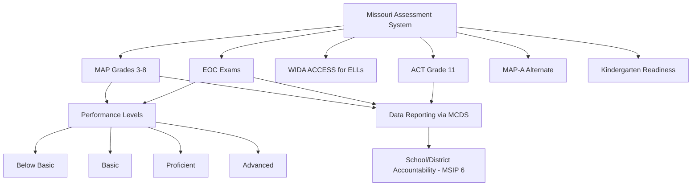

# Assessments — Missouri K-12 Education Reference

## Table of Contents
1. Missouri Assessment Program (MAP)
2. End-of-Course (EOC) Exams
3. WIDA ACCESS for ELLs
4. ACT / SAT (College Readiness)
5. MAP Alternate Assessment (MAP-A)
6. Kindergarten Readiness
7. NAEP (Nation's Report Card)
8. Assessment Accommodations
9. Assessment Calendar & Administration
10. Data Interpretation & Use

---

## 1. Missouri Assessment Program (MAP)

### Overview
MAP is Missouri's statewide academic assessment system, measuring student proficiency on the Missouri Learning Standards.

### Grade-Level Assessments
| Subject | Grades Tested |
|---------|--------------|
| English Language Arts (ELA) | 3, 4, 5, 6, 7, 8 |
| Mathematics | 3, 4, 5, 6, 7, 8 |
| Science | 5, 8 |

### Performance Levels
| Level | Description |
|-------|-------------|
| **Below Basic** | Student demonstrates minimal understanding of the standards |
| **Basic** | Student demonstrates partial understanding of the standards |
| **Proficient** | Student demonstrates adequate understanding of the standards |
| **Advanced** | Student demonstrates thorough understanding of the standards |

### Testing Window
- MAP is typically administered in the **spring** (March-May)
- Exact dates set by DESE annually in the assessment calendar
- Computer-based administration (most districts)

### Participation Requirements
- All students enrolled in tested grades must participate
- Students with IEPs may receive accommodations (per IEP) or take the MAP-A (alternate assessment) if they meet specific eligibility criteria
- ELL students must participate; accommodations available per DESE guidance
- Opt-out: Missouri law does not explicitly provide a parental opt-out for MAP, but DESE guidance and local policy may address refusals. Non-participation affects school accountability data.

---

## 2. End-of-Course (EOC) Exams

### Required EOC Subjects
| Subject | When Administered |
|---------|-------------------|
| **English II** | Upon completion of English II course |
| **Algebra I** | Upon completion of Algebra I (or Algebra II if taken instead) |
| **Biology** | Upon completion of Biology course |
| **American Government** | Upon completion of American Government course |

### EOC Performance Levels
Same 4-level scale as MAP: Below Basic, Basic, Proficient, Advanced

### Score Use
- EOC scores are incorporated into the student's course grade per local board policy
- EOC results count toward school/district accountability under MSIP 6
- Student participation is required; a passing EOC score is NOT a graduation requirement, but participation is

### Retake Policy
Students may retake EOC exams per DESE and district policy. The highest score is typically used for accountability purposes.

---

## 3. WIDA ACCESS for ELLs

### Overview
ACCESS (Assessing Comprehension and Communication in English State-to-State) is administered annually to all identified English Learners in Missouri.

### Domains Tested
| Domain | Description |
|--------|-------------|
| Listening | Comprehension of spoken English |
| Speaking | Oral English production |
| Reading | Comprehension of written English |
| Writing | Written English production |

### Proficiency Levels
| Level | Label | Description |
|-------|-------|-------------|
| 1 | Entering | Minimal English proficiency |
| 2 | Emerging | Beginning English communication |
| 3 | Developing | Expanding English skills for academic use |
| 4 | Expanding | Increasing independence in academic English |
| 5 | Bridging | Near-proficient; approaching English fluency |
| 6 | Reaching | Full English proficiency (tested for monitoring) |

### Exit Criteria
DESE establishes the composite proficiency score required to exit ELL services. Students meeting the threshold are monitored for 2 years after exiting.

### Testing Window
- ACCESS is administered in the **winter/spring** (January-March)
- All identified ELL students K-12 must participate

---

## 4. ACT / SAT (College Readiness)

### Statewide ACT Administration
- Missouri provides a free ACT administration for all **11th graders** (juniors) during the school day
- Part of the state accountability system; ACT results contribute to MSIP 6 college readiness indicators

### ACT College Readiness Benchmarks
| Subject | Benchmark Score |
|---------|----------------|
| English | 18 |
| Mathematics | 22 |
| Reading | 22 |
| Science | 23 |
| Composite | 21 (general college readiness indicator) |

### Use in Accountability
- Percentage of students meeting ACT benchmarks is reported in the APR
- ACT composite and subject scores used as indicators under MSIP 6 Standard 3 (College & Career Readiness)

### SAT
- Some students take the SAT; concordance tables map SAT scores to ACT equivalents
- Missouri's primary state assessment is the ACT

---

## 5. MAP Alternate Assessment (MAP-A)

### Eligibility
MAP-A is for students with the **most significant cognitive disabilities** who:
- Have an IEP
- Are receiving instruction aligned to alternate achievement standards (Missouri's Alternate Learning Expectations)
- Meet participation criteria documented by the IEP team using DESE's MAP-A Participation Criteria Checklist

### Key Restrictions
- No more than **1% of all students** in a tested grade/subject should take the MAP-A (federal ESSA requirement)
- IEP teams must document the decision and justification
- MAP-A should not be selected based on: disability category alone, attendance, language/cultural factors, teacher expectations, or current achievement level

### Performance Levels
Same 4-level scale: Below Basic, Basic, Proficient, Advanced (based on alternate achievement standards)

---

## 6. Kindergarten Readiness

### Missouri Kindergarten Readiness Assessment
- **What:** Assessment administered to entering kindergarteners to measure readiness
- **Domains:** language/literacy, mathematics, social-emotional, physical development
- **Purpose:** instructional planning (not gatekeeping); data contributes to MSIP 6 indicators
- **Administration:** fall of the kindergarten year (typically within first weeks of school)
- **Not a high-stakes test:** does not determine kindergarten eligibility

### Kindergarten Entry Age
Children must turn 5 by August 1 to enter kindergarten that year (RSMo 160.053). Parents may request early entry for children who turn 5 after August 1 through district assessment processes.

---

## 7. NAEP (Nation's Report Card)

### Overview
The National Assessment of Educational Progress (NAEP) is a federally mandated assessment that provides national and state-level data:
- Administered to a **sample** of students (not all students)
- Subjects: reading and mathematics (grades 4 and 8) every 2 years; science, writing, and other subjects periodically
- Results reported at the state level; cannot be used for individual student or school accountability
- Provides comparison data across all 50 states and jurisdictions

### Missouri NAEP Results
NAEP data is useful for comparing Missouri student performance to national benchmarks and other states. Results are published on the NAEP Data Explorer (nationsreportcard.gov).

---

## 8. Assessment Accommodations

### Who Receives Accommodations?
- Students with **IEPs** — accommodations specified in the IEP
- Students with **504 plans** — accommodations specified in the 504 plan
- **ELL students** — linguistic accommodations per DESE ELL testing guidance

### Common Accommodations
| Category | Examples |
|----------|---------|
| **Timing/scheduling** | Extended time, breaks, multiple sessions, time of day |
| **Setting** | Separate room, small group, reduced distractions, special furniture |
| **Presentation** | Large print, Braille, read-aloud (for non-reading tests), human reader, sign language, translated directions |
| **Response** | Scribe, speech-to-text, large-print answer sheet, assistive technology |

### Key Rules
- Accommodations must be used regularly in instruction (not just for testing)
- Some accommodations may result in the test being scored as a "non-standard" administration
- IEP teams must document accommodation decisions and ensure they do not invalidate what the test measures
- DESE publishes an annual Accommodations Manual with specific allowable accommodations per assessment

---

## 9. Assessment Calendar & Administration

### Annual Calendar
DESE publishes the assessment calendar each year with testing windows:
| Assessment | Typical Window |
|-----------|---------------|
| MAP (grades 3-8) | Spring (March-May) |
| EOC exams | Administered upon course completion (fall, spring, or summer) |
| MAP-A | Spring (aligned with MAP window) |
| ACCESS for ELLs | Winter/Spring (January-March) |
| ACT (grade 11) | Spring (specific date designated by DESE) |
| Kindergarten readiness | Fall (first weeks of school) |

### Test Security
- District Test Coordinator (DTC) is responsible for test security district-wide
- Building Test Coordinator (BTC) manages administration at the school level
- Test materials must be stored securely before and after administration
- Proctors must follow administration manuals exactly
- Irregularities must be reported to DESE; testing violations can result in score invalidation and sanctions

### Data Reporting
- MAP and EOC results are reported at student, school, and district levels
- Results are available through DESE's MCDS (Missouri Comprehensive Data System) portal
- Schools/districts must communicate results to parents in understandable formats

---

## 10. Data Interpretation & Use

### Using Assessment Data
- **Individual student level:** identify strengths/gaps, inform instruction, plan interventions, monitor growth
- **Classroom level:** adjust curriculum pacing, grouping, reteaching priorities
- **School level:** evaluate program effectiveness, allocate resources, set CSIP goals
- **District level:** strategic planning, resource allocation, accountability, program evaluation

### Disaggregation
ESSA and MSIP 6 require data disaggregation by:
- Race/ethnicity
- Gender
- Students with disabilities
- English Learners
- Economically disadvantaged students
- Homeless students
- Foster care students
- Military-connected students

### Growth vs. Proficiency
- **Proficiency:** percentage of students meeting or exceeding the Proficient level (point-in-time)
- **Growth:** change in student performance over time (year-over-year progress)
- Both are important: proficiency shows current status; growth shows trajectory
- Missouri uses a student growth model as part of MSIP 6 accountability

### Common Data Pitfalls
- Drawing conclusions from small sample sizes (small schools, small subgroups)
- Ignoring confidence intervals
- Attributing causation to correlation
- Comparing year-over-year data without accounting for cohort differences
- Using single assessment data points to make high-stakes decisions
