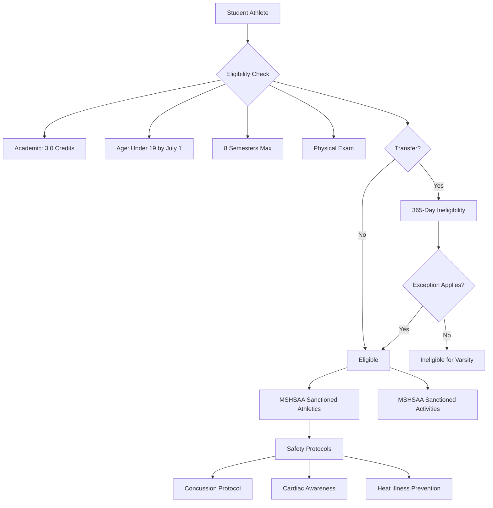

# Athletics & Activities — Missouri K-12 Education Reference

## Table of Contents
1. MSHSAA Overview
2. Athletic Eligibility
3. Transfer & Eligibility Rules
4. Title IX in Athletics
5. Concussion Protocol
6. Sudden Cardiac Arrest Awareness
7. Heat Illness Prevention
8. Fine Arts Activities
9. Student Organizations & Clubs
10. Activity Fund Management
11. Coaching Requirements
12. Homeschool & Virtual Student Participation

---

## 1. MSHSAA Overview

### Missouri State High School Activities Association
MSHSAA is the governing body for interscholastic athletics and activities in Missouri public and some private high schools.

### MSHSAA Governance
- Voluntary membership organization (not a state agency)
- Member schools agree to abide by MSHSAA bylaws and regulations
- Board of Directors elected by member schools
- Rules adopted by member vote
- Appeals process through MSHSAA committees and board

### Sanctioned Activities
**Athletics:** baseball, basketball (boys/girls), bowling, cross country, football, golf, ice hockey, lacrosse, soccer (boys/girls), softball, swimming/diving, tennis, track & field, volleyball, water polo, wrestling

**Activities:** academic competitions, band, chess, choir, debate/forensics, drama/theater, journalism/publications, math/science competitions, scholar bowl, speech, spirit squads (competitive cheer/dance), student council

---

## 2. Athletic Eligibility

### Academic Eligibility (MSHSAA Bylaw 2)
- Student must be enrolled in and attending school
- Must have earned **3.0 units of credit** the preceding semester (or be on track to graduate)
- Must be currently enrolled in courses that, if passed, would earn 3.0 units of credit
- Must maintain academic eligibility throughout the season (districts may impose higher standards)

### Age Eligibility
- Student must be **under 19 years of age** as of July 1 of the current school year
- Students who turn 19 before July 1 are ineligible for the entire year

### Semesters of Eligibility
- Maximum **8 semesters** of eligibility in high school (grades 9-12)
- Semesters are consecutive from first enrollment in 9th grade (does not pause for non-enrollment)
- A student who repeats a grade does NOT gain additional semesters

### Enrollment Requirements
- Must be enrolled full-time (or in a number of courses that would constitute full-time per district policy)
- Must attend school regularly
- Must not have graduated from a four-year high school

### Amateur Status
Students must maintain amateur status — cannot receive compensation for participation in MSHSAA-sanctioned sports (rules around NIL for college differ from high school)

### Physical Examination
- Annual physical examination required before participation (MSHSAA Pre-Participation Physical Evaluation form)
- Must be dated after **February 1** of the current calendar year
- Conducted by a licensed physician, DO, nurse practitioner, or physician assistant

---

## 3. Transfer & Eligibility Rules

### Transfer Rule (Bylaw 3)
Students who transfer schools are subject to a **365-day period of ineligibility** for varsity competition, UNLESS they meet one of the recognized exceptions:

### Common Exceptions
| Exception | Description |
|-----------|-----------|
| **Bona fide family move** | Family establishes new primary residence in the new district's boundaries |
| **Boundary change** | Student's home moves into a new district due to redistricting |
| **Open enrollment** | Some open enrollment transfers qualify (specific conditions apply) |
| **Hardship waiver** | MSHSAA may grant a waiver based on documented hardship |
| **Expelled/involuntary** | Student was expelled and enrolls in a new school |

### Transfer Verification
- Receiving school must complete a transfer form
- Sending school verifies enrollment dates, eligibility status, and any disciplinary issues
- MSHSAA reviews contested or complex transfer cases

### Recruiting Prohibition
- Recruiting or inducing a student to transfer for athletic purposes is prohibited
- Violations can result in sanctions against the school, coach, and student

---

## 4. Title IX in Athletics

### Equal Opportunity Requirements
Title IX requires schools receiving federal funds to provide equal athletic opportunities regardless of sex. This includes:

### Three-Part Test (OCR Compliance)
Schools must meet ONE of these tests:
1. **Proportionality:** participation opportunities are substantially proportionate to enrollment by gender
2. **History of expansion:** the school has a history and continuing practice of expanding opportunities for the underrepresented sex
3. **Full accommodation:** the interests and abilities of the underrepresented sex are fully and effectively accommodated

### Equal Treatment Areas
Title IX requires equitable (not necessarily identical) treatment in:
- Equipment and supplies
- Scheduling of games and practice times
- Travel and per diem
- Coaching (quality and compensation)
- Locker rooms, practice, and competition facilities
- Publicity and media
- Medical and training facilities
- Recruitment (at college level)

### Transgender Student Athletes
Policies continue evolving. MSHSAA has adopted policies for transgender student-athlete participation. Districts and schools should consult current MSHSAA guidelines and legal counsel.

---

## 5. Concussion Protocol

### Missouri Return-to-Play Act (RSMo 167.765)
Enacted 2011 (amended 2021). Key requirements:

### Requirements
1. **Information sheet:** each school year, schools must provide concussion/head injury information to students and parents/guardians before the student participates in athletics or cheerleading
2. **Removal from play:** any student suspected of sustaining a concussion during practice or competition must be **immediately removed** from participation
3. **No same-day return:** student may NOT return to participation on the same day as the suspected concussion
4. **Written clearance required:** student may NOT return to participation until they have been evaluated and received **written clearance from a licensed health care provider** (physician, DO, or advanced practice provider trained in concussion evaluation)
5. **Graduated return-to-play protocol:** must follow a step-by-step return-to-activity progression

### Return-to-Play Steps (Standard Protocol)
| Step | Activity | Minimum Duration |
|------|---------|-----------------|
| 1 | Complete physical and cognitive rest | Until symptom-free |
| 2 | Light aerobic exercise (walking, swimming) | 24 hours |
| 3 | Sport-specific exercise (no contact) | 24 hours |
| 4 | Non-contact training drills, progressive resistance | 24 hours |
| 5 | Full-contact practice (after medical clearance) | 24 hours |
| 6 | Return to competition | — |

If symptoms recur at any step, return to previous step.

### Return-to-Learn
Students recovering from concussion may also need academic accommodations:
- Reduced workload, extended time, quiet testing environment
- Modified screen time
- Excused absences during recovery
- 504 plan or temporary accommodation plan may be appropriate

---

## 6. Sudden Cardiac Arrest Awareness

### RSMo 167.775 (Lindsay's Law — Missouri)
- Schools must provide sudden cardiac arrest awareness information to students and parents before participation in athletics
- Coaches must complete training in recognizing signs and symptoms of sudden cardiac arrest
- Student who shows signs of cardiac distress must be removed from activity and may not return until cleared by a physician

### AED Requirements
- MSHSAA recommends (and many districts require) Automated External Defibrillators (AEDs) at all athletic venues
- Staff trained in CPR/AED use should be present at practices and competitions
- Emergency Action Plans (EAPs) for each athletic venue should include AED location and use

---

## 7. Heat Illness Prevention

### MSHSAA Heat Policy
- MSHSAA provides guidelines for heat acclimatization (especially for fall sports like football)
- Wet Bulb Globe Temperature (WBGT) monitoring recommended
- Activity modifications based on heat index/WBGT readings
- Mandatory hydration breaks
- New football players: gradual increase in equipment and contact during first weeks of practice

### Heat Index Activity Guidelines (MSHSAA)
| Heat Index | Recommendations |
|-----------|----------------|
| <80°F | Normal activity |
| 80-89°F | Caution; hydration breaks every 20-30 minutes |
| 90-104°F | Reduce intensity; increase breaks; watch for symptoms |
| 105°F+ | Consider canceling outdoor activity |

---

## 8. Fine Arts Activities

### MSHSAA Fine Arts
- District and state competitions in: band, choir, orchestra, speech/debate/forensics, drama, journalism
- Academic eligibility rules apply to fine arts competitors
- MSHSAA sets competition rules, schedules, and classification

### Music Education
- Missouri Music Educators Association (MMEA) coordinates All-State ensembles and festivals
- Missouri Learning Standards for Fine Arts (2007) guide curriculum
- Music teacher certification: K-12 Music Education certificate

### Speech, Debate, & Theatre
- Competitive categories include: original oratory, informative speaking, dramatic/humorous interpretation, duo interpretation, Lincoln-Douglas debate, policy debate, Congress, poetry
- State tournament administered by MSHSAA
- National qualification through NSDA (National Speech and Debate Association)

---

## 9. Student Organizations & Clubs

### Types
| Category | Examples |
|----------|---------|
| **Academic** | National Honor Society, Mu Alpha Theta, Science Olympiad, FBLA, DECA, TSA, SkillsUSA |
| **Service** | Key Club, Interact, Leo Club, community service clubs |
| **Identity/Affinity** | Multicultural clubs, LGBTQ+ student alliances (GSA), faith-based clubs |
| **Interest** | Robotics, coding, environmental, art, gaming, book club |
| **Leadership** | Student council/government, class officers |
| **CTE** | FFA, FCCLA, HOSA, BPA |

### Equal Access Act (20 U.S.C. §4071)
- Public secondary schools that allow any non-curriculum-related student groups must allow ALL such groups equal access to facilities and resources
- Schools cannot deny a group based on the religious, political, philosophical, or other content of the group's speech
- Groups must be student-initiated and student-led
- School staff may be present but cannot control or direct the group
- Groups must be voluntary; no compelled participation

### Advisor Requirements
- Student organizations should have a faculty/staff advisor
- Advisor provides supervision but does not lead the group
- Advisor must meet any background check requirements
- CTE organizations (FFA, FBLA, DECA, etc.) are typically led by the CTE teacher as advisor

---

## 10. Activity Fund Management

### Activity Fund Accounting
School activity funds (student organizations, athletics, fine arts) must follow district financial policies:
- Proper receipt and deposit procedures
- Two-signature requirement for disbursements
- Regular reconciliation and reporting
- Subject to annual audit
- Funds belong to the student organization, not individual students or advisors
- Carry-over between school years is subject to board policy

### Booster Organizations
- Booster clubs (parent-run) are separate legal entities from the school district
- Must follow IRS rules for nonprofit organizations (if 501(c)(3))
- District should have a written policy governing booster club relationships
- Booster funds donated to the school become school property and must follow district financial procedures
- District maintains authority over how donated funds are used for the program

### Gate Receipts & Fundraising
- Gate receipts from athletic events are typically deposited into the school activity fund
- Fundraising by student organizations must comply with district policy
- State sales tax may apply to certain fundraising activities
- Online fundraising (GoFundMe, etc.) should be coordinated through district procedures

---

## 11. Coaching Requirements

### Certification
- **Head coaches** of MSHSAA-sanctioned sports should hold a valid Missouri teaching certificate OR meet MSHSAA's requirements for non-certified coaches
- **Non-certified coaches** (community coaches, walk-ons): MSHSAA allows limited use with district approval; must complete required training modules
- All coaches must complete annual training including: CPR/AED, concussion recognition, heat illness prevention, sport-specific safety

### Coach Conduct
- MSHSAA Code of Ethics for coaches
- Mandatory reporting obligations (coaches are mandated reporters under RSMo 210.115)
- Appropriate relationship boundaries with student athletes
- Title IX compliance in coaching and program management
- MSHSAA sportsmanship expectations and ejection consequences

---

## 12. Homeschool & Virtual Student Participation

### Missouri Law
Missouri does not have a statewide law requiring public school districts to allow homeschool students to participate in MSHSAA activities.

### District Policy
- Individual districts may adopt policies allowing homeschool students to participate in extracurriculars (board discretion)
- MSHSAA allows member schools to apply local eligibility standards to homeschool students
- Virtual school students: eligibility determined by resident district in coordination with the virtual school

### Eligibility for Homeschool Students (If District Allows)
Districts that choose to allow participation typically require:
- Verification of academic work (transcript or portfolio)
- Age and residency requirements
- Physical examination (same as enrolled students)
- Agreement to follow team/activity rules and MSHSAA bylaws
- Regular meeting with a school counselor or designated liaison
