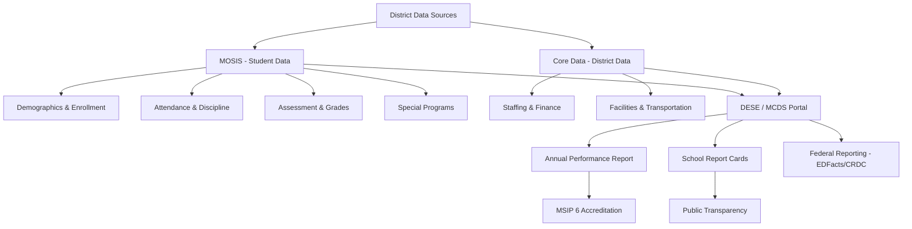

# Data & Reporting — Missouri K-12 Education Reference

## Table of Contents
1. MOSIS (Missouri Student Information System)
2. Core Data
3. Annual Performance Report (APR)
4. School Report Cards
5. Data Governance Framework
6. FERPA in the Digital Age
7. Data-Driven Decision Making
8. Assessment Data Analysis
9. Data Literacy for Educators
10. Data Dashboards & Tools
11. Federal Reporting Requirements
12. Data Quality & Validation

---

## 1. MOSIS (Missouri Student Information System)

### Overview
MOSIS is Missouri's individual student-level data collection system. All public school districts report student data to DESE through MOSIS.

### Data Elements Collected
| Category | Examples |
|----------|---------|
| **Demographics** | Name, DOB, gender, race/ethnicity, address, county-district-school code |
| **Enrollment** | Entry date, exit date, exit type (graduated, transferred, dropped out, etc.), grade level |
| **Attendance** | Days enrolled, days attended, days absent (excused/unexcused), chronic absenteeism flag |
| **Assessment** | MAP scores, EOC scores, ACT scores, ACCESS for ELLs scores, MAP-A scores |
| **Special education** | Disability category, placement setting, related services, IEP dates |
| **ELL** | ELL status, home language, ACCESS proficiency level, program type, entry/exit dates |
| **Discipline** | Incident type, consequence type, duration, race/gender of student |
| **Programs** | Title I, free/reduced lunch, homeless, foster care, migrant, A+ eligibility, CTE, gifted |
| **Course enrollment** | Courses taken, grades earned, credits, teacher of record |
| **Mobility** | Transfer records, school changes within and between districts |
| **Post-secondary** | College enrollment data (linked through National Student Clearinghouse partnership) |

### Reporting Cycles
| Cycle | Timing | Key Data |
|-------|--------|----------|
| **October (fall)** | October count date | Enrollment, demographics, free/reduced lunch, ELL status, special education |
| **End-of-Year (EOY)** | After school year ends | Attendance, discipline, grades, credits, assessment, graduation, exit codes |
| **Summer** | After summer programs | Summer school enrollment, credit recovery |

### MOSIS Coordinator
Every district designates a MOSIS Coordinator responsible for:
- Data entry, validation, and submission
- Resolving DESE data quality alerts
- Coordinating with SIS vendor for data exports
- Training building-level staff on data entry procedures
- Ensuring accuracy of demographic, enrollment, and program data

---

## 2. Core Data

### Overview
Core Data is DESE's district and school-level data collection system. It captures information about staffing, finances, facilities, and programs that is not student-specific.

### Data Elements
| Category | Examples |
|----------|---------|
| **Staffing** | FTE counts by position type, certification status, years of experience, race/ethnicity, salary |
| **Financial** | Revenue by source (local, state, federal), expenditures by function and object, fund balances |
| **Facilities** | Building inventory, square footage, age of buildings, capacity |
| **Transportation** | Route miles, buses, students transported, expenditures |
| **Programs** | Programs offered, enrollment in special programs, CTE programs |
| **Calendar** | School year dates, instructional hours, professional development days |

### Annual Secretary of the Board Report (ASBR)
Districts submit the ASBR to DESE annually with comprehensive financial data. The ASBR is a public document and forms the basis for financial transparency.

---

## 3. Annual Performance Report (APR)

### What It Is
The APR is DESE's accountability report for every district and school. It compiles data from MOSIS, Core Data, and assessment results into performance indicators aligned to MSIP 6.

### APR Indicators (MSIP 6 Alignment)
| Standard | Key Indicators |
|----------|---------------|
| **Academic Achievement** | MAP/EOC proficiency rates (ELA, Math, Science); subgroup performance |
| **Subgroup Achievement** | Performance of racial/ethnic groups, students with disabilities, ELL, economically disadvantaged |
| **College & Career Readiness** | Graduation rate (4-year adjusted cohort), ACT scores, post-secondary placement, IRC attainment, AP/IB participation |
| **Attendance** | Attendance rate, chronic absenteeism rate |
| **School Quality** | Teacher retention, school climate survey data, advanced coursework access, CTE participation |

### APR Score
- Each indicator receives a percentage score
- Indicators roll up into standard-level scores
- Overall APR score contributes to accreditation classification (Accredited, Provisionally Accredited, Unaccredited)

### Public Access
- APR data is publicly available on DESE's MCDS (Missouri Comprehensive Data System) portal: mcds.dese.mo.gov
- Parents, community members, and media can access school and district performance data

---

## 4. School Report Cards

### ESSA Requirement
ESSA requires states to produce and publish annual school report cards with:
- Student achievement data (overall and by subgroup)
- Graduation rates
- School quality indicators
- Teacher qualification data
- Per-pupil expenditures (state and federal)
- School identification status (CSI, TSI, ATSI)
- Civil rights data (discipline, access to advanced coursework)

### Missouri Implementation
DESE publishes school report cards through the MCDS portal. Report cards include:
- Assessment results (MAP, EOC, ACT)
- Demographic data
- Attendance and chronic absenteeism
- Discipline data
- Teacher data (experience, certification, out-of-field teaching)
- Per-pupil expenditure
- Program participation (Title I, CTE, gifted, special education)

---

## 5. Data Governance Framework

### What It Is
Data governance is the system of policies, procedures, roles, and standards that ensure data is managed consistently, securely, and effectively across the organization.

### Key Components
| Component | Description |
|-----------|-----------|
| **Data governance committee** | Cross-functional team (IT, admin, legal, instruction, assessment) that oversees data policies |
| **Data classification** | Categorize data by sensitivity: public, internal, confidential, restricted |
| **Data ownership** | Assign responsibility for data quality, access, and lifecycle by domain (enrollment, assessment, HR, finance) |
| **Access controls** | Role-based access (RBAC): who can view, edit, export what data |
| **Data retention** | How long data is kept, when and how it's destroyed (per Missouri records retention schedule) |
| **Data sharing agreements** | Written agreements with external parties who receive student or staff data |
| **Data breach response** | Protocol for identifying, containing, and reporting data breaches |
| **Training** | Regular data privacy and security training for all staff |

### Data Governance Policy Elements
1. Purpose and scope
2. Definitions (PII, directory information, education records)
3. Roles and responsibilities
4. Data classification matrix
5. Access request and approval process
6. Vendor data privacy requirements
7. Data breach response plan
8. Training requirements
9. Compliance monitoring and audit
10. Policy review and update cycle

---

## 6. FERPA in the Digital Age

### Core FERPA Rules (Applied to Technology)
| Rule | Digital Application |
|------|-------------------|
| **Access to records** | Parents/eligible students can access electronic education records (SIS, LMS, gradebook) |
| **Consent for disclosure** | PII from education records cannot be shared without consent UNLESS an exception applies |
| **School official exception** | Vendors acting as "school officials" can access data if they: (1) perform a function the school would otherwise use employees for, (2) are under school's direct control regarding data use, (3) cannot re-disclose PII, (4) meet criteria in the district's annual FERPA notice |
| **Directory information** | Schools must define directory information and provide opt-out notice; applies to digital directories, apps, and online platforms |
| **De-identified data** | Data stripped of all identifiers may be disclosed without consent (but must be truly de-identified; small cell sizes can re-identify students) |

### Technology-Specific FERPA Considerations
- **Cloud services:** student data stored in cloud (Google Workspace, Microsoft 365, LMS) must be covered by FERPA-compliant agreements
- **Social media:** posting student photos/names on school social media — requires directory information designation or specific consent
- **Student devices:** data generated on school-issued devices (browsing history, app usage) may be education records
- **Learning analytics:** AI and analytics tools processing student data must comply with FERPA
- **Video surveillance:** footage may become education records if used in discipline; FERPA and state open records law both apply
- **Zoom/virtual classes:** recordings of virtual instruction containing student PII are education records

### COPPA Considerations
Children's Online Privacy Protection Act applies when schools direct use of online services by students under 13:
- School can provide consent on behalf of parents for educational technology
- Teacher/administrator must be aware of what data the tool collects
- Tool must not collect more data than necessary for the educational purpose
- FTC enforces COPPA; violations can result in significant penalties

---

## 7. Data-Driven Decision Making

### Data Teams
Building and district data teams review student data regularly to inform instruction and intervention:
- Membership: administrators, teachers, counselors, instructional coaches, data specialists
- Meeting frequency: monthly (minimum); weekly for intensive intervention teams
- Focus: student performance data, attendance, behavior, climate, program effectiveness

### Data Cycle
1. **Identify questions** — what do we need to know?
2. **Collect data** — from assessment, SIS, observations, surveys
3. **Analyze** — disaggregate, look for patterns, compare to benchmarks
4. **Interpret** — what does this mean? root causes? contributing factors?
5. **Plan** — what actions will we take? who is responsible? what resources are needed?
6. **Implement** — execute the plan with fidelity
7. **Monitor** — use formative data to check progress
8. **Evaluate** — did it work? what did we learn? adjust.

### Common Data Analysis Frameworks
- **ABC data (attendance, behavior, course performance):** early warning system for dropout prevention
- **Disaggregation by subgroup:** required by ESSA; reveals equity gaps
- **Trend analysis:** year-over-year comparisons of the same metric
- **Cohort tracking:** following the same group of students over time
- **Root cause analysis:** 5 Whys, fishbone diagram, to identify underlying causes

---

## 8. Assessment Data Analysis

### Using MAP/EOC Data
- **Proficiency rates:** % of students scoring Proficient or Advanced (point-in-time snapshot)
- **Performance distributions:** how students are distributed across Below Basic, Basic, Proficient, Advanced (more nuanced than proficiency rate alone)
- **Subgroup analysis:** compare proficiency across race, gender, disability, ELL, income groups
- **Item-level analysis:** which standards/skills students mastered vs. struggled with (available through DESE assessment platform)
- **Growth data:** change in student performance over time (value-added or student growth percentiles)

### Common Pitfalls
- Comparing cohorts year-over-year and calling it "growth" (it's not — different students)
- Drawing conclusions from small sample sizes (small schools, small subgroups)
- Ignoring confidence intervals and margins of error
- Using single data points for high-stakes decisions
- Equating correlation with causation
- Cherry-picking data that confirms a preferred narrative
- Ignoring qualitative data (teacher observations, student voice, family input)

---

## 9. Data Literacy for Educators

### What It Is
Data literacy is the ability to understand, interpret, use, and communicate about data in the educational context.

### Key Data Literacy Skills
| Skill | Description |
|-------|-----------|
| **Identify questions** | Formulate meaningful questions that data can answer |
| **Locate data** | Know where to find relevant data in SIS, assessment platforms, DESE portal |
| **Read data** | Understand data displays (tables, charts, graphs, dashboards) |
| **Interpret data** | Draw accurate conclusions; recognize patterns, outliers, and limitations |
| **Act on data** | Use data to inform instructional decisions, interventions, and goals |
| **Communicate data** | Present data clearly to colleagues, families, and community |
| **Ethical use** | Protect privacy; avoid bias in interpretation; ensure equitable use |

### Building Data Literacy Capacity
- Professional development dedicated to data analysis (not just data entry)
- Protected time for collaborative data review (PLCs, data teams)
- Data coaches or instructional coaches with data expertise
- User-friendly data tools and dashboards
- Practice with real (not hypothetical) data
- Culture of inquiry: data used for learning, not judgment

---

## 10. Data Dashboards & Tools

### DESE Tools
| Tool | Purpose |
|------|---------|
| **MCDS (Missouri Comprehensive Data System)** | APR data, school report cards, demographic data, assessment results — publicly accessible |
| **DESE Assessment Platform** | Detailed assessment data (student-level, item-level) for educators |
| **MoScores** | Labor market data for career pathway alignment |
| **MOSIS Web** | District data submission and validation portal |

### District-Level Tools
| Tool Category | Examples |
|--------------|---------|
| **Student Information System (SIS)** | Tyler SIS (formerly Infinite Campus), PowerSchool, Synergy, Skyward |
| **Assessment platforms** | NWEA MAP Growth, iReady, Renaissance Star, AIMSweb |
| **Data visualization** | Tableau, Power BI, Google Data Studio (Looker Studio), Excel/Sheets |
| **Early warning systems** | Built into SIS or standalone (e.g., EWS dashboards tracking ABC indicators) |
| **Survey tools** | Panorama, Hanover Research, BrightBytes (school climate surveys) |

---

## 11. Federal Reporting Requirements

### ESSA Reporting
| Report | Data | Frequency |
|--------|------|-----------|
| **Consolidated State Performance Report (CSPR)** | State submits to ED; aggregate performance data | Annual |
| **EDFacts** | Federal data collection from states (via MOSIS/Core Data) | Annual cycles |
| **Civil Rights Data Collection (CRDC)** | OCR collects detailed data on access and equity | Biennial (every 2 years) |
| **IDEA Section 618** | Special education child count, settings, discipline, exits, dispute resolution | Annual |
| **Title III (ELL)** | ELL identification, services, assessment, accountability | Annual |
| **Perkins V** | CTE enrollment, completion, placement, credential attainment | Annual |

### Civil Rights Data Collection (CRDC) — Key Elements
- Student enrollment and demographics
- Preschool enrollment and discipline
- Student discipline (by type, duration, race, gender, disability)
- Restraint and seclusion incidents
- Chronic absenteeism
- Access to coursework (AP, IB, advanced math/science, algebra in 8th grade)
- Teacher experience and certification (by school poverty level)
- School finance (per-pupil expenditures)
- Title IX compliance indicators

---

## 12. Data Quality & Validation

### Common Data Quality Issues
- Incorrect demographic coding (race/ethnicity, gender)
- Missing exit codes (students who leave without proper documentation)
- Duplicate student records
- Incorrect program flags (free/reduced lunch, ELL, special education, homeless, foster care)
- Attendance discrepancies (different definitions across buildings)
- Course code errors (CTE, dual credit, AP)
- Late data entry (affecting funding calculations and accountability)

### Data Validation Process
1. **Pre-submission validation:** SIS-generated error reports and DESE validation tools
2. **DESE data quality alerts:** automated alerts sent to districts when data anomalies are detected
3. **Resolution:** MOSIS coordinator investigates and corrects errors
4. **Certification:** superintendent certifies data accuracy before final submission
5. **Post-submission audit:** DESE may audit district data; discrepancies may require correction

### Impact of Data Errors
- **Funding:** errors in poverty counts, special education child count, or ADA affect state aid calculations
- **Accountability:** incorrect assessment data, graduation rates, or subgroup coding affect APR scores and accreditation
- **Compliance:** inaccurate special education or ELL data can trigger compliance findings
- **Federal reporting:** errors flow through to EDFacts and may trigger federal monitoring
- **Public perception:** school report card data shapes community understanding of school performance
