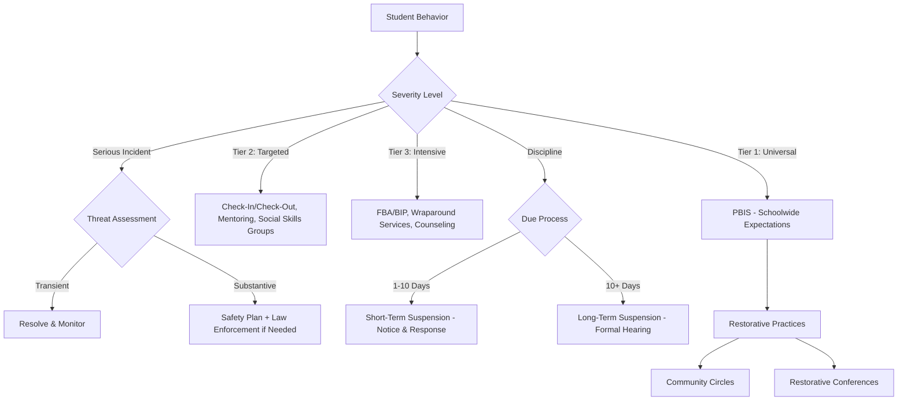

# Discipline & Behavior — Missouri K-12 Education Reference

## Table of Contents
1. Missouri Discipline Policy Requirements
2. PBIS Framework (Deep Dive)
3. Restorative Practices (Protocols)
4. Bullying & Cyberbullying
5. Threat Assessment
6. Zero Tolerance: History & Reform
7. Seclusion & Restraint
8. Sexting & Technology Offenses
9. Hazing
10. Discipline Data & Disparities
11. Alternative Discipline Strategies
12. Student Due Process (Detailed)

---

## 1. Missouri Discipline Policy Requirements

### RSMo 160.261 — Mandatory Policy Components
Every school board must adopt a written discipline policy that includes:
- Clear code of conduct with prohibited behaviors defined
- Range of consequences (graduated, proportional)
- Due process procedures for suspension and expulsion
- Mandatory reporting to law enforcement for:
  - First or second degree assault
  - Weapons possession on school property
  - Drug distribution on school property
  - Arson or attempted arson
- District must report acts of school violence to DESE
- Policy must be distributed to parents and students annually

### RSMo 160.263 — Corporal Punishment
Missouri does not prohibit corporal punishment at the state level. Individual districts may prohibit it by board policy. Trend: most Missouri districts have eliminated corporal punishment.

### RSMo 167.161 — Short-Term Suspension
Suspension of 10 school days or fewer:
- Oral or written notice of charges
- Opportunity for student to respond
- Parent notification
- Principal authority

### RSMo 167.171 — Long-Term Suspension / Expulsion
Suspension exceeding 10 days or expulsion:
- Written notice of charges
- Right to hearing before board or hearing officer
- Right to representation
- Right to present evidence and witnesses
- Written decision
- Right to appeal

---

## 2. PBIS Framework (Deep Dive)

### MO SW-PBS (Missouri Schoolwide Positive Behavior Support)
Missouri's statewide PBIS initiative, supported by DESE and the University of Missouri.

### Tier 1: Universal Supports (All Students — 80-85%)
| Component | Description |
|-----------|-----------|
| **3-5 schoolwide expectations** | Positively stated (e.g., Be Respectful, Be Responsible, Be Safe) |
| **Teaching expectations** | Explicitly teach what each expectation looks like in every setting (classroom, hallway, cafeteria, bus, restroom, playground) |
| **Positive reinforcement** | Systematic recognition of expected behavior (tickets, shout-outs, celebrations) |
| **Consistent consequences** | Minor vs. major behavior definitions; clear response protocol |
| **Data collection** | Office Discipline Referrals (ODRs) tracked; data reviewed monthly by PBIS team |
| **PBIS team** | Building-level team (admin, teachers, support staff) meeting regularly to review data and adjust systems |

### Tier 2: Targeted Supports (At-Risk Students — 10-15%)
| Intervention | Description |
|-------------|-----------|
| **Check-In/Check-Out (CICO)** | Daily check-in with mentor; behavior card; positive feedback; data tracking |
| **Social skills groups** | Small-group instruction on specific social-emotional skills |
| **Mentoring** | Assigned adult mentor for relationship building and support |
| **Behavior contracts** | Written agreement with specific goals, reinforcement, and monitoring |
| **Academic support** | If behavior is driven by academic frustration, provide targeted academic intervention |
| **Self-monitoring** | Student tracks own behavior using a checklist or app |

### Tier 3: Intensive Supports (3-5%)
| Intervention | Description |
|-------------|-----------|
| **Functional Behavior Assessment (FBA)** | Identify the function (why) of behavior |
| **Behavior Intervention Plan (BIP)** | Individualized plan based on FBA results |
| **Wraparound services** | Multi-agency, family-centered planning |
| **Individual counseling/therapy** | School-based or community-based mental health |
| **Crisis plan** | Individualized safety and de-escalation plan |
| **[Special education](../roles/specialists.md) referral** | If behavior may be related to a disability |

### PBIS Data Tools
- SWIS (Schoolwide Information System) — ODR data tracking platform used by many Missouri schools
- Monthly data review: identify patterns by time, location, behavior type, student subgroup
- Decision rules: data thresholds that trigger Tier 2 or Tier 3 referral

---

## 3. Restorative Practices (Protocols)

### Proactive Practices
| Practice | When | Protocol |
|----------|------|---------|
| **Community-building circles** | Daily/weekly in classrooms | Seated in circle; talking piece; check-in question; norms; go-around |
| **Affective statements** | Ongoing | "I feel ___ when ___ because ___" — staff model emotional expression |
| **Restorative questions** | After minor incidents | What happened? What were you thinking? Who was affected? What needs to happen to make it right? |

### Responsive Practices
| Practice | When | Protocol |
|----------|------|---------|
| **Restorative conference** | After harm occurs | Facilitated meeting: harmed party, responsible party, supporters. Focus: what happened → who was affected → how to repair → agreement |
| **Restorative circle** | After community-level harm | Larger group process with talking piece. Explore impact, develop collective agreement for repair |
| **Peer mediation** | Conflicts between students | Trained student mediators facilitate structured conversation; goal: mutual understanding and agreement |
| **Re-entry circle** | After suspension/exclusion | Welcome student back; acknowledge harm; hear student's perspective; establish support plan |

### Implementation Guidance
1. Start with staff buy-in and training (restorative philosophy before techniques)
2. Begin with proactive practices (circles) before responsive
3. Build slowly — don't eliminate all consequences on day one
4. Training: intensive (3-5 days initial) with ongoing coaching
5. Measure: track ODRs, suspensions, school climate surveys, restorative conference agreements
6. Avoid "restorative-in-name-only" — genuine commitment to relationship repair, not just avoiding suspension

---

## 4. Bullying & Cyberbullying

### Missouri Anti-Bullying Law (RSMo 160.775)
- Every school district must adopt an anti-bullying policy
- Policy must prohibit bullying, cyberbullying, and hazing
- Must include reporting procedures, investigation process, and consequences
- Must address bullying by students against other students

### Definitions
| Term | Definition |
|------|-----------|
| **Bullying** | Intimidation, unwanted aggressive behavior, or harassment that is repetitive or substantially interferes with a student's education, creates a hostile environment, or substantially disrupts school operations |
| **Cyberbullying** | Bullying through electronic communication (social media, texting, email, online platforms) |

### District Responsibilities
- Adopt and enforce anti-bullying policy
- Train staff to recognize, intervene, and report bullying
- Provide reporting mechanisms for students and parents (including anonymous reporting)
- Investigate all reports promptly and thoroughly
- Take appropriate action (consequences for aggressor, support for target)
- Document incidents and actions taken
- If bullying is based on race, sex, disability, or other protected class → may also constitute harassment under Title VI, Title IX, or Section 504 (federal civil rights obligation to respond)

### Prevention Programs
| Program | Approach |
|---------|---------|
| **Olweus Bullying Prevention Program** | Whole-school approach; evidence-based |
| **KiVa** | Finnish evidence-based program (universal + targeted) |
| **Second Step: Bullying Prevention Unit** | SEL-integrated bullying prevention |
| **STOPit** | Anonymous reporting app + prevention curriculum |
| **Sandy Hook Promise** | Say Something program — anonymous reporting, threat recognition |

### Cyberbullying Specifics
- School authority over off-campus cyberbullying is limited (Mahanoy v. B.L., 2021) but may act if it causes substantial disruption at school or threatens student safety
- Encourage parents to monitor online activity and report to platforms
- Preserve evidence (screenshots, URLs)
- Involve law enforcement if threats of violence, sexual exploitation, or stalking are involved
- Missouri law RSMo 565.225 (stalking/harassment) may apply to cyberbullying in some cases

---

## 5. Threat Assessment

### Overview
Threat assessment is a structured process for evaluating whether a student who has made a threat (or exhibited threatening behavior) poses an actual risk of carrying out violence.

### CSTAG Model (Comprehensive School Threat Assessment Guidelines — Dr. Dewey Cornell)
Evidence-based framework widely adopted in Missouri:

### Step 1: Evaluate the Threat
- Interview the student, witnesses, and target
- Is the threat transient (expression of frustration, not serious intent) or substantive (intent + planning)?

### Step 2: Transient Threat → Resolve
- Clarify the student's meaning
- Student apologizes or clarifies
- Appropriate disciplinary response
- No further threat assessment needed

### Step 3: Substantive Threat → Respond
- Take protective action (notify target, notify parents of both students, increase supervision)
- Is the threat serious (e.g., "I'm going to beat you up") or very serious (e.g., detailed plan involving a weapon)?
- **Serious:** safety plan, parent conference, counseling referral, disciplinary consequences
- **Very serious:** law enforcement notification, comprehensive safety evaluation, mental health assessment, disciplinary consequences (may include long-term removal)

### Threat Assessment Team
Every school should have a trained threat assessment team:
- Administrator (team leader)
- School counselor
- School psychologist
- SRO or law enforcement liaison
- Teacher representative
- Other specialists as needed (social worker, nurse)

### Key Principles
- Threat assessment is NOT punishment — it is a safety process
- Focus on behavior and circumstances, not profile-matching
- Every threat is evaluated individually (no zero-tolerance shortcut)
- Document all steps and decisions
- Follow up and monitor after resolution

---

## 6. Zero Tolerance: History & Reform

### History
Zero tolerance policies (mandatory severe consequences for specific offenses) became widespread in the 1990s after federal Gun-Free Schools Act (1994). Missouri and most states adopted mandatory expulsion for weapons violations and expanded zero tolerance to drugs, fighting, and other behaviors.

### Problems with Zero Tolerance
Research has consistently shown:
- No evidence that zero tolerance improves school safety
- Disproportionate impact on Black students, students with disabilities, and male students
- Pushes students out of school (school-to-prison pipeline)
- Removes context and discretion from discipline decisions
- Counterproductive: exclusion increases (not decreases) risk of future behavior problems and dropout

### Reform Movement
National and Missouri trend toward:
- Graduated discipline (proportional to severity)
- Restorative practices as alternatives to exclusion
- Limiting suspension/expulsion for non-violent, non-safety-threatening offenses
- Disaggregating discipline data to address racial disparities
- PBIS implementation as preventive framework
- Keeping students in school whenever safely possible

### Missouri Context
- RSMo 160.261 still requires mandatory reporting of certain offenses to law enforcement
- Many Missouri districts have reformed discipline codes to reduce exclusionary discipline
- DESE supports PBIS and restorative approaches through professional development

---

## 7. Seclusion & Restraint

### Missouri Guidance
Missouri has addressed seclusion and restraint in schools through DESE guidance (not a standalone statute, but incorporated into special education rules and best practice guidance):

### Definitions
| Term | Definition |
|------|-----------|
| **Physical restraint** | Use of physical force to restrict a student's movement |
| **Seclusion** | Involuntary confinement of a student alone in a room or area from which they cannot exit |
| **Time-out** | Removal from reinforcement (not the same as seclusion if the student can leave or the door is not locked) |

### Key Principles
- Restraint and seclusion should ONLY be used in emergency situations where there is imminent danger of serious physical harm to the student or others
- Should NEVER be used as punishment, for staff convenience, or as a behavioral intervention
- Should be the least restrictive intervention possible
- Should end as soon as the emergency ends
- Staff using restraint must be trained in safe techniques
- Prone (face-down) restraint is prohibited in most guidance
- Mechanical restraints (devices) prohibited except for safety equipment (wheelchair harness, medical devices)

### Documentation & Reporting
- Every incident of seclusion or restraint must be documented
- Parents must be notified promptly (same day)
- Written incident report filed
- [IEP](../roles/specialists.md) team review if the student has an IEP — may trigger FBA/BIP development or revision (see [IEP Compliance Checklist](../../templates/specialist/iep-compliance-checklist.md))
- Data on seclusion/restraint incidents tracked and reviewed by administration

---

## 8. Sexting & Technology Offenses

### Sexting Among Minors
Sexting (sending/receiving sexually explicit images via text or social media) among minors creates a complex intersection of:
- Missouri criminal law (child pornography statutes — RSMo 573.023, 573.025 — could technically apply)
- School discipline policy
- Child protection concerns
- Educational opportunity

### School Response
- Investigate promptly
- Preserve evidence but minimize viewing of images
- Notify law enforcement (mandatory if images involve exploitation or coercion)
- Notify parents of all involved students
- Provide support for students depicted in images (victim-centered approach)
- Consider educational interventions alongside discipline
- Assess for exploitation, coercion, or bullying (power dynamics)
- [504](../../templates/specialist/plans-and-forms.md)/[IEP](../roles/specialists.md) team review if applicable

### Prevention
- Digital citizenship curriculum addressing sexting
- Age-appropriate conversations about healthy relationships, consent, and online privacy
- Parent education on monitoring and communication

---

## 9. Hazing

### Missouri Law (RSMo 160.775 + RSMo 578.360-578.365)
- School anti-bullying policies must address hazing
- RSMo 578.360 defines hazing as forced activity that could endanger physical health, regardless of the student's willingness to participate
- Hazing is a Class A misdemeanor (RSMo 578.365)

### Common Hazing Contexts
- Athletic teams (initiation rituals)
- Student organizations and clubs
- Band and performing arts groups
- Social groups and fraternities/sororities (less common in high school but exists)

### School Prevention
- Written anti-hazing policy
- Coach/advisor training on hazing recognition and reporting
- Student education on what constitutes hazing
- Anonymous reporting mechanisms
- Clear consequences for participants and bystanders who fail to report
- Culture-building alternatives to hazing traditions (team bonding without hierarchy or humiliation)

---

## 10. Discipline Data & Disparities

### Required Reporting
- MOSIS collects discipline data (incidents, consequences, demographics)
- DESE reports discipline data publicly through APR and school report cards
- Data disaggregated by race/ethnicity, gender, disability, grade level

### Known Disparities (National and Missouri)
- Black students are suspended at rates 2-3x higher than white students
- Students with disabilities are suspended at higher rates than non-disabled peers
- Male students are disciplined at higher rates than female students
- These disparities persist after controlling for behavior and socioeconomic factors
- Disparities are driven by: implicit bias in referral decisions, culturally mismatched behavioral norms, zero-tolerance policies, lack of alternative responses, systemic racism

### Addressing Disparities
1. Disaggregate discipline data monthly (not just annually)
2. Set reduction targets for disproportionate exclusion
3. Train staff on implicit bias and culturally responsive behavior management
4. Implement PBIS and restorative practices
5. Use restorative rather than exclusionary responses for non-safety-threatening behaviors
6. Ensure consistent application of discipline code across staff
7. Root cause analysis when disparities are identified
8. Community engagement on discipline reform

---

## 11. Alternative Discipline Strategies

| Strategy | Description | When to Use |
|----------|-----------|-------------|
| **In-school suspension (ISS)** | Student remains at school in supervised separate space; completes academic work | Alternative to out-of-school suspension for non-safety-threatening offenses |
| **Lunch/recess detention** | Loss of unstructured time | Minor infractions |
| **Community service** | Service to school or community | Alternative to suspension; connection to community |
| **Behavioral contract** | Written agreement with goals, reinforcements, consequences | Recurring behavior; student commitment |
| **Parent shadow** | Parent attends school with student for a day | Attendance or behavior (use carefully; can be stigmatizing) |
| **Saturday school** | Extended school time on Saturday | Attendance, academic, or behavior |
| **Mediation** | Facilitated conversation between parties | Conflicts between students |
| **Restorative conference** | Facilitated repair of harm | After a specific incident with identifiable victim |
| **Counseling referral** | Individual or group counseling | Underlying emotional or mental health concerns |
| **Mentoring** | Assigned adult mentor for ongoing support | At-risk students needing positive relationship |
| **Schedule change** | Modified class schedule to reduce triggers | When specific contexts drive behavior |

---

## 12. Student Due Process (Detailed)

### Constitutional Basis
**Goss v. Lopez (1975):** Students have a property interest in public education; due process is required before suspension. For suspensions of 10 days or fewer, students must receive oral or written notice and an opportunity to respond. For longer exclusions, more formal procedures are required.

### Missouri Due Process Framework

**Short-term suspension (≤10 days):**
1. Oral or written notice of charges and evidence
2. Explanation of evidence against the student
3. Opportunity for the student to present their side
4. Decision by principal/administrator
5. Parent notification (oral or written)
6. No formal hearing required
7. Students with [IEP](../roles/specialists.md)/[504](../../templates/specialist/plans-and-forms.md): if cumulative days exceed 10 in a year → MDR required

**Long-term suspension (>10 days) or expulsion:**
1. Written notice of charges with specific allegations and evidence
2. Reasonable time to prepare a response
3. Formal hearing before the school board or designated hearing officer
4. Right to be represented (parent, advocate, attorney)
5. Right to present evidence and call witnesses
6. Right to cross-examine school witnesses
7. Written decision with findings of fact and conclusions
8. Right to appeal to the school board (if initial hearing was before a hearing officer)
9. Right to judicial review if desired

**Emergency removal:** If a student poses an imminent danger to self or others, the student may be removed immediately. Due process must follow as soon as practicable (within 24-72 hours).
