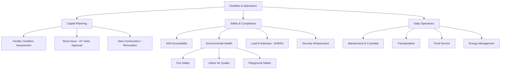

# Facilities & Operations — Missouri K-12 Education Reference

## Table of Contents
1. ADA Accessibility
2. Environmental Health & Safety
3. Capital Planning & Bond Issues
4. New Construction & Renovation
5. Indoor Air Quality
6. Lead & Asbestos Management
7. Playground Safety
8. Energy Management
9. Maintenance & Custodial Operations
10. Transportation Operations
11. Food Service Facilities
12. Security Infrastructure

---

## 1. ADA Accessibility

### Requirements
- All new construction must comply with ADA Accessibility Standards (2010 ADA Standards for Accessible Design)
- Existing facilities must provide **program access** — the program/activity must be accessible even if every part of the building is not fully accessible
- Alterations to existing buildings trigger accessibility requirements for the altered area

### Common Accessibility Elements
- Accessible entrances, routes, and exits
- Elevators or lifts (multi-story buildings)
- Accessible restrooms on each floor with accessible classrooms
- Accessible parking (quantity based on total parking spaces)
- Signage (Braille, raised letters, pictograms)
- Accessible classroom furniture and lab stations
- Assistive listening systems in assembly areas
- Accessible playground equipment and surfaces
- Door hardware (lever handles, not knobs), door widths (32" minimum clear), thresholds
- Visual alarm devices (for deaf/hard of hearing)

### Self-Evaluation & Transition Plan
- ADA requires public entities to conduct a self-evaluation of facilities and programs
- Develop a Transition Plan to address identified barriers
- Prioritize: (1) access to programs, (2) access to state and local government services, (3) employee access

---

## 2. Environmental Health & Safety

### Key Regulatory Areas
| Area | Authority | Requirements |
|------|----------|-------------|
| **Fire safety** | State Fire Marshal, local fire department | Annual inspection, fire alarm testing, sprinkler system maintenance, egress compliance |
| **OSHA** | Federal/State OSHA | Hazard communication, bloodborne pathogens, lockout/tagout, PPE, confined spaces |
| **Drinking water** | EPA / Missouri DNR | Lead testing (Lead-Free Schools provisions); safe drinking water act compliance |
| **Radon** | EPA (guidance) | Testing recommended (Missouri has elevated radon areas); mitigation if levels exceed 4 pCi/L |
| **Mold** | EPA / local health dept | Moisture control, remediation protocols, indoor air quality management |
| **Pest management** | EPA / Missouri Dept of Agriculture | Integrated Pest Management (IPM) recommended; notification requirements for pesticide application in schools |

### Health & Safety Committee
Best practice: establish a building-level health and safety committee including administration, custodial, nursing, teaching, and parent representatives. Conduct annual facility walk-throughs and address identified hazards.

---

## 3. Capital Planning & Bond Issues

### Long-Range Facility Plan
Districts should maintain a 5-10 year capital improvement plan addressing:
- Facility condition assessment (roof, HVAC, plumbing, electrical, structural, ADA)
- Enrollment projections
- Educational adequacy (do spaces support current instructional needs?)
- Technology infrastructure needs
- Energy efficiency upgrades
- Security improvements
- Athletic/activity facility needs

### Bond Issues
- General obligation bonds are the primary mechanism for large capital projects
- Require **4/7 voter approval (57.14%)** at election
- Bonded indebtedness limit: generally 15% of assessed valuation (RSMo 164.011)
- Typical uses: new construction, major renovation, technology infrastructure, buses, equipment
- Repaid through a debt service levy on property taxes

### Lease-Purchase Agreements
- Alternative financing for equipment, technology, vehicles
- Board approval required; does not require voter approval
- Annual payments from operating budget
- Interest costs typically higher than bond financing
- Useful for smaller projects or equipment with shorter useful life

### No-Tax-Increase Bonds
Districts may issue no-tax-increase bonds by refinancing existing bonds at lower rates, freeing up capacity within the existing levy.

---

## 4. New Construction & Renovation

### DESE Requirements
- School facility plans should be submitted to DESE for review
- DESE provides guidance on minimum square footage per student, classroom sizes, and facility requirements

### Planning Process
1. Needs assessment (enrollment data, facility condition, educational adequacy)
2. Community engagement (input sessions, surveys, task forces)
3. Architectural programming (educational specifications → schematic design)
4. Board approval of project scope and budget
5. Bond election (if needed)
6. Architect/engineer selection (competitive process; RSMo 8.285-8.291 for public procurement)
7. Bidding and construction (prevailing wage applies — RSMo 290.210-290.340)
8. Occupancy and commissioning
9. Post-occupancy evaluation

### Prevailing Wage
Missouri prevailing wage law (RSMo 290.210) applies to public construction projects over $75,000. Contractors and subcontractors must pay workers the prevailing wage rate for the locality.

---

## 5. Indoor Air Quality (IAQ)

### EPA Tools for Schools Program
EPA recommends schools use the "IAQ Tools for Schools" framework:
- Designate an IAQ coordinator
- Conduct IAQ walk-throughs regularly
- Address the six IAQ pathways: HVAC, moisture, chemical sources, biological sources, ventilation, filtration

### Common IAQ Issues in Schools
- Inadequate ventilation (especially in older buildings)
- Mold growth (moisture intrusion, condensation, plumbing leaks)
- Chemical off-gassing (cleaning products, new construction materials, science labs)
- Dust and allergens
- CO2 accumulation (overcrowded classrooms with poor ventilation)
- Vehicle exhaust near air intakes (bus loading zones)

### COVID-19 Legacy: Ventilation Improvements
- Many Missouri districts used ESSER funds (federal pandemic relief) to upgrade HVAC systems
- ASHRAE standards for school ventilation (minimum outdoor air per occupant)
- MERV-13 filtration recommended (or highest rated filter compatible with HVAC system)
- Portable air cleaners with HEPA filtration for classrooms without adequate HVAC

---

## 6. Lead & Asbestos Management

### Lead in Drinking Water
- EPA Lead-Free Schools guidance and some state requirements for lead testing in school drinking water
- Missouri DNR and DHSS provide guidance
- Action level: EPA recommends action at 15 ppb (parts per billion); many schools use 5 ppb
- Remediation: replace fixtures, install filters, shut off non-compliant sources
- Testing recommended at all drinking fountains, food service taps, and classroom sinks used for drinking

### Asbestos (AHERA)
**Asbestos Hazard Emergency Response Act (40 CFR Part 763)**
- All schools (K-12) must have an Asbestos Management Plan on file
- Initial inspection and periodic re-inspections (every 3 years) by accredited inspectors
- Asbestos-containing materials (ACM) must be managed: encapsulated, enclosed, or removed
- Custodial/maintenance staff must receive asbestos awareness training (2 hours minimum)
- Parents and employees must be notified annually of the asbestos management plan availability
- Designated Person in each district/school oversees AHERA compliance

---

## 7. Playground Safety

### CPSC Guidelines
Consumer Product Safety Commission (CPSC) publishes the Public Playground Safety Handbook:
- Age-appropriate equipment (separate areas for 2-5 and 5-12)
- Fall zone surfacing (engineered wood fiber, rubber mulch, poured rubber — minimum 12" depth)
- Equipment spacing and clearances
- No entrapment or entanglement hazards
- Regular inspection and maintenance schedule

### ADA Accessibility
- Playground must include accessible routes to and through the play area
- Accessible play components (ground-level activities)
- Accessible surfacing (firm, stable, slip-resistant — poured rubber preferred for wheelchair access)

### Inspection
- Routine inspection by trained staff (weekly/monthly)
- Annual comprehensive inspection by certified playground safety inspector (CPSI)
- Document all inspections and maintenance

---

## 8. Energy Management

### Energy Costs
Energy is typically the second-largest operating expenditure for school districts (after personnel). Energy efficiency reduces operating costs and can redirect savings to instruction.

### Strategies
- Energy audits (ASHRAE Level I, II, or III)
- HVAC upgrades (high-efficiency equipment, building automation systems)
- LED lighting conversion
- Building envelope improvements (insulation, windows, roofing)
- Renewable energy (solar panels — net metering available in Missouri)
- Behavioral programs (turning off lights, managing thermostats)
- Energy management systems (automated scheduling, demand response)
- Utility incentive programs (Ameren, Evergy, others offer rebates)

### Guaranteed Energy Savings Contracts (GESC)
Missouri law (RSMo 8.231) allows school districts to enter into guaranteed energy savings contracts:
- Energy service company (ESCO) guarantees savings from efficiency improvements
- Project financed through the guaranteed savings (no upfront capital required)
- If savings are not achieved, ESCO pays the difference

---

## 9. Maintenance & Custodial Operations

### Staffing Guidelines
APPA (Association of Physical Plant Administrators) recommends cleaning levels:
- Level 1 (Orderly Tidiness): ~10,000-11,000 sq ft per custodian per shift
- Level 2 (Ordinary Tidiness): ~18,000-20,000 sq ft
- Level 3 (Casual Inattention): ~28,000-31,000 sq ft
- Most schools target Level 2 or 3 due to budget constraints

### Preventive Maintenance
- Scheduled maintenance program (HVAC, electrical, plumbing, roofing, grounds)
- Work order system for tracking requests and completion
- Preventive maintenance extends equipment life and reduces emergency repairs
- Capital maintenance budgeting: industry recommends 2-4% of current replacement value annually for maintenance

---

## 10. Transportation Operations

See `references/school-staff.md` for bus driver requirements.

### Key Operational Areas
- Route planning and optimization (software tools: Transfinder, Versatrans, Tyler)
- Fleet management (vehicle maintenance, replacement schedule, inspections)
- GPS tracking and monitoring
- Student safety (cameras, stop-arm violations, pre-trip/post-trip inspections)
- Special transportation (IEP-mandated, wheelchair accessible, attendants)
- Fuel management and procurement
- Driver recruitment, training, and retention
- Missouri State Highway Patrol school bus inspection (annual)

---

## 11. Food Service Facilities

### Kitchen Design & Equipment
- Must comply with local health department requirements
- USDA meal production requirements
- Equipment for scratch cooking vs. heat-and-serve (trend toward scratch cooking)
- Allergen management (separate preparation areas, labeling)
- Walk-in cooler/freezer storage for USDA commodity foods

### Cafeteria Space
- Adequate seating capacity for student population
- Multiple lunch periods for large schools
- Serving line efficiency
- Clean and welcoming environment (impacts participation rates)

---

## 12. Security Infrastructure

### Physical Security
- Controlled access (single-point entry, buzz-in systems, visitor management)
- Security cameras (interior and exterior)
- Communication systems (intercoms, radios, mass notification)
- Classroom door hardware (lockable from inside — "barricade-proof" hardware discouraged in favor of proper locksets)
- Secure vestibule design (screening visitors before entry to main building)
- Window treatments (for concealment during lockdown)
- Panic/duress alarms (in offices, counseling rooms)
- Emergency lighting and exit signage

### Visitor Management Systems
- Digital visitor management (Raptor, LobbyGuard, School Gate Guardian)
- Sex offender registry check upon sign-in
- Photo ID badge printing
- Visitor logs maintained for safety and FERPA compliance
- Clear signage directing all visitors to main office

### School Safety Assessments
- CPTED (Crime Prevention Through Environmental Design) assessment
- Vulnerability assessment (conducted by law enforcement or security consultants)
- Annual review and update of safety plans
- Coordination with local law enforcement and emergency management
