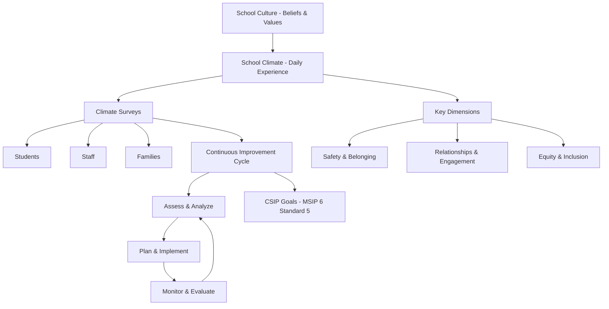

# School Culture & Climate — Missouri K-12 Education Reference

## Table of Contents
1. Defining Culture vs. Climate
2. Climate Surveys
3. Student Belonging & Connectedness
4. Staff Culture & Morale
5. Equity-Centered School Culture
6. SEL Integration into School Culture
7. Positive School Identity
8. Physical Environment & Culture
9. Building Community & Traditions
10. Addressing Toxic Culture
11. Measuring & Improving Climate
12. MSIP 6 School Quality Indicators

---

## 1. Defining Culture vs. Climate

### Culture
The deeply embedded beliefs, values, norms, and assumptions that shape "how we do things here":
- Shared expectations for behavior (students and staff)
- Unwritten rules and traditions
- Collective identity and pride
- Values about learning, discipline, equity, and relationships
- Takes years to build, moments to damage

### Climate
The day-to-day experience of being in the school — how it "feels":
- Physical safety and emotional safety
- Quality of relationships (student-teacher, student-student, teacher-administrator)
- Teaching and learning environment
- Sense of belonging and inclusion
- Institutional environment (fairness, clarity of expectations, responsiveness)
- Can shift more quickly than culture; measured through surveys and observation

### Relationship
Culture is the root system; climate is the weather. Strong culture sustains positive climate even through challenges. Poor culture undermines any climate improvement effort.

---

## 2. Climate Surveys

### Purpose
Systematically measure perceptions of safety, belonging, engagement, and environment from students, staff, and families.

### Common Climate Survey Tools
| Tool | Respondents | Features |
|------|-----------|---------|
| **Panorama Education** | Students, staff, families | Comprehensive; equity-focused analytics; MSIP 6 aligned; widely used in Missouri |
| **ED School Climate Surveys (EDSCLS)** | Students, staff, families | Free (U.S. Dept of Education); validated; three domains (engagement, safety, environment) |
| **Hanover Research** | Students, staff, families | Custom surveys; benchmarking against peer districts |
| **BrightBytes** | Students, staff, families | Technology integration + climate; data visualization |
| **YouthTruth** | Students | Student voice focused; national benchmarking |
| **5Essentials** | Students, teachers | Research-based (University of Chicago); five essential supports for school improvement |

### Climate Survey Best Practices
- Administer annually (same time each year for comparison)
- Disaggregate results by race, gender, grade, disability, program
- Share results transparently (staff, families, community, board)
- Use results to set specific improvement goals (not just to "check a box")
- Include student voice in interpreting results and designing responses
- Track trends over time (3+ years of data)
- Complement quantitative data with qualitative methods (focus groups, student listening sessions)

### Missouri Context
MSIP 6 includes school climate as a School Quality indicator. Many Missouri districts administer climate surveys as part of their CSIP data collection and MSIP 6 reporting.

---

## 3. Student Belonging & Connectedness

### Why It Matters
Students who feel they belong at school:
- Have higher academic achievement
- Have better attendance
- Have fewer behavioral incidents
- Report lower levels of anxiety and depression
- Are less likely to drop out
- Are more resilient to adversity

### Barriers to Belonging
- Bullying, harassment, exclusion
- Identity-based marginalization (race, disability, gender, sexual orientation, socioeconomic status, immigration status)
- Lack of representation in curriculum, staff, or school environment
- Exclusionary discipline (suspension removes students from the community)
- Social cliques and peer hierarchies
- Implicit bias from staff
- Inconsistent expectations and unclear norms
- Physical environment that feels institutional or unwelcoming

### Strategies to Build Belonging
| Strategy | Description |
|----------|-----------|
| **Advisory programs** | Small, consistent groups of students meeting regularly with an advisor (weekly or daily) for relationship building, check-ins, and community |
| **Morning meetings / classroom circles** | Daily community-building ritual (greeting, sharing, activity, message) |
| **Student voice** | Student advisory councils, surveys, town halls, participatory decision-making |
| **Identity-affirming practices** | Celebrate cultural heritage, display diverse representations, affirm identities |
| **Mentoring** | Adult-student mentoring (every student known by at least one trusted adult) |
| **Peer connection** | Buddy programs, peer mentoring, cross-age interactions, welcome committees |
| **Extracurricular access** | Remove financial barriers to participation in clubs, sports, arts |
| **Restorative practices** | Build community through circles; repair harm through relationship (not exclusion) |
| **Teacher-student relationships** | Greet students by name, show genuine interest, maintain high expectations with high support |

---

## 4. Staff Culture & Morale

### Indicators of Healthy Staff Culture
- High trust between teachers and administration
- Collaborative professional relationships (not isolation)
- Shared purpose and commitment to students
- Psychological safety (safe to take risks, make mistakes, disagree)
- Professional autonomy balanced with accountability
- Celebration of success and recognition of effort
- Low turnover and high staff retention
- Positive staff climate survey results

### Indicators of Toxic Staff Culture
- High turnover and difficulty filling positions
- Cliques, gossip, and interpersonal conflict
- Fear of retaliation for speaking up
- Micromanagement or authoritarian leadership
- Cynicism and "us vs. them" mentality (staff vs. admin, veteran vs. new)
- Burnout and disengagement
- Low survey participation or low scores
- Resistance to change and improvement

### Building Positive Staff Culture
- Authentic shared decision-making (not performative)
- Protected planning and collaboration time
- Meaningful professional development (teacher-directed)
- Recognition systems (genuine, not formulaic)
- Social connection opportunities (team building, celebrations, traditions)
- Transparent communication from leadership
- Manageable workload expectations
- Support for staff wellness (see `references/educator-workforce.md`)
- Consistent, fair application of policies
- Inclusive hiring practices (diversity in staff)

---

## 5. Equity-Centered School Culture

### What It Looks Like
- Achievement gaps are treated as institutional responsibility, not student deficit
- Discipline data is transparent and disaggregated; disparities are actively addressed
- Curriculum includes diverse perspectives, histories, and authors
- Staff demographics increasingly reflect student demographics
- Family engagement is culturally responsive and accessible
- Advanced coursework is accessible to all students (not gatekept)
- Special education identification is equitable (monitored for disproportionality)
- All students see themselves reflected in the physical environment (bulletin boards, library, artwork)
- Implicit bias is acknowledged and actively countered through professional development
- Policies and practices are reviewed through an equity lens

### Equity Audit
An equity audit systematically examines school/district data, policies, and practices for equity:
1. **Academic data:** achievement, growth, grade distribution — disaggregated by race, income, disability, ELL status
2. **Access data:** enrollment in AP/IB/dual credit, gifted, CTE, extracurriculars — disaggregated
3. **Discipline data:** referrals, suspensions, expulsions — disaggregated
4. **Staffing data:** demographics, qualifications, experience — by school
5. **Resource allocation:** per-pupil spending, facility quality, technology access — by school
6. **Policy review:** discipline code, grading policy, enrollment, program access — for potential disparate impact
7. **Climate data:** survey results — disaggregated by subgroup
8. **Qualitative data:** student and family voice (focus groups, listening sessions)

---

## 6. SEL Integration into School Culture

### Schoolwide SEL (Not Just Classroom Curriculum)
| Level | What It Looks Like |
|-------|-------------------|
| **Classroom** | Explicit SEL instruction, embedded SEL in academic content, warm-demanding teacher relationships |
| **Building** | Shared language for SEL competencies, advisory programs, morning meetings, conflict resolution protocols, recognition systems |
| **District** | SEL standards, professional development, data collection, policy alignment, family communication about SEL |
| **Community** | Partnerships with mental health providers, youth-serving organizations, family support agencies |

### Adult SEL
Effective student SEL requires adults in the building to model social-emotional competencies:
- Self-regulation under stress
- Empathetic responses to student behavior
- Collaborative problem-solving with colleagues
- Self-awareness of biases and triggers
- Healthy communication and conflict resolution

### SEL and Academics
SEL is not separate from academic instruction — it's foundational:
- Students who feel safe, connected, and emotionally regulated learn better
- Academic engagement increases when students have relationship skills and self-management
- SEL reduces behavioral barriers to learning
- Integrated approach: teach SEL skills through academic content (discussion protocols, cooperative learning, growth mindset, metacognition)

---

## 7. Positive School Identity

### Elements
- **School name and mascot** — symbols of community identity and pride
- **Mission and vision** — lived (not just posted) statements that guide daily practice
- **Traditions** — annual events, rituals, ceremonies that build collective memory
- **Physical symbols** — school colors, logos, murals, trophy cases, displays of student work
- **Alumni connections** — celebrating alumni achievements; alumni engagement in current programs
- **Community narrative** — the story the school tells about itself and its purpose

### Cautions
- Traditions should be inclusive (not exclusionary based on race, gender, or identity)
- Mascots and symbols should be respectful and non-offensive
- School identity should embrace current student body, not just historical demographics
- "We've always done it this way" should never override equity, safety, or inclusion

---

## 8. Physical Environment & Culture

### Environmental Factors That Shape Climate
| Factor | Impact |
|--------|--------|
| **Cleanliness and maintenance** | Communicates respect and care; affects pride and behavior |
| **Natural light** | Improves mood, attention, and learning outcomes |
| **Color and design** | Welcoming colors and intentional design reduce stress |
| **Student work displays** | Communicates value of student effort and learning |
| **Signage and wayfinding** | Multilingual signage communicates inclusion |
| **Gathering spaces** | Common areas for informal social connection |
| **Classroom arrangement** | Flexible furniture supports collaboration; rows communicate control |
| **Library/media center** | Welcoming, diverse collection; safe space for exploration |
| **Outdoor spaces** | Gardens, nature areas, outdoor classrooms support whole-child development |
| **Sensory considerations** | Noise management, calming spaces for students with sensory needs |

---

## 9. Building Community & Traditions

### Examples of Community-Building Traditions
- **Welcome Week:** orientation activities for all students, with emphasis on new students
- **Community circles:** regular classroom or schoolwide circles for sharing and connection
- **Student recognition:** academic, character, effort, growth — not just top performers
- **Cultural celebrations:** honoring diverse cultural traditions and holidays throughout the year
- **Spirit weeks / themed days:** fun, inclusive, optional participation
- **Service projects:** schoolwide community service connecting students to broader community
- **Art and performance showcases:** visual art exhibits, concerts, plays, poetry slams
- **Athletic events:** community-building through school sports (not just competition)
- **Graduation and milestone ceremonies:** celebrating transitions with dignity and joy
- **Alumni events:** homecoming, career day with alumni, hall of fame

---

## 10. Addressing Toxic Culture

### Warning Signs
- Persistent negative climate survey results
- High staff turnover (especially mid-year departures)
- Student disengagement (attendance, behavior, apathy)
- Parent complaints and withdrawal
- Community distrust of school leadership
- Media attention for negative incidents
- Board-superintendent dysfunction
- Absence of shared vision or conflicting values among staff

### Turnaround Strategies
1. **Acknowledge the problem** honestly and transparently
2. **Listen** — conduct listening sessions with students, staff, families, community
3. **New leadership** may be necessary (not always, but sometimes the leader IS the culture problem)
4. **Quick wins** — visible, tangible improvements that signal change (fix facilities, reduce punitive discipline, add student voice)
5. **Shared visioning** — collaboratively develop new mission/vision/values
6. **Professional development** — train staff on relational practices, equity, trauma-informed care
7. **Structural changes** — modify schedules, teams, communication systems to support new culture
8. **Accountability** — set measurable goals for climate improvement and monitor progress
9. **Patience** — culture change takes 3-5 years of sustained effort; don't expect overnight transformation
10. **External support** — bring in coaches, consultants, or partnership organizations to support the work

---

## 11. Measuring & Improving Climate

### Continuous Improvement Cycle for Climate
1. **Assess:** administer climate surveys; review data on attendance, discipline, engagement
2. **Analyze:** disaggregate by subgroup; identify patterns and root causes
3. **Plan:** set 1-3 specific climate improvement goals; select evidence-based strategies
4. **Implement:** launch strategies with fidelity; communicate plan to all stakeholders
5. **Monitor:** collect formative data (monthly discipline data, attendance trends, informal surveys)
6. **Evaluate:** re-administer climate survey annually; compare results to baseline
7. **Adjust:** modify strategies based on data; celebrate progress; address persistent challenges

### Climate Data Integration with CSIP
School climate goals should be integrated into the Comprehensive School Improvement Plan (CSIP):
- Climate goals aligned to MSIP 6 Standard 5 (School Quality)
- Specific, measurable climate targets (e.g., "Increase student belonging score by 10% on Panorama survey")
- Strategies and action steps with assigned responsibility
- Professional development aligned to climate goals
- Budget allocation for climate initiatives

---

## 12. MSIP 6 School Quality Indicators

### Climate-Related Indicators in MSIP 6
MSIP 6 Standard 5 (School Quality) includes several climate-related metrics:

| Indicator | Measurement |
|-----------|-------------|
| **Student attendance rate** | Average daily attendance percentage |
| **Chronic absenteeism rate** | % of students missing 10%+ of school days |
| **Teacher retention rate** | % of teachers returning year-over-year |
| **School climate survey results** | Student, staff, and/or family perception data |
| **Advanced coursework access** | % of students enrolled in AP, IB, dual credit, advanced courses |
| **Arts and CTE participation** | % of students participating in fine arts and career-technical education |
| **Discipline incidents** | Rate of suspensions, expulsions; disaggregated data |

### Using MSIP 6 to Drive Climate Work
- APR scores provide baseline and comparison data
- Climate indicators are reported publicly (accountability driver)
- Low scores trigger improvement requirements (CSIP goals)
- Districts can benchmark against similar-sized districts statewide
- DESE provides resources and support for climate improvement
