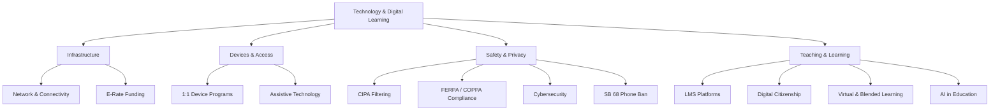

# Technology & Digital Learning — Missouri K-12 Education Reference

## Table of Contents
1. 1:1 Device Programs
2. Learning Management Systems (LMS)
3. Digital Citizenship
4. AI in Education
5. Virtual & Blended Learning
6. CIPA Compliance & Internet Filtering
7. Student Data Privacy
8. Cybersecurity
9. Assistive Technology
10. E-Rate & Technology Funding
11. Infrastructure & Connectivity
12. Professional Development for Technology
13. SB 68 — Electronic Communication Device Ban
8. Cybersecurity
9. Assistive Technology
10. E-Rate & Technology Funding
11. Infrastructure & Connectivity
12. Professional Development for Technology

---

## 1. 1:1 Device Programs

### Implementation Models
| Model | Description |
|-------|-----------|
| **Take-home 1:1** | Every student assigned a device they take home daily |
| **In-school 1:1** | Every student has a device during school hours; devices stay at school |
| **BYOD (Bring Your Own Device)** | Students use personal devices; school provides for those without |
| **Shared carts** | Devices shared among classrooms on a schedule |

### Device Options
- Chromebooks (most common in Missouri — low cost, easy management, Google Workspace integration)
- iPads (common in elementary, special education, fine arts)
- Windows laptops (common in CTE, STEM, secondary)
- Desktop labs (legacy; still used for specialized software, CTE, testing)

### Program Considerations
- Acceptable Use Policy (AUP) — required; signed by student and parent
- Device insurance/repair programs
- Internet access at home (equity concern — hotspot lending, community Wi-Fi partnerships)
- Content filtering on take-home devices (CIPA requires filtering on school-owned devices used off-campus)
- Digital equity: ensure all students have equal access regardless of income, geography, or disability
- Refresh cycle: plan for device replacement every 3-5 years
- Asset management and tracking

---

## 2. Learning Management Systems (LMS)

### Common LMS Platforms in Missouri Schools
| Platform | Common Usage |
|----------|-------------|
| **Google Classroom** | Most widely adopted (K-12); integrated with Google Workspace |
| **Canvas** | Growing adoption, especially secondary and districts with post-secondary partnerships |
| **Schoology** | Some districts; strong assessment tools |
| **Seesaw** | Elementary-focused; portfolio and family communication |
| **Microsoft Teams** | Some districts using Microsoft 365 ecosystem |

### LMS Best Practices
- Consistent use across the district (reduces family confusion)
- Parent/guardian access (view assignments, grades, communications)
- Accessibility compliance (WCAG 2.1 standards for students with disabilities)
- Integration with Student Information System (SIS) for grade passback
- Regular training for teachers on effective LMS use
- Content organization standards (consistent naming, structure, due dates)

---

## 3. Digital Citizenship

### ISTE (International Society for Technology in Education) Standards
Missouri has adopted ISTE Standards for Students as a framework:
1. Empowered Learner
2. Digital Citizen
3. Knowledge Constructor
4. Innovative Designer
5. Computational Thinker
6. Creative Communicator
7. Global Collaborator

### Digital Citizenship Curriculum Topics
| Topic | Grade Level Focus |
|-------|------------------|
| **Online safety** | K-5 (stranger danger online, personal information, trusted adults) |
| **Cyberbullying** | 3-12 (recognition, prevention, reporting, bystander intervention) |
| **Digital footprint** | 5-12 (permanent nature of online activity, social media, college/employer searches) |
| **Privacy & security** | 5-12 (passwords, phishing, data collection, privacy settings) |
| **Media literacy** | 6-12 (identifying misinformation, evaluating sources, understanding algorithms) |
| **Intellectual property** | 6-12 (copyright, fair use, citation, plagiarism, Creative Commons) |
| **Healthy tech habits** | K-12 (screen time, balance, sleep, physical health, social comparison) |
| **Digital communication** | 3-12 (tone, netiquette, appropriate sharing, context collapse) |

### Common Digital Citizenship Programs
- Common Sense Education (most widely used free curriculum)
- Google Be Internet Awesome (elementary)
- NetSmartz (National Center for Missing & Exploited Children)
- CyberPatriot (competition-based cybersecurity education)

---

## 4. AI in Education

→ **AI in education is covered in depth in `references/ai-in-education/INDEX.md`** (canonical source). Route there for: DESE AI guidance, AI for teaching, AI for learning/reinforcement, AI for communication, AI policy development, academic integrity, AI data privacy, AI equity, AI literacy K-12, AI tools, AI career readiness, and SB 68 interaction.

**Quick context for this file:** AI tools used in schools are subject to the same CIPA filtering, FERPA/COPPA data privacy, and technology procurement requirements as all other educational technology. AI-specific concerns (academic integrity, prompt engineering, AI-resistant assessment design) are addressed in the AI reference files.

---

## 5. Virtual & Blended Learning

See `references/alternative-education.md` for MOCAP details.

### Blended Learning Models
| Model | Description |
|-------|-----------|
| **Station rotation** | Students rotate between online and face-to-face learning stations in the classroom |
| **Flipped classroom** | Students access content (video, reading) online at home; class time for practice and application |
| **Flex** | Primarily online with teacher available for support; student moves at own pace |
| **A la carte** | Student takes some courses online, some face-to-face |
| **Enriched virtual** | Primarily online with required in-person sessions |

### Virtual Learning Best Practices
- Synchronous + asynchronous balance (live interaction matters)
- Regular check-ins and progress monitoring
- Accessible content (captions, alt text, screen reader compatibility)
- Student engagement strategies (discussion boards, collaborative projects, formative assessment)
- Technical support for students and families
- Attendance and participation policies adapted for virtual context

---

## 6. CIPA Compliance & Internet Filtering

### Children's Internet Protection Act (47 U.S.C. §254)
Required for schools receiving E-Rate funding:

### Requirements
1. **Internet filtering** — technology protection measure that blocks visual depictions that are:
   - Obscene
   - Child pornography
   - Harmful to minors (for student-accessible devices)
2. **Internet safety policy** — board-adopted policy addressing:
   - Access by minors to inappropriate matter
   - Safety and security of minors when using email, chat, and other electronic communications
   - Unauthorized access, including hacking
   - Unauthorized disclosure of personal information regarding minors
   - Measures restricting minors' access to harmful materials
3. **Public hearing** — at least one public hearing before adopting the internet safety policy
4. **Education** — educating minors about appropriate online behavior, cyberbullying awareness, and interaction on social networking sites

### Filtering Implementation
- Enterprise-level content filtering (e.g., GoGuardian, Lightspeed, Securly, Cisco Umbrella)
- Filtering must apply to school network AND school-owned devices used off-campus
- Authorized adults (teachers, administrators) may request unblocking of specific sites for educational purposes
- Over-filtering (blocking legitimate educational content) is a common concern; regular filter review recommended

---

## 7. Student Data Privacy

### FERPA (20 U.S.C. §1232g)
See `references/students.md` for FERPA overview. Technology-specific applications:

### Key Technology Privacy Requirements
| Requirement | Description |
|-------------|-----------|
| **Vendor agreements** | Districts must have agreements with all technology vendors who access student PII; agreements must specify data use, retention, deletion, and security |
| **RSMo 161.096** | Missouri student data privacy law — prohibits use of student data for commercial purposes; requires transparency about data collection |
| **COPPA (Children's Online Privacy Protection Act)** | Applies to online services collecting data from children under 13; schools can consent on behalf of parents for educational purposes |
| **Directory information** | Annual notification; parent opt-out right; applies to online directories and school apps |
| **Data breach notification** | District must have a plan for responding to data breaches; Missouri has a general breach notification law (RSMo 407.1500) |

### Technology Vendor Vetting
Before adopting any educational technology tool:
1. Review privacy policy and terms of service
2. Determine what student data is collected, how it's used, stored, and shared
3. Ensure FERPA compliance and get appropriate agreements signed
4. Check for COPPA compliance (for tools used by students under 13)
5. Verify data encryption (in transit and at rest)
6. Confirm data deletion procedures when contract ends
7. Review for accessibility compliance (Section 508 / WCAG 2.1)

### Student Data Governance
Districts should establish a data governance framework:
- Data governance committee (IT, administration, legal, teaching)
- Data classification system (public, internal, confidential, restricted)
- Role-based access controls (who can see what data)
- Data retention and destruction schedules
- Staff training on data privacy and security
- Incident response plan for data breaches

---

## 8. Cybersecurity

### Threats to School Districts
- Ransomware attacks (increasingly targeting school districts)
- Phishing (email and social engineering attacks on staff)
- Data breaches (student and employee records)
- Unauthorized access (hacking of school systems)
- DDoS attacks (disrupting online learning and operations)

### Cybersecurity Best Practices
- Multi-factor authentication (MFA) for all staff accounts
- Regular security awareness training for staff
- Endpoint protection (antivirus, device management)
- Network segmentation (separate student, staff, IoT, and guest networks)
- Regular patching and software updates
- Data backup strategy (3-2-1 rule: 3 copies, 2 media, 1 offsite)
- Incident response plan
- Cyber insurance
- Vulnerability assessments and penetration testing
- FCC Schools and Libraries Cybersecurity Pilot Program (when available)

---

## 9. Assistive Technology

See `references/specialists.md` for AT overview. Technology-specific details:

### Software-Based AT Common in Missouri Schools
| Tool Category | Examples |
|--------------|---------|
| **Text-to-speech** | Read&Write, NaturalReader, Immersive Reader (Microsoft), screen readers (JAWS, NVDA, VoiceOver) |
| **Speech-to-text** | Dragon NaturallySpeaking, Google Voice Typing, Apple Dictation |
| **Word prediction** | Co:Writer, Google predictive text |
| **Graphic organizers** | Inspiration, MindMeister, Google Drawings |
| **AAC (Augmentative & Alternative Communication)** | Proloquo2Go, TouchChat, LAMP Words for Life |
| **Accessibility features** | Built-in OS accessibility (zoom, color contrast, captions, switch access) |

### Accessibility Standards
- WCAG 2.1 (Web Content Accessibility Guidelines) — applies to all digital content used in instruction
- Section 508 (federal) — federal technology must be accessible; often used as benchmark for school technology procurement
- VPAT (Voluntary Product Accessibility Template) — request from vendors before purchasing educational technology

---

## 10. E-Rate & Technology Funding

See `references/funding-programs.md` for detailed E-Rate information.

### Additional Technology Funding Sources
| Source | Use |
|--------|-----|
| **Title IV-A** | Effective use of technology (devices, infrastructure, PD, digital literacy) — no more than 15% on devices |
| **IDEA Part B** | Assistive technology devices and services for students with IEPs |
| **Perkins V** | CTE technology and equipment |
| **State technology grants** | When available through DESE |
| **Bond issues** | Capital funding for technology infrastructure |
| **Lease-purchase** | Financing for device purchases |
| **Federal Emergency Connectivity Fund** | When funded — off-campus internet access and devices for students |

---

## 11. Infrastructure & Connectivity

### Bandwidth Recommendations
- FCC goal: 1 Mbps per student (external internet)
- 10 Gbps internal network backbone per school (for modern learning environments)
- Sufficient Wi-Fi density for 1:1 + IoT devices

### Network Architecture
- Wired backbone (fiber to each building, Cat6a+ to access points)
- Wi-Fi 6 (802.11ax) or newer access points
- Network management and monitoring tools
- Content delivery optimization (caching, CDN)
- Guest network isolation
- IoT network segmentation (HVAC, security cameras, etc.)

### Rural Broadband Challenges
See `references/rural-education.md` for detailed rural connectivity information.

---

## 12. Professional Development for Technology

### ISTE Standards for Educators
1. Learner — continually improving through technology-enabled professional learning
2. Leader — seeking leadership opportunities for technology integration
3. Citizen — modeling responsible digital citizenship
4. Collaborator — using technology to collaborate with colleagues and students
5. Designer — designing authentic, learner-driven activities enhanced by technology
6. Facilitator — facilitating student learning with technology
7. Analyst — using data and technology to improve instruction

### PD Models for Technology
- Coaching and mentoring (technology integration coaches)
- Just-in-time training (micro-learning, video tutorials, help desk)
- Professional learning communities (PLCs) focused on technology
- Conference attendance (METC — Missouri Educational Technology Conference, ISTE Conference)
- Graduate coursework in educational technology
- Vendor-provided training (during tool adoption)
- Student-led training (student tech teams teaching staff)

---

## 13. SB 68 — Electronic Communication Device Ban

### Missouri Senate Bill 68 (Signed July 9, 2025)
Governor Kehoe signed SB 68 enacting a statewide ban on electronic communication devices in Missouri public and charter schools beginning with the 2025-26 academic year.

### Key Provisions
- Personal electronic communication devices (phones, smartwatches with communication capability) restricted during the school day
- Districts must adopt policies implementing the ban
- Specific implementation details (collection, storage, exceptions, enforcement) are determined by local board policy

### Implementation Considerations
| Area | Guidance |
|------|---------|
| **Collection method** | Options: phone pouches (Yondr), phone lockers, turned in to teacher, kept in locker (powered off) — district policy determines method |
| **Exceptions** | Medical devices, IEP/504 accommodations requiring device access, parental emergency communication procedures, teacher-directed instructional use (district policy defines) |
| **Enforcement** | Progressive consequences per board policy; should not result in disproportionate discipline |
| **Parent communication** | Establish clear alternative for parents to reach students during emergencies (call front office) |
| **Instructional devices** | School-issued devices (Chromebooks, iPads) are NOT electronic communication devices — these continue as normal |
| **Before/after school** | Policy may or may not cover before/after school hours — board policy determines |
| **Extracurriculars** | Policy may or may not cover activities outside the school day — board policy determines |

### Interaction with Other Policies
- **AI policy:** SB 68 simplifies AI governance by channeling student technology access through managed school devices
- **1:1 programs:** school-issued devices become the sole student access point during school hours
- **BYOD programs:** effectively suspended during school day (may still apply before/after school)
- **Digital citizenship:** reinforces boundaries; curriculum should address healthy device habits
- **Special education:** IEP teams must consider whether device access is a necessary accommodation; if yes, must be documented in IEP

→ For AI-specific implications of SB 68: see `references/ai-in-education/ai-policy-governance.md` §9
