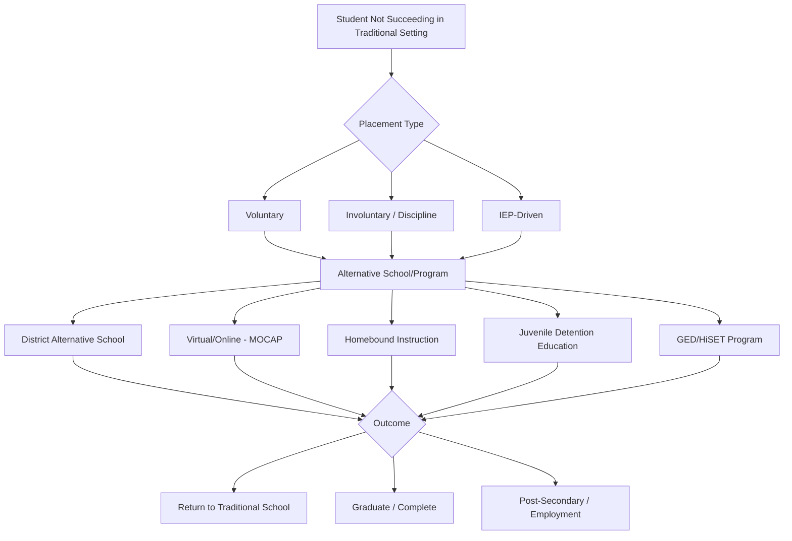

# Alternative Education — Missouri K-12 Education Reference

## Table of Contents
1. Alternative Schools & Programs
2. Missouri Virtual Schools / Online Learning
3. Homebound Instruction
4. Juvenile Detention Education
5. Dropout Prevention & Recovery
6. Credit Recovery
7. GED/HiSET Programs
8. Night School & Adult Education
9. Missouri Options Program
10. Placement Process & Student Rights
11. Accountability & Oversight

---

## 1. Alternative Schools & Programs

### Definition
Alternative education programs serve students who are not succeeding in traditional school settings due to behavioral, academic, social-emotional, or circumstantial factors.

### Types of Alternative Programs in Missouri
| Type | Description | Typical Population |
|------|-----------|-------------------|
| **District alternative school** | Separate facility operated by the district | Students with disciplinary removals, chronic absenteeism, credit deficiency, at-risk factors |
| **District alternative program** | Program within an existing school (school-within-a-school) | At-risk students needing modified structure |
| **Area alternative program** | Shared program serving multiple districts | Smaller districts pooling resources |
| **Contracted alternative** | District contracts with private provider (e.g., Ombudsman, Camelot) | Students needing specialized behavior/academic support |
| **Day treatment / therapeutic** | Clinical setting with educational component | Students with significant mental health or behavioral needs |

### Program Components (Best Practice)
- Small class sizes (typically 10-15:1 ratio)
- Individualized learning plans
- Social-emotional learning integration
- Behavioral supports (often PBIS or therapeutic model)
- Counseling services (individual and group)
- Credit recovery options
- Career exploration and work-based learning
- Transition planning back to traditional school or to graduation
- Family engagement
- Trauma-informed practices

### Missouri Requirements
- Alternative school students are counted in the district's enrollment for funding purposes
- Alternative schools must follow Missouri Learning Standards
- Students must have access to certified teachers
- Students in alternative settings continue to be eligible for special education services (if applicable)
- Districts must report alternative school data through MOSIS

---

## 2. Missouri Virtual Schools / Online Learning

### Missouri Course Access Program (MOCAP)
**Statutory basis:** RSMo 161.670

MOCAP provides Missouri students access to virtual courses from approved providers.

### Key MOCAP Rules
- Available to any Missouri public school student (grades K-12)
- Students may take individual courses or enroll full-time through a virtual provider
- Courses must be taught by Missouri-certified teachers
- Resident district must pay tuition to the virtual provider (per-course or per-pupil)
- Resident district may deny enrollment only for specific reasons enumerated in statute (prior course failure in same subject, lack of prerequisites, IEP team determination)
- Parents must submit notice of intent to enroll in virtual courses
- Virtual providers must be approved by DESE

### Full-Time Virtual Schools
Several DESE-approved full-time virtual schools operate in Missouri:
- Students enroll as residents of their local district but attend virtually
- Virtual school is responsible for instruction and assessment
- Resident district remains responsible for special education, if applicable
- Virtual school students must participate in state assessments (MAP, EOC, ACT)

### District-Operated Virtual Programs
Some districts operate their own virtual academies:
- Offer blended or fully online options
- May serve students who are: homebound, medically fragile, working, parenting, anxious/school-avoidant, credit-deficient, or in unique circumstances
- Must use Missouri-certified teachers
- Curriculum must align to Missouri Learning Standards

### Virtual Learning During Emergencies
COVID-19 established precedent for emergency virtual instruction. DESE guidance on virtual attendance, assessment, and IEP delivery has evolved since 2020. Districts should maintain continuity of learning plans.

---

## 3. Homebound Instruction

### When Used
Homebound instruction is provided when a student cannot attend school due to:
- Medical condition (physical illness, surgery, injury, pregnancy complications)
- Mental health condition (severe anxiety, psychiatric hospitalization follow-up)
- Disciplinary exclusion exceeding 10 days (if not in alternative setting)
- IEP team determination (interim alternative educational setting)

### Requirements
- **Physician documentation** required to initiate homebound services (medical homebound)
- Minimum hours of instruction: DESE guidance recommends a minimum of **5 hours per week** of direct instruction by a certified teacher (some districts provide more)
- Student remains enrolled in their school of record
- Grades and credits earned during homebound count toward graduation
- District is responsible for providing instruction and materials
- Homebound instruction is typically temporary; re-entry plan should be developed

### Special Education Students
- IEP team must convene if homebound placement is considered
- Homebound is a placement on the LRE continuum — it must be justified by the IEP
- District must continue to provide FAPE during homebound
- Related services may continue during homebound as determined by the IEP team

---

## 4. Juvenile Detention Education

### Requirement
Youth in juvenile detention facilities are entitled to educational services. Missouri law and IDEA require:
- Continued access to education during detention/incarceration
- Special education services (if student has an IEP) must continue
- Credit accrual and transfer between detention facility school and home district
- Transition planning for re-entry to community school

### Missouri Division of Youth Services (DYS)
DYS operates residential treatment programs for adjudicated youth:
- Educational programming provided within DYS facilities
- DESE-certified teachers employed or contracted by DYS
- Curriculum aligned to Missouri Learning Standards
- Students continue to earn credits toward graduation
- GED/HiSET preparation available for older students
- Transition services support re-entry to community school or post-secondary options

### Local Juvenile Detention Centers
- Education services vary by facility
- Districts where the facility is located are typically responsible for providing educational services
- Students must receive instruction comparable in quality (not necessarily identical in format) to what they would receive in school
- IEP services must continue; the detaining district (where the facility is located) is responsible

### Re-Entry Challenges
- Credit transfer issues (courses taken in detention may not align to home district's sequence)
- Records transfer delays
- Enrollment barriers (districts may not refuse enrollment based on juvenile record)
- Social-emotional re-adjustment
- Ongoing probation/supervision requirements
- Stigma and relationship rebuilding

---

## 5. Dropout Prevention & Recovery

### Missouri Dropout Data
- Missouri tracks dropout rates by district, school, and subgroup through MOSIS
- Chronic absenteeism (missing 10%+ of school days) is a leading indicator of dropout risk
- ESSA requires reporting of graduation rates (4-year adjusted cohort) and chronic absenteeism

### Risk Factors for Dropping Out
- Chronic absenteeism (strongest predictor)
- Course failure (especially 9th grade)
- Overage for grade level
- Behavioral issues / suspensions
- Pregnancy / parenting
- Family economic hardship
- Homelessness or housing instability
- Substance abuse
- Lack of engagement / belonging
- Unaddressed learning disabilities or mental health needs

### Prevention Strategies (Evidence-Based)
| Strategy | Description |
|----------|-----------|
| **Early Warning Systems (EWS)** | Data dashboards tracking attendance, behavior, course performance (ABC indicators) to flag at-risk students |
| **9th Grade Academies** | Structured transition support for incoming freshmen |
| **Mentoring programs** | Adult or peer mentoring for at-risk students |
| **Check & Connect** | Evidence-based mentoring/monitoring intervention for at-risk youth |
| **Flexible scheduling** | Modified school day, evening programs, weekend school |
| **Wraparound services** | Connecting students to health, housing, food, transportation, child care |
| **Career relevance** | CTE programs, work-based learning, relevance to career goals |
| **Family engagement** | Home visits, family liaison, parent education |
| **Restorative practices** | Alternative to exclusionary discipline |
| **Credit recovery** | Options to make up failed courses |

---

## 6. Credit Recovery

### Definition
Credit recovery allows students to earn credit for courses they previously failed, enabling them to stay on track for graduation.

### Common Models
| Model | Description | Considerations |
|-------|-----------|---------------|
| **Online credit recovery** | Student completes coursework through digital platform (Edgenuity, Apex, Odysseyware, etc.) | Flexible pacing; quality varies; must have certified teacher of record |
| **Summer school** | Traditional classroom instruction during summer | More structured; limited availability; transportation barrier |
| **Extended day/after school** | Additional instructional time during the school year | Teacher availability; student scheduling |
| **Competency-based** | Student demonstrates mastery of standards through assessment/portfolio | Requires robust assessment system; may not be universally accepted |

### Quality Considerations
- Credit recovery courses should maintain academic rigor equivalent to the original course
- Missouri-certified teacher must be involved in instruction and/or assessment
- Board policy should define credit recovery standards and procedures
- Credit recovery grades and credits should be clearly identified on transcripts
- A+ eligibility: credit recovery courses may count toward GPA (district policy)

---

## 7. GED/HiSET Programs

### Missouri High School Equivalency
Missouri uses the **HiSET exam** as its approved high school equivalency test.

### HiSET Details
| Element | Details |
|---------|---------|
| **Subtests** | Language Arts Reading, Language Arts Writing, Mathematics, Science, Social Studies |
| **Passing score** | Minimum 8 on each subtest; minimum 2 on essay; minimum 45 total |
| **Age** | 17+ with documented school withdrawal; 16 with special circumstances |
| **Testing sites** | Missouri Job Centers, community colleges, adult education providers |
| **Diploma** | Issued by DESE upon passing all subtests |
| **Cost** | Per-subtest fees (modest; fee waivers may be available) |

### Adult Education & Literacy (AEL)
DESE administers Missouri's Adult Education and Literacy programs:
- Free classes in reading, writing, math, and HiSET preparation
- English language classes for adults (EL Civics)
- Digital literacy training
- Career readiness preparation
- Services delivered through public schools, community colleges, community-based organizations, and correctional facilities

### Limitations
- HiSET/GED recipients are NOT eligible for A+ Scholarship benefits
- Some employers and colleges may treat HiSET differently than a traditional diploma
- Military branches may have different enlistment policies for GED/HiSET holders

---

## 8. Night School & Adult Education

### Night School / Evening Programs
Some Missouri districts offer evening high school programs for:
- Students who work during the day
- Parenting teens
- Students returning to complete a diploma after dropping out
- Adult learners (age 21+) seeking a regular diploma (if district offers this option)

### Adult Education in Missouri
- DESE-funded AEL programs operate statewide
- Instruction in basic skills, HiSET preparation, English language acquisition, workforce readiness
- Free to participants
- WIOA Title II (Adult Education and Family Literacy Act) is the primary federal funding source
- Programs report to DESE using the National Reporting System (NRS)

---

## 9. Missouri Options Program

### Overview
Some districts have implemented "options" or "flex" programs for non-traditional learners:
- Blended learning (online + face-to-face)
- Self-paced progression
- Flexible attendance schedules
- Career-embedded learning
- Competency-based advancement (where approved by board policy)

### DESE Innovation Waivers
Missouri allows districts to apply for innovation waivers to modify certain requirements (e.g., seat time, school day structure) for innovative programs. Waivers must be approved by DESE and demonstrate how the alternative approach will meet or exceed student outcomes.

---

## 10. Placement Process & Student Rights

### Voluntary vs. Involuntary Placement
| Type | Description | Rights |
|------|-----------|--------|
| **Voluntary** | Student/family chooses alternative program | May withdraw and return to traditional school |
| **Involuntary (discipline)** | District assigns student following disciplinary action | Due process rights apply (RSMo 167.161-171); hearing for long-term removal |
| **IEP-driven** | IEP team determines alternative placement | IEP procedural safeguards; LRE considerations; parent consent |

### Student Rights in Alternative Settings
- Continue to receive FAPE (if eligible for special education)
- Access to certified teachers and aligned curriculum
- Opportunity to earn credits toward graduation
- Due process before involuntary placement
- Periodic review of placement (not indefinite without review)
- Non-discrimination protections (Title VI, Title IX, Section 504, ADA)
- McKinney-Vento protections (if homeless)

### Transition Back to Traditional School
- Districts should have clear re-entry criteria and process
- Re-entry plan developed collaboratively (student, family, sending school, alternative program)
- Support services during transition (mentoring, counseling, academic catch-up)
- No punitive barriers to re-entry (e.g., cannot require "earning" the right to return beyond meeting documented criteria)

---

## 11. Accountability & Oversight

### Reporting
- Alternative school data reported through MOSIS (enrollment, attendance, assessment, discipline, graduation)
- DESE may include alternative school data in the sending district's APR (varies by reporting rules)
- Graduation rates: students who graduate from an alternative program count in their district's cohort graduation rate

### Quality Indicators
- Student progress toward graduation (credit accrual rate)
- Attendance improvement
- Behavioral incident reduction
- Student/family satisfaction
- Post-program outcomes (return to traditional school, graduation, GED, employment, post-secondary enrollment)
- Special education compliance (for students with IEPs)

### DESE Oversight
- DESE does not separately accredit alternative schools (they fall under the district's accreditation)
- DESE monitors compliance with state and federal requirements
- Alternative programs using contracted providers must ensure providers meet all certification, curriculum, and reporting requirements
