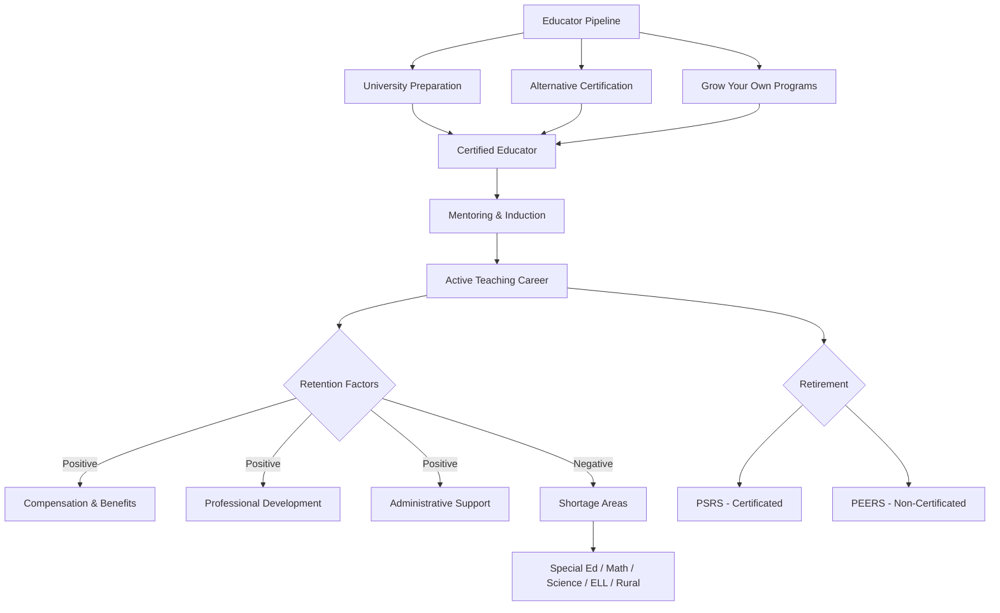

# Educator Workforce — Missouri K-12 Education Reference



## Table of Contents
1. PSRS (Public School Retirement System)
2. PEERS (Public Education Employee Retirement System)
3. Health Insurance & Benefits
4. Compensation & Salary Schedules
5. Teacher Shortages
6. Alternative Certification Pathways
7. Loan Forgiveness Programs
8. Teacher Pipeline & Recruitment
9. Retention Strategies
10. Educator Wellness
11. Labor Relations
12. Substitute Teacher Workforce

---

## 1. PSRS (Public School Retirement System of Missouri)

### Overview
PSRS is the defined benefit pension system for certificated (certified) employees of Missouri public schools: teachers, administrators, counselors, librarians, and other professional staff.

### Membership
- Mandatory for all full-time certificated employees of Missouri public school districts, community colleges, and DESE
- Employees contribute a percentage of salary (member contribution rate set annually by the PSRS Board — historically around 14.5% of salary, shared between employee and employer)

### Retirement Eligibility
| Condition | Requirements |
|-----------|-------------|
| **Normal retirement (Rule of 80)** | Age + years of service = 80 (minimum age 48) |
| **Normal retirement (age/service)** | Age 60 with 5+ years of service |
| **Early retirement** | Age 55 with 5+ years of service (reduced benefit) |
| **25-and-out** | 25 years of service regardless of age (with reduction if under Rule of 80) |

### Benefit Calculation
```
Annual Benefit = Years of Service × Multiplier × Final Average Salary
```
- **Multiplier:** 2.5% per year of service (for most members)
- **Final Average Salary (FAS):** average of the 3 highest consecutive years of salary
- **Maximum benefit:** capped at a percentage of FAS (check current PSRS rules)

### Key Features
- **Vesting:** 5 years of creditable service
- **Cost of Living Adjustment (COLA):** PSRS has provided COLAs historically (not guaranteed; depends on board action and funding status)
- **Disability retirement:** available for members who become disabled
- **Survivor benefits:** death benefits for surviving spouse/dependents
- **Service purchase:** members may purchase credit for certain types of prior service (military, out-of-state teaching, etc.)
- **No Social Security:** most PSRS members do NOT participate in Social Security for their school employment (Missouri is a non-Social Security state for public school employees)

### WEP and GPO
Because PSRS members typically do not pay Social Security:
- **Windfall Elimination Provision (WEP):** may reduce Social Security benefits earned from other employment
- **Government Pension Offset (GPO):** may reduce spousal/survivor Social Security benefits
- Important financial planning consideration for educators

---

## 2. PEERS (Public Education Employee Retirement System)

### Overview
PEERS is the defined benefit pension for non-certificated (classified) employees of Missouri public schools: paraprofessionals, bus drivers, custodians, food service, office staff, and other support staff.

### Key Differences from PSRS
| Feature | PSRS (Certificated) | PEERS (Non-Certificated) |
|---------|---------------------|-------------------------|
| **Membership** | Certificated staff | Non-certificated staff |
| **Multiplier** | 2.5% | 1.61% |
| **Contribution rate** | ~14.5% | ~6.86% (employee) + employer match |
| **Social Security** | NOT covered | COVERED (PEERS members DO participate in Social Security) |
| **Normal retirement** | Rule of 80 or age 60/5 | Same: Rule of 80 or age 60/5 |

### PEERS Membership
Mandatory for non-certificated employees working 20+ hours/week for at least 5 months. Some seasonal or part-time employees may not meet the threshold.

---

## 3. Health Insurance & Benefits

### Missouri Consolidated Health Care Plan (MCHCP)
MCHCP does NOT cover K-12 public school employees (it covers state employees and some other public entities). Missouri school districts independently provide health insurance.

### District-Provided Health Insurance
- Each district selects and administers its own health insurance plan(s)
- Common approaches: self-insured, fully insured, or health insurance pools/cooperatives
- Plans typically include: medical, dental, vision, life insurance, disability
- Employee contribution varies widely by district (from fully employer-paid to significant cost-sharing)
- Dependent coverage available but often at higher employee cost

### Other Benefits
- **Sick leave:** accumulated per board policy (no statewide minimum for school employees)
- **Personal leave:** varies by district
- **Bereavement leave:** varies by district
- **FMLA:** applicable to districts with 50+ employees (12 weeks unpaid leave for qualifying reasons)
- **Workers' compensation:** required for all employees (Missouri state law)
- **403(b) retirement savings:** supplemental tax-deferred savings (district may or may not match)
- **Section 125 (cafeteria) plans:** pre-tax premium payments, FSA, dependent care FSA

---

## 4. Compensation & Salary Schedules

### Missouri Salary Landscape
- Missouri teacher salaries historically rank below the national average
- Minimum teacher salary: RSMo 163.172 establishes a minimum starting salary (adjusted periodically by the legislature — verify current amount)
- Most districts use step-and-lane salary schedules (based on years of experience and education level)

### Salary Schedule Structure
| Lane | Education Level |
|------|---------------|
| **BS/BA** | Bachelor's degree |
| **BS+15/30** | Bachelor's + additional credit hours |
| **MA/MS** | Master's degree |
| **MA+15/30** | Master's + additional credit hours |
| **Ed.S.** | Education Specialist |
| **Ed.D./Ph.D.** | Doctorate |

Steps increase with years of experience (typically 15-30 steps).

### Extra-Duty Pay
- Coaching stipends (vary significantly by sport, level, and district)
- Activity sponsor stipends (academic bowl, yearbook, drama, etc.)
- Department chair/team leader supplements
- National Board Certification supplement (RSMo 168.345 — up to $2,000/year)
- Hard-to-staff area supplements (some districts)
- Summer school and extended year pay

---

## 5. Teacher Shortages

### Shortage Areas in Missouri
DESE identifies teacher shortage areas annually for federal Teacher Loan Forgiveness and TEACH Grant purposes. Persistent shortage areas include:
- **Special education** (all levels)
- **Mathematics** (secondary)
- **Science** (secondary — physics, chemistry especially)
- **English Language Learners (ELL/ESL)**
- **Career and Technical Education (CTE)**
- **School counseling**
- **School psychology**
- **World languages**
- **Early childhood**
- **Rural districts** (most content areas)

### Contributing Factors
- Low compensation relative to other professions requiring similar education
- High workload and accountability pressure
- Student behavior challenges and safety concerns
- Lack of professional autonomy
- Inadequate administrative support
- Cost of certification and preparation
- Retirement eligibility (experienced teachers leaving)
- Career changers not pursuing teaching due to barriers to entry
- COVID-19 accelerated burnout and exits

### Measuring Shortages
- DESE's annual Teacher Vacancy Survey
- Unfilled positions data reported through Core Data
- Emergency/temporary certifications issued (indicator of shortage)
- Class size increases and program cuts in shortage areas

---

## 6. Alternative Certification Pathways

### Missouri Alternative Routes to Certification
| Pathway | Description | Requirements |
|---------|-----------|-------------|
| **American Board for Certification of Teacher Excellence (ABCTE)** | Competency-based certification | Bachelor's degree, pass ABCTE content exam, professional teaching knowledge exam, background check |
| **Teach for America (TFA)** | Two-year placement with certification pathway | Bachelor's degree, TFA selection, intensive summer training, concurrent enrollment in certification program |
| **Temporary Authorization Certificate (TAC)** | District-specific, DESE-approved | Bachelor's degree, enrolled in certification coursework, district sponsorship |
| **CTE Certificate of License to Teach** | For industry professionals entering CTE teaching | Industry experience (2,000+ hours), enrollment in education coursework |
| **Visiting Scholar** | Short-term authorization for subject matter experts | Advanced degree or expertise in the field, district nomination |
| **Missouri Adjunct Teaching Certificate** | For professionals teaching part-time | Bachelor's degree + expertise in the field, district sponsorship |

### Grow Your Own Programs
Some Missouri districts are developing "grow your own" teacher pipeline programs:
- Paraprofessional-to-teacher pathways (tuition assistance for paras earning education degrees)
- High school teaching cadet programs (Future Educators, Educators Rising)
- Community partnerships with local universities
- Residency programs (year-long student teaching with mentor, stipend, and certification)

---

## 7. Loan Forgiveness Programs

### Federal Programs
| Program | Eligibility | Benefit |
|---------|-----------|---------|
| **Public Service Loan Forgiveness (PSLF)** | 10 years of qualifying payments while employed full-time by a public school district | Remaining federal loan balance forgiven (tax-free) |
| **Teacher Loan Forgiveness** | 5 consecutive years teaching in a low-income school (Title I eligible) | Up to $17,500 forgiven (math, science, special ed) or $5,000 (other subjects) |
| **TEACH Grant** | Serve in high-need field at low-income school for 4 years within 8 years of completing program | Up to $4,000/year during preparation (converts to loan if service obligation not met) |
| **Income-Driven Repayment (IDR) Forgiveness** | 20-25 years of IDR payments | Remaining balance forgiven (may be taxable) |
| **Perkins Loan Cancellation** | Teaching in shortage areas or low-income schools | Up to 100% cancellation over 5 years |

### State Programs
Missouri has periodically offered state-level loan forgiveness or scholarship programs for teachers in shortage areas. Availability varies by legislative appropriation. Check MDHEWD for current programs.

---

## 8. Teacher Pipeline & Recruitment

### University-Based Preparation
- Missouri has 30+ DESE-approved educator preparation programs (universities and alternative providers)
- Programs must meet DESE's Educator Preparation Program Standards
- EPP (Educator Preparation Program) graduates must pass: content assessment (MoCA/Praxis), performance assessment (edTPA/MoPTA), and basic skills (MoGEA or equivalent)

### Recruitment Strategies
- Competitive starting salaries and benefits
- Signing bonuses for hard-to-staff positions
- Housing assistance (some rural districts)
- Relocation stipends
- Partnership with university teacher preparation programs
- Targeted recruitment at HBCU and HSI institutions
- Career fair participation (MSTA, MNEA, university job fairs)
- Social media and online recruitment
- International teacher recruitment (J-1 visa programs)
- Military-to-teaching programs (Troops to Teachers)
- Paraprofessional-to-teacher pathways

---

## 9. Retention Strategies

### Evidence-Based Retention Practices
- **Mentoring and induction:** structured multi-year support for new teachers (not just year 1)
- **Administrative support:** responsive, respectful, and supportive building leadership
- **Professional development:** meaningful, teacher-directed, job-embedded PD
- **Compensation improvement:** competitive salary and benefits; addressing stagnation at mid-career
- **Working conditions:** manageable class sizes, adequate planning time, safe facilities, functional technology
- **Teacher voice:** including teachers in school decision-making
- **Career pathways:** teacher leader roles, instructional coaching, department chairs, curriculum writing
- **Recognition:** meaningful, authentic recognition of teacher contributions
- **Work-life balance:** reasonable expectations for after-hours work, meeting load, duties

---

## 10. Educator Wellness

See `references/health-wellness.md` (Staff Wellness section) for detailed information on secondary trauma and burnout.

### Key Support Structures
- Employee Assistance Programs (EAP)
- Wellness committees (building and district level)
- Mental health days (some districts have begun explicitly designating these)
- Flexible leave policies
- Peer support networks
- Administrative practices that protect planning time and reduce meeting overload

---

## 11. Labor Relations

### Missouri Law (RSMo 105.500-105.530)
- Missouri is a **permissive collective bargaining** state (not mandatory)
- School districts are NOT required to negotiate with teacher unions/associations
- Teachers have the right to organize and join unions/associations
- Teachers DO NOT have the right to strike (RSMo 105.530)
- Many districts engage in "meet and confer" or collaborative relationships with teacher organizations
- Teacher organizations in Missouri: MNEA (Missouri National Education Association), MSTA (Missouri State Teachers Association), AFT-Missouri

### At-Will Employment
- Non-tenured teachers are essentially at-will during their probationary period (may be non-renewed without cause)
- Tenured teachers have due process protections (RSMo 168.114)
- Non-certificated staff are generally at-will employees (unless board policy or contract provides otherwise)

---

## 12. Substitute Teacher Workforce

### Persistent Challenges
- Chronic substitute shortages across Missouri (urban, suburban, and rural)
- Low daily rates discourage participation
- Lack of benefits for short-term substitutes
- Inconsistent training and support
- Increasing complexity of classroom management

### Strategies to Address Substitute Shortages
- Increase daily pay rates (competitive analysis with neighboring districts)
- Provide long-term substitute benefits (health insurance, pro-rated)
- Streamline substitute certification process (DESE substitute certificate requires only 60 credit hours)
- Build a dedicated substitute pool (recruit retirees, community members, college students)
- Partner with substitute management companies (Kelly Education, Swing Education, etc.)
- Internal coverage systems (admin coverage rotation, study hall consolidation, combined classes as last resort)
- Virtual substitute options (pre-recorded lessons supervised by a monitor — limited application)
- Retired teacher substitute programs (PSRS allows limited substitute teaching without affecting retirement benefits — check current earnings limits)
