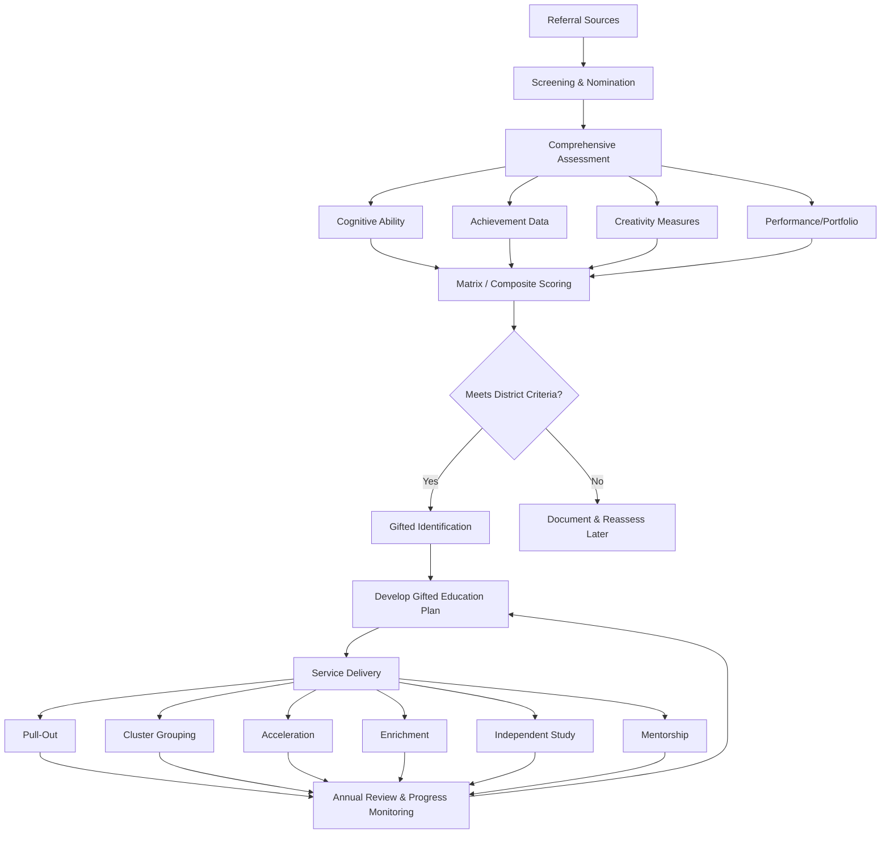

# Gifted & Talented Education — Missouri K-12 Reference

<!-- Canonical source for: gifted education, talented students, gifted identification, acceleration, twice-exceptional (2e), gifted IQ, enrichment, pull-out gifted, cluster grouping, Iowa Acceleration Scale, RSMo 162.675 -->
<!-- Cross-references: roles/specialists.md (specialist caseloads), compliance/equity-access.md (equity in identification), references/programs/special-populations.md (underrepresented groups) -->
<!-- Last content review: 2026-03 -->

## Table of Contents
- [1. Missouri Gifted Definition (RSMo 162.675-162.695)](#1-missouri-gifted-definition-rsmo-162675-162695)
- [2. Identification Process](#2-identification-process)
  - [Referral Sources](#referral-sources)
  - [Assessment Tools](#assessment-tools)
  - [Matrix/Portfolio Approach](#matrixportfolio-approach)
- [3. Underrepresented Populations in Gifted Programs](#3-underrepresented-populations-in-gifted-programs)
- [4. Service Delivery Models](#4-service-delivery-models)
- [5. Acceleration Policies](#5-acceleration-policies)
- [6. Parent Rights in Gifted Education](#6-parent-rights-in-gifted-education)
- [7. Funding](#7-funding)
- [8. Gifted Coordinator/Teacher Qualifications](#8-gifted-coordinatorteacher-qualifications)
- [9. Twice-Exceptional (2e) Students](#9-twice-exceptional-2e-students)
- [10. Social-Emotional Needs of Gifted Students](#10-social-emotional-needs-of-gifted-students)
- [11. Related Resources](#11-related-resources)

---

## 1. Missouri Gifted Definition (RSMo 162.675-162.695)

Missouri statute defines **gifted children** as students who exhibit high performance capability in intellectual, creative, or artistic areas, possess an unusual leadership capacity, or excel in specific academic fields, and who require services or activities not ordinarily provided by the school in order to fully develop those capabilities.

Key statutory provisions under RSMo 162.675-162.695:
- **162.675** -- Definitions; "gifted children" means those identified as possessing demonstrated or potential ability that gives evidence of high performance in areas such as intellectual, creative, specific academic, or leadership ability
- **162.680** -- Each district **may** establish a program for gifted education; DESE provides guidelines and technical assistance
- **162.685** -- State funding provisions for approved gifted programs
- **162.690** -- DESE shall develop and distribute guidelines covering identification procedures, program standards, and teacher qualifications
- **162.695** -- Annual reporting requirements; districts with approved programs must submit data to DESE on students served, services provided, and program outcomes

**Important distinction:** Missouri gifted education is **permissive, not mandatory**. Districts are encouraged but not required to offer gifted programs. However, districts that do operate programs must follow DESE guidelines and meet reporting requirements.

---

## 2. Identification Process

### Referral Sources

Any of the following may initiate a referral for gifted evaluation:
- **Parents/guardians** -- written request to the school
- **Teachers** -- classroom observation of advanced performance or behavior
- **Counselors** -- standardized test data, behavioral observations
- **Peers** -- peer nomination (particularly for leadership)
- **Self-referral** -- student self-nomination (especially at secondary level)
- **Community members** -- coaches, tutors, mentors
- **Universal screening** -- district-wide testing at designated grade levels (recommended practice to reduce bias)

**Best practice:** Districts should use **universal screening** at a minimum of one elementary grade level to cast a wide net and reduce reliance on teacher/parent nominations, which can carry implicit bias.

### Assessment Tools

| Domain | Common Instruments | What It Measures |
|--------|--------------------|------------------|
| **Cognitive Ability** | CogAT, WISC-V, NNAT-3, KBIT-2 | General intellectual ability, reasoning |
| **Achievement** | MAP scores, Iowa Assessments, STAR, district benchmarks | Academic performance relative to grade level |
| **Creativity** | Torrance Tests of Creative Thinking (TTCT), Scales for Rating the Behavioral Characteristics of Superior Students (SRBCSS) | Divergent thinking, fluency, originality, elaboration |
| **Performance/Portfolio** | Student work samples, auditions, exhibitions, project-based evidence | Domain-specific talent in art, music, writing, STEM |
| **Leadership** | Teacher/peer rating scales, SRBCSS leadership subscale | Organizational ability, influence, responsibility |

**No single test should determine eligibility.** Missouri DESE guidelines recommend multiple measures across multiple domains.

### Matrix/Portfolio Approach

Missouri districts commonly use a **matrix scoring system** that combines data from multiple sources:

1. **Assign weighted scores** across assessment categories (e.g., cognitive 30%, achievement 25%, creativity 20%, performance 15%, teacher rating 10%)
2. **Establish a composite threshold** -- students meeting or exceeding the cutoff qualify
3. **Portfolio option** -- for students who score near the threshold, a portfolio of work samples, awards, and documented performance can supplement quantitative data
4. **Multiple pathways** -- a student may qualify through exceptional strength in one domain (e.g., top 2% cognitive) even if other scores are moderate, depending on district policy

Districts must document the identification process and maintain records for DESE reporting.

---

## 3. Underrepresented Populations in Gifted Programs

Gifted programs nationally and in Missouri disproportionately underidentify students from certain groups. Districts should actively address barriers.

| Population | Barriers to Identification | Recommended Strategies |
|------------|---------------------------|----------------------|
| **English Language Learners (ELL)** | Language-loaded tests depress scores; cultural differences in expressing giftedness | Use nonverbal measures (NNAT-3, Naglieri); assess in native language when possible; train teachers to recognize giftedness masked by language acquisition |
| **Students with Disabilities (Twice-Exceptional)** | Disability masks giftedness; giftedness compensates for disability, creating "average" performance | Evaluate cognitive potential separately from achievement; look for uneven profiles; see [Section 9](#9-twice-exceptional-2e-students) |
| **Low-Income Students** | Limited access to enrichment; fewer parent nominations; test prep gaps | Universal screening; use local norms alongside national norms; talent development programs as a bridge; fee waivers for gifted activities |
| **Racial/Ethnic Minorities** | Implicit bias in teacher referrals; culturally biased assessments; historical exclusion | Mandate universal screening; use culturally responsive assessment tools; train staff on recognizing giftedness across cultures; set representation goals; analyze referral data by demographics annually |

**Equity checkpoint:** Districts should compare gifted program demographics to overall enrollment demographics annually. Significant underrepresentation should trigger a review of identification practices.

---

## 4. Service Delivery Models

Missouri districts may use one or more of the following service delivery models:

| Model | Description | Best For | Considerations |
|-------|-------------|----------|----------------|
| **Pull-Out** | Students leave the general classroom for gifted instruction with a gifted specialist, typically 1-5 hours per week | Elementary; districts with a dedicated gifted teacher | Coordination with classroom teacher needed; students miss regular instruction |
| **Cluster Grouping** | 5-8 identified gifted students placed in the same general education classroom with a teacher trained in gifted strategies | All grade levels; cost-effective | Requires trained classroom teacher; avoid clustering all high achievers in one room |
| **Subject Acceleration** | Student advances to a higher grade level for one or more subjects (e.g., 4th grader takes 6th-grade math) | Students with domain-specific strengths | Requires scheduling flexibility; plan for social needs |
| **Grade Acceleration (Skipping)** | Student moves to a higher grade level entirely | Students advanced across all domains with social-emotional readiness | Use Iowa Acceleration Scale for decision-making; see [Section 5](#5-acceleration-policies) |
| **Enrichment** | Extended or deepened curriculum within the regular classroom or through supplemental programs | All identified students; good complement to other models | Should go beyond "more work"; focus on depth, complexity, and creativity |
| **Independent Study** | Student pursues a self-directed project under teacher/mentor guidance | Secondary; highly motivated students | Requires clear goals, timelines, and regular check-ins |
| **Mentorship** | Student is paired with a community expert or professional in their area of interest | Secondary; career-connected learning | Vetting of mentors required; align with district volunteer policies |

**Recommended practice:** Combine multiple models to create a continuum of services. A student might participate in cluster grouping daily, pull-out enrichment weekly, and subject acceleration in their strongest area.

---

## 5. Acceleration Policies

Acceleration is one of the most research-supported interventions for gifted students. Missouri does not have a statewide acceleration policy, so districts set their own guidelines.

### Types of Acceleration

| Type | Description | Key Considerations |
|------|-------------|--------------------|
| **Early Kindergarten Entrance** | Admitting a child before the age cutoff based on demonstrated readiness | Cognitive, academic, social-emotional, and physical readiness assessments |
| **Grade Skipping** | Advancing a student one or more full grade levels | Use Iowa Acceleration Scale; consider all developmental domains |
| **Subject Acceleration** | Advancing in one content area while remaining with age peers otherwise | Most common form; scheduling logistics; transcript documentation |
| **Curriculum Compacting** | Pre-testing to eliminate mastered content, replacing it with advanced material | Requires trained teacher; good formative assessment practices |
| **Dual Enrollment** | High school student takes college courses for simultaneous credit | Missouri statute (RSMo 167.223) supports dual credit; see [students reference](../roles/students.md) |
| **AP/IB Courses** | Advanced Placement or International Baccalaureate coursework | Available at participating Missouri high schools |
| **Early College Entrance** | Student enters college full-time before completing high school | Rare; requires careful social-emotional evaluation |

### Iowa Acceleration Scale (IAS)

The **Iowa Acceleration Scale** is the most widely used research-based tool for making whole-grade acceleration decisions. It evaluates:
- Academic ability and achievement
- School factors (grade-level class size, receiving teacher attitude)
- Developmental factors (physical size, motor coordination, age)
- Interpersonal skills and attitude
- Prior academic history
- Results in a numerical score with recommended action (acceleration recommended, further discussion needed, or not recommended)

Districts considering grade acceleration should use the IAS or a comparable structured decision-making framework rather than relying on informal judgment.

---

## 6. Parent Rights in Gifted Education

While Missouri gifted education does not carry the same federal mandate as special education (IDEA), parents have important rights:

- **Referral** -- Parents may request a gifted evaluation at any time by submitting a written request to the school; the district should respond within a reasonable timeframe (typically 30 school days)
- **Evaluation information** -- Parents have the right to be informed about what assessments will be used and to receive a written summary of results
- **Participation** -- Parents should be included in the development of their child's gifted education plan, including goal-setting and service delivery decisions
- **Access to records** -- Under [FERPA](../compliance/equity-access.md), parents may review all educational records, including gifted assessment data
- **Appeals** -- If a parent disagrees with an identification decision, they may request a review; districts should have a documented appeals process that includes:
  - Written notice of the decision with supporting rationale
  - Opportunity to submit additional evidence (e.g., outside testing)
  - Review by a committee that includes at least one gifted education professional
  - Written outcome of the appeal within 30 school days
- **Withdrawal** -- Parents may withdraw their child from gifted services at any time with written notice

**Note:** Because gifted education is not covered by IDEA, there is no equivalent of due process hearings or state complaints. Parent advocacy is critical. Encourage parents to document all requests and communications in writing.

---

## 7. Funding

### State Gifted Education Funding

Missouri provides state funding for approved gifted education programs through the foundation formula:
- Districts with DESE-approved gifted programs receive **additional weighted funding** for identified gifted students
- The state gifted education grant requires districts to submit an annual program plan and end-of-year report
- Funding levels have historically been modest; districts supplement with local funds and federal Title II or Title IV-A dollars where allowable

### Local District Allocation

- Districts determine how to allocate gifted funds (staffing, materials, professional development, contracted services)
- Common expenditures include: gifted coordinator salary, pull-out teacher FTE, assessment instruments, enrichment materials, competition fees (e.g., Odyssey of the Mind, Science Olympiad, MATHCOUNTS), and professional development for classroom teachers
- Districts must track and report expenditures separately for gifted program funds

**Advocacy note:** Gifted education funding in Missouri is significantly lower per-pupil than special education funding. Parent and educator advocacy at the district and legislative level is important for maintaining and expanding programs.

---

## 8. Gifted Coordinator/Teacher Qualifications

Missouri DESE sets expectations for educators serving gifted students:

| Role | Qualifications |
|------|---------------|
| **Gifted Education Coordinator** | Valid Missouri teaching certificate; completion of DESE-approved gifted education coursework or graduate certificate/degree in gifted education; experience in gifted programming |
| **Gifted Pull-Out/Resource Teacher** | Valid Missouri teaching certificate; gifted education endorsement or completion of approved coursework (minimum 12 graduate hours in gifted education recommended) |
| **Cluster Classroom Teacher** | Valid Missouri teaching certificate; professional development in gifted strategies (differentiation, compacting, depth and complexity); ongoing PD recommended |
| **Content Mentor** | Subject-matter expertise; district volunteer clearance; orientation to gifted learner characteristics |

**Professional development areas for gifted educators:**
- Characteristics and identification of gifted learners
- Differentiated instruction and curriculum compacting
- Social-emotional needs of gifted students
- Culturally responsive gifted education
- Twice-exceptional learner strategies
- Acceleration practices and policies
- Creativity development and assessment

---

## 9. Twice-Exceptional (2e) Students

Twice-exceptional students are those who are **both gifted and have one or more disabilities** (learning disabilities, ADHD, autism spectrum, sensory impairments, emotional/behavioral disorders, or other conditions).

### Identification Challenges

- **Masking effect:** giftedness compensates for the disability, producing average performance that masks both exceptionalities
- **Misidentification:** behaviors from giftedness (e.g., boredom, intensity) may be attributed solely to the disability, or disability-related struggles may obscure gifted potential
- **Uneven profiles:** significant discrepancies between cognitive ability and achievement, or between different cognitive subtests, are a hallmark of 2e learners
- **Assessment limitations:** standardized tests may not capture the full picture; comprehensive evaluation across cognitive, achievement, adaptive, and behavioral domains is essential

### Dual IEP/Gifted Plan

When a student qualifies for both special education services (IEP or 504 plan) and gifted education services:
- **Coordinate both plans** -- the IEP team and gifted coordinator should collaborate to ensure goals and accommodations do not conflict
- **Address strengths AND needs** -- the IEP should include goals that leverage the student's gifted strengths, and the gifted plan should include accommodations for the disability
- **Avoid removing gifted services as an intervention** -- pulling a 2e student from gifted programming because they are "struggling" in general education removes their primary source of engagement and motivation
- **Annual review** -- both plans should be reviewed simultaneously when possible, with all relevant professionals and the parents present

### Accommodation Strategies for 2e Learners

| Strategy | Purpose |
|----------|---------|
| Assistive technology (text-to-speech, speech-to-text) | Bypass disability barriers while accessing advanced content |
| Extended time on assessments | Reduce disability-related time pressure without limiting intellectual challenge |
| Alternative output formats | Allow students to demonstrate knowledge through preferred modality (oral, visual, digital) |
| Flexible pacing | Permit acceleration in strength areas while allowing additional time in challenge areas |
| Executive function supports | Visual schedules, checklists, and organizational tools for students with ADHD or LD |
| Counseling/social skills groups | Address social-emotional needs specific to the 2e experience |

---

## 10. Social-Emotional Needs of Gifted Students

Gifted students face distinct social-emotional challenges that educators and parents should understand:

### Perfectionism
- **Healthy vs. unhealthy perfectionism:** healthy perfectionism drives high standards; unhealthy perfectionism creates paralysis, fear of failure, and avoidance of challenge
- **Signs:** refusal to turn in "imperfect" work, meltdowns over mistakes, procrastination, reluctance to try new things
- **Strategies:** normalize mistakes as learning; praise effort and process over product; model imperfection; teach growth mindset explicitly

### Asynchronous Development
- Gifted students often develop unevenly -- a child may read at a 10th-grade level but have the emotional regulation of a typical 7-year-old
- This mismatch creates frustration for the student, confusion for teachers, and unrealistic expectations from adults
- **Strategies:** set expectations based on the developmental area (academic expectations can be advanced; behavioral expectations should match emotional age); provide age-appropriate social opportunities alongside intellectual peers

### Peer Relationships
- Gifted students may feel "different" from age peers and struggle to find intellectual equals
- Risk of social isolation, bullying (sometimes for being "too smart"), or hiding abilities to fit in
- **Strategies:** connect with intellectual peers through gifted programming, competitions, or interest-based groups; teach social skills explicitly when needed; validate the experience of feeling different

### Overexcitabilities (Dabrowski)
Gifted individuals may exhibit heightened intensities in five areas:
- **Psychomotor** -- high energy, rapid speech, need for movement
- **Sensual** -- heightened sensitivity to sensory input (sounds, textures, tastes)
- **Intellectual** -- deep curiosity, love of learning, questioning
- **Imaginational** -- vivid imagination, daydreaming, creative play
- **Emotional** -- intense feelings, strong empathy, heightened reactions

These are not disorders but characteristics of gifted development. Educators should understand overexcitabilities to avoid misinterpreting them as behavioral problems or symptoms of ADHD.

### Existential Concerns
- Gifted students may grapple with existential questions (meaning of life, death, justice, inequality) earlier than age peers
- This can cause anxiety, depression, or a sense of isolation
- **Strategies:** validate their questions; provide access to philosophical and ethical discussions; connect with a school counselor who understands gifted development

---

## 11. Related Resources

| Resource | Path | Relevance |
|----------|------|-----------|
| Student rights and graduation requirements | [roles/students.md](../roles/students.md) | Dual credit, graduation pathways, academic planning |
| Specialist caseload and evaluation guidance | [roles/specialists.md](../roles/specialists.md) | Evaluation procedures, service delivery models |
| Equity and access compliance | [compliance/equity-access.md](../compliance/equity-access.md) | FERPA, nondiscrimination, equitable access |
| English Learners reference | [programs/english-learners.md](english-learners.md) | ELL identification, accommodations, overlap with gifted ELL |
| Special populations | [programs/special-populations.md](special-populations.md) | Low-income, foster care, and other underrepresented groups |
| Special needs index | [special-needs/INDEX.md](../special-needs/INDEX.md) | IEP process, disability-specific guides relevant to 2e students |
| Funding and programs | [compliance/funding-programs.md](../compliance/funding-programs.md) | Title II, Title IV-A, state funding formula |
| Parent guide (Spanish) | [guia-padres-espanol.md](../guia-padres-espanol.md) | Spanish-language parent rights and advocacy guidance |
| Calculators | [scripts/calculators.md](../../scripts/calculators.md) | Graduation credit audit, funding estimators |
