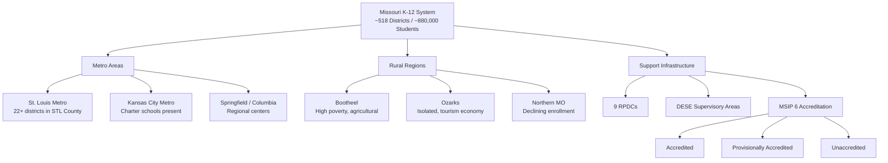

# Missouri Districts & Regions — Missouri K-12 Education Reference

## Table of Contents
1. Missouri District Landscape
2. District Types & Organization
3. RPDC Regions
4. Metro Areas
5. Rural Regions
6. County-District Code System
7. Supervisory Areas
8. Demographic Profiles by Region
9. District Size Distribution
10. MSIP 6 Accreditation Status
11. Key Data Sources for District Information
12. Regional Challenges & Opportunities

---

## 1. Missouri District Landscape

### By the Numbers (Approximate — verify current data on DESE MCDS portal)
| Metric | Value |
|--------|-------|
| Total public school districts | ~518 |
| Total public schools | ~2,400 |
| Total student enrollment | ~880,000 |
| Total certified staff | ~69,000 |
| Number of counties | 114 (+1 independent city: St. Louis) |
| Charter school districts | Limited to St. Louis City, Kansas City, and formerly unaccredited districts |

### Missouri has among the highest number of school districts in the nation
This is a legacy of Missouri's historical pattern of small, community-based districts. The large number creates challenges for efficiency but also reflects community attachment to local schools.

---

## 2. District Types & Organization

### Classification
| Type | Description | Examples |
|------|-----------|---------|
| **K-12 district** | Full-service district operating elementary and secondary schools | Most Missouri districts |
| **Elementary-only (K-8)** | District operating only elementary grades; sends secondary students to another district | Some rural districts |
| **High school district** | District operating only high school; receives students from elementary-only districts | Rare in Missouri |
| **K-8 + tuition-out** | Elementary district that pays tuition for students to attend high school in another district | Several rural arrangements |
| **Charter school district** | Public charter school authorized under RSMo 160.400-425 | St. Louis, Kansas City |
| **Special school district** | Serves students with disabilities across multiple districts | Special School District of St. Louis County (SSD) |

### Special School District of St. Louis County (SSD)
Unique entity in Missouri: a county-wide special school district providing special education services to 22 member districts in St. Louis County. SSD employs special education teachers and related service providers who work in member district schools.

### Cooperative Arrangements
Many small districts form cooperatives for:
- Special education services (SELPA-like cooperatives)
- Area Career Centers (shared CTE)
- Shared personnel (superintendent, counselor, therapists)
- Purchasing (insurance, supplies, fuel)
- Professional development

---

## 3. RPDC Regions

### Regional Professional Development Centers
Missouri's nine RPDCs serve all districts with free and low-cost professional development:

| RPDC | Region | Approximate Counties Served |
|------|--------|---------------------------|
| **Heart of Missouri RPDC** | Central Missouri | Boone, Callaway, Cole, Cooper, Howard, Moniteau, Morgan, Osage, and surrounding |
| **Central RPDC** | Mid-Missouri (south/central) | Camden, Dallas, Hickory, Laclede, Maries, Miller, Phelps, Pulaski, and surrounding |
| **Northwest RPDC** | Northwestern Missouri | Andrew, Atchison, Buchanan, Clinton, DeKalb, Gentry, Harrison, Holt, Nodaway, Platte, and surrounding |
| **Southwest RPDC** | Southwestern Missouri | Barry, Christian, Dade, Greene, Lawrence, McDonald, Newton, Polk, Stone, Taney, Webster, and surrounding |
| **Southeast RPDC** | Southeastern Missouri (Bootheel) | Bollinger, Butler, Cape Girardeau, Carter, Dunklin, Mississippi, New Madrid, Pemiscot, Perry, Ripley, Scott, Stoddard, Wayne, and surrounding |
| **Northeast RPDC** | Northeastern Missouri | Adair, Clark, Knox, Lewis, Lincoln, Macon, Marion, Monroe, Pike, Ralls, Randolph, Shelby, and surrounding |
| **Kansas City Metro RPDC** | Greater Kansas City | Clay, Jackson, Platte, Cass, and surrounding metro counties |
| **St. Louis Metro RPDC** | Greater St. Louis | St. Louis City, St. Louis County, St. Charles, Jefferson, Franklin, Warren, and surrounding |
| **Ozarks RPDC** | Ozarks region | Douglas, Howell, Oregon, Ozark, Shannon, Texas, Wright, and surrounding |

---

## 4. Metro Areas

### St. Louis Metropolitan Area
- **St. Louis City** (independent city — not in a county) — St. Louis Public Schools (SLPS); charter schools present
- **St. Louis County** — 22+ school districts; Special School District (SSD) provides county-wide special education
- **St. Charles County** — rapidly growing; multiple high-performing districts
- **Jefferson County** — suburban to rural gradient; multiple districts
- **Franklin County** — suburban to rural
- **Characteristics:** significant district fragmentation in St. Louis County (legacy of separate municipalities); wide variation in wealth, demographics, and achievement across districts; charter schools in St. Louis City

### Kansas City Metropolitan Area
- **Kansas City (KCMO)** — Kansas City Public Schools; charter schools present
- **Clay County** — Liberty, North Kansas City, and other districts
- **Jackson County** — multiple districts including Blue Springs, Lee's Summit, Independence, Grandview, Raytown, Center
- **Platte County** — Park Hill, Platte County R-III
- **Cass County** — Raymore-Peculiar, Belton, Harrisonville
- **Characteristics:** Kansas City Public Schools historically unaccredited (now provisionally accredited); strong suburban districts surrounding the core city; charter school presence in KCMO

### Springfield Area
- **Springfield R-XII** — largest outstate district
- **Greene County** — multiple surrounding districts
- **Southwest Missouri hub** for education, healthcare, commerce
- **Missouri State University** — significant educator preparation pipeline

### Columbia Area
- **Columbia Public Schools** — mid-sized urban district
- **Boone County** — home to University of Missouri (Mizzou)
- **Strong university-school partnerships**

### St. Joseph, Joplin, Cape Girardeau
Mid-sized regional centers with anchor school districts serving as education hubs for surrounding rural areas.

---

## 5. Rural Regions

### The Bootheel (Southeast Missouri)
- Missouri's poorest region; high poverty, low educational attainment
- Agricultural economy (cotton, soybeans, rice)
- Majority-minority demographics in some communities
- Small districts with limited resources
- Significant educational access challenges
- High needs for Title I, McKinney-Vento, ELL, and workforce development

### Ozarks Region
- Geographically isolated; mountainous terrain
- Tourism-dependent economy (Branson, Table Rock Lake)
- Very small districts (some under 100 students)
- Teacher recruitment and retention extremely challenging
- Limited broadband infrastructure
- Strong community identity centered on schools
- Four-day school weeks common

### Northern Missouri
- Agricultural economy (corn, soybeans, cattle)
- Declining enrollment in many districts
- Aging population
- Consolidation pressures
- Limited access to specialized services (mental health, related services, CTE)
- Strong FFA and agricultural education tradition

### Central Missouri (outside Columbia)
- Mix of small towns and rural areas
- Fort Leonard Wood (significant military population in Pulaski County)
- Lake of the Ozarks region (tourism economy)
- Several mid-sized districts as regional hubs

---

## 6. County-District Code System

### Format
Missouri uses a 6-digit county-district code: `CCC-DDD`
- **CCC:** 3-digit county code (001-115; St. Louis City = 115)
- **DDD:** 3-digit district code within the county

### Example Codes
| Code | District |
|------|---------|
| 096-109 | Springfield R-XII (Greene County) |
| 115-115 | St. Louis Public Schools (St. Louis City) |
| 048-078 | Kansas City 33 (Jackson County) |
| 010-107 | Columbia 93 (Boone County) |

### Accessing Codes
DESE's MCDS portal provides a complete directory of county-district codes, searchable by district name, county, or code.

---

## 7. Supervisory Areas

### DESE Regional Supervision
DESE organizes districts into supervisory areas for oversight and support purposes. Each supervisory area has an assigned DESE liaison who:
- Monitors district compliance
- Provides technical assistance
- Facilitates accreditation reviews
- Coordinates with RPDCs for professional development
- Serves as a communication channel between the district and DESE

---

## 8. Demographic Profiles by Region

### Key Demographic Trends Affecting Missouri Education
| Trend | Impact |
|-------|--------|
| **Enrollment decline in rural areas** | Reduced state aid, program cuts, consolidation pressure |
| **Growth in suburban/exurban districts** | Capacity challenges, new construction, staffing growth |
| **Increasing diversity** | ELL growth (especially in metro areas and meatpacking communities); need for culturally responsive practices |
| **Aging population in rural counties** | Reduced community support base, declining property tax revenue |
| **Poverty concentration** | Urban cores and rural Bootheel/Ozarks; persistent achievement gaps |
| **Migration patterns** | Outmigration from rural areas; in-migration to suburban ring |

### Student Demographics (Statewide Approximate)
| Group | % of Enrollment |
|-------|----------------|
| White | ~70% |
| Black/African American | ~15% |
| Hispanic/Latino | ~8% |
| Multiracial | ~5% |
| Asian | ~2% |
| American Indian/Alaska Native | <1% |
| Native Hawaiian/Pacific Islander | <1% |
| Free/Reduced Lunch eligible | ~45-50% |
| Students with IEPs | ~14% |
| English Learners | ~4-5% |

*Note: Percentages are approximate and should be verified through current DESE data.*

---

## 9. District Size Distribution

### Enrollment Bands
| Enrollment | # of Districts (Approximate) | % of Total |
|-----------|------------------------------|-----------|
| Under 200 | ~100 | ~19% |
| 200-499 | ~120 | ~23% |
| 500-999 | ~100 | ~19% |
| 1,000-2,499 | ~100 | ~19% |
| 2,500-4,999 | ~50 | ~10% |
| 5,000-9,999 | ~30 | ~6% |
| 10,000+ | ~18 | ~3.5% |

### Key Observation
The vast majority of Missouri districts are small (under 1,000 students), but the majority of students attend the small number of large districts. This creates a tension in state policy: what works for Kansas City or Springfield may not work for a 150-student rural district, and vice versa.

---

## 10. MSIP 6 Accreditation Status

### Current Classification System
| Status | Description |
|--------|-----------|
| **Accredited** | District meets or exceeds DESE performance expectations |
| **Provisionally Accredited** | District has identified deficiencies; improvement plan required |
| **Unaccredited** | Serious performance failures; state intervention possible |

### Checking District Status
Current accreditation status for any Missouri district is available on the DESE MCDS portal: mcds.dese.mo.gov

### Historical Context
Several Missouri districts have experienced unaccreditation:
- **St. Louis Public Schools** — historically unaccredited; accreditation restored and maintained
- **Kansas City Public Schools** — historically unaccredited; provisionally accredited
- **Normandy / Riverview Gardens** — unaccredited; significant state intervention; student transfer provisions activated
- **Wellston** — small district; unaccredited; transferred students

---

## 11. Key Data Sources for District Information

| Source | URL / Access | What You Can Find |
|--------|-------------|------------------|
| **DESE MCDS Portal** | mcds.dese.mo.gov | APR, demographics, assessment, staffing, finance, programs |
| **DESE School Directory** | dese.mo.gov | District/school contact info, codes, administrators |
| **DESE Financial Data** | dese.mo.gov/financial-admin-services | Revenue, expenditure, salary data |
| **NCES (National Center for Education Statistics)** | nces.ed.gov | National comparison data, school search |
| **U.S. Census** | census.gov | Community demographics, poverty data, housing |
| **Missouri Census Data Center** | mcdc.missouri.edu | Missouri-specific census data and tools |
| **Missouri Office of Administration** | oa.mo.gov | State-level demographic and economic data |

---

## 12. Regional Challenges & Opportunities

### Urban Challenges
- Poverty concentration and resource inequity
- Discipline disparities and school-to-prison pipeline
- Teacher recruitment in high-need schools
- Charter school dynamics (competition/collaboration)
- Community violence impact on students and schools
- Complex family needs (housing, health, food, legal)

### Urban Opportunities
- Diverse student body and cultural richness
- University partnerships and resources
- Community organizations and nonprofits
- Grant funding availability (urban-targeted programs)
- Innovation ecosystems (charter schools, community schools, magnet programs)

### Rural Challenges
- Enrollment decline and funding pressure
- Teacher and administrator shortages
- Limited broadband and technology access
- Transportation costs and distance
- Community poverty and limited services
- Consolidation politics and community identity

### Rural Opportunities
- Strong community bonds and family engagement
- Personalized education (small class sizes, every child known)
- Outdoor and place-based learning
- Agricultural education and CTE connections
- Four-day school week flexibility
- Regional cooperation and shared services
- Federal rural priority in many grant programs
