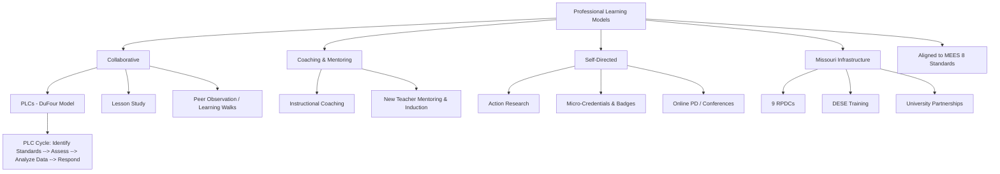

# Professional Learning — Missouri K-12 Education Reference

## Table of Contents
1. Professional Learning Communities (PLCs)
2. Instructional Coaching
3. Mentoring & Induction (Expanded)
4. Micro-Credentials & Digital Badges
5. Action Research
6. Lesson Study
7. Peer Observation & Learning Walks
8. Conference & Workshop PD
9. Online & Self-Directed PD
10. PD Planning & Evaluation
11. Missouri PD Infrastructure
12. MEES-Aligned Professional Growth

---

## 1. Professional Learning Communities (PLCs)

### DuFour PLC Model (Most Widely Used in Missouri)
Four critical questions that drive PLC work:
1. **What do we want students to learn?** (Essential standards identification)
2. **How will we know when they have learned it?** (Common formative assessments)
3. **What will we do when they don't learn it?** (Systematic intervention)
4. **What will we do when they already know it?** (Enrichment/extension)

### PLC Structure
| Element | Description |
|---------|-----------|
| **Collaborative teams** | Teachers organized by grade level, content area, or course (not by "committee" — by shared students/standards) |
| **Shared mission/vision/values** | Collective commitment to student learning |
| **Collective inquiry** | Teams study best practices and current reality together |
| **Action orientation** | Teams test strategies and assess results (not just discuss) |
| **Focus on results** | Common assessments → data analysis → responsive action |
| **SMART goals** | Specific, Measurable, Attainable, Results-oriented, Time-bound team goals |

### PLC Meeting Cycle (Typical)
1. **Identify essential standards** for the upcoming unit
2. **Design common formative assessment** aligned to standards
3. **Teach** the unit (each teacher, own classroom)
4. **Administer common assessment** (same assessment, same time frame)
5. **Analyze results** together (by student, by standard, by teacher)
6. **Respond:** re-teach, intervene, extend based on results
7. **Reflect:** what worked? what needs to change?

### Administrative Support for PLCs
- Protected, scheduled collaborative time (during the school day — not after hours)
- Norms and protocols for productive meetings
- Facilitation support (instructional coach or team leader)
- Access to data tools
- Accountability for PLC work (admin monitors but doesn't micromanage)

---

## 2. Instructional Coaching

### Coaching Models
| Model | Description |
|-------|-----------|
| **Cognitive Coaching (Costa & Garmston)** | Develops teacher's self-directedness through structured planning, reflecting, and problem-resolving conversations |
| **Jim Knight's Impact Cycle** | Identify → Learn → Improve cycle; teacher chooses focus; coach provides support |
| **Student-Centered Coaching (Sweeney)** | Coaching goals tied to student outcomes, not teacher behavior |
| **Literacy Coaching** | Content-specific coaching for ELA/reading teachers |
| **Instructional Rounds** | Team-based observations and analysis of instructional practice (not evaluative) |

### Coaching vs. Evaluation
| Coaching | Evaluation |
|----------|-----------|
| Supportive and formative | Summative and judgmental |
| Teacher-directed focus | Administrator-directed criteria |
| Confidential (coaching conversations not shared with evaluators) | Documented and placed in personnel file |
| Growth-oriented | Accountability-oriented |
| Voluntary (ideally) | Mandatory |

### Effective Coaching Practices
- Build trusting relationships (confidentiality is essential)
- Use data to identify coaching priorities
- Model lessons (demonstrate in the teacher's classroom)
- Co-plan and co-teach
- Observe and provide specific, actionable feedback
- Use video for self-reflection (teacher reviews their own teaching)
- Celebrate growth and progress
- Maintain regular coaching cycles (not one-off interactions)

---

## 3. Mentoring & Induction (Expanded)

### Missouri Requirement (RSMo 168.028)
All Missouri districts must provide a mentoring program for new teachers.

### Comprehensive Induction Framework (Beyond One Year)
| Year | Focus |
|------|-------|
| **Year 1** | Survival and orientation: classroom management, curriculum, procedures, building relationships |
| **Year 2** | Refinement: assessment literacy, differentiation, data use, deepening content knowledge |
| **Year 3** | Leadership: mentoring others, leading teams, contributing to school improvement |

### Mentor Selection Criteria
- Experienced and effective teacher (minimum 3-5 years)
- Same or similar content area/grade level (when possible)
- Strong interpersonal skills and empathy
- Commitment to confidentiality
- Willingness to invest time (regular meetings, observations, feedback)
- Formal mentor training (required by most programs)

### Mentor Activities
- Regular meetings (weekly during year 1; biweekly in year 2)
- Classroom observations (mentor observes new teacher; new teacher observes mentor)
- Co-planning
- Introducing school/district culture and procedures
- Emotional support (teaching is hard; mentors provide safe space)
- Professional development guidance
- Documentation of mentoring activities (for DESE certification progression)

---

## 4. Micro-Credentials & Digital Badges

### What They Are
Micro-credentials are competency-based, digital certifications demonstrating mastery of specific skills. Teachers earn them by submitting evidence of practice.

### Platforms
- **Digital Promise** (Educator Micro-credentials)
- **BloomBoard** (micro-credentials aligned to evaluation standards)
- **ISTE** (digital learning micro-credentials)
- **District-developed** micro-credential systems

### Applications in Missouri
- Professional development credit for certificate renewal
- Evidence for MEES evaluation (Standard 8: Professionalism)
- Salary schedule advancement (some districts accept micro-credentials in lieu of graduate credits)
- Targeted professional growth in specific skill areas
- Teacher leadership pathways

---

## 5. Action Research

### Definition
Teacher-led systematic inquiry into their own practice:
1. **Identify a question** — What am I curious about? What problem do I want to solve?
2. **Review literature** — What does research say about this topic?
3. **Design the study** — What data will I collect? How? Over what period?
4. **Collect data** — Student work, assessments, observations, surveys, interviews
5. **Analyze data** — Look for patterns, themes, unexpected findings
6. **Reflect and act** — What did I learn? How will I change my practice?
7. **Share findings** — Present to colleagues, contribute to school's knowledge base

### Benefits
- Develops teacher agency and professional autonomy
- Bridges theory and practice
- Creates a culture of inquiry
- Generates locally relevant evidence for instructional decisions
- Counts as professional development

---

## 6. Lesson Study

### Japanese Model (Adapted for U.S.)
1. **Plan together** — team collaboratively designs a "research lesson" focused on a specific learning goal
2. **Teach** — one team member teaches the lesson while others observe (focus is on STUDENT learning, not teacher performance)
3. **Debrief** — team discusses observations of student learning during the lesson
4. **Revise** — team revises the lesson based on observations
5. **Re-teach** — another team member teaches the revised lesson; team observes again
6. **Reflect and share** — document findings and share with broader staff

### Key Principles
- Focus on student learning, not teacher evaluation
- Collaborative (not competitive)
- Iterative (plan-teach-observe-revise cycle)
- Research-informed (connected to learning standards and pedagogical theory)
- Time-intensive (best supported with structured collaborative time)

---

## 7. Peer Observation & Learning Walks

### Peer Observation
Voluntary, non-evaluative observation between teacher peers:
- Teacher A observes Teacher B (with invitation)
- Focus area agreed upon in advance
- Brief post-observation conversation
- Completely confidential — no reports to administration
- Reciprocal: both teachers observe each other

### Learning Walks (Instructional Rounds)
Structured team observations across multiple classrooms:
- Team of 4-8 (teachers, coaches, administrators)
- Brief visits (10-15 minutes per classroom)
- Look for specific "look-fors" aligned to school improvement goals
- No individual teacher feedback — aggregate observations shared school-wide
- Identify patterns and trends in instructional practice
- Inform professional development priorities
- Based on City, Elmore, Fiarman & Teitel's "Instructional Rounds" model

---

## 8. Conference & Workshop PD

### Key Conferences for Missouri Educators
| Conference | Focus | Organizer |
|-----------|-------|-----------|
| **MSTA Conference** | All subjects, all levels | Missouri State Teachers Association |
| **MNEA Conference** | Professional issues, instruction | Missouri National Education Association |
| **METC (Missouri Educational Technology Conference)** | Ed tech, digital learning | METC / DESE |
| **MSBA Annual Conference** | Governance, policy, school leadership | Missouri School Boards Association |
| **MASA / MOSPRA Conferences** | Administration, school PR | Missouri Association of School Administrators |
| **MSTA Subject Area Conferences** | Content-specific (math, science, ELA, social studies) | MSTA |
| **MoCASE Conference** | Special education administration | Missouri Council of Administrators of Special Education |
| **MSCA Conference** | School counseling | Missouri School Counselor Association |

### Workshop Quality Indicators
- Aligned to school/district improvement goals
- Research-based content
- Active engagement (not sit-and-listen)
- Opportunities for practice and application
- Follow-up support (coaching, collaboration, resources)
- Measured impact (not just satisfaction surveys)

---

## 9. Online & Self-Directed PD

### Platforms
| Platform | Content |
|----------|---------|
| **DESE Online PD** | State-specific training modules |
| **RPDC online offerings** | Regional PD delivered virtually |
| **Coursera / edX / FutureLearn** | University-partnered courses (some free) |
| **Khan Academy** | Content knowledge refresher (free) |
| **Edutopia** | Instructional strategies, project-based learning (free) |
| **Teaching Channel** | Video-based PD (classroom observation videos) |
| **ASCD / Learning Forward** | Professional learning resources, publications |
| **ISTE** | Technology integration standards and courses |

### Self-Directed PD Best Practices
- Set specific learning goals
- Document learning (reflective journal, portfolio)
- Apply learning in the classroom
- Share learning with colleagues
- Connect to evaluation goals (MEES Standard 8)
- Track hours for certificate renewal

---

## 10. PD Planning & Evaluation

### Characteristics of Effective PD (Learning Forward Standards)
1. **Learning communities** — occurs within collaborative communities
2. **Leadership** — requires skillful leaders who develop capacity
3. **Resources** — adequate time, money, technology, and human resources
4. **Data** — uses multiple sources of data to plan and evaluate
5. **Learning designs** — integrates theories and evidence-based practices
6. **Implementation** — applies research on change to sustain support
7. **Outcomes** — aligns with educator performance and student results

### PD Needs Assessment
- Student achievement data (assessment results, grades, growth data)
- Teacher evaluation data (MEES trends, common growth areas)
- Staff surveys (perceived needs, interests, barriers)
- School improvement plan goals (CSIP/DSIP)
- Compliance requirements (mandated training)
- New initiative needs (curriculum adoption, technology rollout)

### Evaluating PD Impact (Guskey's 5 Levels)
| Level | Question | Data Sources |
|-------|---------|-------------|
| 1 | Did participants like it? | Satisfaction surveys |
| 2 | Did participants learn? | Pre/post assessments, quizzes |
| 3 | Was the organization supportive? | Implementation logs, support availability |
| 4 | Did participants apply it? | Classroom observations, coaching notes |
| 5 | Did students benefit? | Student assessment data, attendance, behavior |

---

## 11. Missouri PD Infrastructure

### RPDCs
See `references/rural-education.md` for RPDC network details. Key services:
- Free and low-cost PD across all content areas and grade levels
- New teacher support and mentoring training
- MEES evaluator training
- Curriculum and assessment PD
- Technology integration
- Virtual PD options

### DESE Professional Development
- DESE-hosted webinars and training sessions
- Mandated training modules (mandated reporter, suicide prevention, etc.)
- Content-area specialist consultants available through DESE
- Missouri Leadership Development System (MLDS) for administrator development

### University Partnerships
- Graduate coursework for salary advancement and endorsement additions
- Professional development schools (PDS) model
- Research partnerships
- Student teacher supervision and mentoring

---

## 12. MEES-Aligned Professional Growth

### Using MEES for Professional Growth
MEES Standard 8 (Professionalism) explicitly addresses professional growth. But ALL 8 standards can drive PD:

| Standard | PD Connection |
|----------|--------------|
| **1. Content Knowledge** | Content-area deepening (graduate courses, institutes, content PD) |
| **2. Student Learning** | Developmental psychology, learning theory, differentiation |
| **3. Curriculum Implementation** | Curriculum design, standards alignment, scope and sequence |
| **4. Critical Thinking** | Inquiry-based instruction, Socratic seminar, PBL |
| **5. Classroom Environment** | Classroom management, SEL, trauma-informed practices, PBIS |
| **6. Communication** | Parent engagement, questioning techniques, ELL strategies |
| **7. Assessment** | Assessment literacy, formative assessment, data analysis |
| **8. Professionalism** | PLCs, coaching, leadership, ethics, collaboration |

### Individual Professional Growth Plan
Best practice: every teacher has a written professional growth plan:
- Based on self-assessment and evaluation feedback
- Aligned to 1-2 specific MEES indicators
- Includes: goal, action steps, resources needed, evidence of progress, timeline
- Reviewed with evaluator or coach
- Connected to building/district improvement goals
