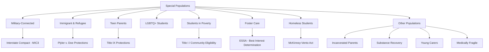

# Special Populations — Missouri K-12 Education Reference

## Table of Contents
1. Military-Connected Students
2. Immigrant & Refugee Students
3. Teen Parents & Pregnant Students
4. LGBTQ+ Students
5. Students Experiencing Poverty
6. Students with Incarcerated Parents
7. Students in Foster Care (Expanded)
8. Students Experiencing Homelessness (Expanded)
9. Students in Substance Recovery
10. Young Carers
11. Tribal & Native American Students
12. Medically Fragile Students

---

## 1. Military-Connected Students

### Interstate Compact on Educational Opportunity for Military Children
Missouri is a member of the Military Interstate Children's Compact Commission (MIC3):
- **Enrollment:** immediate enrollment regardless of paperwork delays; accepting unofficial records
- **Placement:** honor course/grade placement from sending state; flexibility in prerequisite waivers
- **Eligibility:** maintain extracurricular and athletic eligibility when transferring
- **Graduation:** waive specific [graduation requirements](../roles/students.md) if similar coursework was completed; allow alternative graduation pathways for seniors
- **Records:** expedited transfer of records between states
- **Excused absences:** reasonable accommodation for deployment-related family events

### Impact of Military Life on Students
- Frequent moves (average military child moves 6-9 times during K-12)
- Parental deployment (separation anxiety, behavioral changes, academic disruption)
- Reintegration challenges (adjusting when parent returns from deployment)
- Social isolation (repeatedly being "the new kid")
- Cumulative stress from transitions, uncertainty, and family strain

### Support Strategies
- Designated military family liaison in the school
- Welcome program for incoming military families
- Student peer mentoring (buddy system for new students)
- Counseling support during deployment/reintegration cycles
- Flexible academic accommodations for transition periods
- Military and Family Life Counselors (MFLCs) available through installations
- School Liaison Officers (SLOs) at military installations coordinate with schools

### Missouri Military Installations
- Fort Leonard Wood (Pulaski County — significant military-connected student population)
- Whiteman Air Force Base (Johnson County)
- National Guard and Reserve units statewide

---

## 2. Immigrant & Refugee Students

### Legal Right to Attend School
**Plyler v. Doe (1982):** all children have the right to a free public education regardless of immigration status. Schools may NOT:
- Ask about immigration status during enrollment
- Require Social Security numbers (must offer alternatives)
- Report students or families to immigration authorities
- Deny enrollment based on lack of documentation

### Enrollment Requirements
- Schools may request proof of residency (utility bill, lease) but must provide alternatives if documents are unavailable
- Immunization requirements apply but temporary enrollment without records is required
- Home Language Survey identifies potential [ELL](../programs/english-learners.md) students for assessment

### Students with Interrupted Formal Education (SIFE)
Students who have gaps in their schooling (due to war, displacement, poverty, lack of access):
- May be significantly below grade level in literacy and numeracy
- May have limited or no prior formal schooling
- Need intensive academic support + cultural orientation
- Age-appropriate grade placement (not simply placed in lowest grade)
- SIFE programs provide accelerated content + language instruction

### Refugee-Specific Supports
- Refugee resettlement agencies (International Institute, Catholic Charities, Jewish Family Services) coordinate school enrollment
- Cultural orientation programs
- Trauma-informed approaches (many refugee students have experienced war, displacement, family separation)
- Bilingual family liaisons and interpreters
- After-school tutoring and homework support
- Free/reduced lunch (many refugee families qualify)

### Unaccompanied Minors
- Unaccompanied immigrant minors (under federal Office of Refugee Resettlement care or released to sponsors) have the right to enroll in school
- McKinney-Vento protections may apply if the minor lacks a fixed, regular residence
- School should coordinate with the minor's sponsor or guardian

---

## 3. Teen Parents & Pregnant Students

### Title IX Protections
Title IX prohibits discrimination against pregnant and parenting students:
- Cannot be excluded from any educational program or activity
- Must be allowed to remain in regular classes and participate in all activities
- Cannot be required to attend a separate program (though participation must be voluntary if offered)
- Must be excused for absences due to pregnancy, childbirth, and related medical conditions (treated the same as any temporary medical condition)
- Must be given reasonable time to make up missed work
- Provide homebound instruction if medically necessary (same as for any temporary medical condition)

### Support Services
- Academic support and flexible scheduling
- School-based or community-based child care (some districts provide on-site child care)
- Parenting education programs
- Connection to WIC, Medicaid, TANF, child care subsidy
- School counseling (academic and personal)
- Teen parent support groups
- A+ eligibility: pregnancy and parenting should not be penalized in attendance or citizenship requirements (reasonable accommodations)
- Graduation planning and credit recovery if needed

### Prevention
- Comprehensive health education (within RSMo 170.015 guidelines)
- Access to school counselors for confidential conversations
- Community health partnerships
- Mentoring programs

---

## 4. LGBTQ+ Students

### Legal Protections
| Law | Coverage |
|-----|----------|
| **Title IX** | Prohibits sex-based discrimination (federal interpretation of sex discrimination coverage for LGBTQ+ students has varied by administration) |
| **Equal Access Act** | LGBTQ+ student groups (GSAs/Gender and Sexuality Alliances) must be given equal access to school facilities if other non-curriculum clubs are allowed |
| **14th Amendment / Equal Protection** | Students cannot be treated differently by school officials based on sexual orientation or gender identity without legitimate justification |
| **First Amendment** | Students have the right to express their identity (with standard Tinker limitations) |

### School Climate & Safety
Research consistently shows LGBTQ+ students face higher rates of:
- Bullying and harassment
- Verbal and physical victimization
- Exclusion and social isolation
- Depression, anxiety, and suicidality
- School avoidance and lower academic achievement
- Homelessness (family rejection)

**Key: Risk is driven by discrimination and rejection, not by identity itself.**

### Supportive Practices
- **GSA (Gender and Sexuality Alliance) clubs:** safe spaces for LGBTQ+ students and allies; research shows GSAs reduce victimization and improve school climate
- **Anti-bullying policies:** explicitly inclusive of sexual orientation and gender identity
- **Staff training:** professional development on supporting LGBTQ+ students and addressing harassment
- **Inclusive curriculum:** representation of LGBTQ+ people and history in course content
- **Counseling access:** school counselors trained in affirming practices
- **Pronoun and name respect:** use students' chosen names and pronouns
- **Restroom and facility access:** policies for transgender and nonbinary students (evolving legal landscape — consult current guidance and legal counsel)
- **Confidentiality:** do not disclose a student's sexual orientation or gender identity without their consent (even to parents, in cases where disclosure could cause harm — balance with professional judgment)

### Missouri Context
Missouri does not have a statewide law explicitly protecting students based on sexual orientation or gender identity. Protections vary by district policy. Some Missouri districts have adopted comprehensive non-discrimination policies; others have not.

---

## 5. Students Experiencing Poverty

### Scale
- Approximately 40-50% of Missouri public school students qualify for free or reduced-price meals
- Poverty is concentrated in certain areas (urban centers, rural Ozarks, Bootheel) but exists across all communities

### Impact on Learning
- Food insecurity (affects concentration, attendance, behavior)
- Housing instability (frequent moves, overcrowding, homelessness)
- Lack of access to healthcare (untreated vision, hearing, dental, mental health needs)
- Limited access to enrichment (tutoring, camps, extracurriculars with fees)
- Technology gap (limited devices and internet at home)
- Chronic stress and adverse childhood experiences
- Fewer educational resources at home (books, supplies, quiet study space)

### School Supports
- Free/reduced meals + breakfast + after-school snacks
- Community Eligibility Provision (universal free meals in high-poverty schools)
- Fee waiver policies (activity fees, field trips, testing fees, graduation fees)
- School supply programs (backpack drives, supply closets)
- Clothing closets and laundry facilities (some schools)
- School-based health services (SBHC, vision/hearing/dental screening)
- Before/after school programs (safe supervised time, meals, enrichment)
- Summer feeding and summer learning programs
- Transportation support (for extracurriculars, summer programs)
- Family resource centers (connect families to SNAP, TANF, Medicaid, housing, utility assistance)
- Trauma-informed practices (poverty is an ACE and co-occurs with other ACEs)

### Avoiding Deficit Thinking
- Frame supports as removing barriers, not fixing students
- Recognize assets and strengths in all families
- Avoid assumptions based on income (engagement ≠ resources)
- Include family voice in program design
- Address systemic causes (funding equity, access, opportunity) not just symptoms

---

## 6. Students with Incarcerated Parents

### Scale
Approximately 1 in 14 U.S. children has experienced parental incarceration. In Missouri, high incarceration rates mean significant numbers of students are affected.

### Impact on Students
- Trauma of parental arrest and separation
- Stigma and shame
- Financial hardship (loss of parental income)
- Housing instability (may move to different caregiver)
- School changes (enrollment disruption)
- Behavioral and emotional challenges (grief, anger, anxiety, depression)
- Higher risk of future justice involvement
- Social isolation (fear of disclosure)

### School Supports
- Identify affected students (sensitively — not through public inquiry)
- Train staff to recognize signs and provide supportive response
- Connect to school counseling (individual and group)
- Mentoring programs (Big Brothers Big Sisters, community mentors)
- Support group for students with incarcerated parents (Sesame Street's "Little Children, Big Challenges" is one resource framework)
- Academic support and attendance monitoring
- Avoid punitive responses to behavioral manifestations of grief/trauma
- Coordinate with caregivers (grandparents, foster parents, kinship care)
- FERPA considerations: non-custodial incarcerated parents generally retain educational rights unless a court order says otherwise

---

## 7. Students in Foster Care (Expanded)

See `references/equity-access.md` for ESSA foster care provisions. Additional detail:

### Educational Challenges
- Average foster youth changes schools 1-2 times per year
- Credit loss and transcript gaps from frequent moves
- Over-identification for special education
- Under-enrollment in advanced coursework
- Lower graduation rates (nationally ~50% vs 85%+ for general population)
- Post-secondary enrollment significantly lower than peers

### Missouri-Specific Supports
- **Point of contact:** every Missouri district must designate a foster care education point of contact (ESSA requirement)
- **Best Interest Determination (BID):** required when a placement change would change the student's school
- **Transportation:** district must collaborate with Children's Division to provide transportation to school of origin
- **Immediate enrollment:** no delays for records, immunizations, or residency documentation
- **Partial credit:** Missouri guidance encourages districts to award partial credit when foster youth transfer mid-semester
- **Graduation flexibility:** some districts allow alternative graduation pathways for foster youth who have attended multiple schools

---

## 8. Students Experiencing Homelessness (Expanded)

See `references/equity-access.md` for McKinney-Vento details. Additional detail:

### Identification Challenges
Many homeless families do not self-identify due to stigma. Schools should:
- Train enrollment staff, teachers, counselors, bus drivers, and cafeteria staff to recognize signs
- Use the McKinney-Vento housing questionnaire at enrollment (and mid-year)
- Look for indicators: frequent moves, inconsistent attendance, lack of supplies, sleeping in class, reluctance to provide address
- Use "doubled-up" language (sharing housing with others due to economic hardship)

### Unaccompanied Homeless Youth
Youth not in the physical custody of a parent or guardian who lack fixed, regular housing:
- Special enrollment protections (McKinney-Vento liaison assists)
- May enroll independently without a parent/guardian
- Eligible for free meals (categorical eligibility)
- Connected to community resources (housing, job training, health, independent living skills)
- May be eligible for FAFSA as an independent student (with verification)

---

## 9. Students in Substance Recovery

### Re-Entry After Treatment
Students returning to school after substance abuse treatment need a planned re-entry:
- Re-entry meeting (student, family, counselor, administrator, treatment provider with consent)
- Modified schedule if needed (gradually increasing academic load)
- Recovery support group (school-based or community-based)
- Relapse prevention plan with identified supports
- Ongoing monitoring (counselor check-ins, attendance tracking)
- Academic catch-up plan (credit recovery, modified deadlines)
- Peer support (connect with positive peer group)
- Confidentiality (substance abuse treatment records have special protections under 42 CFR Part 2)

### Recovery-Friendly Schools
- Staff training on addiction as a health condition (not a moral failing)
- Reduce stigma through education and awareness
- Support groups for students in recovery
- Clear protocols for relapse (support-first, not punishment-first)
- Environmental modifications (monitor restrooms, reduce access to substances)
- Parent education and support

---

## 10. Young Carers

### Definition
Students who provide significant caregiving responsibilities at home:
- Caring for a parent or sibling with illness, disability, or mental health condition
- Providing child care for younger siblings (especially when parent works multiple jobs)
- Translating for non-English-speaking parents
- Managing household responsibilities beyond age-appropriate expectations

### Impact
- Chronic fatigue and stress
- Attendance issues (staying home to provide care)
- Limited time for homework and extracurriculars
- Social isolation
- Emotional burden beyond developmental appropriateness
- Higher rates of anxiety and depression
- Academic underperformance

### School Supports
- Flexible attendance policies with support (not punishment)
- Counseling access
- Connection to community resources (respite care, social services, family support)
- Academic accommodations (extended deadlines, flexible scheduling)
- Peer support groups
- Staff awareness training (recognize signs of caregiving burden)

---

## 11. Tribal & Native American Students

### Missouri Context
Missouri's Native American student population is small but present. Key considerations:
- Federal trust responsibility and sovereignty for tribal nations
- Title VI (Indian Education) formula grants for districts with Native American students
- Johnson O'Malley (JOM) program for supplemental education services
- Cultural responsiveness in curriculum (accurate representation of Native history and contemporary life)
- Tribal consultation when applicable
- Impact Aid for districts with tribal lands

### Cultural Considerations
- Respect tribal identity and cultural practices
- Avoid stereotyping and tokenizing
- Include Native perspectives in social studies, history, and literature
- Connect with tribal education departments for resources and collaboration

---

## 12. Medically Fragile Students

### Definition
Students with complex medical conditions requiring ongoing monitoring, medical procedures, or technology support during the school day.

### Examples
- Ventilator-dependent students
- Students requiring tube feeding
- Students with tracheostomies
- Students with seizure disorders requiring emergency medication
- Students with severe allergies requiring EpiPen and monitoring
- Students with diabetes requiring continuous glucose monitoring and insulin management
- Students receiving chemotherapy or other ongoing medical treatment

### School Responsibilities
- Individualized Healthcare Plan (IHP) developed by school nurse with family and healthcare provider
- May also require an IEP (if disability affects learning) or 504 plan (if disability affects major life activities)
- Trained staff for medical procedures (delegation by RN per Missouri Nurse Practice Act)
- Emergency protocols clearly documented and communicated
- Appropriate medical equipment and supplies in the school
- Staff training on specific conditions and emergency response
- Transportation accommodations (specialized vehicles, nurse or aide on bus)
- Homebound instruction if student cannot attend school (temporary or extended)
- FAPE requirements apply — cannot deny enrollment or exclude student based on medical complexity
