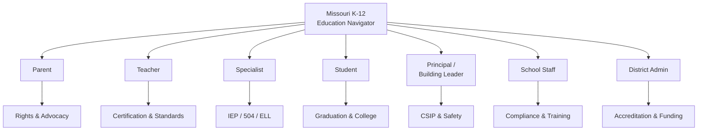
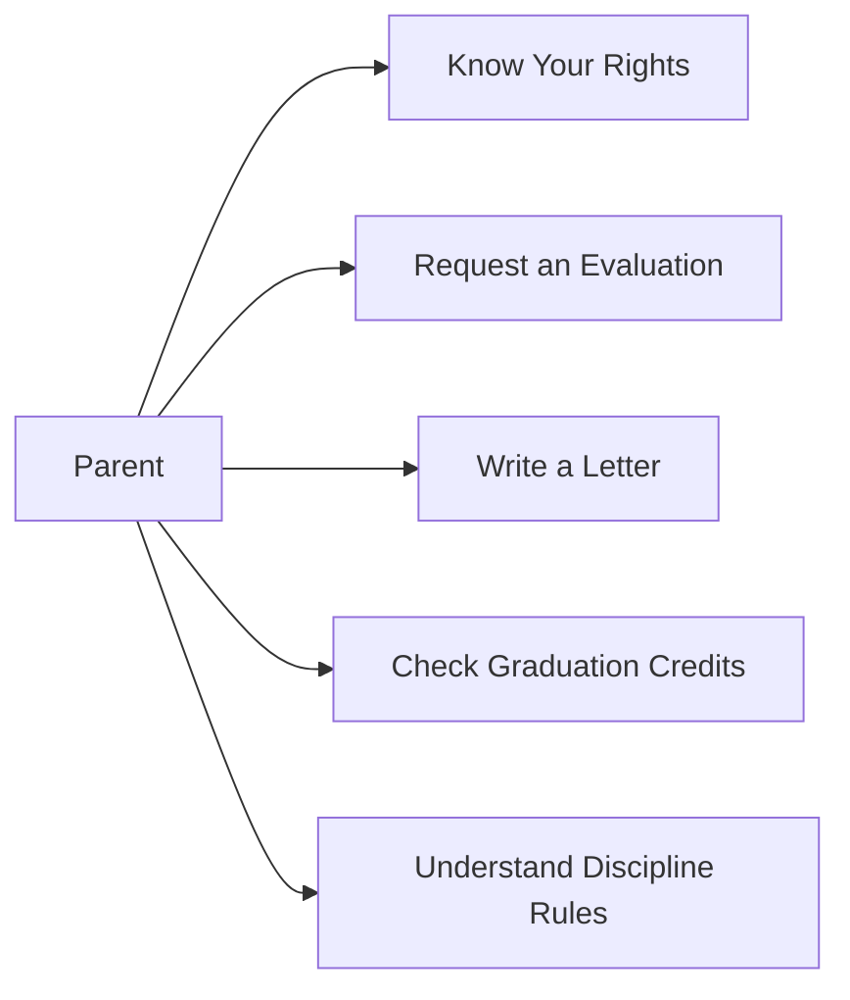
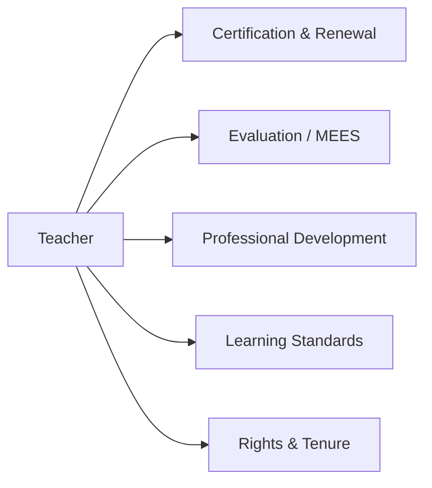
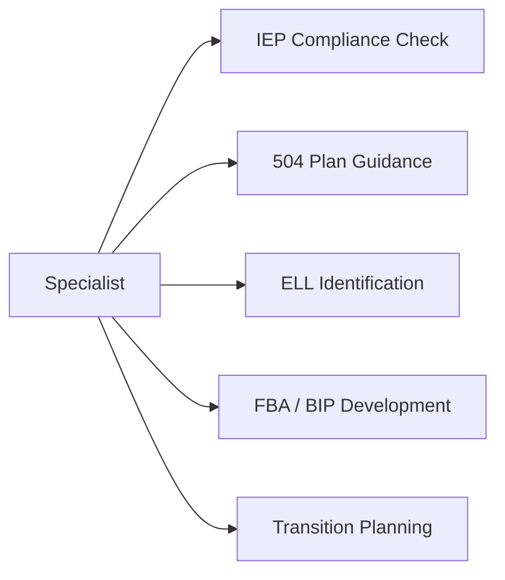
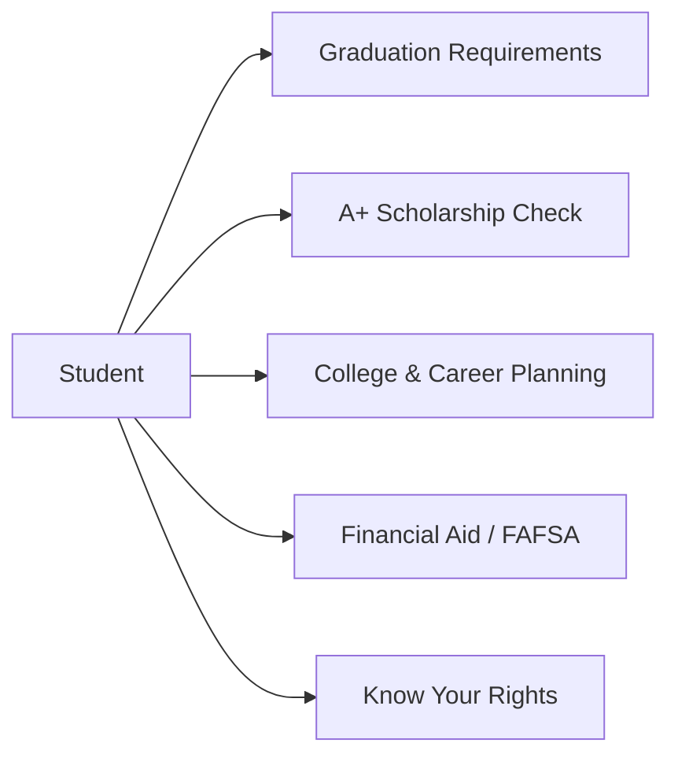
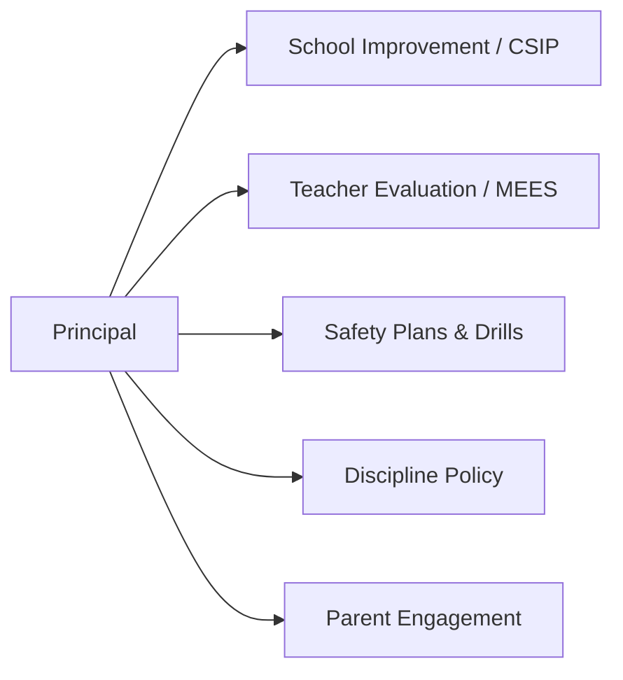
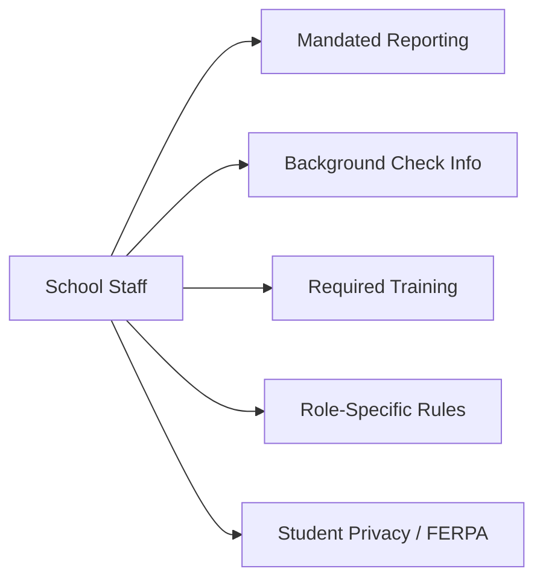
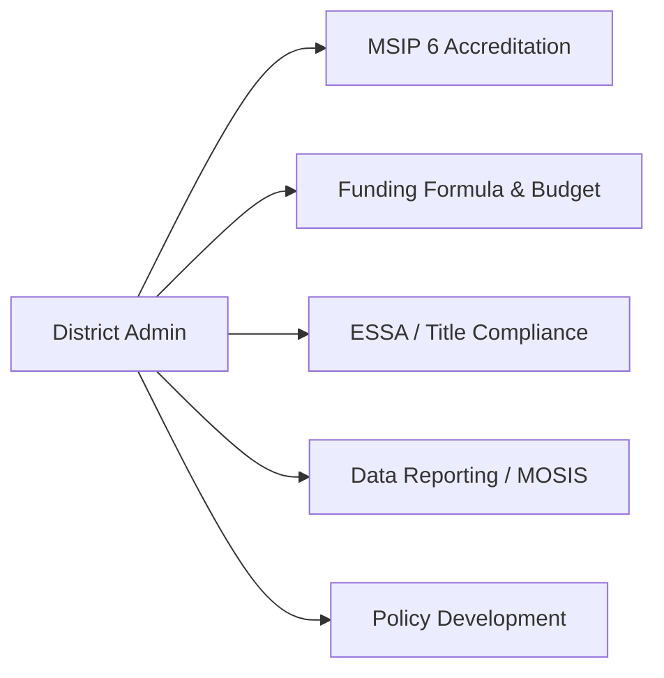

# Quick-Start Cards — Missouri K-12 Education Navigator

Use these cards to jump straight to what matters for your role. Each card lists your top tasks, key commands, essential reference files, and answers to common questions.

---

## All Roles Overview

---

## Parent

### Top 5 Things You Can Do

1. **Look up your rights** -- type `/rights` or ask "What are my rights regarding [topic]?"
2. **Request a special education evaluation** -- type `/letter evaluation-request` to generate a formal letter
3. **Draft any parent letter** -- type `/letter [type]` (options: evaluation-request, records-request, iep-meeting, dispute, 504-request, attendance-excuse)
4. **Audit graduation credits** -- type `/graduation` to walk through your student's credit status
5. **Check A+ Scholarship eligibility** -- type `/a-plus` to see if your student qualifies

### Key Files

- [Students & Parents Reference](roles/students.md) -- graduation, attendance, discipline, FERPA, financial aid
- [Parent Letter Templates](../templates/parent/) -- ready-to-send letters for common situations
- [FAQ](faq.md) -- pre-built answers for the most common questions
- [Spanish Language Guide](guia-padres-espanol.md) -- full guide in Spanish (use `/translate` for any content)

### Common Questions

**Q: How do I request my child be evaluated for special education?**
A: Submit a written request to your school. Use `/letter evaluation-request` to generate one. The district has 60 calendar days from your signed consent to complete the evaluation.

**Q: Can my child transfer to another school district?**
A: Yes. Missouri allows voluntary interdistrict transfers (RSMo 162.1010). If your district is unaccredited, your child may transfer to an accredited district at the sending district's expense (RSMo 167.131).

**Q: What is the A+ Scholarship?**
A: A tuition-reimbursement program at Missouri community colleges. Students need a 2.5 GPA, 95% attendance, 50 hours of tutoring/mentoring, and Proficient on the Algebra I EOC, among other requirements. Type `/a-plus` for a full eligibility check.

---

## Teacher

### Top 5 Things You Can Do

1. **Check certification requirements** -- ask "What do I need for my IPC?" or "How do I add an endorsement?"
2. **Understand your evaluation** -- ask "Explain the MEES process" or "What are the 8 Missouri Teaching Standards?"
3. **Find professional development** -- type `/pd [topic]` to get PD suggestions aligned to your needs
4. **Look up Missouri Learning Standards** -- ask about any subject or grade level standards
5. **Calculate retirement eligibility** -- type `/retire` to check Rule of 80 and your options

### Key Files

- [Teachers Reference](roles/teachers.md) -- certification, MEES, PD, standards, tenure, CTE
- [Professional Learning](../references/programs/professional-learning.md) -- PD resources and requirements
- [Compliance Calendar](compliance/compliance-calendar.md) -- month-by-month deadlines
- [Missouri Data Tables](mo-data-tables.md) -- quick statute and data lookups

### Common Questions

**Q: How do I move from an IPC to a CCPC?**
A: Teach for 4 years on your IPC, complete a mentoring program, get a recommendation from your employing district, and fulfill professional development requirements. Your district HR office processes the application through DESE.

**Q: When does tenure kick in?**
A: After 5 consecutive years of satisfactory employment in the same district (RSMo 168.104). Tenured teachers can only be terminated for cause with due process.

**Q: Am I a mandated reporter?**
A: Yes. All school employees must report suspected child abuse or neglect immediately to the Children's Division hotline at 1-800-392-3738 (RSMo 210.115). Failure to report is a Class A misdemeanor.

---

## Specialist

### Top 5 Things You Can Do

1. **Run an IEP compliance check** -- type `/iep-check` to walk through every required component
2. **Compare IEP vs. 504** -- type `/compare IEP vs 504` for a side-by-side decision guide
3. **Review SPED timelines** -- ask "What are the special education evaluation timelines?" (60-day eval, 30-day IEP, annual review, triennial)
4. **Build an FBA/BIP** -- ask "Walk me through an FBA" for step-by-step functional behavior assessment guidance
5. **Plan transition services** -- ask "What is required for transition planning?" (begins at age 16 per IDEA)

### Key Files

- [Specialists Reference](roles/specialists.md) -- IDEA, IEP process, 504, ELL, gifted, related services, dispute resolution
- [Special Needs Guides](special-needs/) -- disability-specific guidance (INDEX + 3 sub-files)
- [IEP Compliance Checklist](../templates/specialist/iep-compliance-checklist.md) -- component-by-component verification
- [Equity & Access](compliance/equity-access.md) -- enrollment for homeless, foster, military, immigrant students

### Common Questions

**Q: What triggers a Manifestation Determination Review (MDR)?**
A: An MDR is required before any disciplinary removal exceeding 10 cumulative school days in a year for a student with an IEP or 504 plan. The team determines whether the behavior was caused by the disability or by a failure to implement the plan.

**Q: What are the 13 IDEA disability categories?**
A: Autism, Deaf-Blindness, Deafness, Emotional Disturbance, Hearing Impairment, Intellectual Disability, Multiple Disabilities, Orthopedic Impairment, Other Health Impairment, Specific Learning Disability, Speech/Language Impairment, Traumatic Brain Injury, and Visual Impairment. Missouri also uses "Young Child with a Developmental Delay" for ages 3-5.

**Q: How long does the district have to complete an evaluation?**
A: 60 calendar days from the date parent consent is received. The IEP must be developed within 30 calendar days of the eligibility determination.

---

## Student

### Top 5 Things You Can Do

1. **Audit your graduation credits** -- type `/graduation` to check your progress toward the 24-credit requirement
2. **Check A+ eligibility** -- type `/a-plus` to verify GPA, attendance, tutoring hours, and test scores
3. **Explore careers and colleges** -- ask "Help me plan for college" or "What CTE pathways are available?"
4. **Understand financial aid** -- ask about FAFSA, Bright Flight, Access Missouri, or A+ benefits
5. **Know your discipline rights** -- ask "What are my rights if I get suspended?" for due process information

### Key Files

- [Students & Parents Reference](roles/students.md) -- graduation, A+, attendance, discipline, FERPA, college readiness
- [Career Pathways](operations/career-pathways.md) -- CTE clusters, dual credit, Missouri Connections
- [FAQ](faq.md) -- quick answers to common student questions
- [Missouri Data Tables](mo-data-tables.md) -- statute lookups and key numbers

### Common Questions

**Q: How many credits do I need to graduate?**
A: Missouri requires a minimum of 24 credits: 4 ELA, 3 Math (including Algebra I+), 3 Science, 3 Social Studies, 1 Fine Arts, 1 Practical Arts, 1 PE, 0.5 Health, 0.5 Personal Finance, and 7 electives. Your district may require more.

**Q: What EOC exams do I have to take?**
A: English II, Algebra I (or Algebra II), Biology, and American Government. Participation is mandatory, but passing is not currently required for graduation.

**Q: Can I earn college credit while in high school?**
A: Yes. Missouri supports dual credit/dual enrollment through district partnerships with colleges. You earn both high school and college credit. A+ benefits can also be used for dual enrollment courses at community colleges.

---

## Principal / Building Leader

### Top 5 Things You Can Do

1. **Build or review your CSIP** -- type `/csip` to walk through each required component of your school improvement plan
2. **Create a safety plan** -- type `/safety-plan` to build an emergency operations plan annex by annex
3. **Run a threat assessment** -- type `/threat` to document a threat assessment using the CSTAG framework
4. **Get monthly compliance tasks** -- type `/comply [month]` (e.g., `/comply april`) for that month's checklist
5. **Draft or review discipline policy** -- type `/policy discipline` for a board-ready policy template

### Key Files

- [Building Leaders Reference](roles/building-leaders.md) -- CSIP, staff evaluation, discipline, safety, Title I, MTSS/PBIS
- [Crisis & Emergency](operations/crisis-emergency.md) -- crisis response protocols and action steps
- [Safety Plan Template](../templates/admin/safety-plan-outline.md) -- full emergency operations plan outline
- [CSIP Template](../templates/admin/csip-template.md) -- school improvement plan framework
- [Compliance Calendar](compliance/compliance-calendar.md) -- month-by-month deadlines

### Common Questions

**Q: How often must I conduct safety drills?**
A: Fire drills monthly (minimum 2/semester), tornado and earthquake drills minimum 2/year each, lockdown/active threat drills minimum 2/year (RSMo 160.660), and bus evacuation drills minimum 1/year.

**Q: What is required in a CSIP?**
A: A school profile, needs assessment, measurable goals aligned to MSIP 6, evidence-based strategies, PD plan, resource allocation, timeline, monitoring plan, evaluation plan, and evidence of stakeholder engagement. The CSIP is reviewed annually and fully revised every 5 years.

**Q: When can I non-renew a non-tenured teacher?**
A: Non-tenured teachers may be non-renewed without cause at the end of their contract year, but you must provide written notice by April 15 (RSMo 168.126). Tenured teachers require termination for cause with full due process.

---

## School Staff

### Top 5 Things You Can Do

1. **Understand mandated reporting** -- ask "What are my mandated reporting obligations?" (all staff must report to 1-800-392-3738)
2. **Review required annual training** -- ask "What training do I need this year?" for a role-specific list
3. **Learn FERPA basics** -- ask "What can I share about students?" for student privacy rules
4. **Check paraprofessional requirements** -- ask "What qualifications do paras need?" (ESSA requirements for Title I)
5. **Look up crisis procedures** -- type `/crisis [type]` for immediate action steps during an emergency

### Key Files

- [School Staff Reference](roles/school-staff.md) -- paras, nurses, transportation, food service, custodial, office, tech, SROs
- [Crisis & Emergency](operations/crisis-emergency.md) -- emergency response protocols
- [Compliance Calendar](compliance/compliance-calendar.md) -- training and reporting deadlines
- [Health & Wellness](operations/health-wellness.md) -- health procedures, medication, screenings

### Common Questions

**Q: Am I a mandated reporter?**
A: Yes. Every school employee -- teachers, paras, bus drivers, custodians, food service, office staff, coaches, and regular volunteers -- is a mandated reporter (RSMo 210.115). Report suspected abuse or neglect immediately to 1-800-392-3738. Failure to report is a Class A misdemeanor.

**Q: What qualifications do paraprofessionals need in Title I schools?**
A: One of three: (1) 60 semester hours of college credit, (2) an associate's degree or higher, or (3) a passing score on an approved paraprofessional assessment. All paras must work under the direct supervision of a certified teacher.

**Q: What is FERPA and how does it affect me?**
A: FERPA protects student education records. You may not disclose personally identifiable student information without parent consent except under specific exceptions (e.g., school officials with legitimate educational interest, transfer schools, health/safety emergencies). When in doubt, do not share.

---

## District Admin

### Top 5 Things You Can Do

1. **Review accreditation status** -- ask "Explain MSIP 6 standards" or "What triggers provisional accreditation?"
2. **Understand the funding formula** -- ask "How does Missouri's school funding formula work?" for SAT, WADA, and local effort calculations
3. **Get monthly compliance tasks** -- type `/comply [month]` for federal and state deadlines
4. **Draft district policy** -- type `/policy [type]` (options: ai, discipline, bullying, attendance, device) for board-ready templates
5. **Check data reporting requirements** -- type `/data [report]` for MOSIS/Core Data cycle guidance

### Key Files

- [District Administration Reference](roles/administrators.md) -- MSIP 6, funding, governance, ESSA, Title programs, data reporting, fiscal management
- [Compliance Calendar](compliance/compliance-calendar.md) -- month-by-month federal and state deadlines
- [Funding & Finance](compliance/funding-programs.md) -- detailed funding formula, Title programs, audit requirements
- [Data Reporting](operations/data-reporting.md) -- MOSIS, Core Data, APR submission cycles
- [Policy Templates](../templates/admin/) -- board-ready policy documents

### Common Questions

**Q: What are the five MSIP 6 standards?**
A: (1) Academic Achievement, (2) Subgroup Achievement, (3) High School Readiness / College & Career Readiness, (4) Attendance, and (5) School Quality / Climate. DESE publishes an Annual Performance Report (APR) scoring each standard.

**Q: What happens if a district loses accreditation?**
A: Consequences include a state-appointed advisory team or special administrative board, mandatory improvement plans with DESE oversight, student transfer provisions at the district's expense (RSMo 167.131), potential lapse of corporate organization (RSMo 162.081), and loss of local governance.

**Q: What data systems must we report to?**
A: MOSIS (individual student-level data: demographics, enrollment, attendance, discipline, assessment, SPED, ELL) with Fall, Spring, and End-of-Year cycles; and Core Data (district/school-level staffing, salaries, revenue/expenditures, facilities) submitted annually. Errors can affect funding, APR scores, and accreditation.
