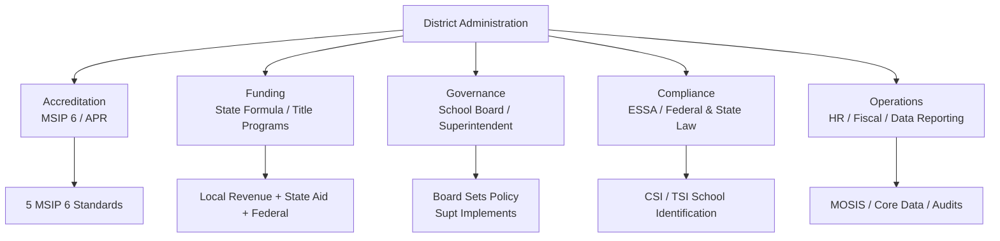

# District Administration — Missouri K-12 Education Reference

## Table of Contents
1. MSIP 6 Accreditation
2. School Funding Formula
3. School Board Governance
4. Superintendent Role & Responsibilities
5. ESSA Compliance
6. Title Programs (I, II, III, IV)
7. Charter Schools
8. Data Reporting (MOSIS / Core Data)
9. District Improvement Planning (DSIP)
10. Human Capital Management
11. Legal Compliance Framework
12. Fiscal Management

---

## 1. MSIP 6 Accreditation

### Overview
The Missouri School Improvement Program (MSIP 6) is DESE's accreditation and accountability system for all public school districts. MSIP 6 replaced MSIP 5 and is aligned to ESSA requirements.

### Five MSIP 6 Standards

| Standard | Focus |
|----------|-------|
| **1. Academic Achievement** | Student proficiency on MAP/EOC assessments; ACT/SAT college readiness |
| **2. Subgroup Achievement** | Performance of historically underperforming subgroups (race, income, disability, ELL) |
| **3. High School Readiness (K-8) / College & Career Readiness (9-12)** | K-8: attendance, course completion, behavior; 9-12: graduation rate, postsecondary enrollment, credentials |
| **4. Attendance** | Student attendance rates; chronic absenteeism |
| **5. School Quality / Climate** | School climate surveys, teacher retention, advanced coursework access, arts/CTE participation |

### Annual Performance Report (APR)
- DESE publishes an APR for every district and school annually
- APR includes performance on each MSIP 6 standard/indicator
- APR data drives accreditation status determination

### Accreditation Classifications
| Status | Meaning |
|--------|---------|
| **Accredited** | District meets or exceeds performance expectations |
| **Provisionally Accredited** | District has identified deficiencies; improvement plan required |
| **Unaccredited** | Serious performance failures; significant state intervention possible |

### Consequences of Non-Accreditation
- State-appointed advisory team or special administrative board
- Mandatory improvement plan with DESE oversight
- Student transfer provisions (RSMo 167.131 — students in unaccredited districts may transfer to accredited districts at the sending district's expense)
- Potential lapse of the district's corporate organization (RSMo 162.081)
- Loss of local governance (state-appointed board)

### MSIP 6 Review Cycle
- Districts undergo comprehensive review approximately every 5 years
- Annual data monitoring between full reviews
- Continuous improvement expectation with annual goal-setting

---

## 2. School Funding Formula

### State Foundation Formula (SB 287, as amended)

**Core concept:** Missouri's formula calculates a **State Adequacy Target (SAT)** per weighted average daily attendance (WADA), then determines each district's share based on local wealth.

### Key Components

| Component | Description |
|-----------|-------------|
| **Average Daily Attendance (ADA)** | Primary enrollment measure; based on student attendance counts |
| **Weighted ADA (WADA)** | ADA adjusted by weighting factors for special populations |
| **State Adequacy Target (SAT)** | Dollar amount per WADA that represents "adequate" funding |
| **Local Effort** | Local tax revenue (primarily property tax); deducted from state entitlement |
| **State Aid** | SAT × WADA minus Local Effort = State Aid (simplified) |
| **Hold Harmless** | Districts cannot receive less state aid than they received in the base year (prevents sudden funding drops) |

### Weighting Factors
Students in certain categories receive additional weight:
- Free/Reduced Price Lunch eligible students
- Students with IEPs
- English Language Learners
- Students in transportation-eligible areas

### Local Revenue Sources
- **Property tax (operating levy):** primary local funding source; Proposition C (1982) dedicated a portion of sales tax to education
- **Operating levy cap:** $6.00 per $100 assessed valuation (with voter override possible)
- **Bond issues:** for capital improvements, technology, transportation; require 4/7 (57%) voter approval
- **Proposition C sales tax:** state sales tax distributed to districts based on ADA

### Federal Funding
Federal funds supplement (not supplant) state and local funding:
- Title I, II, III, IV (ESSA)
- IDEA Part B
- Perkins V (CTE)
- School meals programs (NSLP, SBP)
- E-Rate
- Impact Aid (districts with federal property)

---

## 3. School Board Governance

### Authority (RSMo Chapter 162)
Missouri school boards are the governing bodies of public school districts:
- 7 members (most districts); elected at-large or by ward
- Terms: 3 years (staggered elections in April)
- Board sets policy; superintendent implements policy
- Board hires and evaluates the superintendent
- Board adopts the annual budget
- Board approves expenditures above thresholds set by policy
- Board has authority over employment, contracts, and property

### Open Meetings (Sunshine Law — RSMo Chapter 610)
- All board meetings must be open to the public (with limited exceptions for closed sessions)
- Closed session permitted for: personnel matters, litigation, real estate negotiations, individualized student discipline, security matters, and other RSMo 610.021 exceptions
- Meeting notices must be posted at least 24 hours in advance
- Minutes of open sessions are public records
- Votes taken in closed session must be recorded and made public

### Board Member Requirements
- Resident of the district
- Registered voter
- At least 24 years old (for most districts)
- No felony conviction
- Not employed by the district (conflict of interest)

### Board Ethics
- Conflict of interest disclosure (RSMo 162.215)
- Prohibition on nepotism (varies by district policy; some statutory provisions)
- Financial disclosure requirements for school officials
- MSBA (Missouri School Boards Association) Code of Ethics (voluntary but widely adopted)

---

## 4. Superintendent Role & Responsibilities

### Certification
- Must hold a valid Missouri Superintendent Certificate
- Requirements: master's degree (doctorate preferred), superintendent preparation program, administrative experience, passing assessment, background check

### Core Responsibilities
- Chief executive officer of the district
- Implements board policy
- Recommends hiring, discipline, and termination of employees to the board
- Develops and recommends the annual budget
- Serves as primary liaison between board and staff
- Leads strategic planning and improvement efforts
- Represents the district publicly
- Ensures compliance with all state and federal requirements
- Reports to DESE as required (MOSIS, Core Data, APR, compliance reports)

---

## 5. ESSA Compliance

### Every Student Succeeds Act (2015) — Key District Requirements

| Area | Requirement |
|------|-------------|
| **State plan alignment** | District programs must align to Missouri's ESSA State Plan |
| **Accountability** | Participate in MSIP 6; address schools identified for CSI/TSI |
| **Assessments** | Administer MAP, EOC, ACCESS for ELLs per state testing calendar |
| **Report cards** | Publish school and district report cards (online) with required data elements |
| **Teacher quality** | Ensure teachers meet state certification requirements; report teacher qualifications to parents |
| **Title program compliance** | Maintain and submit required plans, budgets, and reports for all Title programs |
| **Parent engagement** | Meet parent notification and engagement requirements |
| **Data reporting** | Submit required data through MOSIS and other DESE reporting systems |

### School Identification Under ESSA

| Category | Criteria | Response |
|----------|----------|----------|
| **Comprehensive Support and Improvement (CSI)** | Bottom 5% of schools; high schools with <67% graduation rate; TSI school not improving | Comprehensive needs assessment, evidence-based improvement plan, resource allocation, monitoring |
| **Targeted Support and Improvement (TSI)** | One or more subgroups consistently underperforming | Targeted improvement plan, root cause analysis, progress monitoring |
| **Additional Targeted Support (ATSI)** | TSI school with subgroup(s) performing at CSI level | More intensive intervention, potential reclassification as CSI if not improving |

---

## 6. Title Programs (I, II, III, IV)

### Title I, Part A — Improving Basic Programs
- **Purpose:** Academic achievement for disadvantaged students
- **Allocation:** Formula-based on poverty counts (Census data)
- **Uses:** Supplemental instruction, interventions, materials, PD, parent engagement
- **Models:** Schoolwide (40%+ poverty) or Targeted Assistance
- **Key rules:** Supplement-not-supplant, comparability, set-aside for parent engagement (1% if >$500K), set-aside for homeless students (McKinney-Vento)

### Title II, Part A — Supporting Effective Instruction
- **Purpose:** Teacher and principal quality
- **Uses:** Recruitment, retention, PD, class-size reduction, teacher leadership, induction/mentoring
- **Key rule:** Must be evidence-based; aligned to comprehensive needs assessment

### Title III, Part A — English Language Acquisition
- **Purpose:** Supplement ELL services
- **Uses:** Supplemental ELL instruction, PD for ELL teachers, parent outreach (in home languages)
- **Key rules:** Supplement-not-supplant; must have base ELL program funded with state/local funds

### Title IV, Part A — Student Support and Academic Enrichment
- **Purpose:** Well-rounded education, safe/healthy students, effective use of technology
- **Three pillars:**
  1. Well-rounded education (STEM, arts, civics, social studies, advanced coursework)
  2. Safe and healthy students (mental health, drug/violence prevention, school climate)
  3. Effective use of technology (devices, infrastructure, digital literacy, PD)
- **Key rule:** Districts receiving >$30,000 must conduct a needs assessment and spend minimum amounts across all three pillars

---

## 7. Charter Schools

### Missouri Charter School Law (RSMo 160.400-160.425)

### Where Permitted
Charter schools in Missouri are currently limited to:
- City of St. Louis
- Kansas City (KCMO)
- Unaccredited districts (or districts that have been unaccredited within the previous 3 years)

### Sponsors
Eligible charter school sponsors:
- Local school board
- Missouri university/college with approved education programs
- Community college (in some circumstances)

### Accountability
- Charter schools must meet the same assessment requirements as traditional public schools
- Subject to MSIP 6 accountability
- Charter contracts define performance expectations; renewal depends on meeting those expectations
- Sponsors are responsible for oversight and can revoke or non-renew charters for failure to meet academic, financial, or operational standards

### Funding
- Charter schools receive per-pupil funding from the resident district (based on the district's average per-pupil expenditure)
- Charter schools may also receive federal Title funding
- Charter schools do not have local taxing authority

---

## 8. Data Reporting (MOSIS / Core Data)

### MOSIS (Missouri Student Information System)
- **What:** Individual student-level data reporting system
- **Data elements:** demographics, enrollment, attendance, discipline, assessment, special education, ELL, mobility, programs
- **Reporting cycles:** Fall (October), Spring (additional), End-of-Year
- **Used for:** Accountability (MSIP 6, APR), state/federal reporting, funding calculations, research

### Core Data
- **What:** District and school-level reporting to DESE
- **Data elements:** staffing, salaries, revenue/expenditures, facilities, transportation, programs
- **Cycles:** Annual (primarily fall submission with updates)

### Compliance Obligations
- Timely and accurate data submission is a district obligation
- Errors in MOSIS/Core Data can affect funding calculations, APR scores, and accreditation
- DESE provides data quality tools and validation checks
- Districts must designate a Core Data coordinator

---

## 9. District Improvement Planning (DSIP)

### District Strategic Plan / DSIP
The DSIP aggregates building-level CSIPs into a coherent district-wide strategy:

### Required Components
1. District mission, vision, and goals
2. Needs assessment based on disaggregated data
3. Improvement goals aligned to MSIP 6 standards
4. Strategies and action steps with evidence base
5. Professional development plan (district-wide)
6. Resource allocation aligned to priorities
7. Monitoring and evaluation plan
8. Stakeholder engagement process

### Alignment
- DSIP should align to: MSIP 6 standards, ESSA requirements, Title program plans, special education improvement plan, ELL plan, and any DESE-required improvement plans
- Building CSIPs should ladder up to the DSIP

---

## 10. Human Capital Management

### Recruitment & Retention Challenges
Missouri faces educator shortages in:
- Special education
- Mathematics and science (secondary)
- ELL/ESL
- Career and technical education
- Rural districts (across all subjects)
- School counseling and psychology

### Retention Strategies
- Competitive compensation (salary schedules, benefits, signing bonuses)
- Mentoring and induction programs
- Leadership pathways (teacher leaders, department chairs, instructional coaches)
- Professional development opportunities
- Positive school culture and supportive administration
- Housing incentives (some rural districts)
- Loan forgiveness program awareness (federal PSLF, state-specific programs)

### Substitute Shortage
A persistent challenge across Missouri. Strategies include:
- Increasing substitute pay
- Streamlining substitute certification process
- Building relationships with substitute pools
- Using long-term substitutes strategically
- Internal coverage systems (admin coverage, study hall consolidation)

---

## 11. Legal Compliance Framework

### Key Federal Laws
| Law | Coverage |
|-----|----------|
| ESSA | Accountability, assessments, Title programs, teacher quality |
| IDEA | Special education, FAPE, LRE, procedural safeguards |
| Section 504 | Disability accommodation in programs receiving federal funds |
| ADA | Accessibility of facilities and programs |
| Title IX | Prohibition of sex discrimination in education |
| FERPA | Student records privacy |
| Title VI (Civil Rights Act) | Prohibition of race/national origin discrimination |
| Title VII (Civil Rights Act) | Employment discrimination prohibition |
| McKinney-Vento | Homeless student protections |
| PPRA | Protection of Pupil Rights (surveys, data collection) |

### Key Missouri Laws
| Statute | Coverage |
|---------|----------|
| RSMo 160-178 | Education code (comprehensive) |
| RSMo 162 | School district organization, board governance |
| RSMo 163 | School finance, state aid |
| RSMo 167 | Student enrollment, attendance, transfers, discipline |
| RSMo 168 | Teacher/administrator employment, tenure, certification |
| RSMo 170 | Curriculum requirements (personal finance, CPR, health education) |
| RSMo 210.115 | Mandated reporting of child abuse/neglect |
| RSMo 610 | Sunshine Law (open meetings, open records) |

---

## 12. Fiscal Management

### Budget Process
1. Superintendent/CFO develops preliminary budget based on enrollment projections, revenue estimates, and strategic priorities
2. Board reviews and provides direction
3. Public hearing on proposed budget (required)
4. Board adoption of annual budget (prior to start of fiscal year, July 1)
5. Budget amendments as needed throughout the year (board approval required)

### Fund Accounting
Missouri school districts use fund accounting:
- **Incidental Fund (Fund 1):** day-to-day operations not classified elsewhere
- **Teachers Fund (Fund 2):** certified staff salaries and benefits
- **Capital Projects Fund (Fund 3):** facilities, equipment, technology capital
- **Debt Service Fund (Fund 4):** bond principal and interest payments
- **Special Revenue Fund (Fund 5+):** specific restricted purposes (food service, etc.)

### Annual Audit
- Independent financial audit required annually (RSMo 165.121)
- Audit report submitted to DESE and State Auditor's office
- Single Audit required if federal expenditures exceed $750,000 (2 CFR Part 200)

### Financial Transparency
- Annual Secretary of the Board Report (ASBR) published and submitted to DESE
- Budget documents available for public inspection
- Expenditure data increasingly available online (DESE Financial Data portal)
