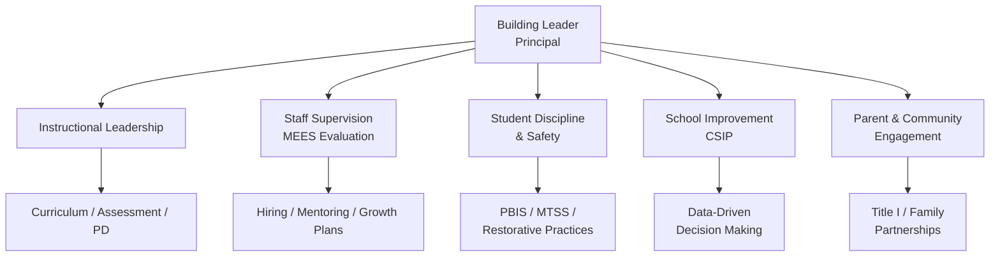

# Building Leaders — Missouri K-12 Education Reference

## Table of Contents
1. Principal Certification & Role
2. Comprehensive School Improvement Plan (CSIP)
3. Staff Evaluation & Supervision
4. Student Discipline Policy
5. School Safety
6. Title I Building-Level Implementation
7. Parent & Family Engagement
8. Data-Driven Decision Making
9. Teacher Hiring & Induction
10. School Culture & Climate

---

## 1. Principal Certification & Role

### Certification Requirements
- **Master's degree** in educational administration or related field
- Completion of a DESE-approved principal preparation program
- Passing score on the **Missouri Content Assessment for Principals** (or approved equivalent)
- At least **2 years of teaching experience** (or equivalent educational experience per DESE guidelines)
- Background check (FBI fingerprint + Missouri Highway Patrol)

### Principal Certificate Types
- **Initial Administrator Certificate:** 4 years; requires mentoring and professional development
- **Career Continuous Administrator Certificate:** lifetime with renewal; requires ongoing PD

### Core Responsibilities
- Instructional leadership (curriculum, assessment, professional development)
- Staff supervision, evaluation, and growth
- School operations (budget, facilities, safety, scheduling)
- Student discipline and culture
- Parent and community engagement
- Compliance with state and federal requirements
- School improvement planning and implementation

---

## 2. Comprehensive School Improvement Plan (CSIP)

### Requirement
Every Missouri public school is required to develop and maintain a CSIP (RSMo 160.526). The CSIP is the primary vehicle for school improvement under MSIP 6.

### Required Components
1. **School profile data:** demographics, enrollment, attendance, assessment results, discipline data, graduation rate (high school), teacher qualifications
2. **Needs assessment:** analysis of strengths and areas for improvement based on data
3. **Goals:** specific, measurable improvement goals aligned to MSIP 6 standards
4. **Strategies/action steps:** evidence-based strategies to achieve each goal
5. **Professional development plan:** PD aligned to improvement goals
6. **Resources:** budget, personnel, materials needed
7. **Timeline:** implementation schedule with milestones
8. **Monitoring plan:** how progress will be tracked (formative data points)
9. **Evaluation plan:** how effectiveness will be measured (summative data)
10. **Stakeholder engagement:** evidence of parent, teacher, student, and community input

### CSIP Cycle
- Reviewed and updated **annually**
- Full revision aligned to MSIP 6 review cycle (typically every 5 years)
- Submitted to the district; district compiles building CSIPs into the **District School Improvement Plan (DSIP)**

### Stakeholder Engagement Requirements
- CSIP development must include input from: teachers, parents, students (at secondary level), community members, and building leadership
- ESSA requires Title I schools to jointly develop school-parent compacts and parent engagement policies

---

## 3. Staff Evaluation & Supervision

### Administrator's Role in MEES
Principals (or designees) serve as primary evaluators for teachers:
- Conduct formal observations (pre-conference, observation, post-conference)
- Provide written feedback aligned to Missouri Teaching Standards
- Develop growth plans for teachers performing below proficiency
- Document evaluation evidence and maintain records
- Ensure non-tenured teachers receive annual evaluations
- Ensure tenured teachers receive evaluations per district schedule (minimum every 3 years)

### Mentoring & Induction
- Districts are required to provide a mentoring program for new teachers (RSMo 168.028)
- Principals assign mentors and monitor the mentoring relationship
- Mentoring is a requirement for progression from IPC to CCPC

### Addressing Underperformance
1. Document specific concerns with evidence (observations, data, complaints)
2. Provide clear expectations and support (coaching, PD, resources)
3. Develop a formal improvement plan with measurable targets and timeline
4. Monitor progress at defined intervals
5. If insufficient improvement → progressive discipline per board policy
6. Non-tenured teachers: non-renewal by April 15 (RSMo 168.126)
7. Tenured teachers: termination for cause with due process (RSMo 168.114)

---

## 4. Student Discipline Policy

### Board Policy Requirements
Every district must adopt a written discipline policy (RSMo 160.261) that includes:
- Code of conduct with clearly defined prohibited behaviors
- Range of consequences for violations
- Due process procedures for suspensions and expulsions
- Provisions for students with disabilities (IDEA/504)
- Reporting requirements for serious incidents (weapons, drugs, violence)

### Mandatory Reporting to Law Enforcement
RSMo 160.261 requires reporting to law enforcement when a student is found to have committed:
- First or second degree assault
- Possession of a weapon on school property
- Distribution of drugs on school property
- Arson or attempted arson

### Suspension/Expulsion Authority
- **Principals** may suspend students for up to **10 school days** per incident
- **Superintendent/Board** authority required for suspensions exceeding 10 days or expulsion
- **180-day suspension:** common long-term suspension in Missouri for serious offenses
- **Expulsion:** permanent removal from the district; board action required

### Alternative Discipline Approaches
- Restorative practices (circles, conferences, mediation)
- In-school suspension with academic support
- Behavioral contracts
- Referral to counseling or community services
- Saturday school
- Community service
- MTSS/PBIS framework integration

---

## 5. School Safety

### School Safety Plans (RSMo 160.660)
Every school building must have a **school safety plan** that includes:
- Building-level crisis response procedures
- Protocols for active threat situations (Run/Hide/Fight or similar framework)
- Severe weather / natural disaster procedures
- Medical emergency protocols
- Communication plan (internal and external)
- Reunification procedures
- Annual review and update

### Required Drills
| Drill Type | Frequency | Notes |
|-----------|-----------|-------|
| Fire drill | Monthly (minimum 2/semester) | Per State Fire Marshal requirements |
| Tornado/severe weather | Minimum 2/year | |
| Earthquake | Minimum 2/year | Missouri is in New Madrid Seismic Zone |
| Lockdown/active threat | Minimum 2/year | RSMo 160.660 |
| Bus evacuation | Minimum 1/year | For students who ride buses |

### Mandatory Reporting
- **Child abuse/neglect:** all school employees are mandated reporters (RSMo 210.115). Reports go to the Children's Division hotline (1-800-392-3738) or local law enforcement.
- **Threats of violence:** must be reported to administration and may require law enforcement notification
- **Suicide risk:** follow district protocol for suicide risk assessment and intervention; referral to crisis services

### School Resource Officers (SROs)
- Many Missouri districts employ SROs through partnerships with local law enforcement
- MOU (Memorandum of Understanding) required defining SRO role, authority, and limitations
- SROs should not be used as school disciplinarians for routine student behavior issues

---

## 6. Title I Building-Level Implementation

### Two Models

**Schoolwide Program (SWP):** available to schools where 40%+ students are from low-income families
- Comprehensive reform strategy serving ALL students in the building
- Requires a comprehensive needs assessment
- Must implement evidence-based strategies
- Flexible use of Title I funds for whole-school improvement

**Targeted Assistance (TA):** for schools below 40% poverty threshold (or schools choosing this model)
- Serves only identified eligible students (based on academic need)
- More restrictive use of funds
- Must identify students using multiple, educationally related criteria

### Title I Building Requirements
- Annual parent notification of school's Title I status
- School-Parent Compact (jointly developed)
- Parent and Family Engagement Policy
- Teacher qualification notifications (parent right-to-know under ESSA)
- Annual Title I meeting for parents
- Schools identified for Comprehensive Support and Improvement (CSI) or Targeted Support and Improvement (TSI) have additional requirements

---

## 7. Parent & Family Engagement

### ESSA Requirements (Title I Schools)
- Develop and distribute a written parent engagement policy
- Jointly develop a school-parent compact outlining shared responsibilities
- Hold an annual Title I meeting to explain programs and parent rights
- Provide materials and training to help parents support learning at home
- Ensure communications are in a language and format parents can understand
- Reserve a portion of Title I allocation for parent engagement activities (1% at the district level if allocation exceeds $500,000)

### Best Practices
- Regular two-way communication (not just newsletters — include surveys, conferences, home visits)
- Parent-friendly meeting times and locations
- Translation and interpretation services for non-English-speaking families
- Family literacy and education programs
- Parent representation on school improvement teams
- Culturally responsive engagement strategies
- Technology-accessible communication (portals, apps, text messaging)

---

## 8. Data-Driven Decision Making

### Key Data Sources for Principals
| Data Type | Source | Use |
|-----------|--------|-----|
| Assessment | MAP, EOC, district benchmarks, classroom assessments | Identify academic strengths/gaps, target interventions |
| Attendance | SIS (Student Information System) | Flag chronic absenteeism, target outreach |
| Discipline | SIS discipline module | Identify patterns, evaluate policy effectiveness |
| Teacher effectiveness | MEES observations, student growth data | Inform PD, staffing, coaching |
| School climate | Climate surveys (students, staff, parents) | Guide culture initiatives |
| Demographic | MOSIS/Core Data | Equity analysis, program eligibility |

### Data Cycle
1. **Collect** — gather data from multiple sources
2. **Analyze** — disaggregate by subgroup (race, gender, disability, ELL, income)
3. **Interpret** — identify root causes, not just symptoms
4. **Plan** — develop targeted strategies based on findings
5. **Implement** — execute strategies with fidelity
6. **Monitor** — use formative data to check progress
7. **Evaluate** — assess impact and adjust

---

## 9. Teacher Hiring & Induction

### Hiring Process
1. Post position (internal and external)
2. Screen applications for certification, experience, fit
3. Interview panel (include teachers, administrators, potentially parent/community representatives)
4. Reference checks
5. Background check (RSMo 168.133) — required before employment
6. Board approval
7. Contract issuance

### Induction Program Requirements (RSMo 168.028)
- All new teachers (first year in the district or first year teaching) must participate in a district mentoring/induction program
- Mentors should be experienced, effective teachers in the same or similar content/grade level
- Induction programs typically include: mentor pairing, regular meetings, classroom observations (of and by the new teacher), professional development, and gradual release of responsibilities

---

## 10. School Culture & Climate

### PBIS (Positive Behavioral Interventions and Supports)
Missouri's PBIS framework (MO SW-PBS) is a statewide initiative:
- Tier 1: Universal supports for all students (schoolwide expectations, teaching behavioral expectations, positive reinforcement, consistent consequences)
- Tier 2: Targeted supports for at-risk students (Check-In/Check-Out, social skills groups, mentoring)
- Tier 3: Intensive, individualized supports (FBA/BIP, wraparound services, therapy)

### MTSS (Multi-Tiered System of Supports)
MTSS integrates academic and behavioral support:
- Universal screening (all students, multiple times per year)
- Progress monitoring (frequent data collection for students receiving interventions)
- Evidence-based interventions at each tier
- Data-based decision making for tier movement
- Team-based problem solving

### Trauma-Informed Practices
- Recognize the prevalence and impact of ACEs (Adverse Childhood Experiences)
- Create physically and emotionally safe environments
- Build trusting relationships between staff and students
- Support staff wellness and secondary trauma awareness
- Avoid re-traumatization through punitive or shaming practices
- Collaborate with community mental health providers
