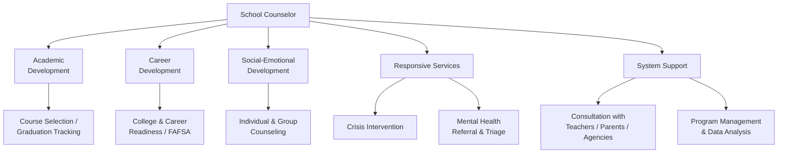

# School Counseling — Missouri K-12 Education Reference

## Table of Contents
1. Missouri Comprehensive School Counseling Program
2. ASCA National Model
3. Individual Student Planning
4. Responsive Services
5. System Support
6. School Counselor Certification
7. Caseload & Ratios
8. College & Career Readiness Counseling
9. Mental Health Referral & Triage
10. Crisis Counseling
11. Group Counseling
12. Ethical & Legal Considerations
13. School Counselor Evaluation
14. Elementary vs. Secondary Counseling
15. Non-Counseling Duties (Advocacy)

---

## 1. Missouri Comprehensive School Counseling Program

### Overview
Missouri's school counseling framework is aligned to the ASCA (American School Counselor Association) National Model and organized around three domains: academic, career, and social-emotional development.

### Missouri School Counseling Standards
DESE has adopted standards for school counseling programs that include:
- Student standards: knowledge, attitudes, and skills students acquire through the counseling program
- Program standards: structural components, delivery methods, management, and accountability
- Ethical standards: aligned to ASCA Ethical Standards for School Counselors

### Program Components
| Component | % of Time (ASCA Recommendation) | Description |
|-----------|--------------------------------|-------------|
| **Direct student services** | 80%+ | Instruction, appraisal/advisement, counseling |
| **Indirect student services** | Included in 80% | Referrals, consultation, collaboration |
| **Program management** | ≤20% | Planning, data analysis, program evaluation, fair-share duties |

---

## 2. ASCA National Model

### Four Components
1. **Define** — program focus (vision, mission, beliefs, student standards)
2. **Manage** — assessments, tools, action plans, calendars, data tracking
3. **Deliver** — direct and indirect student services
4. **Assess** — program results, counselor competency, counselor performance

### ASCA Mindsets & Behaviors
ASCA has defined student standards organized as:
- **Mindsets** (M1-M6): beliefs about self, learning, and growth (e.g., "Belief in development of whole self," "Self-confidence in ability to succeed")
- **Behaviors:** learning strategies (B-LS), self-management skills (B-SMS), social skills (B-SS)

### Delivery System
| Method | Description |
|--------|-----------|
| **Classroom instruction** | School counselor delivers or co-delivers lessons on academic skills, career exploration, SEL, conflict resolution, study skills, college readiness |
| **Small-group counseling** | 4-8 students with shared needs (grief, divorce, social skills, anger management, transition, academic support) |
| **Individual counseling** | Short-term, solution-focused counseling for students experiencing barriers to learning |
| **Individual student planning** | Academic planning, course selection, career exploration, post-secondary planning |
| **Consultation** | Counselor consults with parents, teachers, administrators, and community agencies |
| **Referral** | Connect students and families to community resources (mental health, social services, medical, legal) |
| **Collaboration** | Work with school teams (IEP, 504, MTSS, PBIS, grade-level, crisis) |

---

## 3. Individual Student Planning

### Academic Planning
- **Course selection guidance** — helping students choose courses aligned to graduation requirements, interests, and post-secondary goals
- **Graduation tracking** — monitoring credit accumulation, [A+ eligibility](../roles/students.md), testing requirements ([graduation audit template](../../templates/counselor/graduation-audit.md))
- **Individual Learning Plans (ILPs)** — career-connected academic plans (see `references/career-pathways.md`)
- **Schedule changes** — managing student requests for schedule modifications
- **Advanced coursework advising** — AP, IB, dual credit, honors course recommendations
- **Credit recovery planning** — for students behind in credits

### Career Planning
- **Career assessments** — interest inventories, aptitude assessments, values clarification (via Missouri Connections platform)
- **Career exploration activities** — research, job shadowing, informational interviews, career fairs
- **Post-secondary planning** — college applications, financial aid, military options, trade schools, workforce entry
- **CTE pathway advising** — connecting students to CTE programs and industry credentials

### Social-Emotional Planning
- **Transition support** — elementary to middle, middle to high school, high school to post-secondary
- **Goal setting** — academic and personal goal setting with regular check-ins
- **Self-advocacy skills** — teaching students to communicate needs and access support

---

## 4. Responsive Services

### Individual Counseling
- Short-term (typically 4-8 sessions)
- Solution-focused, strengths-based approach
- Common concerns: academic stress, peer conflict, family changes, grief, anxiety, self-esteem, identity exploration, behavioral issues
- NOT long-term therapy (school counselors refer out for clinical treatment)
- Document sessions in confidential counseling notes (separate from education records)

### Small-Group Counseling
Common group topics:
- Grief and loss
- Family changes (divorce, separation, incarceration of a parent)
- Social skills development
- Anger management / emotional regulation
- Friendship / relationship skills
- Study skills and academic motivation
- Transition (new students, grade transitions)
- Self-harm prevention
- Substance use awareness

### Crisis Response
See `references/health-wellness.md` for detailed crisis protocols. School counselor's role:
- Member of the Building Crisis Team
- Conduct suicide risk screenings (C-SSRS, ASQ)
- Provide immediate emotional support
- Contact parents/guardians
- Coordinate referrals to community crisis services
- Facilitate re-entry after a crisis event
- Support postvention activities (after a student death, community trauma)

### Peer Mediation / Conflict Resolution
- School counselors may train and supervise peer mediators
- Mediation used for interpersonal conflicts (not bullying — power imbalance makes mediation inappropriate for bullying)
- Structured process: ground rules → each party shares perspective → identify needs → brainstorm solutions → agreement

---

## 5. System Support

### Consultation
| With Whom | Focus |
|-----------|-------|
| **Teachers** | Student behavior strategies, classroom management, academic interventions, recognizing warning signs |
| **Parents/guardians** | Child development, parenting strategies, school navigation, resource connection |
| **Administrators** | Discipline alternatives, school climate, program development, data analysis |
| **Community agencies** | Coordinating services for students/families (mental health, housing, food, medical) |

### Program Management
- Develop and maintain the annual school counseling program calendar
- Analyze school data to identify student needs (attendance, grades, discipline, assessment, climate surveys)
- Create and implement action plans for each domain (academic, career, social-emotional)
- Evaluate program effectiveness using results data (process, perception, outcome data)
- Advocate for program resources and reasonable counselor-to-student ratios

### Advisory Council
Best practice: establish a school counseling advisory council with stakeholders (parents, teachers, students, administrators, community members) to review program goals, provide input, and advocate for the program.

---

## 6. School Counselor Certification

### Missouri Requirements
- **Master's degree** in school counseling from a DESE-approved or CACREP-accredited program
- **Practicum and internship** (600+ hours typically)
- **Missouri School Counselor Certificate** (K-12)
- **Background check** (FBI fingerprint + Missouri Highway Patrol)
- **Content assessment** (Missouri Content Assessment for School Counselors or approved equivalent)

### National Certification
- **NBCC (National Board for Certified Counselors):** NCC (National Certified Counselor)
- **NBCC:** NCSC (National Certified School Counselor)
- National certification is optional but demonstrates advanced competency

### Professional Development
- DESE requires ongoing PD for certificate maintenance
- Missouri School Counselor Association (MSCA) provides conferences and professional learning
- ASCA provides national webinars, conferences, and resources
- RPDC offerings relevant to school counseling

---

## 7. Caseload & Ratios

### ASCA Recommendation
**1 school counselor : 250 students**

### Missouri Reality
Many Missouri districts exceed this ratio significantly:
- Urban districts may have ratios of 1:400-500+
- Rural districts may have even higher ratios (one counselor for an entire K-12 building or district)
- Counselor shortages are a statewide concern

### Impact of High Ratios
- Less time for individual counseling and small groups
- More time consumed by non-counseling duties (testing, scheduling, lunch duty)
- Reduced capacity for proactive programming (classroom lessons, career planning)
- Higher counselor burnout and turnover

---

## 8. College & Career Readiness Counseling

### College Application Process
| Task | Timing | Counselor Role |
|------|--------|---------------|
| **Career exploration** | Grades 6-10 | Facilitate assessments, career research, course planning |
| **College search** | Grades 10-11 | Help students identify college matches (academic, financial, social fit) |
| **Standardized testing** | Grade 11-12 | ACT/SAT preparation, fee waivers, registration support |
| **Application support** | Grade 12 (fall) | Transcript requests, recommendation letters, essay review, application assistance |
| **Financial aid** | Grade 12 (Oct-Feb) | FAFSA completion, scholarship search, financial aid award comparison |
| **Decision support** | Grade 12 (spring) | Compare offers, commit, enrollment deposits, transition planning |

### FAFSA Completion
- Missouri has emphasized FAFSA completion rates as a school quality indicator
- A+ Scholarship requires FAFSA completion (or waiver)
- School counselors host FAFSA completion events and provide individual assistance
- FAFSA opens October 1 annually; Missouri priority deadline typically February 1
- FAFSA Simplification (2024-25 forward) reduces questions and uses IRS data transfer

### First-Generation College Students
Special attention needed for students whose parents did not attend college:
- Navigate unfamiliar application processes
- Explain financial aid and scholarships
- Address imposter syndrome and belonging concerns
- Connect with college access programs (TRIO, Upward Bound, College Bound)
- Provide application fee waivers

---

## 9. Mental Health Referral & Triage

### When to Refer Out
School counselors provide short-term support but refer to community providers when:
- Student needs long-term or intensive therapy (more than 6-8 sessions)
- Student presents with clinical-level symptoms (major depression, PTSD, psychosis, eating disorders, substance dependence)
- Student needs psychiatric evaluation (medication management)
- Student needs specialized treatment (trauma-focused CBT, EMDR, family therapy, substance treatment)
- Student's needs exceed the counselor's scope of competence

### Referral Process
1. Assess the student's needs (screening tools, interview, observation)
2. Consult with school psychologist or social worker if available
3. Contact parent/guardian to discuss concerns and recommend referral
4. Provide a list of community resources (agencies, providers, hotlines)
5. Help the family navigate insurance, eligibility, and access
6. Obtain release of information (with parent consent) to coordinate with the community provider
7. Follow up with the family and student regularly

### Community Mental Health Resources (Missouri)
- Community mental health centers (Comprehensive Mental Health Services, Behavioral Health Response, etc.)
- Regional federally qualified health centers (FQHCs) with behavioral health
- Missouri Department of Mental Health (DMH) — local offices
- Private therapists and counseling agencies
- University training clinics (sliding scale)
- Crisis services: 988 Suicide & Crisis Lifeline, Crisis Text Line

---

## 10. Crisis Counseling

### School Counselor's Crisis Role
- Immediate emotional stabilization for affected students
- Active listening, validation, and containment
- Assess for imminent risk (suicidality, self-harm, harm to others)
- Coordinate with crisis team, administration, and emergency services
- Contact parents/guardians
- Provide follow-up counseling and check-ins
- Facilitate re-entry after absence related to crisis

### Psychological First Aid (PFA)
Evidence-informed approach for crisis response:
1. **Contact and engagement** — approach the person with compassion
2. **Safety and comfort** — ensure physical and emotional safety
3. **Stabilization** — calm overwhelmed individuals
4. **Information gathering** — understand the person's needs
5. **Practical assistance** — help with immediate needs (food, shelter, communication)
6. **Connection with social supports** — connect to family, friends, community
7. **Information on coping** — provide psychoeducation on normal stress reactions
8. **Linkage to collaborative services** — connect to ongoing support

---

## 11. Group Counseling

### Group Formation
- Screen potential members (individual pre-group interview)
- Obtain parent/guardian consent (passive or active, per district policy)
- Group size: 4-8 members (smaller for younger students)
- Duration: typically 6-10 sessions, 20-45 minutes per session (age-dependent)
- Closed groups preferred (same members throughout)

### Group Stages (Tuckman)
1. Forming — orientation, getting to know each other, establishing norms
2. Storming — resistance, testing boundaries, power dynamics
3. Norming — cohesion, trust building, group identity
4. Performing — productive work, mutual support, skill practice
5. Adjourning — closure, reflection, transferring skills to daily life

---

## 12. Ethical & Legal Considerations

### ASCA Ethical Standards (Key Principles)
- **Student autonomy** — respect student decision-making capacity (age-appropriate)
- **Confidentiality** — counseling conversations are confidential with specific exceptions:
  - Imminent danger to self or others (duty to warn/protect)
  - Suspected child abuse or neglect (mandated reporting — RSMo 210.115)
  - Court order
  - Student consent to share (or parent consent for minors in some circumstances)
- **Informed consent** — students and parents understand the counseling process and its limits
- **Dual relationships** — avoid conflicts of interest
- **Cultural competence** — practice within cultural context
- **Professional boundaries** — maintain appropriate relationships with students

### Confidentiality with Minors
- Missouri law does not grant minors an absolute right to confidential counseling (except in specific clinical contexts)
- Best practice: explain confidentiality limits at the outset of counseling
- Balance student trust with parental rights — use professional judgment
- Consult with supervisor or ethics board when uncertain
- When breaking confidentiality is necessary, inform the student first (when safe to do so)

### Records
- Counseling notes (sole possession records) are generally exempt from FERPA if kept solely for the counselor's own use and not shared
- Once counseling notes are shared with others or placed in the student's education file, they become education records subject to FERPA
- Maintain notes separately from cumulative files

---

## 13. School Counselor Evaluation

### DESE Evaluation
School counselors in Missouri may be evaluated using:
- Missouri Educator Evaluation System (MEES) adapted for counselors, OR
- A locally-developed evaluation instrument aligned to ASCA standards

### ASCA School Counselor Performance Standards
1. Program planning, design, implementation
2. Direct student services
3. Indirect student services
4. Use of data
5. Use of time
6. Advocacy, leadership, collaboration
7. Ethical practice
8. Professionalism

---

## 14. Elementary vs. Secondary Counseling

### Elementary (K-5)
| Focus | Activities |
|-------|-----------|
| **Classroom guidance** | SEL lessons, conflict resolution, career awareness, study skills, kindness/anti-bullying |
| **Individual counseling** | Play-based or talk-based counseling for social-emotional concerns |
| **Small groups** | Friendship, grief, family changes, self-regulation, new student transition |
| **Parent consultation** | Child development, behavior strategies, community resources |
| **Crisis response** | Abuse/neglect reporting, student safety concerns |
| **Transition** | Kindergarten readiness, transition to middle school |

### Secondary (6-12)
| Focus | Activities |
|-------|-----------|
| **Academic advising** | Course selection, graduation tracking, credit recovery planning |
| **Career development** | Career assessments, ILP, Missouri Connections, CTE advising, work-based learning coordination |
| **College readiness** | College search, applications, FAFSA, scholarships, test preparation |
| **Individual counseling** | Peer relationships, identity, anxiety, depression, family, substance use, academic stress |
| **Small groups** | Academic motivation, social skills, grief, anger management, substance awareness |
| **Crisis response** | Suicide risk screening, threat assessment team, crisis intervention |
| **Transition** | High school orientation (9th grade), post-secondary transition (12th grade) |

---

## 15. Non-Counseling Duties (Advocacy)

### ASCA Position: Appropriate vs. Inappropriate Duties
**Appropriate:**
- Classroom guidance lessons, individual/group counseling, academic planning, crisis response, consultation, referral, program management, data analysis, leadership team participation

**Inappropriate (should be minimized or eliminated):**
- Test coordination and administration (proctoring)
- Substitute teaching
- Lunch/bus/hall duty
- Discipline referral processing (not the same as counseling after discipline)
- Clerical/data entry tasks
- Master schedule building (counselors may advise but should not be solely responsible)
- IEP case management (school counselors may participate in IEP teams but should not serve as case manager)

### Advocacy
- ASCA recommends counselors spend 80%+ of time in direct/indirect student services
- School counselors should advocate with administrators and boards for appropriate use of their time
- Use time studies (ASCA Use of Time calculator) to document how time is spent
- Present data showing the impact of counseling activities on student outcomes
- Missouri School Counselor Association (MSCA) advocates at the state level for appropriate counselor roles and ratios
