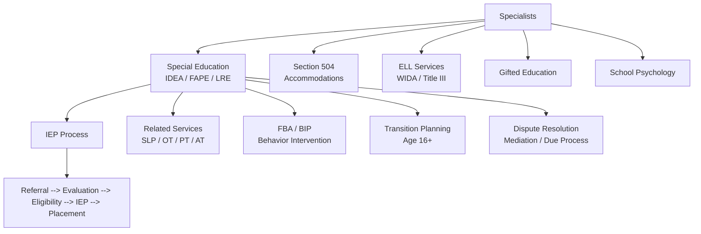

# Specialists — Missouri K-12 Education Reference

## Table of Contents
1. Special Education (IDEA) Overview
2. IEP Process
3. Section 504 Plans
4. 13 IDEA Disability Categories
5. Related Services
6. English Language Learners (ELL)
7. Gifted Education
8. School Counseling
9. School Psychology
10. Behavior Intervention (FBA/BIP)
11. Transition Planning
12. Assistive Technology
13. Dispute Resolution

---

## 1. Special Education (IDEA) Overview

### Federal Foundation
The Individuals with Disabilities Education Act (IDEA) guarantees every eligible child with a disability a Free Appropriate Public Education (FAPE) in the Least Restrictive Environment (LRE).

### Missouri State Plan
Missouri's State Plan for Special Education is administered by DESE's Office of Special Education. Missouri follows federal IDEA regulations (34 CFR Part 300) and supplements with state rules (5 CSR 20-300).

### Key IDEA Principles
1. **FAPE** — Free Appropriate Public Education
2. **LRE** — Least Restrictive Environment (educated with non-disabled peers to the maximum extent appropriate)
3. **Child Find** — districts must identify, locate, and evaluate all children with disabilities (birth-21)
4. **Zero Reject** — no child can be excluded from public education due to disability
5. **Procedural Safeguards** — parents have protected rights throughout the process
6. **Appropriate Evaluation** — nondiscriminatory, comprehensive evaluation before placement

### Eligibility Ages
- **Part B (3-21):** school-age special education services
- **Part C (Birth-3):** First Steps early intervention program (Missouri's Part C provider)
- **Transition from Part C to Part B:** at age 3, child transitions from First Steps to school district (if eligible for Part B)

---

## 2. IEP Process

### Timeline and Steps

| Step | Description | Timeline |
|------|-------------|----------|
| **1. Referral** | Parent, teacher, or other party requests evaluation | Document date of request |
| **2. Consent for evaluation** | District provides Prior Written Notice (PWN); parent signs consent | District must respond promptly |
| **3. Evaluation** | Comprehensive, multidisciplinary assessment | Must be completed within **60 calendar days** of receiving parent consent |
| **4. Eligibility determination** | Team reviews evaluation data, determines if child meets IDEA criteria | Within evaluation timeline |
| **5. IEP development** | Team (including parent) writes the IEP | Within 30 calendar days of eligibility determination |
| **6. Placement** | IEP team determines placement based on LRE | Concurrent with IEP development |
| **7. Implementation** | Services begin per the IEP | As soon as possible after IEP is finalized |
| **8. Annual review** | IEP team reviews and revises the IEP | At least annually (every 365 days) |
| **9. Triennial reevaluation** | Comprehensive reevaluation to determine continued eligibility | Every 3 years (may be waived by agreement) |

### IEP Required Components (IDEA §300.320)
1. Present levels of academic achievement and functional performance (PLAAFP)
2. Measurable annual goals (and short-term objectives/benchmarks for students on alternate assessments)
3. How progress toward goals will be measured and reported
4. Special education services, related services, and supplementary aids/services
5. Explanation of extent child will NOT participate with non-disabled peers
6. Accommodations for state/district assessments (or justification for alternate assessment)
7. Service dates, frequency, location, and duration
8. Transition services (beginning no later than the IEP in effect when student turns 16)
9. Transfer of rights at age of majority (age 18 in Missouri)

### IEP Team Members
- Parent(s)/guardian(s)
- At least one regular education teacher (if the child is or may be in regular education)
- At least one special education teacher or provider
- LEA representative (can make resource commitments)
- Individual who can interpret evaluation results
- The student (when appropriate, required for transition-age students)
- Other individuals with knowledge or expertise (at parent or district invitation)

### Extended School Year (ESY)
IEP teams must consider ESY services when there is evidence of:
- Significant regression and slow recoupment of skills during breaks
- Emerging or breakthrough skills at risk of being lost
- The nature/severity of the disability warrants year-round services

---

## 3. Section 504 Plans

### Section 504 of the Rehabilitation Act of 1973
Prohibits discrimination against individuals with disabilities in programs receiving federal financial assistance.

### 504 vs. IEP Comparison
| Feature | Section 504 | IDEA/IEP |
|---------|-------------|----------|
| Law | Rehabilitation Act §504 | IDEA |
| Eligibility | Physical or mental impairment that substantially limits a major life activity | Meets 1 of 13 disability categories AND needs specially designed instruction |
| Plan | 504 Accommodation Plan | Individualized Education Program |
| Services | Accommodations (level the playing field) | Specially designed instruction + related services |
| Funding | No additional federal funding | IDEA Part B funding |
| Due process | OCR complaint; impartial hearing | State complaint; mediation; due process hearing |

### Common 504 Accommodations
- Extended time on tests
- Preferential seating
- Modified assignments (reduced quantity, not rigor)
- Behavioral supports
- Health-related accommodations (diabetes management, medication, allergies)
- Assistive technology
- Environmental modifications

### 504 Process
1. Referral (parent, teacher, or other)
2. Evaluation (may use existing data; must be sufficient to determine impairment and impact)
3. Eligibility determination by a 504 team
4. Development of 504 plan with accommodations
5. Implementation and monitoring
6. Annual review
7. Reevaluation before any significant change in placement

---

## 4. 13 IDEA Disability Categories

Missouri recognizes all 13 federal IDEA disability categories:

1. **Autism Spectrum Disorder**
2. **Deaf-Blindness**
3. **Deafness**
4. **Emotional Disturbance**
5. **Hearing Impairment**
6. **Intellectual Disability**
7. **Multiple Disabilities**
8. **Orthopedic Impairment**
9. **Other Health Impairment** (e.g., ADHD, epilepsy, diabetes, Tourette's)
10. **Specific Learning Disability** (e.g., dyslexia, dyscalculia, dysgraphia)
11. **Speech or Language Impairment**
12. **Traumatic Brain Injury**
13. **Visual Impairment (including blindness)**

### Young Child with a Developmental Delay (YC-DD)
Missouri also uses the category "Young Child with a Developmental Delay" for children ages 3-5 who demonstrate developmental delays but may not yet meet criteria for a specific disability category. This category is not available after age 5 (must be reclassified or exited).

---

## 5. Related Services

Related services are supportive services required for a student to benefit from special education:

| Service | Provider | Common For |
|---------|----------|-----------|
| Speech-Language Therapy | SLP (CCC-SLP) | Communication disorders, articulation, language, fluency, voice |
| Occupational Therapy | OT (OTR/L) | Fine motor, sensory processing, self-care, handwriting |
| Physical Therapy | PT (licensed) | Gross motor, mobility, positioning, accessibility |
| School Psychology | School Psychologist | Evaluation, consultation, crisis intervention, counseling |
| School Counseling | School Counselor | Social-emotional, academic, career development |
| Social Work | School Social Worker | Family engagement, community resources, attendance, behavioral |
| Audiology | Audiologist | Hearing evaluation, FM systems, cochlear implant support |
| Vision Services | TVI (Teacher of Visually Impaired) | Braille, orientation & mobility, assistive technology |
| Interpreting | Sign language interpreter | Deaf/hard of hearing students |
| Transportation | District | Special transportation to/from school and services |
| Nursing | School nurse (RN/LPN) | Health procedures, medication, specialized health care |
| Assistive Technology | AT Specialist | Device evaluation, training, implementation |

### Service Delivery Models
- **Direct service:** specialist works directly with the student
- **Consultation:** specialist advises teachers/staff on implementation
- **Co-teaching/push-in:** specialist provides services within the general education classroom
- **Pull-out:** student is removed from general education setting for services

---

## 6. English Language Learners (ELL)

### Identification Process
1. **Home Language Survey (HLS):** administered at enrollment; identifies potential ELLs
2. **English Language Proficiency Screener:** students flagged by HLS are screened (WIDA Screener in Missouri)
3. **Placement:** ELL services provided based on screening results

### WIDA Standards and Assessment
- Missouri is a member of the **WIDA Consortium**
- **WIDA ACCESS for ELLs:** annual English language proficiency assessment (listening, speaking, reading, writing)
- **WIDA Screener:** used for initial identification
- **Proficiency levels:** 1-Entering, 2-Emerging, 3-Developing, 4-Expanding, 5-Bridging, 6-Reaching

### ELL Program Models (Common in Missouri)
- **Sheltered instruction / SIOP:** content instruction adapted for English learners
- **Pull-out ESL:** dedicated English language instruction outside the general classroom
- **Push-in ESL:** ESL teacher supports within the general classroom
- **Dual language / bilingual programs:** (limited availability in Missouri; more common in Kansas City, St. Louis metro)

### Exiting ELL Services
- Student must demonstrate English proficiency on ACCESS assessment (composite proficiency level per DESE criteria)
- Monitoring period of at least 2 years after exit
- Students may be re-entered into ELL services if they struggle during monitoring

### Title III
Federal funding for ELL services. Requires districts to:
- Implement effective language instruction educational programs
- Report ELL progress on ACCESS annually
- Provide parent notification of ELL identification and program placement (in a language parents understand)

---

## 7. Gifted Education

### Missouri Gifted Education (RSMo 162.720-162.725)
- DESE provides guidance on gifted education; it is not mandated as a right (unlike special education under IDEA)
- Districts are encouraged to identify and serve gifted students
- Gifted services are funded through a combination of state gifted education funding and local funds

### Identification
- Multiple criteria recommended: standardized assessments, teacher nomination, parent nomination, portfolio review, performance data
- No single test score should be used as the sole criterion
- Attention to equitable identification across racial, ethnic, and socioeconomic groups

### Service Models
- Cluster grouping within regular classrooms
- Pull-out enrichment programs
- Advanced/accelerated coursework
- Independent study
- Mentorship programs
- Grade acceleration (whole grade or subject-specific)

---

## 8. School Counseling

### Missouri School Counseling Framework
Aligned to the ASCA (American School Counselor Association) National Model:
- **Academic development** — support student achievement
- **Career development** — career awareness, exploration, planning
- **Social-emotional development** — personal/social skills, mental health awareness

### School Counselor Certification
- Master's degree in school counseling from an approved program
- Missouri School Counselor Certificate (K-12)
- Required coursework in counseling theories, group work, career development, assessment, ethics, practicum/internship

### Recommended Ratios (ASCA)
- 1 school counselor : 250 students
- Missouri averages are higher than this recommendation in many districts

### Mandatory Duties vs. Non-Counseling Tasks
ASCA guidelines distinguish between appropriate counseling duties and non-counseling tasks (e.g., test coordination, scheduling, lunch duty). Missouri counselors are encouraged to spend 80%+ of time in direct/indirect student services.

---

## 9. School Psychology

### Role
- Psychoeducational evaluation (intelligence, achievement, behavioral, social-emotional)
- Consultation with teachers, parents, and teams
- Intervention design and progress monitoring
- Crisis prevention and intervention
- Data-based decision making for MTSS/RTI

### Certification
- Specialist-level degree (Ed.S.) minimum; many hold doctoral degrees
- Missouri requires certification through DESE as a School Psychological Examiner or School Psychologist
- National certification: NCSP (Nationally Certified School Psychologist) through NASP

---

## 10. Behavior Intervention (FBA/BIP)

### Functional Behavior Assessment (FBA)
Required when:
- A student's behavior impedes learning (theirs or others')
- Behavior results in disciplinary action triggering an MDR
- IEP team determines need for a behavioral assessment

FBA Process:
1. Define the target behavior in observable, measurable terms
2. Collect data: direct observation, interviews, record review, ABC data (Antecedent-Behavior-Consequence)
3. Identify the function of the behavior (attention, escape/avoidance, access to tangible, sensory)
4. Develop a hypothesis statement
5. Use findings to develop a Behavior Intervention Plan (BIP)

### Behavior Intervention Plan (BIP)
Components:
- Target behavior definition
- Hypothesis of function
- Replacement behaviors (functionally equivalent, appropriate alternatives)
- Prevention strategies (antecedent modifications)
- Teaching strategies (explicit instruction of replacement behaviors)
- Consequence strategies (reinforcement of replacement behavior, response to target behavior)
- Data collection plan
- Crisis/safety plan (if applicable)
- Review schedule

---

## 11. Transition Planning

### IDEA Transition Requirements
- Transition planning must begin **no later than the first IEP in effect when the student turns 16** (some states start at 14; Missouri follows the federal age-16 requirement)
- Must include appropriate measurable postsecondary goals in: education/training, employment, and (where appropriate) independent living
- Must include transition services and activities to help the student reach those goals
- Student must be invited to IEP meetings where transition is discussed

### Transition Service Areas
- Post-secondary education/training (college, vocational programs, certificate programs)
- Employment (competitive integrated employment, supported employment, sheltered workshops)
- Independent living skills (self-advocacy, daily living, financial literacy, community access)
- Community participation

### Agency Connections
- **Vocational Rehabilitation (VR):** Missouri Division of Vocational Rehabilitation — pre-employment transition services, job training, job placement
- **Developmental Disabilities:** Missouri Division of Developmental Disabilities — waiver services, residential, day programs
- **Centers for Independent Living (CILs):** independent living skills, advocacy, peer support

### Age of Majority
At age 18, educational rights transfer from parent to student in Missouri (unless guardianship or supported decision-making is established). Districts must notify the student and parent of this transfer at least one year before the student turns 18.

---

## 12. Assistive Technology

### IDEA Requirement
IEP teams must consider whether the student needs assistive technology devices and services as part of FAPE. This consideration is required for every IEP.

### AT Continuum (Low to High Tech)
- **No tech:** pencil grips, slant boards, visual schedules, fidget tools
- **Low tech:** graphic organizers, communication boards, magnifiers, timers
- **Mid tech:** audio recorders, calculators, adapted keyboards, FM systems
- **High tech:** speech-generating devices (AAC), screen readers, eye-gaze systems, specialized software

### Missouri Assistive Technology Resources
- **Missouri Assistive Technology (MoAT):** statewide AT program providing device loans, demonstrations, and training
- **DESE AT guidance:** available through the Office of Special Education

---

## 13. Dispute Resolution

### Options for Resolving Disagreements

| Mechanism | Filed With | Timeline | Outcome |
|-----------|-----------|----------|---------|
| **IEP Facilitation** | DESE (voluntary) | As scheduled | Facilitated agreement |
| **Mediation** | DESE | 30 days to schedule | Legally binding agreement if reached |
| **State Complaint** | DESE | 60 calendar days for resolution | Written decision; corrective action if violation found |
| **Due Process Hearing** | DESE | 30-day resolution period; 45-day decision timeline | Binding decision by hearing officer; appealable to court |

### Parent Rights (Procedural Safeguards)
Districts must provide a copy of procedural safeguards to parents:
- At initial referral or parent request for evaluation
- Upon receipt of the first state complaint or due process complaint in a school year
- At any time upon parent request

### Key Parent Safeguards
- Prior Written Notice (PWN) for any proposed or refused action
- Informed consent for evaluation, initial placement, and reevaluation
- Right to Independent Educational Evaluation (IEE)
- Right to examine all educational records
- Right to participate in meetings regarding identification, evaluation, placement, and FAPE
- Right to file a state complaint or request due process
- Right to mediation
- "Stay put" provision: during disputes, the child remains in the current placement unless both parties agree otherwise
