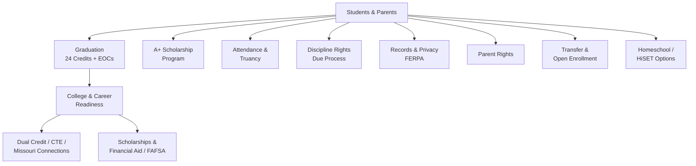

# Students & Parents — Missouri K-12 Education Reference

## Table of Contents
1. Graduation Requirements
2. A+ Schools Program
3. Student Attendance & Truancy
4. Student Discipline Rights
5. Student Records & Privacy (FERPA)
6. Parent Rights in Education
7. College & Career Readiness
8. Scholarships & Financial Aid
9. Transfer & Open Enrollment
10. Homeschool Requirements
11. GED/HiSET Equivalency

---

## 1. Graduation Requirements

**Minimum credits for graduation: 24 units of credit** (DESE minimum; districts may require more)

### Required Subject Areas
| Subject | Minimum Credits | Notes |
|---------|----------------|-------|
| English Language Arts | 4.0 | |
| Mathematics | 3.0 | Must include Algebra I or higher |
| Science | 3.0 | Must include at least 1 lab science |
| Social Studies | 3.0 | Must include American History, American Government, World History |
| Fine Arts | 1.0 | |
| Practical Arts | 1.0 | |
| Physical Education | 1.0 | |
| Health | 0.5 | |
| Personal Finance | 0.5 | RSMo 170.013 |
| Electives | 7.0 | |
| **Total** | **24.0** | |

**Key notes:**
- Districts may set higher requirements (e.g., 26 or 28 credits)
- Students with [IEPs](../roles/specialists.md) may have modified graduation requirements per their IEP team
- CPR instruction required prior to graduation (RSMo 170.310)
- Students must participate in MAP/EOC assessments (scores do not prevent graduation, but participation is required)

### End-of-Course (EOC) Exams
Missouri requires EOC exams in:
- English II
- Algebra I (or Algebra II if taken)
- Biology
- American Government

EOC scores are factored into course grades per local board policy. Participation is mandatory; passing is not a graduation gate (as of current DESE guidance).

### Early Graduation
Districts may allow early graduation. Student must meet all credit and assessment requirements. Board policy governs the process.

---

## 2. A+ Schools Program

**Statutory basis:** RSMo 160.545

### Eligibility Requirements (Student)
To qualify for A+ tuition reimbursement at participating Missouri community colleges and vocational/technical schools:

1. **Attend a designated A+ school** for 3 consecutive years prior to graduation (or the student's entire high school enrollment if fewer than 3 years)
2. **Graduate with a minimum 2.5 GPA** (unweighted, cumulative)
3. **Maintain 95% cumulative attendance** for grades 9-12
4. **Complete 50 hours of unpaid tutoring/mentoring** (documented by the school's A+ coordinator)
5. **Maintain good citizenship** — avoid the unlawful use of drugs, and avoid conviction of or guilty plea/nolo contendere to a felony or certain misdemeanors (per RSMo 160.545)
6. **Have made a good faith effort to secure all available federal financial aid** — complete the FAFSA (or FAFSA waiver if applicable)
7. **Score Proficient or Advanced on the Algebra I EOC** (or a qualifying score on the Math section of an approved alternative assessment)

### A+ Benefits
- Tuition reimbursement (not fees/books) at any Missouri public community college or vocational/technical school
- Benefits last for up to 48 months after high school graduation (students must use benefits within this window)
- Students must maintain a 2.5 GPA and attend full-time (12+ credit hours) at the college level
- Benefits are "last dollar" — applied after all other non-loan financial aid

### A+ Coordinator Role
Each A+ school designates a coordinator who tracks student eligibility, mentoring hours, citizenship, and GPA/attendance. Students should check with their A+ coordinator regularly.

---

## 3. Student Attendance & Truancy

### Compulsory Attendance
- **Ages 7 through 17** must attend school regularly (RSMo 167.031)
- Children may begin kindergarten if they turn 5 before August 1 of that school year
- Compulsory attendance exceptions: homeschool (RSMo 167.031.2), documented illness, religious holidays, suspension/expulsion, certain employment situations

### Truancy Definitions
- **Truant:** absent without valid excuse
- **Habitual truant:** absent without valid excuse for a specified number of days (typically 10+ in Missouri, but district policy varies)
- Schools must have truancy intervention plans; referral to juvenile court or Children's Division is a last resort

### Attendance Interventions (Typical Progression)
1. Parent notification (phone, letter) after 3-5 unexcused absences
2. School-based meeting with family (attendance team, counselor, social worker)
3. Written attendance contract/improvement plan
4. Referral to community resources (mental health, transportation, housing)
5. Referral to juvenile office or Division of Family Services (habitual truancy)

### Chronic Absenteeism
ESSA defines chronic absenteeism as missing 10% or more of school days (excused or unexcused). Missouri reports chronic absenteeism as part of MSIP 6 / school quality indicators.

---

## 4. Student Discipline Rights

### Due Process Requirements (RSMo 167.161, 167.171)

**Short-term suspension (≤10 school days):**
- Oral or written notice of charges
- Opportunity for the student to present their side
- Parent/guardian notification
- No formal hearing required, but must be fair

**Long-term suspension (>10 days) or expulsion:**
- Written notice of charges with specific allegations
- Right to a hearing before the board or designated hearing officer
- Right to be represented (by parent, advocate, or attorney)
- Right to present evidence and witnesses
- Right to cross-examine witnesses
- Written decision with findings of fact
- Right to appeal to the school board (if initial hearing was before a hearing officer)

### Discipline of Students with Disabilities (IDEA / [Section 504](../../templates/specialist/plans-and-forms.md))
- **Manifestation Determination Review (MDR):** required before any removal exceeding 10 cumulative school days in a year for a student with an [IEP](../roles/specialists.md) or [504 plan](../../templates/specialist/plans-and-forms.md)
- MDR team must determine: (1) Was the conduct caused by or substantially related to the disability? (2) Was the conduct a direct result of the district's failure to implement the IEP/504?
- If YES to either → the behavior IS a manifestation → student returns to placement; IEP/504 team reviews and revises the plan; FBA/BIP conducted
- If NO → district may apply standard discipline, but must continue FAPE (Free Appropriate Public Education) during removal
- **Special circumstances exceptions:** weapons, drugs, serious bodily injury → district may move student to interim alternative educational setting for up to 45 school days regardless of manifestation finding

### Corporal Punishment
Missouri law does not prohibit corporal punishment statewide, but individual districts may prohibit it by board policy. Many Missouri districts have eliminated it.

### Restorative Practices
Increasingly adopted across Missouri districts as alternative/complementary to exclusionary discipline. Not mandated statewide but encouraged by DESE.

---

## 5. Student Records & Privacy (FERPA)

### Family Educational Rights and Privacy Act (20 U.S.C. §1232g) ([full legal reference](../compliance/mo-education-law.md))
- Parents (or eligible students age 18+) have the right to inspect and review education records
- Schools must respond to requests within 45 days
- Parents may request amendment of records they believe are inaccurate
- Schools may not disclose personally identifiable information (PII) from education records without consent, except under specific FERPA exceptions (school officials with legitimate educational interest, transfer to another school, health/safety emergency, etc.)

### Directory Information
- Schools may designate certain information as "directory information" (name, address, phone, grade level, participation in activities, honors, etc.)
- Parents must be notified annually and given the right to opt out of directory information disclosure
- Missouri districts must include this in their annual FERPA notice

### Record Retention
Missouri DESE requires retention of student records per the Missouri Secretary of State's records retention schedule. Permanent records (transcript, immunization, demographic) are retained indefinitely.

---

## 6. Parent Rights in Education

### General Rights
- Right to review curriculum materials
- Right to opt child out of sex education (RSMo 170.015)
- Right to opt child out of surveys collecting sensitive information (PPRA)
- Right to request teacher qualifications (ESSA parent right-to-know)
- Right to participate in school governance (PTO, advisory councils, board meetings)
- Right to file complaints with DESE or OCR for civil rights violations

### Rights at IEP/504 Meetings
- Right to participate as equal member of the IEP team
- Right to receive Prior Written Notice (PWN) of proposed changes
- Right to consent (or refuse consent) for evaluation, initial placement, and services
- Right to obtain Independent Educational Evaluation (IEE) at public expense if they disagree with the school's evaluation
- Right to dispute resolution: mediation, state complaint, due process hearing
- Right to request meetings at mutually agreed times
- Right to bring advocates, attorneys, or other support persons

### Rights of Non-Custodial Parents
- Both parents generally have equal rights to access education records (unless a court order restricts access)
- Schools should not require a custody agreement to provide records to either parent
- Schools must comply with court orders that restrict a parent's access

---

## 7. College & Career Readiness

### Missouri Connections
Missouri's career planning platform (missouriconnections.org) — free for all Missouri students:
- Career assessments and exploration
- College and program searches
- Resume builder and portfolio tools
- Financial aid information

### College Readiness Indicators
- ACT/SAT scores (Missouri participates in statewide ACT testing for juniors)
- AP/IB/dual enrollment course completion
- EOC exam performance
- College-ready benchmark: ACT composite 21+ (or subject-specific benchmarks)

### Dual Credit / Dual Enrollment
- Students earn both high school and college credit simultaneously
- Governed by district partnership agreements with colleges
- DESE provides dual credit guidance; some state funding support available
- A+ benefits can be used for dual enrollment courses at community colleges

### Career and Technical Education (CTE)
- Missouri has 16 career clusters aligned to Perkins V
- Area Career Centers serve multiple districts
- Students can earn industry-recognized credentials
- CTE concentrators tracked under MSIP 6

---

## 8. Scholarships & Financial Aid

### State Scholarships
| Scholarship | Basis | Amount (approximate) | Requirements |
|-------------|-------|---------------------|--------------|
| **A+ Scholarship** | Merit + need | Tuition at community colleges | See A+ section above |
| **Bright Flight (Missouri Higher Education Academic Scholarship)** | Merit | Up to $3,000/year | Top composite ACT/SAT scores; in-state institution |
| **Access Missouri Financial Assistance** | Need | $300–$2,850/year | EFC-based; enrolled at approved MO institution |
| **Missouri Higher Education Academic Scholarship (Bright Flight)** | Merit | Tiered by score | ACT/SAT percentile thresholds |

### FAFSA Requirement
- A+ students must complete the FAFSA to receive A+ benefits
- FAFSA (or the simplified FAFSA for 2024-25 forward) opens October 1 annually
- Missouri's FAFSA priority deadline is typically February 1

### Missouri 529 Plans (MOST)
Missouri offers the MOST 529 Education Plan with state tax deductions for contributions.

---

## 9. Transfer & Open Enrollment

### Voluntary Interdistrict Transfer
- RSMo 162.1010-162.1060 governs student transfers between districts
- Receiving districts may accept transfer students based on capacity
- Transportation is generally the parent's responsibility unless otherwise agreed
- Unaccredited district provisions: students in unaccredited districts may transfer to accredited districts; sending district pays tuition (RSMo 167.131)

### Intradistrict Transfer
- Board policy governs within-district transfers (school-to-school)
- Common reasons: safety, special programs, childcare proximity, IEP placement

---

## 10. Homeschool Requirements

**Statutory basis:** RSMo 167.031.2

Missouri homeschool requirements:
- 1,000 hours of instruction annually (600 hours in core subjects: reading, language arts, math, social studies, science)
- At least 400 of those 600 core hours must be at the regular home or other location approved by the parent
- Maintain records of: subjects taught, activities, portfolio of student work or other evidence of educational progress, and a log of hours (not required to be submitted, but must be available for review)
- No registration or notification to the district required (Missouri is among the least regulated states for homeschool)
- Homeschool students may participate in public school activities in some districts (board policy varies)

---

## 11. GED/HiSET Equivalency

### Missouri High School Equivalency (HSE)
- Missouri uses the **HiSET exam** (replaced GED in 2014 as the state-approved HSE test)
- Eligibility: age 17+ (with documented withdrawal from school), or age 16 with special circumstances
- Five subtests: Language Arts Reading, Language Arts Writing, Mathematics, Science, Social Studies
- Testing centers: Missouri Job Centers, community colleges, adult education providers
- HSE diploma is issued by DESE upon passing all subtests
- A+ benefits are NOT available to HiSET/GED recipients (must be a traditional high school graduate from an A+ school)
