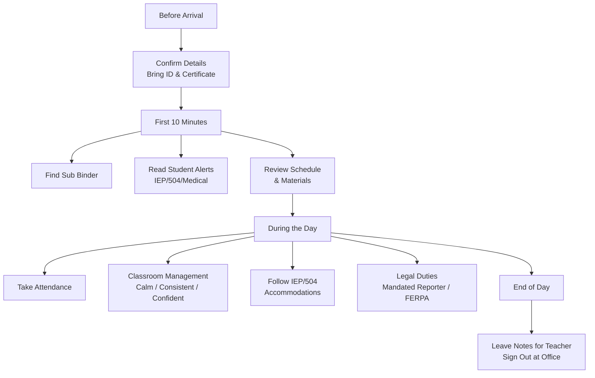

# Substitute Teacher Quick-Reference Guide

**Purpose:** A guide for substitute teachers — what you need to know to walk into any Missouri school and have a good day. Keep this on your phone or print it.

## Table of Contents
- [Before You Arrive](#before-you-arrive)
- [First 10 Minutes in the Room](#first-10-minutes-in-the-room)
- [Taking Attendance](#taking-attendance)
- [Classroom Management — The Basics](#classroom-management-the-basics)
  - [What works](#what-works)
  - [What doesn't work](#what-doesnt-work)
  - [If a student refuses to comply](#if-a-student-refuses-to-comply)
  - [If a fight breaks out](#if-a-fight-breaks-out)
- [Legal Things You Must Know](#legal-things-you-must-know)
  - [You are a mandated reporter](#you-are-a-mandated-reporter)
  - [Student privacy (FERPA)](#student-privacy-ferpa)
  - [Student medications](#student-medications)
- [Students With Special Needs — What the Sub Must Do](#students-with-special-needs-what-the-sub-must-do)
  - [IEP / 504 Students](#iep-504-students)
  - [ELL Students](#ell-students)
  - [Students in crisis](#students-in-crisis)
- [End of the Day](#end-of-the-day)
- [Missouri Substitute Teacher Requirements](#missouri-substitute-teacher-requirements)
- [Helpful Phrases for Tough Moments](#helpful-phrases-for-tough-moments)

---

## Before You Arrive

- [ ] Confirm: school name, address, room number, check-in time
- [ ] Bring: valid photo ID, sub certificate (if requested), pen, phone charger
- [ ] Arrive 15-20 minutes early — find the office, get your room key, ask where the binder is
- [ ] Ask the office: "Is there a sub binder in the classroom? Who's the neighbor teacher I can go to?"

---

## First 10 Minutes in the Room

1. **Find the sub binder / folder** — should be on the desk or in a labeled spot
2. **Read the student alert page first** — medical conditions, IEP/504 accommodations, behavior notes
3. **Review the schedule** — know what time each class starts and where you need to be
4. **Check materials** — are handouts ready? Is the projector on? Do you have attendance access?
5. **Write on the board:**
   - Your name
   - Today's schedule / agenda
   - Expectations: "1. Be respectful. 2. Follow directions. 3. Try your best."

---

## Taking Attendance

- Use the teacher's roster or the school's digital system (ask the office for login if needed)
- Mark students present/absent at the START of each period
- If a student arrives late, mark them tardy and note the time
- If you don't know names, have students say their name as you call roll (this also helps with pronunciation)
- **Never let students take their own attendance** — they will mark absent friends as present

---

## Classroom Management — The Basics

### What works
- **Be calm, consistent, and confident** — students sense uncertainty
- **Use the teacher's rules** — say "Your teacher's expectation is..." not "my rule is..."
- **Stand near problems** — proximity is your most powerful tool. Walk the room.
- **Give choices, not ultimatums** — "Would you like to start the assignment now, or do you need a minute to get organized?"
- **Praise publicly, correct privately** — "Thank you, table 3, for getting started" is more powerful than "Table 5, stop talking"
- **Learn 3-4 names fast** — use the seating chart. Using a student's name changes the dynamic.

### What doesn't work
- Yelling or threatening — you'll lose the room
- Taking it personally — it's not about you
- Trying to be their friend — be warm but firm
- Ignoring everything — small problems become big ones
- Engaging in public power struggles — redirect privately

### If a student refuses to comply
1. One calm, quiet redirect: "I need you to [specific behavior]."
2. If they refuse: "I'm going to give you a minute to make a good choice."
3. If they escalate: send to the office or call the neighbor teacher. Don't argue.
4. Document: student name, what happened, what you did. Leave it in the sub notes.

### If a fight breaks out
1. **Do NOT physically intervene** — you can be held liable
2. Send a student to get an administrator immediately
3. Clear other students away from the area
4. Use a firm, calm voice: "Everyone move back. Stop. This is over."
5. If you have a classroom phone or walkie, call the office

---

## Legal Things You Must Know

### You are a mandated reporter
Under **RSMo 210.115**, ALL school employees — including substitutes — must report suspected child abuse or neglect **immediately**.
- **Call:** Children's Division hotline **1-800-392-3738**
- You do NOT need proof. A child's statement or visible injuries are enough.
- Also notify the building administrator.
- **Failure to report is a Class A misdemeanor.**

### Student privacy (FERPA)
- Do NOT discuss student grades, behavior, or IEP/504 information with other students
- The sub binder's student alert page is **CONFIDENTIAL** — keep it face-down or in the binder
- Do not take photos of student work or behavior

### Student medications
- **Never** administer medication — that's the school nurse's job
- If a student says they need medication, send them to the nurse (or call the nurse to the room)
- Exception: if a student is having a severe allergic reaction and their EpiPen is in the classroom, follow the emergency plan in the sub binder

---

## Students With Special Needs — What the Sub Must Do

### IEP / 504 Students
- Check the sub binder for accommodations — **these are legally required, not optional**
- Common accommodations you'll see:
  - Extended time → let them keep working while others move on
  - Preferential seating → they're already seated where they should be; don't rearrange
  - Breaks → let them take a 3-5 minute break if their plan says so
  - Modified work → look for a "modified" version in the materials
- If you're unsure, ask the special education teacher (listed in the sub binder's key people section)

### ELL Students
- Check the sub binder for ELL students and their supports
- Speak clearly and at a moderate pace — don't shout
- Use the visuals, word banks, and sentence frames the teacher left
- It's okay if they use their home language to understand the content
- Pair them with a bilingual buddy if one is identified

### Students in crisis
- If a student discloses abuse, self-harm, or suicidal thoughts → **take it seriously**
- Stay calm. Say: "Thank you for telling me. I need to make sure you're safe."
- Immediately contact the school counselor or administrator
- Do not promise to keep it a secret
- Do not leave the student alone

---

## End of the Day

- [ ] Leave notes for the teacher (use the feedback form if one is provided):
  - How did each class go?
  - Who was absent?
  - Who was helpful?
  - Any behavior issues? (name + what happened)
  - Did students complete the work?
  - Were the plans clear?
- [ ] Collect completed student work and leave it on the teacher's desk
- [ ] Clean up — erase the board, straighten desks, pick up trash
- [ ] Lock the classroom
- [ ] Return keys and sign out at the office

---

## Missouri Substitute Teacher Requirements

| Requirement | Details |
|------------|---------|
| **Certificate** | Substitute certificate from DESE (4-year validity) |
| **Education** | Minimum 60 college credit hours |
| **Background check** | FBI fingerprint + Missouri Highway Patrol |
| **Long-term sub (60+ days same assignment)** | Must hold a valid Missouri teaching certificate |
| **Pay** | Set by district — typically $80-$150/day (no state minimum) |
| **Retirement** | Substitutes working regularly may earn PEERS (not PSRS) credit |

---

## Helpful Phrases for Tough Moments

| Situation | What to say |
|-----------|------------|
| Student says "You're not our real teacher" | "You're right — I'm your sub today, and I'm here to help you learn. Let's have a good day." |
| Student says "We don't do it that way" | "Thanks for letting me know. Today we'll follow the plans your teacher left." |
| Student refuses to work | "I'm not going to force you, but I do need to let your teacher know. Want to give it a try?" |
| Student is upset/crying | "I can see you're having a hard time. Do you need a minute, or would you like to talk to the counselor?" |
| You don't know the answer | "Good question — I don't know the answer to that, but I'll write it down so your teacher can address it." |
| Class is out of control | Stop talking. Wait. Stand at the front. Say calmly: "I'm going to wait." Silence is powerful. |
