# Scenario Walkthroughs — 25 Education Journeys

```mermaid
flowchart TD
    USER[User Need Identified] --> ROLE{User Role}
    ROLE --> PARENT[Parent]
    ROLE --> TEACHER[Teacher/Educator]
    ROLE --> ADMIN[Admin/Principal]
    ROLE --> STAFF[Staff]
    ROLE --> STUDENT[Student]

    PARENT --> S1["#1 Learning Disability<br/>Concern → Eval → IEP → Services"]
    PARENT --> S3["#3 School Discipline<br/>Incident → Due Process → Appeal"]
    PARENT --> S11["#11 Military PCS Transfer<br/>Orders → Enroll → Credits → Support"]
    PARENT --> S12["#12 Homeschool to Public<br/>Assess → Enroll → Place → Monitor"]
    PARENT --> S15["#15 Homeschool Withdrawal<br/>Notify → Comply → Transition"]
    PARENT --> S16["#16 Diabetes 504 vs IEP<br/>Diagnose → Plan → Implement"]
    PARENT --> S17["#17 Custody & Records<br/>Order → Rights → Access"]
    PARENT --> S22["#22 Parent Requesting IEE<br/>Disagree → Request → Evaluate"]
    PARENT --> S25["#25 Non-English Parent at IEP<br/>Notice → Interpreter → Participate"]

    STUDENT --> S4["#4 College Prep<br/>Explore → Apply → Fund → Decide"]
    STUDENT --> S20["#20 Dual-Credit Failure<br/>Fail → Transcript → Recovery"]
    STUDENT --> S21["#21 Athlete Transfer Eligibility<br/>Transfer → MSHSAA → Appeal"]

    TEACHER --> S2["#2 Certification<br/>Prep → IPC → Mentoring → CCPC"]
    TEACHER --> S6["#6 Retirement<br/>Plan → Eligibility → PSRS Benefits"]
    TEACHER --> S18["#18 Mandated Reporter<br/>Suspect → Report → Follow Up"]

    ADMIN --> S5["#5 Crisis Response<br/>Detect → Respond → Recover → Review"]
    ADMIN --> S7["#7 AI Policy<br/>Convene → Draft → Adopt → Train"]
    ADMIN --> S9["#9 Bullying Report<br/>Receive → Investigate → Respond"]
    ADMIN --> S10["#10 New Superintendent<br/>Listen → Plan → Execute → Sustain"]
    ADMIN --> S23["#23 School Consolidation<br/>Vote → Plan → Transition → Merge"]
    ADMIN --> S24["#24 Service Animal<br/>Request → Verify → Accommodate"]

    STAFF --> S8["#8 Homeless Student<br/>Identify → Enroll → Serve → Monitor"]
    STAFF --> S13["#13 Juvenile Detention Return<br/>Notify → Enroll → Credit → Support"]
    STAFF --> S14["#14 International Student<br/>Arrive → Assess → Place → Support"]
    STAFF --> S19["#19 McKinney-Vento Mid-Year<br/>Identify → Rights → Serve → Stable"]
```

<!-- These are complete, step-by-step narratives for the most common paths people take through Missouri's education system. When a user is clearly on one of these journeys, walk them through the relevant steps rather than dumping all information at once. -->

---

## 1. "I Think My Child Has a Learning Disability" (Parent Journey)

### The Full Path: Concern → Evaluation → Eligibility → IEP → Services → Annual Review

**Step 1: You notice a concern.**
Your child is struggling — maybe with reading, math, attention, behavior, or social skills. You've talked to the teacher, and the concern persists. This is the starting point for most families.

**Step 2: Request an evaluation in writing.**
You have the right to request an evaluation at any time (IDEA §300.301). Put it in writing — an email or letter to the principal or special education director. The written request starts a legal clock. Say: *"I am requesting that [district] evaluate my child, [name], for special education services due to concerns about [describe concerns]."*

**Step 3: The school responds.**
The school must respond — they cannot ignore your request. Two possible responses:
- **They agree to evaluate:** they'll send you a Consent for Evaluation form. Sign it. The 60-calendar-day clock starts when they receive your signed consent.
- **They refuse to evaluate:** they must give you Prior Written Notice (PWN) explaining why. You can disagree — options include mediation, state complaint, or due process hearing.

**Step 4: The evaluation happens.**
A team of qualified professionals evaluates your child across all areas of suspected disability. This is not just one test — it includes observations, records review, parent input, and standardized assessments. The evaluation must be nondiscriminatory and comprehensive.

**Step 5: Eligibility determination.**
The team (including you) reviews the evaluation data and determines:
- Does the child meet criteria for one of the 13 IDEA disability categories?
- Does the disability affect their ability to access the general curriculum?
- Does the child need specially designed instruction?
If YES to all three → your child is eligible for special education and an IEP.
If NO → your child may still qualify for a 504 plan (if the disability substantially limits a major life activity). You can also request an Independent Educational Evaluation (IEE) if you disagree with the school's evaluation.

**Step 6: IEP development.**
Within 30 calendar days of eligibility, the IEP team (which includes you) develops the IEP. The IEP must include: present levels, measurable goals, services, accommodations, LRE justification, and how progress will be measured.

**Step 7: Services begin.**
Once the IEP is finalized and you consent to placement, services begin "as soon as possible." The school must implement the IEP as written.

**Step 8: Progress monitoring.**
The school reports progress toward IEP goals on a schedule (typically with report cards). If your child is not making progress, request an IEP meeting to discuss changes.

**Step 9: Annual review.**
The IEP is reviewed at least once every 365 days. You can request a meeting at any time. The team reviews progress, updates goals, and adjusts services.

**Step 10: Triennial reevaluation.**
Every 3 years, the team conducts a comprehensive reevaluation to determine continued eligibility (can be waived by agreement between parent and school).

**What to remember throughout:** You are an equal member of the IEP team. You can bring an advocate. Everything should be documented. The school must give you Prior Written Notice for any proposed change. Your procedural safeguards document explains all your rights.

---

## 2. Becoming a Certified Teacher in Missouri (Teacher Journey)

### The Full Path: Preparation → Assessment → Application → IPC → Mentoring → CCPC

**Step 1: Complete an approved educator preparation program.**
Bachelor's degree from a DESE-approved educator preparation program (EPP). Your program includes coursework in pedagogy, content area, classroom management, assessment, and a student teaching experience (practicum/internship).

**Step 2: Pass required assessments.**
- **Basic skills:** MoGEA (Missouri General Education Assessment) or qualifying ACT/SAT/GRE scores
- **Content area:** Missouri Content Assessment (MoCA) or Praxis in your teaching field
- **Performance:** edTPA or Missouri Pre-Service Teacher Assessment (MoPTA)

**Step 3: Background check.**
FBI fingerprint + Missouri Highway Patrol background check. This must clear before any certificate is issued.

**Step 4: Apply for Initial Professional Certificate (IPC).**
Apply through DESE's Educator Certification System (ECS). The IPC is valid for 4 years.

**Step 5: Get hired.**
Apply to Missouri school districts. Your IPC allows you to teach in Missouri public schools in your certified content area(s).

**Step 6: Complete mentoring program.**
Your employing district must provide a mentoring/induction program (RSMo 168.028). You'll be paired with an experienced mentor teacher. This is a requirement for progressing to your career certificate.

**Step 7: Teach and grow.**
During your 4 years on the IPC, you complete professional development, receive MEES evaluations, and build your practice. You're in your probationary period — you can be non-renewed (by April 15 notice) without cause.

**Step 8: Apply for Career Continuous Professional Certificate (CCPC).**
After 4 years on the IPC with: mentoring completion, district recommendation, and professional development → apply for CCPC. This is your career certificate (lifetime, with renewal).

**Step 9: Ongoing professional growth.**
CCPC requires ongoing professional development for renewal. Continue growing through PLCs, coaching, graduate work, conferences, micro-credentials, and leadership roles.

**Step 10: Career milestones.**
- **Year 5:** Tenure eligibility (if 5 consecutive years in same district — RSMo 168.104)
- **Any time:** Add content endorsements (additional coursework + assessment)
- **Any time:** National Board Certification (optional; $2,000/year supplement per RSMo 168.345)
- **Retirement:** PSRS Rule of 80, or age 60 with 5+ years

---

## 3. Navigating School Discipline (Parent Journey)

### The Full Path: Incident → Notification → Due Process → Appeal → Resolution

**Step 1: An incident occurs.**
Your child is accused of a rule violation. The school contacts you.

**Step 2: Get the facts.**
Ask: What exactly is my child accused of? Who are the witnesses? What evidence does the school have? What is the proposed consequence? Get this in writing if possible.

**Step 3: Know the consequence level and your rights.**

| Consequence | Your Rights |
|------------|------------|
| Detention, in-school suspension, minor consequence | Limited formal rights; school should follow board policy |
| Out-of-school suspension 1-10 days | Notice of charges + opportunity for child to respond + parent notification |
| Out-of-school suspension >10 days | Written charges + formal hearing + right to representation + right to present evidence + written decision + appeal |
| Expulsion | Board hearing + all rights above |

**Step 4: If your child has an IEP or 504.**
CRITICAL: If cumulative out-of-school removals exceed 10 days in a school year, the school MUST hold a Manifestation Determination Review (MDR) before proceeding with additional removals. Request this if the school hasn't initiated it.

**Step 5: Prepare for a hearing (if long-term suspension/expulsion).**
Gather: your child's version of events, any witnesses who support your child, relevant records (academic, behavioral, IEP/504 if applicable), character references. You may bring an advocate, attorney, or support person.

**Step 6: The hearing.**
Present your case. Cross-examine the school's witnesses. Submit evidence. The hearing officer or board issues a written decision.

**Step 7: Appeal.**
If the hearing was before a hearing officer, you can appeal to the full school board. If the board made the original decision, you may have further appeal rights through the courts (consult an attorney).

**Step 8: During removal.**
If your child is removed from school, the district must continue educational services after day 10 of suspension in a school year (for students with IEPs — FAPE continues). For students without IEPs, board policy governs whether educational services are provided during suspension.

---

## 4. Getting Ready for College (Student Journey)

### The Full Path: Explore → Prepare → Apply → Fund → Decide → Transition

**Grades 9-10: Explore and Build**
- Take challenging courses (honors, pre-AP, dual credit when available)
- Complete career assessments on Missouri Connections (missouriconnections.org)
- Begin your Individual Learning Plan (ILP) with your school counselor
- Get involved in activities (clubs, sports, community service, work)
- Start tracking A+ eligibility if your school is an A+ school (2.5 GPA, 95% attendance, tutoring hours, citizenship)

**Grade 11: Prepare**
- Take the ACT (free statewide administration for all juniors)
- Consider retaking the ACT or taking the SAT for better scores
- Visit college campuses (in-state options, community colleges, universities)
- Meet with your school counselor to narrow your college list
- Take AP or dual credit courses for college credit
- Attend college fairs and financial aid nights
- Begin scholarship search

**Grade 12 (Fall): Apply**
- Complete college applications (most deadlines: November-February)
- Request transcripts from your school counselor
- Ask teachers and counselors for recommendation letters (give them 3+ weeks)
- Write your personal statement / application essay
- Complete the FAFSA (opens October 1 — Missouri priority deadline typically February 1)
- Apply for scholarships (local, state, national)
- Submit A+ eligibility verification with your A+ coordinator

**Grade 12 (Spring): Decide**
- Compare financial aid award letters (cost of attendance minus aid = what you actually pay)
- Visit finalist schools
- Commit by May 1 (typical national decision deadline)
- Submit enrollment deposit
- Complete housing application (if living on campus)
- Register for orientation
- Send final transcript after graduation
- CELEBRATE — you did it

**Key Missouri Financial Aid:**
- **A+ Scholarship:** tuition at community colleges (if A+ eligible)
- **Bright Flight:** up to $3,000/year for top ACT/SAT scores at in-state institutions
- **Access Missouri:** need-based, $300-$2,850/year at approved MO institutions

---

## 5. Responding to a School Crisis (Principal Journey)

### The Full Path: Detect → Respond → Communicate → Recover → Review

**Step 1: Detect and assess.**
Something happens — active threat, natural disaster, medical emergency, student death, community violence. Immediately assess: Is anyone in physical danger right now?

**Step 2: Activate the response.**
- **Immediate danger:** execute the appropriate protocol (lockdown, evacuation, shelter-in-place, drop/cover/hold)
- **Call 911** if not already called
- **Activate your Building Crisis Team** — each member goes to their assigned role
- **Account for all students and staff** — take attendance, report missing persons

**Step 3: Secure and stabilize.**
- Maintain the protective action until all-clear from law enforcement/emergency services
- Provide first aid (AED, Stop the Bleed, basic medical response)
- Transition to unified command when emergency services arrive

**Step 4: Communicate.**
- **Internal (staff):** clear, factual information through radios/PA/text
- **Parents:** robocall/text alert with factual information, NOT speculation. Include: what happened (briefly), students are safe (if true), reunification instructions OR "students will remain in school and be released at normal time"
- **Media:** only through the designated spokesperson. Prepare a written statement. Do not speculate.
- **DESE:** report as required (RSMo 160.261 for acts of school violence)

**Step 5: Reunification (if needed).**
Activate Standard Reunification Method at the designated off-campus site. Parents present ID, complete reunification cards, students are brought to parents one at a time. Track every release.

**Step 6: Recovery.**
- **Day 1-3:** Make counseling available (not mandatory). Factual, age-appropriate communication to students. Staff debriefing.
- **Week 1-2:** Structured opportunities for processing (classroom circles, not mandatory debriefing). Monitor students showing prolonged distress. Referral to community mental health for students who need more.
- **Ongoing:** Return to routine. Anniversary planning. Follow up with affected students.

**Step 7: After-Action Review.**
Within 1-2 weeks, convene the crisis team: What was supposed to happen? What actually happened? What went well? What needs to change? Document findings. Update the EOP. Retrain on revised procedures.

---

## 6. Teacher Retirement (Educator Journey)

### The Full Path: Planning → Eligibility → Application → Benefits → Life After

**Step 1: Know your system.**
- **PSRS** (certificated staff — teachers, admin, counselors): defined benefit pension. You do NOT pay Social Security on school earnings.
- **PEERS** (non-certificated staff — paras, bus drivers, food service): defined benefit pension. You DO pay Social Security.

**Step 2: Check eligibility.**
| Path | Requirement |
|------|------------|
| Rule of 80 | Age + years of service ≥ 80 (minimum age 48) |
| Age + service | Age 60 with 5+ years of service |
| Early retirement | Age 55 with 5+ years (reduced benefit) |
| 25-and-out | 25 years regardless of age (reduced if under Rule of 80) |

**Step 3: Calculate your benefit.**
Annual benefit = Years of service × 2.5% × Final Average Salary (3 highest consecutive years). Contact PSRS/PEERS (psrs-peers.org) for a personalized estimate.

**Step 4: Understand the fine print.**
- **WEP (Windfall Elimination Provision):** if you also worked in a Social Security-covered job, your Social Security benefit may be reduced
- **GPO (Government Pension Offset):** if your spouse has Social Security, your spousal benefit may be reduced
- **Working after retirement:** PSRS limits post-retirement school employment. Working too many hours/days can affect your pension. Check current rules with PSRS.
- **Health insurance:** PSRS offers retiree health insurance options, but they're not automatic. Plan ahead.

**Step 5: Apply.**
Contact PSRS/PEERS at least 3-6 months before your intended retirement date. Submit application. Select benefit option (single life, joint survivor, etc.).

**Step 6: Life after.**
- Substitute teaching possible within PSRS earnings limits
- Many retirees serve on boards, volunteer, or work in non-school roles
- Your pension is a defined benefit — it pays for life

---

## 7. Building an AI Policy from Scratch (Admin Journey)

### The Full Path: Convene → Assess → Draft → Engage → Adopt → Train → Review

**Step 1: Convene an AI Task Force.**
Membership: teachers (across content areas and grade levels), administrators, technology director, school counselors, parents, students (secondary), board member(s), community partners. Size: 8-15 people.

**Step 2: Assess current state.**
Survey your staff: What AI tools are you already using? For what? With what oversight? Survey students: What AI tools are you using for schoolwork? How? Inventory: what adaptive learning platforms does the district already license?

**Step 3: Review guidance and models.**
Read: DESE AI Guidance (Version 1.0), MSBA model AI policy, MCE sample policies, peer district policies, TeachAI toolkit. Load `references/ai-in-education/ai-policy-governance.md` for the full framework.

**Step 4: Draft the policy.**
Use `templates/ai-policy-template.md` as your scaffold. Key sections: scope, guiding principles, approved tools list, staff use (permitted/prohibited), student use (by grade band), academic integrity, data privacy, equity, PD requirements, transparency, review cycle.

**Step 5: Gather stakeholder input.**
Share the draft with: all staff (feedback survey + Q&A session), parents (information session + comment period), students (advisory council or classroom discussion), board (work session).

**Step 6: Board adoption.**
First reading → public comment → second reading → vote. This is a board policy, not just an administrative procedure.

**Step 7: Train.**
Before the policy takes effect: all staff complete AI orientation (policy overview, approved tools, data privacy rules, prompt engineering basics). Teachers complete subject-specific AI integration PD. Students receive age-appropriate AI literacy instruction.

**Step 8: Implement and monitor.**
Publish approved tools list. Monitor for compliance. Address issues as they arise. Collect data on AI tool usage and impact.

**Step 9: Annual review.**
AI moves fast. Review the policy annually: new tools, new risks, new guidance, stakeholder feedback, legislative changes. Update and re-adopt.

---

## 8. Enrolling a Homeless Student (Staff Journey)

### The Full Path: Identify → Enroll → Serve → Transport → Monitor

**Step 1: Identify.**
A family or youth presents for enrollment and discloses (or you identify through the housing questionnaire) that they lack a fixed, regular, adequate nighttime residence — doubled-up, in a shelter, in a car, in a motel, or unaccompanied.

**Step 2: Enroll immediately.**
Do NOT delay for: records, immunizations, proof of residency, birth certificate, school last attended, or any other documentation. Enroll the student TODAY in the school they choose. McKinney-Vento law requires immediate enrollment.

**Step 3: Determine school of origin.**
The family has the right to remain in their school of origin (last school attended OR school attended when last permanently housed). The McKinney-Vento liaison helps make this determination. If the family chooses a new school, enroll there immediately.

**Step 4: Connect services.**
- **Free meals:** student is automatically eligible — categorical eligibility, no application needed
- **Title I services:** student is entitled to Title I services even if not attending a Title I school
- **Transportation:** district must provide transportation to the school of origin if requested (even across district lines — districts share responsibility)
- **School supplies, clothing, fees:** all barriers must be removed. Waive fees. Provide supplies.
- **Referrals:** connect the family to the McKinney-Vento liaison for housing, health, food, and social service resources

**Step 5: If there's a dispute.**
If a dispute arises about enrollment or school selection, the student must be immediately enrolled in the requested school pending resolution. The McKinney-Vento liaison facilitates the dispute resolution process. The family must receive a written explanation of the decision and their right to appeal.

**Step 6: Monitor.**
Check in regularly. Homeless students face attendance, academic, and social-emotional challenges. Provide counseling access, tutoring, and mentoring as needed. Update housing status as the family's situation changes.

---

## 9. Handling a Bullying Report (Principal Journey)

### The Full Path: Receive → Investigate → Respond → Support → Prevent

**Step 1: Receive the report.**
A student, parent, teacher, or bystander reports bullying. Take every report seriously. Document: who reported, date, time, description of behavior, names of involved parties, witnesses.

**Step 2: Ensure immediate safety.**
Separate the students. Ensure the target is physically and emotionally safe. If there's an immediate physical threat, take action first, investigate second.

**Step 3: Investigate promptly.**
- Interview the target (with sensitivity — let them tell their story)
- Interview the accused student
- Interview witnesses
- Review evidence (social media screenshots, text messages, video footage, prior incident reports)
- Determine: Is this bullying? (Repeated or severe; power imbalance; substantially interferes with education or creates hostile environment)

**Step 4: Critical question — Is this civil-rights-based?**
If the bullying is based on race, color, national origin, sex, disability, or another protected class → this may constitute **harassment** under Title VI, Title IX, or Section 504. Federal civil rights obligations are triggered. The district must take action to stop the harassment, prevent recurrence, and remedy its effects.

**Step 5: Respond.**
- **To the aggressor:** consequences per board policy (restorative conference, loss of privileges, suspension if warranted). Behavioral intervention. Monitoring.
- **To the target:** safety plan, counseling access, academic support if needed, assurance that retaliation will not be tolerated.
- **To parents of both students:** notification of the incident, actions taken, ongoing monitoring plan.
- **Document everything:** incident report, investigation notes, actions taken, follow-up plan.

**Step 6: Prevent recurrence.**
- Increase supervision in locations where bullying occurred
- Classroom lessons on bullying prevention
- Climate check (is this an isolated incident or a pattern?)
- If a pattern → evaluate schoolwide PBIS/prevention programming
- Review discipline data for bullying trends

---

## 10. First Year as a Missouri Superintendent (Admin Journey)

### The Full Path: Transition → Learn → Plan → Execute → Communicate → Sustain

**Step 1: Before Day 1.**
- Review board policies, strategic plan, budget, CSIP/DSIP, APR, audit reports
- Meet individually with each board member (understand their priorities, concerns, communication preferences)
- Meet with outgoing superintendent (if available) for transition briefing
- Study the community (demographics, economics, politics, history)

**Step 2: First 30 Days — Listen.**
- Visit every school building. Be visible. Listen more than you talk.
- Meet with principals, teacher leaders, support staff, union/association leaders
- Meet with parent groups, community leaders, business partners, municipal officials
- Review MOSIS/Core Data, assessment results, discipline data, climate survey data, financial position
- Identify the 3 things that are working well and the 3 things that need immediate attention

**Step 3: First 90 Days — Assess and Plan.**
- Present a "State of the District" to the board and community (what you learned, what you see, what you recommend)
- Establish your leadership team and communication cadence
- Identify quick wins (visible improvements that build trust)
- Begin strategic planning process (if the current plan is expired or misaligned)
- Attend DESE new superintendent workshop
- Establish relationship with DESE liaison for your supervisory area

**Step 4: First Year — Key Compliance Actions.**
Use `references/compliance-calendar.md` as your roadmap. Key first-year items:
- Budget adoption (before July 1)
- Staff assignments and contracts
- MOSIS October count submission
- Board meeting compliance (Sunshine Law)
- Safety plan review (RSMo 160.660)
- Title I/federal programs compliance
- Superintendent evaluation process with the board (establish criteria early)

**Step 5: Build the Culture.**
- Model the behavior you expect (transparency, respect, data-driven decisions)
- Communicate regularly with staff, families, and community (weekly updates, town halls, social media)
- Support principals — they are your front line
- Address staff morale proactively (survey, listen, respond)
- Celebrate successes publicly and often

**Step 6: Sustain.**
- Annual board retreat for goal-setting and relationship-building
- Join MASA (Missouri Association of School Administrators) for peer network
- Find a mentor superintendent (someone who's been where you are)
- Protect your own wellness (the job is demanding — build boundaries)
- Remember: year one is about trust-building. Year two is about acceleration. Year three is about results.
