# Scenario Walkthroughs — 33 Education Journeys

<!-- These are complete, step-by-step narratives for the most common paths people take through Missouri's education system. When a user is clearly on one of these journeys, walk them through the relevant steps rather than dumping all information at once. -->

```mermaid
flowchart TD
    USER[User Need Identified] --> ROLE{User Role}
    ROLE --> PARENT[Parent]
    ROLE --> TEACHER[Teacher/Educator]
    ROLE --> ADMIN[Admin/Principal]
    ROLE --> STAFF[Staff]
    ROLE --> STUDENT[Student]

    PARENT --> S1["#1 Learning Disability<br/>Concern → Eval → IEP → Services"]
    PARENT --> S3["#3 School Discipline<br/>Incident → Due Process → Appeal"]
    PARENT --> S11["#11 Military PCS Transfer<br/>Orders → Enroll → Credits → Support"]
    PARENT --> S12["#12 Homeschool to Public<br/>Assess → Enroll → Place → Monitor"]
    PARENT --> S15["#15 Homeschool Withdrawal<br/>Notify → Comply → Transition"]
    PARENT --> S16["#16 Diabetes 504 vs IEP<br/>Diagnose → Plan → Implement"]
    PARENT --> S17["#17 Custody & Records<br/>Order → Rights → Access"]
    PARENT --> S22["#22 Parent Requesting IEE<br/>Disagree → Request → Evaluate"]
    PARENT --> S25["#25 Non-English Parent at IEP<br/>Notice → Interpreter → Participate"]

    STUDENT --> S4["#4 College Prep<br/>Explore → Apply → Fund → Decide"]
    STUDENT --> S20["#20 Dual-Credit Failure<br/>Fail → Transcript → Recovery"]
    STUDENT --> S21["#21 Athlete Transfer Eligibility<br/>Transfer → MSHSAA → Appeal"]

    TEACHER --> S2["#2 Certification<br/>Prep → IPC → Mentoring → CCPC"]
    TEACHER --> S6["#6 Retirement<br/>Plan → Eligibility → PSRS Benefits"]
    TEACHER --> S18["#18 Mandated Reporter<br/>Suspect → Report → Follow Up"]

    ADMIN --> S5["#5 Crisis Response<br/>Detect → Respond → Recover → Review"]
    ADMIN --> S7["#7 AI Policy<br/>Convene → Draft → Adopt → Train"]
    ADMIN --> S9["#9 Bullying Report<br/>Receive → Investigate → Respond"]
    ADMIN --> S10["#10 New Superintendent<br/>Listen → Plan → Execute → Sustain"]
    ADMIN --> S23["#23 School Consolidation<br/>Vote → Plan → Transition → Merge"]
    ADMIN --> S24["#24 Service Animal<br/>Request → Verify → Accommodate"]

    STAFF --> S8["#8 Homeless Student<br/>Identify → Enroll → Serve → Monitor"]
    STAFF --> S13["#13 Juvenile Detention Return<br/>Notify → Enroll → Credit → Support"]
    STAFF --> S14["#14 International Student<br/>Arrive → Assess → Place → Support"]
    STAFF --> S19["#19 McKinney-Vento Mid-Year<br/>Identify → Rights → Serve → Stable"]
```

---

## 1. "I Think My Child Has a Learning Disability" (Parent Journey)

### The Full Path: Concern → Evaluation → Eligibility → IEP → Services → Annual Review

**Step 1: You notice a concern.**
Your child is struggling — maybe with reading, math, attention, behavior, or social skills. You've talked to the teacher, and the concern persists. This is the starting point for most families.

**Step 2: Request an evaluation in writing.**
You have the right to request an evaluation at any time (IDEA §300.301). Put it in writing — an email or letter to the principal or special education director. The written request starts a legal clock. Say: *"I am requesting that [district] evaluate my child, [name], for special education services due to concerns about [describe concerns]."*

**Step 3: The school responds.**
The school must respond — they cannot ignore your request. Two possible responses:
- **They agree to evaluate:** they'll send you a Consent for Evaluation form. Sign it. The 60-calendar-day clock starts when they receive your signed consent.
- **They refuse to evaluate:** they must give you Prior Written Notice (PWN) explaining why. You can disagree — options include mediation, state complaint, or due process hearing.

**Step 4: The evaluation happens.**
A team of qualified professionals evaluates your child across all areas of suspected disability. This is not just one test — it includes observations, records review, parent input, and standardized assessments. The evaluation must be nondiscriminatory and comprehensive.

**Step 5: Eligibility determination.**
The team (including you) reviews the evaluation data and determines:
- Does the child meet criteria for one of the 13 IDEA disability categories?
- Does the disability affect their ability to access the general curriculum?
- Does the child need specially designed instruction?
If YES to all three → your child is eligible for special education and an IEP.
If NO → your child may still qualify for a 504 plan (if the disability substantially limits a major life activity). You can also request an Independent Educational Evaluation (IEE) if you disagree with the school's evaluation.

**Step 6: IEP development.**
Within 30 calendar days of eligibility, the IEP team (which includes you) develops the IEP. The IEP must include: present levels, measurable goals, services, accommodations, LRE justification, and how progress will be measured.

**Step 7: Services begin.**
Once the IEP is finalized and you consent to placement, services begin "as soon as possible." The school must implement the IEP as written.

**Step 8: Progress monitoring.**
The school reports progress toward IEP goals on a schedule (typically with report cards). If your child is not making progress, request an IEP meeting to discuss changes.

**Step 9: Annual review.**
The IEP is reviewed at least once every 365 days. You can request a meeting at any time. The team reviews progress, updates goals, and adjusts services.

**Step 10: Triennial reevaluation.**
Every 3 years, the team conducts a comprehensive reevaluation to determine continued eligibility (can be waived by agreement between parent and school).

**What to remember throughout:** You are an equal member of the IEP team. You can bring an advocate. Everything should be documented. The school must give you Prior Written Notice for any proposed change. Your procedural safeguards document explains all your rights.

---

## 2. Becoming a Certified Teacher in Missouri (Teacher Journey)

### The Full Path: Preparation → Assessment → Application → IPC → Mentoring → CCPC

**Step 1: Complete an approved educator preparation program.**
Bachelor's degree from a DESE-approved educator preparation program (EPP). Your program includes coursework in pedagogy, content area, classroom management, assessment, and a student teaching experience (practicum/internship).

**Step 2: Pass required assessments.**
- **Basic skills:** MoGEA (Missouri General Education Assessment) or qualifying ACT/SAT/GRE scores
- **Content area:** Missouri Content Assessment (MoCA) or Praxis in your teaching field
- **Performance:** edTPA or Missouri Pre-Service Teacher Assessment (MoPTA)

**Step 3: Background check.**
FBI fingerprint + Missouri Highway Patrol background check. This must clear before any certificate is issued.

**Step 4: Apply for Initial Professional Certificate (IPC).**
Apply through DESE's Educator Certification System (ECS). The IPC is valid for 4 years.

**Step 5: Get hired.**
Apply to Missouri school districts. Your IPC allows you to teach in Missouri public schools in your certified content area(s).

**Step 6: Complete mentoring program.**
Your employing district must provide a mentoring/induction program (RSMo 168.028). You'll be paired with an experienced mentor teacher. This is a requirement for progressing to your career certificate.

**Step 7: Teach and grow.**
During your 4 years on the IPC, you complete professional development, receive MEES evaluations, and build your practice. You're in your probationary period — you can be non-renewed (by April 15 notice) without cause.

**Step 8: Apply for Career Continuous Professional Certificate (CCPC).**
After 4 years on the IPC with: mentoring completion, district recommendation, and professional development → apply for CCPC. This is your career certificate (lifetime, with renewal).

**Step 9: Ongoing professional growth.**
CCPC requires ongoing professional development for renewal. Continue growing through PLCs, coaching, graduate work, conferences, micro-credentials, and leadership roles.

**Step 10: Career milestones.**
- **Year 5:** Tenure eligibility (if 5 consecutive years in same district — RSMo 168.104)
- **Any time:** Add content endorsements (additional coursework + assessment)
- **Any time:** National Board Certification (optional; $2,000/year supplement per RSMo 168.345)
- **Retirement:** PSRS Rule of 80, or age 60 with 5+ years

---

## 3. Navigating School Discipline (Parent Journey)

### The Full Path: Incident → Notification → Due Process → Appeal → Resolution

**Step 1: An incident occurs.**
Your child is accused of a rule violation. The school contacts you.

**Step 2: Get the facts.**
Ask: What exactly is my child accused of? Who are the witnesses? What evidence does the school have? What is the proposed consequence? Get this in writing if possible.

**Step 3: Know the consequence level and your rights.**

| Consequence | Your Rights |
|------------|------------|
| Detention, in-school suspension, minor consequence | Limited formal rights; school should follow board policy |
| Out-of-school suspension 1-10 days | Notice of charges + opportunity for child to respond + parent notification |
| Out-of-school suspension >10 days | Written charges + formal hearing + right to representation + right to present evidence + written decision + appeal |
| Expulsion | Board hearing + all rights above |

**Step 4: If your child has an IEP or 504.**
CRITICAL: If cumulative out-of-school removals exceed 10 days in a school year, the school MUST hold a Manifestation Determination Review (MDR) before proceeding with additional removals. Request this if the school hasn't initiated it.

**Step 5: Prepare for a hearing (if long-term suspension/expulsion).**
Gather: your child's version of events, any witnesses who support your child, relevant records (academic, behavioral, IEP/504 if applicable), character references. You may bring an advocate, attorney, or support person.

**Step 6: The hearing.**
Present your case. Cross-examine the school's witnesses. Submit evidence. The hearing officer or board issues a written decision.

**Step 7: Appeal.**
If the hearing was before a hearing officer, you can appeal to the full school board. If the board made the original decision, you may have further appeal rights through the courts (consult an attorney).

**Step 8: During removal.**
If your child is removed from school, the district must continue educational services after day 10 of suspension in a school year (for students with IEPs — FAPE continues). For students without IEPs, board policy governs whether educational services are provided during suspension.

---

## 4. Getting Ready for College (Student Journey)

### The Full Path: Explore → Prepare → Apply → Fund → Decide → Transition

**Grades 9-10: Explore and Build**
- Take challenging courses (honors, pre-AP, dual credit when available)
- Complete career assessments on Missouri Connections (missouriconnections.org)
- Begin your Individual Learning Plan (ILP) with your school counselor
- Get involved in activities (clubs, sports, community service, work)
- Start tracking A+ eligibility if your school is an A+ school (2.5 GPA, 95% attendance, tutoring hours, citizenship)

**Grade 11: Prepare**
- Take the ACT (free statewide administration for all juniors)
- Consider retaking the ACT or taking the SAT for better scores
- Visit college campuses (in-state options, community colleges, universities)
- Meet with your school counselor to narrow your college list
- Take AP or dual credit courses for college credit
- Attend college fairs and financial aid nights
- Begin scholarship search

**Grade 12 (Fall): Apply**
- Complete college applications (most deadlines: November-February)
- Request transcripts from your school counselor
- Ask teachers and counselors for recommendation letters (give them 3+ weeks)
- Write your personal statement / application essay
- Complete the FAFSA (opens October 1 — Missouri priority deadline typically February 1)
- Apply for scholarships (local, state, national)
- Submit A+ eligibility verification with your A+ coordinator

**Grade 12 (Spring): Decide**
- Compare financial aid award letters (cost of attendance minus aid = what you actually pay)
- Visit finalist schools
- Commit by May 1 (typical national decision deadline)
- Submit enrollment deposit
- Complete housing application (if living on campus)
- Register for orientation
- Send final transcript after graduation
- CELEBRATE — you did it

**Key Missouri Financial Aid:**
- **A+ Scholarship:** tuition at community colleges (if A+ eligible)
- **Bright Flight:** up to $3,000/year for top ACT/SAT scores at in-state institutions
- **Access Missouri:** need-based, $300-$2,850/year at approved MO institutions

---

## 5. Responding to a School Crisis (Principal Journey)

### The Full Path: Detect → Respond → Communicate → Recover → Review

**Step 1: Detect and assess.**
Something happens — active threat, natural disaster, medical emergency, student death, community violence. Immediately assess: Is anyone in physical danger right now?

**Step 2: Activate the response.**
- **Immediate danger:** execute the appropriate protocol (lockdown, evacuation, shelter-in-place, drop/cover/hold)
- **Call 911** if not already called
- **Activate your Building Crisis Team** — each member goes to their assigned role
- **Account for all students and staff** — take attendance, report missing persons

**Step 3: Secure and stabilize.**
- Maintain the protective action until all-clear from law enforcement/emergency services
- Provide first aid (AED, Stop the Bleed, basic medical response)
- Transition to unified command when emergency services arrive

**Step 4: Communicate.**
- **Internal (staff):** clear, factual information through radios/PA/text
- **Parents:** robocall/text alert with factual information, NOT speculation. Include: what happened (briefly), students are safe (if true), reunification instructions OR "students will remain in school and be released at normal time"
- **Media:** only through the designated spokesperson. Prepare a written statement. Do not speculate.
- **DESE:** report as required (RSMo 160.261 for acts of school violence)

**Step 5: Reunification (if needed).**
Activate Standard Reunification Method at the designated off-campus site. Parents present ID, complete reunification cards, students are brought to parents one at a time. Track every release.

**Step 6: Recovery.**
- **Day 1-3:** Make counseling available (not mandatory). Factual, age-appropriate communication to students. Staff debriefing.
- **Week 1-2:** Structured opportunities for processing (classroom circles, not mandatory debriefing). Monitor students showing prolonged distress. Referral to community mental health for students who need more.
- **Ongoing:** Return to routine. Anniversary planning. Follow up with affected students.

**Step 7: After-Action Review.**
Within 1-2 weeks, convene the crisis team: What was supposed to happen? What actually happened? What went well? What needs to change? Document findings. Update the EOP. Retrain on revised procedures.

---

## 6. Teacher Retirement (Educator Journey)

### The Full Path: Planning → Eligibility → Application → Benefits → Life After

**Step 1: Know your system.**
- **PSRS** (certificated staff — teachers, admin, counselors): defined benefit pension. You do NOT pay Social Security on school earnings.
- **PEERS** (non-certificated staff — paras, bus drivers, food service): defined benefit pension. You DO pay Social Security.

**Step 2: Check eligibility.**
| Path | Requirement |
|------|------------|
| Rule of 80 | Age + years of service ≥ 80 (minimum age 48) |
| Age + service | Age 60 with 5+ years of service |
| Early retirement | Age 55 with 5+ years (reduced benefit) |
| 25-and-out | 25 years regardless of age (reduced if under Rule of 80) |

**Step 3: Calculate your benefit.**
Annual benefit = Years of service × 2.5% × Final Average Salary (3 highest consecutive years). Contact PSRS/PEERS (psrs-peers.org) for a personalized estimate.

**Step 4: Understand the fine print.**
- **WEP (Windfall Elimination Provision):** if you also worked in a Social Security-covered job, your Social Security benefit may be reduced
- **GPO (Government Pension Offset):** if your spouse has Social Security, your spousal benefit may be reduced
- **Working after retirement:** PSRS limits post-retirement school employment. Working too many hours/days can affect your pension. Check current rules with PSRS.
- **Health insurance:** PSRS offers retiree health insurance options, but they're not automatic. Plan ahead.

**Step 5: Apply.**
Contact PSRS/PEERS at least 3-6 months before your intended retirement date. Submit application. Select benefit option (single life, joint survivor, etc.).

**Step 6: Life after.**
- Substitute teaching possible within PSRS earnings limits
- Many retirees serve on boards, volunteer, or work in non-school roles
- Your pension is a defined benefit — it pays for life

---

## 7. Building an AI Policy from Scratch (Admin Journey)

### The Full Path: Convene → Assess → Draft → Engage → Adopt → Train → Review

**Step 1: Convene an AI Task Force.**
Membership: teachers (across content areas and grade levels), administrators, technology director, school counselors, parents, students (secondary), board member(s), community partners. Size: 8-15 people.

**Step 2: Assess current state.**
Survey your staff: What AI tools are you already using? For what? With what oversight? Survey students: What AI tools are you using for schoolwork? How? Inventory: what adaptive learning platforms does the district already license?

**Step 3: Review guidance and models.**
Read: DESE AI Guidance (Version 1.0), MSBA model AI policy, MCE sample policies, peer district policies, TeachAI toolkit. Load `references/ai-in-education/ai-policy-governance.md` for the full framework.

**Step 4: Draft the policy.**
Use `templates/ai-policy-template.md` as your scaffold. Key sections: scope, guiding principles, approved tools list, staff use (permitted/prohibited), student use (by grade band), academic integrity, data privacy, equity, PD requirements, transparency, review cycle.

**Step 5: Gather stakeholder input.**
Share the draft with: all staff (feedback survey + Q&A session), parents (information session + comment period), students (advisory council or classroom discussion), board (work session).

**Step 6: Board adoption.**
First reading → public comment → second reading → vote. This is a board policy, not just an administrative procedure.

**Step 7: Train.**
Before the policy takes effect: all staff complete AI orientation (policy overview, approved tools, data privacy rules, prompt engineering basics). Teachers complete subject-specific AI integration PD. Students receive age-appropriate AI literacy instruction.

**Step 8: Implement and monitor.**
Publish approved tools list. Monitor for compliance. Address issues as they arise. Collect data on AI tool usage and impact.

**Step 9: Annual review.**
AI moves fast. Review the policy annually: new tools, new risks, new guidance, stakeholder feedback, legislative changes. Update and re-adopt.

---

## 8. Enrolling a Homeless Student (Staff Journey)

### The Full Path: Identify → Enroll → Serve → Transport → Monitor

**Step 1: Identify.**
A family or youth presents for enrollment and discloses (or you identify through the housing questionnaire) that they lack a fixed, regular, adequate nighttime residence — doubled-up, in a shelter, in a car, in a motel, or unaccompanied.

**Step 2: Enroll immediately.**
Do NOT delay for: records, immunizations, proof of residency, birth certificate, school last attended, or any other documentation. Enroll the student TODAY in the school they choose. McKinney-Vento law requires immediate enrollment.

**Step 3: Determine school of origin.**
The family has the right to remain in their school of origin (last school attended OR school attended when last permanently housed). The McKinney-Vento liaison helps make this determination. If the family chooses a new school, enroll there immediately.

**Step 4: Connect services.**
- **Free meals:** student is automatically eligible — categorical eligibility, no application needed
- **Title I services:** student is entitled to Title I services even if not attending a Title I school
- **Transportation:** district must provide transportation to the school of origin if requested (even across district lines — districts share responsibility)
- **School supplies, clothing, fees:** all barriers must be removed. Waive fees. Provide supplies.
- **Referrals:** connect the family to the McKinney-Vento liaison for housing, health, food, and social service resources

**Step 5: If there's a dispute.**
If a dispute arises about enrollment or school selection, the student must be immediately enrolled in the requested school pending resolution. The McKinney-Vento liaison facilitates the dispute resolution process. The family must receive a written explanation of the decision and their right to appeal.

**Step 6: Monitor.**
Check in regularly. Homeless students face attendance, academic, and social-emotional challenges. Provide counseling access, tutoring, and mentoring as needed. Update housing status as the family's situation changes.

---

## 9. Handling a Bullying Report (Principal Journey)

### The Full Path: Receive → Investigate → Respond → Support → Prevent

**Step 1: Receive the report.**
A student, parent, teacher, or bystander reports bullying. Take every report seriously. Document: who reported, date, time, description of behavior, names of involved parties, witnesses.

**Step 2: Ensure immediate safety.**
Separate the students. Ensure the target is physically and emotionally safe. If there's an immediate physical threat, take action first, investigate second.

**Step 3: Investigate promptly.**
- Interview the target (with sensitivity — let them tell their story)
- Interview the accused student
- Interview witnesses
- Review evidence (social media screenshots, text messages, video footage, prior incident reports)
- Determine: Is this bullying? (Repeated or severe; power imbalance; substantially interferes with education or creates hostile environment)

**Step 4: Critical question — Is this civil-rights-based?**
If the bullying is based on race, color, national origin, sex, disability, or another protected class → this may constitute **harassment** under Title VI, Title IX, or Section 504. Federal civil rights obligations are triggered. The district must take action to stop the harassment, prevent recurrence, and remedy its effects.

**Step 5: Respond.**
- **To the aggressor:** consequences per board policy (restorative conference, loss of privileges, suspension if warranted). Behavioral intervention. Monitoring.
- **To the target:** safety plan, counseling access, academic support if needed, assurance that retaliation will not be tolerated.
- **To parents of both students:** notification of the incident, actions taken, ongoing monitoring plan.
- **Document everything:** incident report, investigation notes, actions taken, follow-up plan.

**Step 6: Prevent recurrence.**
- Increase supervision in locations where bullying occurred
- Classroom lessons on bullying prevention
- Climate check (is this an isolated incident or a pattern?)
- If a pattern → evaluate schoolwide PBIS/prevention programming
- Review discipline data for bullying trends

---

## 10. First Year as a Missouri Superintendent (Admin Journey)

### The Full Path: Transition → Learn → Plan → Execute → Communicate → Sustain

**Step 1: Before Day 1.**
- Review board policies, strategic plan, budget, CSIP/DSIP, APR, audit reports
- Meet individually with each board member (understand their priorities, concerns, communication preferences)
- Meet with outgoing superintendent (if available) for transition briefing
- Study the community (demographics, economics, politics, history)

**Step 2: First 30 Days — Listen.**
- Visit every school building. Be visible. Listen more than you talk.
- Meet with principals, teacher leaders, support staff, union/association leaders
- Meet with parent groups, community leaders, business partners, municipal officials
- Review MOSIS/Core Data, assessment results, discipline data, climate survey data, financial position
- Identify the 3 things that are working well and the 3 things that need immediate attention

**Step 3: First 90 Days — Assess and Plan.**
- Present a "State of the District" to the board and community (what you learned, what you see, what you recommend)
- Establish your leadership team and communication cadence
- Identify quick wins (visible improvements that build trust)
- Begin strategic planning process (if the current plan is expired or misaligned)
- Attend DESE new superintendent workshop
- Establish relationship with DESE liaison for your supervisory area

**Step 4: First Year — Key Compliance Actions.**
Use `references/compliance-calendar.md` as your roadmap. Key first-year items:
- Budget adoption (before July 1)
- Staff assignments and contracts
- MOSIS October count submission
- Board meeting compliance (Sunshine Law)
- Safety plan review (RSMo 160.660)
- Title I/federal programs compliance
- Superintendent evaluation process with the board (establish criteria early)

**Step 5: Build the Culture.**
- Model the behavior you expect (transparency, respect, data-driven decisions)
- Communicate regularly with staff, families, and community (weekly updates, town halls, social media)
- Support principals — they are your front line
- Address staff morale proactively (survey, listen, respond)
- Celebrate successes publicly and often

**Step 6: Sustain.**
- Annual board retreat for goal-setting and relationship-building
- Join MASA (Missouri Association of School Administrators) for peer network
- Find a mentor superintendent (someone who's been where you are)
- Protect your own wellness (the job is demanding — build boundaries)
- Remember: year one is about trust-building. Year two is about acceleration. Year three is about results.

---

## Scenario 11: Military Family PCS Mid-Year Transfer

**Role:** Parent | **Complexity:** Medium

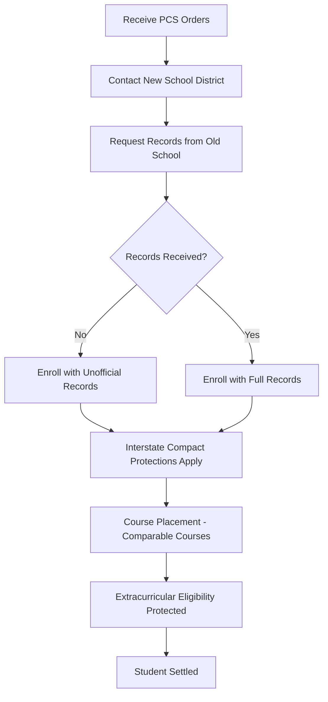

**Step 1:** Receive PCS orders and identify the new school district near your installation (e.g., Fort Leonard Wood, Whiteman AFB).

**Step 2:** Contact the new school district's enrollment office. Mention you are a military family — the Interstate Compact on Educational Opportunity for Military Children applies.

**Step 3:** Request records from the previous school. The new school **cannot delay enrollment** while waiting for records. Unofficial transcripts, hand-carried records, or even a phone call from the previous school are sufficient.

**Step 4:** Course placement must be **comparable** — if your child was in honors algebra, they should be placed in honors algebra. The school cannot demote placement due to administrative convenience.

**Step 5:** Immunization timelines are extended — the school must allow a reasonable period to obtain records or complete missing vaccinations.

**Step 6:** Extracurricular eligibility is protected. Your child should not be subject to sit-out periods for athletics or activities solely due to the military transfer.

**Step 7:** If any issues arise, contact the Missouri state military liaison or your installation's School Liaison Officer.

**Key Laws:** Interstate Compact on Educational Opportunity for Military Children, RSMo 160.2000–160.2050

---

## Scenario 12: Homeschool-to-Public School Transition

**Role:** Parent | **Complexity:** Medium

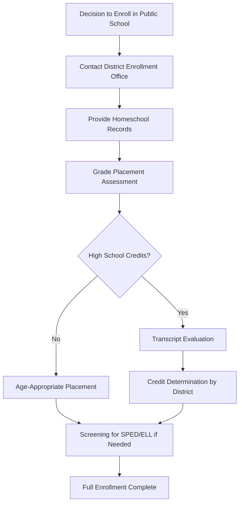

**Step 1:** Contact the local district's enrollment office. You have the right to enroll your child in the attendance-area school.

**Step 2:** Provide homeschool documentation — log of instruction hours, portfolio of work, and any standardized test results. Missouri requires 1,000 hours (600 in core subjects) under RSMo 167.031.

**Step 3:** Grade placement is determined by the district based on age and demonstrated skills. The district may administer placement assessments.

**Step 4:** For high school students, the district evaluates homeschool coursework for credit. Districts have discretion in how many credits they award — this varies. Ask for the policy in writing.

**Step 5:** If you suspect your child may need special education services or ELL support, request a screening or evaluation in writing. The district must respond.

**Step 6:** Complete standard enrollment paperwork including immunization records.

**Key Laws:** RSMo 167.031, RSMo 167.042

---

## Scenario 13: Mandated Reporter — Suspected Child Abuse

**Role:** Teacher | **Complexity:** High

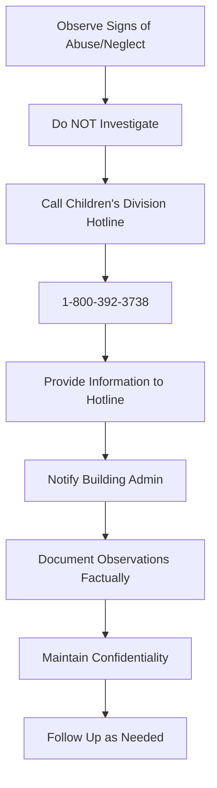

**Step 1:** You observe physical indicators (bruises, burns, malnutrition) or behavioral indicators (withdrawal, fear of adults, inappropriate sexual knowledge) in a student.

**Step 2:** Do **NOT** investigate. Do not question the child about the injuries. Do not confront the parent. Your duty is to **report**, not to determine whether abuse occurred.

**Step 3:** Call the Children's Division hotline **immediately**: **1-800-392-3738**. You do not need permission from your principal or anyone else. The law requires YOU to report — not delegate.

**Step 4:** Provide the hotline with: child's name, age, address, description of what you observed, any statements the child made voluntarily.

**Step 5:** Notify your building administrator that you have made a report. They cannot tell you not to report or override your report.

**Step 6:** Document your observations factually — what you saw, when, where. Do not include opinions or conclusions.

**Step 7:** Maintain strict confidentiality. Do not discuss with other staff, parents of other students, or anyone not involved in the investigation.

**Step 8:** You have legal immunity for good-faith reports (RSMo 210.135). Failure to report is a Class A misdemeanor (RSMo 210.115).

**Key Laws:** RSMo 210.115 (mandated reporter), RSMo 210.135 (immunity)

---

## Scenario 14: Student with Diabetes — 504 vs. IEP

**Role:** Parent | **Complexity:** Medium

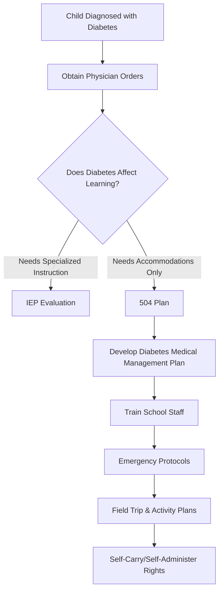

**Step 1:** Get a Diabetes Medical Management Plan (DMMP) from your child's physician. This is the medical foundation for the school plan.

**Step 2:** Request a 504 meeting in writing. Type 1 diabetes qualifies under Section 504 as a condition affecting a major life activity (endocrine function).

**Step 3:** Most students with diabetes need a **504 plan**, not an IEP. An IEP is only needed if diabetes significantly impacts educational performance requiring specialized instruction.

**Step 4:** The 504 plan should include: blood sugar monitoring schedule, insulin administration (who, when, where), free access to snacks and water, bathroom access, nurse access, excusal from activities when blood sugar is out of range.

**Step 5:** Train all staff who interact with your child — classroom teachers, PE teacher, cafeteria staff, bus driver, substitute teachers.

**Step 6:** Establish emergency protocols for hypoglycemia and hyperglycemia. Post in classroom and nurse's office.

**Step 7:** Missouri law allows students to self-carry and self-administer diabetes supplies.

**Key Laws:** Section 504, ADA, RSMo 167.621 (self-administration)

---

## Scenario 15: Custody Dispute and Records Access

**Role:** Counselor | **Complexity:** High

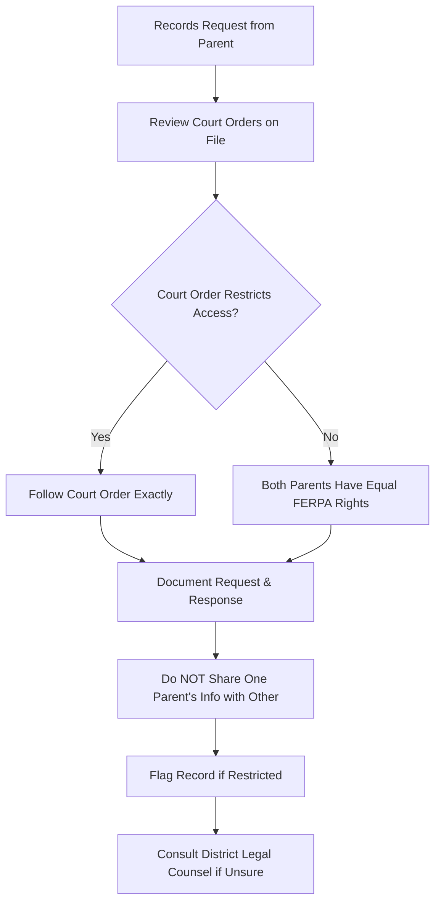

**Step 1:** When a parent requests records, check for any court orders on file in the student's record. This is your first action.

**Step 2:** Under FERPA, both parents — custodial and non-custodial — have equal rights to access educational records **unless** a court order specifically restricts access to educational records.

**Step 3:** A general restraining order or protective order does **NOT** automatically restrict FERPA rights. The court order must specifically address educational records.

**Step 4:** If a court order restricts access, follow it exactly. Provide records only to the parent with rights. Document the request and your response.

**Step 5:** Never share one parent's contact information, address, or phone number with the other parent — especially if there is a protective order.

**Step 6:** Flag the student's record in your SIS for restricted access so all staff are aware.

**Step 7:** When in doubt, consult district legal counsel before releasing records. It is better to delay briefly than to violate a court order.

**Key Laws:** FERPA (34 CFR 99.4), RSMo 452 (custody)

---

## Scenario 16: Student Experiencing Homelessness (McKinney-Vento)

**Role:** Counselor | **Complexity:** High

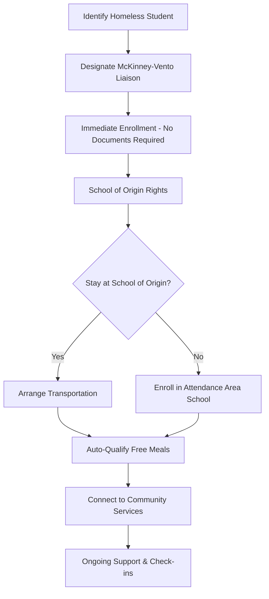

**Step 1:** Identify the student as experiencing homelessness. This includes: doubled-up with another family, living in a shelter, motel, car, campground, or awaiting foster care placement.

**Step 2:** Enroll the student **immediately**. You cannot require proof of residency, immunization records, birth certificate, school records, or any other documentation as a condition of enrollment.

**Step 3:** The student has the right to remain at their **school of origin** (the school they attended before becoming homeless) for the duration of homelessness and through the end of the school year.

**Step 4:** If the student stays at the school of origin, the district **must** arrange transportation, even across district lines.

**Step 5:** The student automatically qualifies for free meals — no application needed.

**Step 6:** Connect the family to community resources: housing assistance, food banks, clothing, health care, mental health services.

**Step 7:** Check in regularly. Students experiencing homelessness face high mobility and chronic stress. Assign a staff mentor if possible.

**Key Laws:** McKinney-Vento Homeless Assistance Act (42 USC 11431), ESSA Title IX Part A

---

## Scenario 17: International Student Enrollment — No Prior US Records

**Role:** Administrator | **Complexity:** High

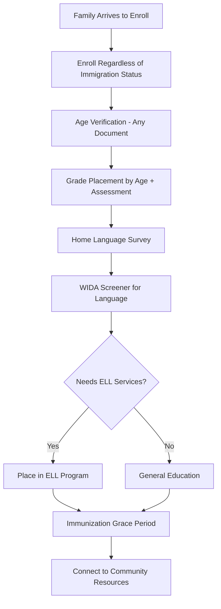

**Step 1:** Enroll the student immediately. Under Plyler v. Doe (1982), you **cannot** ask about immigration status or deny enrollment based on documentation status.

**Step 2:** Verify age with any available document — passport, birth certificate, baptismal record, or parent affidavit if no documents exist.

**Step 3:** Place the student in an age-appropriate grade. For high school students, conduct a transcript evaluation if foreign records are available. If no records exist, use placement assessments.

**Step 4:** Administer the Home Language Survey to identify the home language.

**Step 5:** Administer the WIDA Screener to assess English proficiency. If the student speaks a language other than Spanish, arrange for appropriate interpreter support during screening.

**Step 6:** Place in appropriate ELL program (newcomer program if available, ESL, sheltered instruction).

**Step 7:** Allow immunization grace period — student can attend while completing the vaccination schedule.

**Step 8:** Connect the family to community resources: refugee resettlement agencies, interpreters, cultural liaisons.

**Key Laws:** Plyler v. Doe (1982), Title VI, ESSA Title III

---

## Scenario 18: Parent Requesting Independent Educational Evaluation (IEE)

**Role:** Specialist | **Complexity:** High

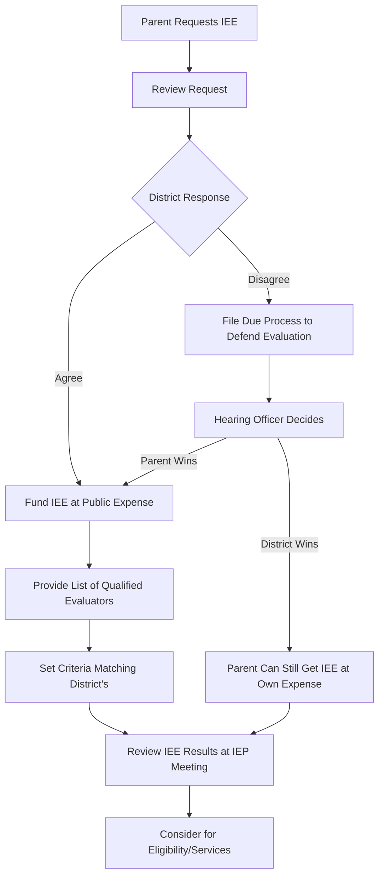

**Step 1:** Parent submits a written request for an independent educational evaluation because they disagree with the district's evaluation.

**Step 2:** The district must respond **without unreasonable delay**. You cannot ignore or delay the request.

**Step 3:** The district has two options: (1) agree and fund the IEE at public expense, or (2) file for due process to defend the adequacy of its own evaluation.

**Step 4:** If funding the IEE, provide the parent with a list of qualified evaluators. The IEE must meet the same criteria the district uses for its own evaluations (qualifications, location, etc.).

**Step 5:** The district cannot impose conditions beyond its own evaluation criteria (e.g., cannot require the parent to use a specific evaluator).

**Step 6:** Once the IEE is complete, the IEP team must **consider** the results. "Consider" does not mean "adopt" — but the team must genuinely review and discuss the findings.

**Step 7:** Parents are entitled to one IEE at public expense each time the district conducts an evaluation with which they disagree.

**Key Laws:** 34 CFR 300.502, IDEA Part B

---

## Scenario 19: Student Athlete Transfer Eligibility (MSHSAA)

**Role:** Principal | **Complexity:** Medium

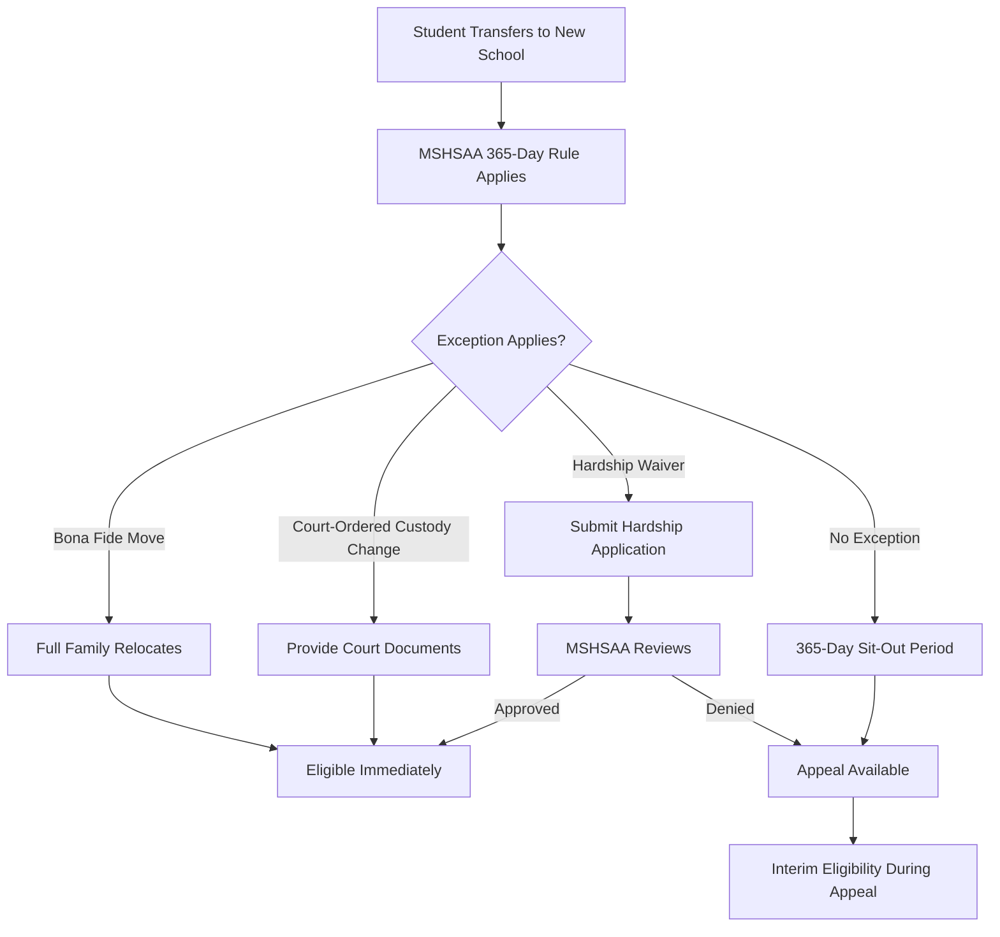

**Step 1:** When a student transfers, the MSHSAA 365-day transfer rule applies — the student is ineligible for varsity competition for 365 days.

**Step 2:** Review exceptions: bona fide family move (entire household relocates), court-ordered custody change, hardship waiver, or approved open enrollment.

**Step 3:** For a bona fide move, the entire family must have relocated. The student living with a relative or friend while parents remain does NOT qualify.

**Step 4:** Submit the MSHSAA transfer form with supporting documentation.

**Step 5:** If denied, an appeal process is available through MSHSAA. Interim eligibility may be granted during the appeal.

**Step 6:** Schools cannot recruit or induce transfers for athletic purposes — this violates MSHSAA bylaws and can result in sanctions.

**Key Laws:** MSHSAA Constitution and Bylaws, RSMo 167.020 (transfers)

---

## Scenario 20: Non-English-Speaking Parent at IEP Meeting

**Role:** Specialist | **Complexity:** High

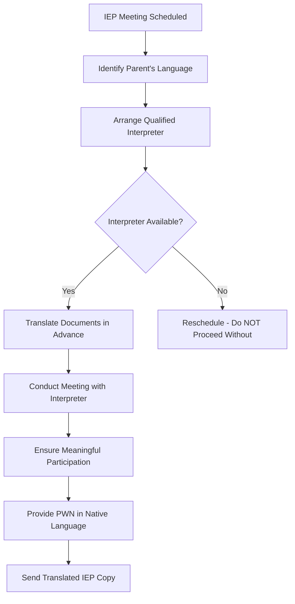

**Step 1:** Identify the parent's primary language as early as possible — at referral or when scheduling the meeting.

**Step 2:** Arrange a qualified interpreter. This must be a trained interpreter — **never** use the student, a sibling, or another child as interpreter. A bilingual staff member may serve if qualified.

**Step 3:** Translate key IEP documents in advance: evaluation summary, proposed goals, Prior Written Notice. Full IEP translation should follow.

**Step 4:** If no interpreter is available, **reschedule the meeting**. Proceeding without an interpreter violates the parent's right to meaningful participation under IDEA and Title VI.

**Step 5:** During the meeting, speak in short sentences, pause for interpretation, check for understanding, and avoid jargon.

**Step 6:** Prior Written Notice (PWN) must be provided in the parent's native language.

**Step 7:** Provide a translated copy of the final IEP within a reasonable timeframe.

**Key Laws:** IDEA §300.322 (parent participation), Title VI of the Civil Rights Act, Executive Order 13166

---

## Scenario 21: School Consolidation Impact on Families

**Role:** Administrator | **Complexity:** High

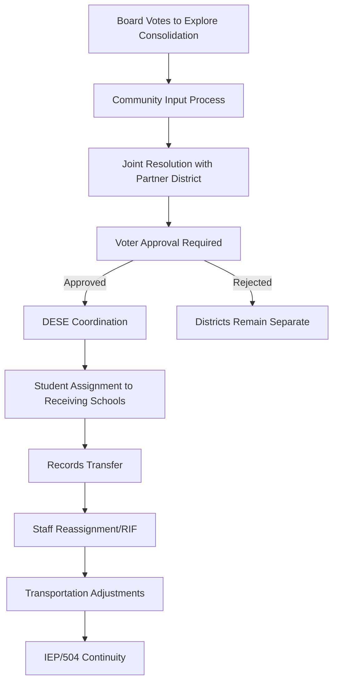

**Step 1:** The board of education votes to explore consolidation. Community engagement begins immediately — town halls, surveys, stakeholder meetings.

**Step 2:** Develop a joint resolution with the partnering district under RSMo 162.223–162.431. Multiple pathways exist: voluntary merger, annexation, or reorganization.

**Step 3:** Voter approval is required in both districts. Prepare clear communication about impacts: school assignments, transportation, programs, staffing, taxes.

**Step 4:** Upon approval, coordinate with DESE on timeline, accreditation transfer, and data systems.

**Step 5:** Assign students to receiving schools. Consider: proximity, capacity, program availability. Minimize disruption.

**Step 6:** Transfer all student records. Ensure IEP and 504 plan continuity — services cannot lapse during transition.

**Step 7:** Handle staff reassignment or reduction in force (RIF) per board policy and collective bargaining agreements.

**Step 8:** Adjust transportation routes and communicate new schedules to families well in advance.

**Key Laws:** RSMo 162.223–162.431, RSMo 168.124 (teacher contracts)

---

## Scenario 22: Student with Service Animal

**Role:** Principal | **Complexity:** Medium

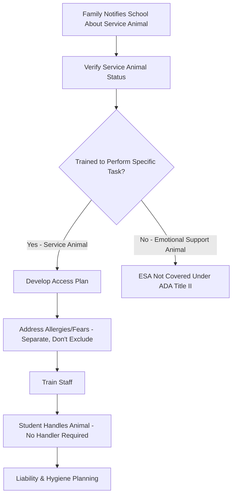

**Step 1:** When a family notifies you that a student needs a service animal, you may ask only two questions: (1) Is this animal required because of a disability? (2) What task has the animal been trained to perform?

**Step 2:** You **cannot** require documentation, certification, or a vest. There is no registry for service animals.

**Step 3:** Emotional support animals (ESAs) are NOT service animals under ADA Title II and are not required in public schools.

**Step 4:** Develop an access plan: where the animal will be during the day, bathroom breaks, feeding schedule, designated relief area.

**Step 5:** If other students or staff have allergies or fears, manage through physical separation (different seating areas), air filtration, and scheduling — **not** by excluding the student with the service animal.

**Step 6:** The student handles their own service animal. The school does not need to provide a handler.

**Step 7:** Address liability and hygiene: the family is responsible for the animal's behavior, the animal must be housebroken, and the school may exclude only if the animal is out of control or not housebroken.

**Key Laws:** ADA Title II, 28 CFR 35.136, RSMo 209.150
