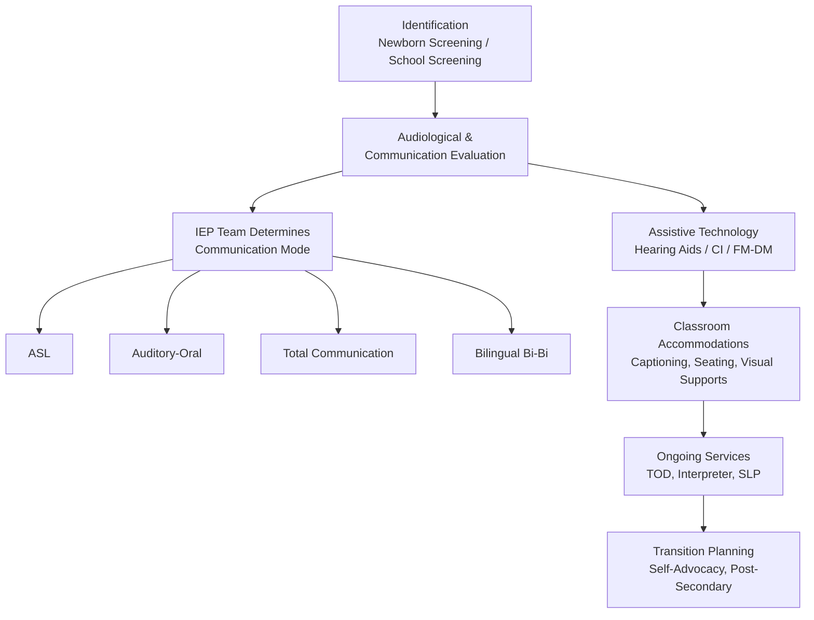

# Hearing Impairment in Education — Missouri Reference

<!-- Canonical source for: deaf/hard of hearing students, MSD, ASL, cochlear implants, FM systems, captioning, interpreters, deaf culture, audiology, IEP goals for hearing -->
<!-- Last content review: 2026-03 -->

## Table of Contents
1. Definitions & Spectrum of Hearing Loss
2. Missouri Infrastructure (MSD, Resource Center on Deafness)
3. Identification & Evaluation
4. IEP Considerations for Hearing Impairment
5. Communication Approaches
6. Assistive Technology for Hearing
7. Interpreter Services in Schools
8. Classroom Accommodations
9. Deaf Culture & Identity
10. Early Intervention (Birth-3)
11. Cochlear Implants in the School Setting
12. Auditory Processing Disorder
13. Transition Planning
14. Physical Environment & Universal Design
15. Working with a Teacher of the Deaf (TOD)
16. Parent Resources
17. IEP Goal Bank — Hearing

---

## 1. Definitions & Spectrum of Hearing Loss

### IDEA Definitions
- **Deafness:** a hearing impairment so severe that the child cannot process linguistic information through hearing, with or without amplification, which adversely affects educational performance
- **Hearing Impairment:** an impairment in hearing, whether permanent or fluctuating, that adversely affects educational performance but is not included under the definition of "deafness"

### Degrees of Hearing Loss
| Degree | Decibel Range | Impact |
|--------|-------------|--------|
| **Slight/Minimal** | 16-25 dB | May miss soft speech, whispers, distant speech |
| **Mild** | 26-40 dB | Misses 25-40% of speech signal; difficulty with soft/distant speech |
| **Moderate** | 41-55 dB | Misses 50-75% of speech; requires amplification; conversation must be loud |
| **Moderately Severe** | 56-70 dB | Misses 100% of speech without amplification |
| **Severe** | 71-90 dB | Speech must be very loud or amplified; relies heavily on visual cues |
| **Profound** | 91+ dB | Cannot process speech through hearing alone; relies on visual language |

### Types of Hearing Loss
| Type | Location | Cause Examples | Educational Impact |
|------|----------|---------------|-------------------|
| **Conductive** | Outer/middle ear | Ear infections, fluid, earwax, malformation | Often temporary/treatable; may fluctuate |
| **Sensorineural** | Inner ear/auditory nerve | Genetic, illness, noise damage, ototoxic drugs | Usually permanent; hearing aids or CI may help |
| **Mixed** | Both outer/middle + inner | Combination of above | Varies |
| **Auditory neuropathy spectrum disorder (ANSD)** | Auditory nerve/brainstem | Neurological | Sound enters ear but signal is disrupted; amplification may not help consistently |
| **Unilateral** | One ear only | Various | Often overlooked; difficulty localizing sound, hearing in noise |

### Fluctuating Hearing Loss
Many young children experience fluctuating conductive hearing loss due to chronic ear infections (otitis media). This is educationally significant — a child may hear well one week and miss 50% of speech the next. Teachers should watch for inconsistent responses to auditory instruction.

---

## 2. Missouri Infrastructure

### Missouri School for the Deaf (MSD)
- **Location:** 505 East Fifth Street, Fulton, MO 65251
- **Founded:** 1851
- **Serves:** deaf and hard of hearing students grades K-12, ages 5-21
- **Free of charge** to all eligible Missouri residents
- **Referral:** IEP team placement decision made jointly by parents and LEA
- **Programs:** Stark Elementary, Wheeler Middle/High School
- **Communication approach:** bilingual — American Sign Language (ASL) and English
- **Residential program:** dormitory/cottage-style housing; students travel home weekends
- **Transportation:** MSD provides statewide transportation between campus and designated pickup points
- **Superintendent:** Christopher Daily, (573) 592-2504
- **Website:** msd.dese.mo.gov

### MSD Resource Center on Deafness (Outreach — Statewide)
- **Services to districts throughout Missouri:**
  - Audiological evaluations and Auditory Processing Disorder evaluations
  - FM system leasing program for public schools
  - Hearing aid loaner program
  - Consultation and technical assistance
  - Sign language instruction for families and school staff
  - Early intervention support for deaf/HH children ages 3-5 (within 30 miles of MSD)
- **Contact:** (573) 592-2543

### Missouri Commission for the Deaf and Hard of Hearing (MCDHH)
- State agency providing advocacy, communication access, and information
- Interpreter referral services
- Telecommunications access

---

## 3. Identification & Evaluation

### Universal Newborn Hearing Screening (UNHS)
Missouri law requires hearing screening for all newborns before hospital discharge. Early identification enables intervention before critical language development windows close.

### School-Based Hearing Screening
| Grade/Frequency | Requirement |
|----------------|-------------|
| Kindergarten entry | Required |
| Grades 1, 3, 5, 7, 9 | DESE recommends |
| Any time a concern arises | Referral to audiologist |
| Students with IEPs for hearing | Annual audiological evaluation |

### Evaluation Components
| Assessment | Conducted By | Purpose |
|-----------|-------------|---------|
| **Audiological evaluation** | Audiologist (Au.D.) | Type, degree, configuration of hearing loss; hearing aid candidacy |
| **Speech-language evaluation** | SLP | Receptive/expressive language, speech production, vocabulary, pragmatics |
| **Communication assessment** | TOD or SLP | Preferred communication mode (ASL, spoken English, cued speech, total communication) |
| **Functional listening evaluation** | TOD or educational audiologist | How student uses hearing in classroom (with and without technology) |
| **Academic assessment** | Special educator or TOD | Impact of hearing loss on academic performance |
| **Social-emotional assessment** | School psychologist | Social skills, self-concept, peer relationships |

---

## 4. IEP Considerations for Hearing Impairment

### Required IDEA Considerations
IDEA §300.324(a)(2)(iv) requires that for a child who is deaf or hard of hearing, the IEP team consider:
- The child's language and communication needs
- Opportunities for direct communication with peers and professional personnel in the child's language and communication mode
- The child's academic level
- The child's full range of needs, including opportunities for direct instruction in the child's language and communication mode

### Key IEP Decisions
| Decision | Options |
|----------|---------|
| **Communication mode** | ASL, spoken English (auditory-oral), cued speech, total communication, bilingual (ASL + English) |
| **Interpreter services** | ASL interpreter, oral interpreter, cued speech transliterator, CART/C-Print |
| **Amplification management** | Who checks hearing aids/CIs daily? Who troubleshoots? Who maintains FM/DM system? |
| **Acoustic environment** | Classroom noise levels, FM/DM system, preferential seating, acoustic treatment |
| **Language access across settings** | How will the student access language in specials, PE, assemblies, field trips, lunch, recess? |
| **Captioning** | CART, C-Print, auto-captioning, captioned media |
| **Note-taking** | Peer notetaker, copy of teacher notes, recording permission |

### IEP Team Should Include
- Parent(s)
- Teacher of the Deaf (TOD)
- Audiologist or educational audiologist
- Speech-language pathologist
- Interpreter (if student uses one)
- General education teacher
- LEA representative
- Student (when appropriate — especially important for communication mode decisions)

---

## 5. Communication Approaches

| Approach | Description | Considerations |
|----------|-----------|---------------|
| **ASL (American Sign Language)** | Complete visual language with its own grammar, syntax, and culture | Not a signed version of English; a distinct language; primary language of the Deaf community |
| **Auditory-Oral** | Emphasizes listening and spoken language; uses hearing aids/CIs; may use speechreading | Requires significant auditory access (typically with CIs or well-fitted hearing aids) |
| **Cued Speech** | Visual system using hand shapes near the face to distinguish speech sounds that look alike on the lips | Clarifies speechreading; represents English visually |
| **Total Communication (TC)** | Philosophy of using all available communication methods (sign, speech, gesture, writing, technology) | Not a single method; flexible but can dilute language input if not implemented well |
| **Bilingual-Bicultural (Bi-Bi)** | ASL as the primary/first language; English (reading/writing) as the second language | Grounded in Deaf cultural identity; research-supported for literacy development |
| **Simultaneous Communication (SimCom)** | Speaking and signing at the same time | Common in schools but linguistically imprecise — English grammar dominates while ASL features are dropped |

### Critical Principle
**The IEP team — including the family and, when appropriate, the student — determines the communication approach.** No single approach is universally best. The decision should be based on the child's hearing levels, language development, family communication, learning style, and cultural identity.

---

## 6. Assistive Technology for Hearing

### Personal Amplification
| Device | Function |
|--------|---------|
| **Behind-the-ear hearing aids (BTE)** | Amplify sound; most common for children |
| **Cochlear implant (CI)** | Surgically implanted device that bypasses damaged inner ear; provides electrical stimulation to auditory nerve |
| **Bone-anchored hearing system (BAHA)** | Transmits sound through bone vibration; for conductive/mixed loss or single-sided deafness |

### Classroom Technology
| Technology | Function |
|-----------|---------|
| **FM system** | Wireless system: teacher wears a microphone/transmitter → signal sent directly to student's hearing aid/CI. Overcomes distance and background noise. |
| **DM (Digital Modulation) system** | Next-generation FM — Roger systems (Phonak). Better noise management. |
| **Soundfield system** | Teacher microphone + ceiling/wall speakers amplifying the teacher's voice for the whole classroom. Benefits ALL students. |
| **CART (Communication Access Realtime Translation)** | Trained captioner types everything said in real time → appears on screen. Used for assemblies, meetings, events. |
| **C-Print** | Meaning-for-meaning captioning (less verbatim than CART); displayed on a laptop screen at the student's desk. |
| **Auto-captioning** | AI-generated captions (Google Live Transcribe, Otter.ai, Microsoft Translator). Improving rapidly but not yet reliable enough to replace human captioners for critical content. |
| **Visual alerts** | Flashing fire alarms, vibrating pager/watch for alerts, visual timers |
| **Captioned media** | All videos must have captions. No exceptions. |
| **Video relay service (VRS)** | For phone calls — ASL interpreter on video connects deaf caller to hearing person |
| **Video phone (VP)** | Direct ASL-to-ASL video calls |

### FM/DM System Management in Schools
**This is the #1 daily issue.** The system only works if:
1. The teacher **wears the microphone correctly** (6-8 inches from mouth, centered on chest)
2. The teacher **turns it on at the start of class and off during private conversations**
3. Someone **checks the student's hearing aids and FM receiver daily** (listening check)
4. **Batteries/charging** is maintained
5. The **system transfers** between classrooms (or each room has a transmitter)
6. **Substitute teachers** are trained on the system (include in sub plans)

---

## 7. Interpreter Services in Schools

### Types of Interpreters
| Type | What They Do |
|------|-------------|
| **ASL interpreter** | Interprets between ASL and spoken English |
| **Oral interpreter** | Silently mouths words clearly and uses natural gestures for students who speechread |
| **Cued speech transliterator** | Produces cued speech to represent spoken English visually |
| **Deaf interpreter (CDI)** | Deaf individual who works as a team with a hearing interpreter; used for complex communication or young children |

### Interpreter Standards
- Missouri does not currently require state licensure for educational interpreters, but national certification (RID — Registry of Interpreters for the Deaf) or EIPA (Educational Interpreter Performance Assessment) score of 3.5+ is strongly recommended
- Interpreters are NOT aides, tutors, or disciplinarians — they provide communication access
- Interpreter should be positioned where the student can see both the interpreter and the instructional content
- Teacher should speak to the STUDENT, not to the interpreter ("Tell him..." is incorrect)
- Build in processing time — the interpreter is always a few seconds behind the speaker

### Interpreter in the IEP
If a student needs an interpreter, it must be documented in the IEP as a related service or supplementary aid/service, specifying: type of interpreter, hours/settings, and whether the interpreter should attend specials, assemblies, field trips, etc.

---

## 8. Classroom Accommodations

### Environmental
- **Reduce background noise** — carpet, tennis balls on chair legs, acoustic panels, close doors/windows, turn off HVAC when possible
- **Optimal seating** — face-to-face with teacher; able to see all speakers; near front but with full visual field of the room
- **Good lighting on the teacher's face** — essential for speechreading; don't stand in front of windows (backlit face is unreadable)
- **Minimize visual distractions** behind the teacher (busy bulletin boards directly behind teacher's position)
- **FM/DM system functioning** every period
- **Visual fire alarms** (ADA requirement)

### Instructional
- **Face the student when speaking** — don't talk while writing on the board, walking away, or looking at a screen
- **Don't cover your mouth** (hands, papers, masks obstruct speechreading)
- **Repeat peer comments** before responding (the student may not have heard classmates)
- **Caption ALL media** — videos, audio clips, announcements
- **Pre-teach vocabulary** — new terms with visual supports before the lesson
- **Visual supports** for everything — written agendas, graphic organizers, anchor charts, visual instructions
- **Check for understanding frequently** — "Did you hear me?" is NOT a check. Ask content questions. Have the student paraphrase.
- **Provide written instructions** in addition to verbal
- **Reduce language complexity** if needed — use clear, direct sentences (not simplified concepts, just clearer language)
- **Signal topic changes** clearly ("We're done talking about fractions. Now we're going to talk about geometry.")

### Assessment
- Extended time (processing through an interpreter takes longer; reading may take longer for students whose first language is ASL)
- Interpreter during testing (for directions and content that is not testing language/reading)
- Preferential seating (away from noise sources)
- Separate room (if using interpreter or FM system)
- Captioned or transcript versions of any audio content
- Signed administration of tests when permitted by test publisher

### Social
- Facilitate communication between deaf and hearing peers (teach basic signs to classmates)
- Ensure the student is included in group work (assign roles, use visual communication tools)
- Lunch, recess, and unstructured time — the interpreter may not be present; plan for access
- Deaf awareness education for the class (age-appropriate — what is deafness? how do hearing aids work? basic signs)
- Connect with Deaf peers if the student is the only deaf student in the school (MSD events, Deaf community events, online connections)

---

## 9. Deaf Culture & Identity

### Key Concepts for Educators
- **Deaf (capital D)** refers to cultural identity — membership in the Deaf community, use of ASL, shared values and experiences
- **deaf (lowercase d)** refers to audiological status — the physical condition of not hearing
- Many Deaf people do not view deafness as a disability but as a linguistic and cultural difference
- **Language deprivation** — when a deaf child does not have access to a fully accessible language (either spoken through amplification OR signed) in the first years of life, it can cause permanent cognitive and linguistic harm. This is a critical equity issue.
- **Deaf gain** — the concept that deafness brings unique perspectives, cognitive strengths, and cultural richness rather than only loss

### Educator Responsibilities
- Respect the family's and student's communication choices
- Provide full language access in the chosen communication mode — not partial access
- Recognize that isolation is the biggest challenge for many deaf students in general education (especially if they are the only deaf student)
- Connect families with the Deaf community and Deaf role models
- Never prohibit a student from signing (historically, sign language was banned in many schools — this caused significant harm)

---

## 10. Early Intervention (Birth-3)

### Missouri First Steps
- Part C early intervention for infants/toddlers with hearing loss
- Family-centered services in natural environments (home, childcare)
- IFSP (Individualized Family Service Plan) developed with the family
- Key services: speech-language therapy, audiology, family education on communication approaches, ASL instruction for families, parent-to-parent support

### Critical Period
Research consistently demonstrates that language intervention before 6 months of age produces significantly better language outcomes for deaf children, regardless of communication mode. Early identification through UNHS + immediate early intervention is essential.

### Transition to Part B (Age 3)
- Planning begins 90 days before the child's 3rd birthday
- IEP must be in effect by the 3rd birthday
- MSD's early childhood program (within 30 miles of Fulton) serves ages 3-5
- LEA may also provide preschool ECSE services locally

---

## 11. Cochlear Implants in the School Setting

### What Schools Need to Know
- A cochlear implant (CI) is a surgically implanted device — the school cannot adjust internal settings
- The **external processor** (the part the student wears) can be managed at school
- Staff should know: how to turn the processor on/off, how to change batteries/charge, basic troubleshooting (reboot, check coil connection), and when to contact the audiologist
- A CI does NOT produce "normal hearing" — the student still has a hearing impairment and needs accommodations
- Some students have bilateral CIs (both ears); some have a CI on one side and a hearing aid on the other (bimodal)

### FM/DM Integration
- FM/DM systems can connect wirelessly to most CI processors
- The audiologist programs the CI to work with the FM receiver
- Critical: make sure the FM system is set correctly for the CI (different from hearing aid settings)

### Water, Sports, PE
- External processor should be removed for swimming and contact sports (or protected with a waterproof cover)
- Static electricity can damage CI processors — be cautious with plastic slides, bouncy houses
- The student should have a safe storage place for the processor during these activities

---

## 12. Auditory Processing Disorder

### What It Is
Auditory Processing Disorder (APD) affects how the brain processes auditory information — hearing is typically normal, but the student struggles to understand speech, especially in noise. It is NOT a hearing loss, but the educational impact can be similar.

### School Accommodations for APD
- FM/DM system (teacher microphone → direct to student)
- Preferential seating (near teacher, away from noise)
- Visual supports for all auditory instruction
- Reduced background noise
- Pre-teaching vocabulary
- Repetition and rephrasing (not just repeating louder)
- Written instructions in addition to verbal
- Extended time for auditory processing

### Eligibility
APD alone may qualify a student under "Other Health Impairment" or may be addressed through a 504 plan if it substantially limits learning.

---

## 13. Transition Planning

### Employment and Post-Secondary
| Resource | Service |
|----------|---------|
| **Missouri Vocational Rehabilitation (VR)** | Pre-employment transition services, job placement, on-the-job support, AT for the workplace |
| **MSD Transition Programs** | Career exploration, work experience, independent living |
| **MCDHH** | Interpreter services, advocacy, employer education |
| **National Technical Institute for the Deaf (NTID/RIT)** | Post-secondary education for deaf students (Rochester, NY) |
| **Gallaudet University** | The only university designed specifically for deaf students (Washington, DC) |

### Transition IEP Goals Should Address
- Self-advocacy for communication access (requesting interpreters, captioning, accommodations)
- Technology skills for the workplace (captioned phone, email, video relay)
- Independent living (managing communication in the hearing world — ordering food, medical appointments, banking)
- Driver's education considerations (visual-only driving — no audio cues)
- Social and community access (Deaf community connections, hearing world navigation)
- Post-secondary planning (accommodations at college, disability services registration)

---

## 14. Physical Environment & Universal Design

### Acoustic Standards
- ANSI/ASA S12.60 recommends background noise ≤35 dB and reverberation time ≤0.6 seconds in classrooms
- Acoustic treatments: carpeting, acoustic ceiling tiles, curtains, wall panels, door seals
- Avoid open-concept classrooms for students with hearing loss

### Visual Access
- Visual fire alarms (strobe lights) — ADA requirement
- Visual announcements (PA announcements should also be displayed on screens or delivered in writing)
- Clear sightlines throughout the room (students need to see the teacher, interpreter, board, and classmates)
- Circular or horseshoe seating for discussions (so the student can see all speakers)
- Visual bells/timers for transitions

---

## 15. Working with a Teacher of the Deaf (TOD)

### Role of the TOD
- Certified specialist with endorsement in Deaf/Hard of Hearing education
- Provides direct instruction in language, communication, self-advocacy, and ECC areas
- Consults with general education teachers on accommodations and modifications
- Manages hearing technology (hearing aid checks, FM system management)
- Provides pre-teaching and post-teaching of vocabulary and concepts
- May serve itinerantly (traveling between schools) or in a self-contained setting
- Critical shortage area in Missouri — many districts have difficulty finding qualified TODs

### Classroom Teacher Responsibilities
- Learn to use the FM/DM system correctly
- Face the student when speaking
- Caption all media — no exceptions
- Repeat peer comments
- Provide materials to the TOD in advance for pre-teaching
- Include the student in ALL activities (don't pull them out for interpreting convenience)
- Learn some basic signs (if the student uses ASL) — even a few signs show respect and effort

---

## 16. Parent Resources

| Resource | Contact |
|----------|---------|
| Missouri School for the Deaf | msd.dese.mo.gov / (573) 592-4000 |
| MSD Resource Center on Deafness | (573) 592-2543 |
| MCDHH (Missouri Commission for the Deaf and Hard of Hearing) | mcdhh.mo.gov |
| MPACT (Missouri Parents Act) | missouriparentsact.org |
| Hands & Voices | handsandvoices.org (national parent organization — unbiased on communication mode) |
| AG Bell Association | agbell.org (spoken language advocacy) |
| National Association of the Deaf (NAD) | nad.org |
| Laurent Clerc National Deaf Education Center | clerccenter.gallaudet.edu |
| Gallaudet University | gallaudet.edu |

---

## 17. IEP Goal Bank — Hearing

### Language Development Goals
- [Student] will comprehend [grade-level/adapted] vocabulary in [communication mode] with 80% accuracy across 3 consecutive sessions as measured by curriculum-based assessment by [date].
- [Student] will produce grammatically correct English sentences (written) containing [target structure] with 80% accuracy on written assignments by [date].
- [Student] will retell a [grade-level] story including [#] story elements in [ASL/spoken English] with 80% accuracy by [date].

### Auditory/Listening Goals (for students using spoken language)
- [Student] will discriminate between [target sounds/words] in a quiet environment with 90% accuracy by [date].
- [Student] will follow [#]-step spoken directions in the classroom with FM system with 80% accuracy by [date].
- [Student] will identify when a communication breakdown has occurred and use a repair strategy (ask for repetition, ask for clarification, move closer) on 4 of 5 opportunities by [date].

### Technology/Self-Management Goals
- [Student] will independently perform a daily listening check of their hearing aids/CI and report malfunctions to the teacher on 5 of 5 school days by [date].
- [Student] will independently manage their FM system (turn on, pair, troubleshoot, charge) with no adult prompting by [date].

### Self-Advocacy Goals
- [Student] will explain their hearing loss and communication needs to a new teacher or adult using [a prepared script / their own words] covering [3+ key points] on 4 of 5 opportunities by [date].
- [Student] will request accommodations (captioning, interpreter, seating, repetition) in a new setting without prompting on 4 of 5 opportunities by [date].
- [Student] will advocate for communication access in a group setting by requesting that one person speak at a time or by asking a peer to repeat what was said, on 4 of 5 observed opportunities by [date].

### Social Goals
- [Student] will initiate a conversation with a hearing peer using [ASL / spoken English / written communication] during unstructured time at least [#] times per week for 4 of 5 weeks by [date].
- [Student] will use appropriate turn-taking in a group conversation (visual attention, waiting for turn, appropriate volume) on 4 of 5 opportunities by [date].
