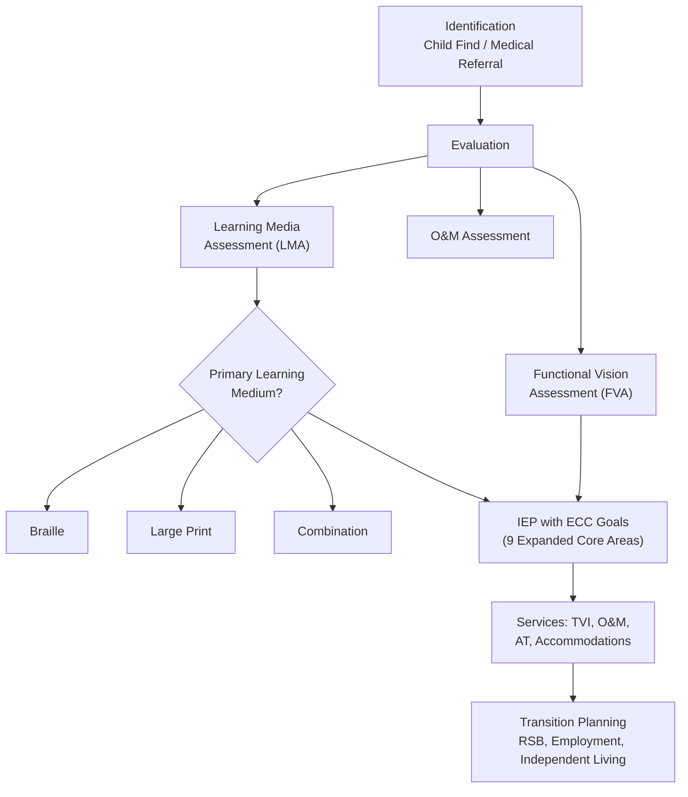

# Vision Impairment in Education — Missouri Reference

<!-- Canonical source for: blind/visually impaired students, TVI, O&M, braille, MSB, MIRC, low vision, cortical visual impairment -->
<!-- Last content review: 2026-03 -->

## Table of Contents
1. Definitions & Prevalence
2. Missouri Infrastructure (MSB, Outreach, MIRC, BSS)
3. Identification & Evaluation
4. IEP Considerations for Visual Impairment
5. The Expanded Core Curriculum (ECC)
6. Braille Literacy & the Braille Decision
7. Assistive Technology for Vision
8. Orientation & Mobility (O&M)
9. Classroom Accommodations
10. Low Vision Strategies
11. Cortical Visual Impairment (CVI)
12. Deaf-Blindness
13. Early Intervention (Birth-3)
14. Transition Planning
15. Physical Environment & Universal Design
16. Working with a TVI and O&M Specialist
17. Parent Resources
18. IEP Goal Bank — Vision

---

## 1. Definitions & Prevalence

### IDEA Definition
**Visual Impairment including Blindness:** an impairment in vision that, even with correction, adversely affects a child's educational performance. The term includes both partial sight and blindness.

### Clinical Definitions
| Term | Definition |
|------|-----------|
| **Legally blind** | Visual acuity of 20/200 or less in the better eye with best correction, OR visual field of 20 degrees or less |
| **Low vision** | Visual acuity between 20/70 and 20/200 with best correction; functional vision remains |
| **Totally blind** | No usable vision; relies on tactile and auditory input |
| **Cortical Visual Impairment (CVI)** | Brain-based visual impairment — eyes may be structurally normal but the brain doesn't process visual input typically; most common cause of visual impairment in children in developed countries |
| **Functional vision** | How a student actually uses their remaining vision in daily life and learning tasks |

---

## 2. Missouri Infrastructure

### Missouri School for the Blind (MSB)
- **Location:** 3815 Magnolia Avenue, St. Louis, MO 63110
- **Serves:** visually impaired Missouri children ages 5-21 (centerbase school) and birth-21 (outreach)
- **Free of charge** to all eligible Missouri students
- **Referral:** joint decision by parents and LEA; placement through the IEP process
- **Accredited** by the North Central Association
- **Programs:** academic instruction, expanded core curriculum, residential options, transition, extracurriculars (wrestling, track, swimming, goalball, cheerleading, forensics)
- **Website:** msb.dese.mo.gov

### MSB Outreach Services (Statewide)
- **Vision/O&M assessment** at no cost to districts
- **Technical assistance** for LEAs serving students with visual impairments
- **Professional development** for teachers and staff
- **MoSPIN (Missouri Statewide Parent Involvement Network):** free home-based program for families of children birth-5 who are visually impaired
- **Contact:** Jane Herder, Director Outreach, 314-633-1582, jane.herder@msb.dese.mo.gov

### Missouri Instructional Resource Center (MIRC)
- Coordinates registration of students who are legally blind
- Administers **Federal Quota Funds** (American Printing House for the Blind — APH)
- Provides braille/large print textbooks and specialized materials
- Serves ~1,250 students across Missouri (public, private, homeschool)

### Blindness Skills Specialists (BSS)
- RSMo 162.1133 mandates a BSS at each Regional Professional Development Center (RPDC)
- Provide training, consultation, and technical assistance to districts
- Located at: Truman State (NE), Missouri State (SW), and other RPDC sites

### Missouri Blind Task Force (BTF)
- Advisory body to DESE on services for blind/visually impaired students
- RSMo 162.1136 requires annual report to the legislature on literacy of blind/VI children
- Composed of parents, educators, adult service providers, and community members

---

## 3. Identification & Evaluation

### Child Find
Districts must identify children with visual impairments through Child Find activities (IDEA §300.111). Many children with VI are identified through pediatric vision screening, medical referral, or parent concern before school age.

### Evaluation Components for Visual Impairment
| Assessment | Conducted By | Purpose |
|-----------|-------------|---------|
| **Functional Vision Assessment (FVA)** | Teacher of the Visually Impaired (TVI) | How the student uses remaining vision in real-world settings |
| **Learning Media Assessment (LMA)** | TVI | Determines whether the student's primary learning medium should be print, braille, or a combination |
| **Clinical/Low Vision Evaluation** | Ophthalmologist or optometrist (low vision specialist) | Medical diagnosis, acuity, field, prognosis |
| **Orientation & Mobility Assessment** | Certified O&M Specialist (COMS) | Travel skills, spatial concepts, environmental awareness |
| **Assistive Technology Assessment** | AT specialist or TVI | Technology needs for access to curriculum |

### The Learning Media Assessment Is Critical
Missouri law (RSMo 162.1120) requires that the IEP team consider braille instruction for any student who is blind or visually impaired. The LMA determines which learning media (braille, print, audio, combination) is appropriate and should drive IEP decisions.

---

## 4. IEP Considerations for Visual Impairment

### Required Considerations (IDEA + Missouri)
- **Braille instruction** must be considered for ALL students with visual impairments (RSMo 162.1120; IDEA §300.324(a)(2)(iii))
- **If braille is not provided,** the IEP must document the reasons why it is not appropriate and what alternative media will be used
- **Expanded Core Curriculum (ECC)** areas should be addressed in the IEP (see §5)
- **Orientation & Mobility** services should be considered
- **Assistive technology** must be considered (IDEA requirement for all IEPs; critical for VI)
- **Accessible materials** must be provided in the student's preferred learning medium (braille, large print, audio, digital)

### IEP Team for a Student with VI Should Include
- Parent(s)
- Teacher of the Visually Impaired (TVI)
- Certified Orientation & Mobility Specialist (COMS) — if O&M is being considered or provided
- General education teacher
- LEA representative
- Student (when appropriate)
- Others as needed (AT specialist, school nurse, PE teacher)

### Service Delivery Models
| Model | Description |
|-------|-----------|
| **Itinerant/consultative** | TVI travels to the student's school; provides direct instruction and consults with classroom teachers (most common for students in general education) |
| **Resource room** | Student receives instruction from TVI in a dedicated space for part of the day |
| **Self-contained** | Student is in a classroom specifically for students with visual impairments (rare in most districts) |
| **Residential school** | Missouri School for the Blind (MSB) — students attend MSB's centerbase program |

---

## 5. The Expanded Core Curriculum (ECC)

The ECC defines the additional skills that students with visual impairments need beyond the general curriculum. Sighted students learn many of these skills incidentally through observation — blind and VI students need explicit, systematic instruction.

### Nine ECC Areas

| Area | What It Covers | Why It Matters |
|------|---------------|---------------|
| **1. Compensatory/academic skills** | Braille, tactile graphics, adapted materials, study skills, organization | Access to the general curriculum |
| **2. Orientation & Mobility** | Cane travel, spatial concepts, route planning, public transportation, GPS | Independent movement and safety |
| **3. Social interaction skills** | Nonverbal communication, eye contact/facial expression awareness, social initiation, interpreting social cues | Sighted peers learn these through observation; VI students need explicit instruction |
| **4. Independent living skills** | Cooking, cleaning, personal care, money management, shopping, home management | Essential for adult independence |
| **5. Recreation & leisure** | Sports (goalball, beep baseball, tandem cycling), hobbies, fitness, community recreation | Quality of life; social inclusion |
| **6. Career education** | Career exploration, work experience, job skills, self-advocacy in the workplace | Employment outcomes for VI adults are disproportionately low |
| **7. Technology** | Screen readers, magnification, braille displays, accessible apps, GPS navigation | Essential for academic and life access |
| **8. Self-determination** | Self-advocacy, understanding one's disability, requesting accommodations, decision-making | Critical for post-secondary success |
| **9. Sensory efficiency** | Maximizing use of remaining vision, auditory skills, tactile discrimination | Foundation for all other learning |

---

## 6. Braille Literacy & the Braille Decision

### Missouri Braille Mandate
RSMo 162.1120 requires IEP teams to provide instruction in braille and the use of braille unless the team determines, after evaluation, that braille instruction is not appropriate. **The presumption is IN FAVOR of braille** — the team must justify NOT providing it.

### When Braille Is Appropriate
- Student is totally blind or has very limited functional vision
- Student has a progressive eye condition and will likely lose vision
- Student reads print at a significantly reduced rate that limits academic access
- Student experiences visual fatigue that limits sustained reading
- LMA indicates braille is or should be the primary learning medium

### Braille Literacy Components
- Uncontracted braille (Grade 1): letter-for-letter transcription
- Contracted braille (Grade 2): standard literary braille with contractions and short-form words
- Nemeth Code: braille for mathematics and science notation
- Music braille
- Braille technology: refreshable braille displays, braille notetakers

---

## 7. Assistive Technology for Vision

### Low Vision AT
| Technology | Function |
|-----------|---------|
| **Magnification software** (ZoomText, built-in OS magnifiers) | Enlarges on-screen content |
| **CCTV / video magnifier** | Desktop or portable camera magnifying printed materials |
| **Large print materials** | Enlarged text (typically 18-24 point; determined by student need) |
| **High-contrast settings** | Reverse contrast (white text on black), color adjustments |
| **Adjustable lighting** | Task lighting, reduced glare, window positioning |
| **iPad/tablet accessibility** | Pinch-to-zoom, display settings, Guided Access |

### Blindness AT
| Technology | Function |
|-----------|---------|
| **Screen readers** (JAWS, NVDA, VoiceOver, TalkBack) | Convert text to speech; navigate computer/device by audio |
| **Refreshable braille display** | Outputs digital text as braille characters the student reads tactually |
| **Braille notetaker** (BrailleNote, Brailliant) | Portable device for note-taking and computing in braille |
| **Optical character recognition (OCR)** | Scans printed text and converts to digital/speech |
| **Audio description** | Narrated description of visual content in videos |
| **Tactile graphics** | Raised-line diagrams, maps, charts for tactile exploration |
| **3D printed models** | Physical models of concepts that are typically visual (molecules, geography, anatomy) |
| **GPS/wayfinding apps** | Blindsquare, Seeing AI, Google Maps with VoiceOver — navigation |
| **Smart cane / electronic travel aids** | WeWalk, Sunu Band — supplement the white cane with sensors |
| **AI vision tools** | Be My Eyes, Seeing AI — use camera to describe surroundings |

---

## 8. Orientation & Mobility (O&M)

### What O&M Covers
| Skill Area | Examples |
|-----------|---------|
| **Spatial concepts** | Body awareness, directionality, spatial relationships, mapping |
| **Indoor travel** | Trailing, room familiarization, locating objects, building navigation |
| **Outdoor travel** | Sidewalk travel, street crossings, traffic patterns, environmental cues |
| **White cane skills** | Cane technique (constant contact, two-point touch), cane care |
| **Public transportation** | Bus, train, ride-share — route planning, stop identification, payment |
| **GPS and technology** | Using accessible GPS for route planning and navigation |
| **Self-advocacy** | Requesting assistance, declining unwanted help, communicating needs |

### Who Provides O&M?
**Certified Orientation & Mobility Specialist (COMS)** — requires specialized graduate training and national certification through ACVREP (Academy for Certification of Vision Rehabilitation and Education Professionals).

### O&M Is a Related Service Under IDEA
O&M should be provided when the IEP team determines the student needs it to access their education and function independently in the school and community environment.

---

## 9. Classroom Accommodations

### Environmental
- Preferential seating (close to board/teacher; consider glare and lighting)
- Consistent room arrangement (notify student of ANY changes)
- Reduced clutter in pathways
- High-contrast markings on stairs, doorframes, hazards
- Adequate and adjustable lighting (some students need MORE light; CVI students may need LESS)
- Minimize glare on screens and whiteboards

### Instructional
- **Verbalize everything written on the board** ("I'm writing 'Chapter 3, page 47' on the board")
- **Describe visual content** — images, graphs, charts, demonstrations
- Provide materials in accessible format BEFORE the lesson (not after)
- Allow extra time for reading, writing, and processing visual information
- Provide tactile models and hands-on materials for concepts typically taught visually
- Permit audio recording of lectures
- Use high-contrast handouts (avoid light colors, busy backgrounds)
- Enlarge worksheets or provide digital versions
- Read aloud test questions and written instructions
- Allow use of AT devices (braille display, magnifier, screen reader) during all activities including testing

### Assessment
- Extended time (typically 1.5x-2x; braille readers may need more)
- Braille test forms (coordinate through MIRC or testing coordinator)
- Large print test forms
- Human reader for tests (for content that is not testing reading ability)
- Scribe or speech-to-text for written responses
- Separate testing room (to use AT without disturbing others)
- Tactile graphics for diagrams and charts on assessments

### Social
- Facilitate introductions (peers may not know the student can't see them)
- Teach sighted peers how to interact naturally (describe what's happening, offer elbow for guiding)
- Include student in all activities (don't exclude from field trips, PE, art, science labs)
- Adaptive PE (beep balls, tactile boundaries, guide runners, audio cues)

---

## 10. Low Vision Strategies

For students with usable remaining vision:
- Determine optimal font size through assessment (not assumption — test it)
- Teach the student to self-advocate for their visual needs
- Position materials at the optimal working distance
- Use bold-lined paper for writing
- Provide colored overlays if helpful for tracking
- Use high-contrast colors (black on white or white on yellow are common)
- Avoid red/green combinations (common color deficiency)
- Allow the student to hold materials close — this is NOT harmful to their eyes
- Provide electronic text that the student can resize themselves

---

## 11. Cortical Visual Impairment (CVI)

### What It Is
CVI is a brain-based visual impairment caused by damage to the visual pathways or visual processing centers of the brain. Eyes may be structurally normal. CVI is the **most common cause of visual impairment in children** in developed countries.

### Characteristics of CVI
| Characteristic | What It Looks Like |
|---------------|-------------------|
| Color preference | Student responds to specific colors (often red or yellow); use preferred color to attract attention |
| Need for movement | Moving objects are easier to see than stationary ones |
| Visual latency | Delayed response to visual stimuli — student needs extra time to "see" |
| Visual field preferences | May see better in a specific area of their visual field |
| Difficulty with complexity | Cluttered visual environments overwhelm; simple backgrounds improve access |
| Light sensitivity | May be attracted to light OR aversive to light |
| Difficulty with distance | Near vision may be better than distance vision |
| Novelty issues | Familiar objects recognized more easily than new ones |
| Difficulty with faces | May not recognize faces visually |

### CVI Accommodations
- **Reduce visual clutter** (clean backgrounds, uncluttered workspace, one item at a time)
- **Use the student's preferred color** for highlighting, materials, presentation
- **Allow extra processing time** (visual latency — don't rush)
- **Present one item at a time** rather than a full page of content
- **Use backlighting** (light table, iPad brightness) if the student is light-seeking
- **Reduce ambient light** if the student is light-aversive
- **Movement cues** to draw visual attention
- **Consistent environment** — minimize changes; introduce new items slowly
- **CVI Range Assessment** (Christine Roman-Lantzy framework) to determine phase and strategies

---

## 12. Deaf-Blindness

### Definition
IDEA defines deaf-blindness as simultaneous hearing and vision impairments, the combination of which causes such severe communication and other developmental and educational needs that they cannot be accommodated in special education programs solely for children with deafness or blindness.

### Missouri DeafBlind Project (MoDBTAP)
- Based at Missouri School for the Blind
- Technical assistance, training, family support
- Intervener services (1:1 support for students who are deafblind)
- Transition planning and the Midwest Transition Institute
- Contact: 314-633-1582; msb.dese.mo.gov

### Intervener
An intervener works 1:1 with a student who is deafblind to facilitate information access, communication, and social interaction. The need is determined by the IEP team.

---

## 13. Early Intervention (Birth-3)

### First Steps + MoSPIN
- **First Steps:** Missouri's Part C program — serves infants/toddlers with visual impairments and developmental delays
- **MoSPIN (Missouri Statewide Parent Involvement Network):** free home-based program through MSB for families of children birth-5 with visual impairments
- Early identification and intervention are critical — visual development occurs primarily in the first years of life

### Key Early Intervention Areas
- Bonding and attachment (visual impairment affects parent-child interaction)
- Motor development (vision drives reaching, crawling, walking)
- Concept development (many early concepts are learned visually)
- Communication and language
- Orientation and mobility readiness
- Sensory integration
- Family support and education

---

## 14. Transition Planning

### Employment Outcomes
Adults who are blind or visually impaired experience significantly higher unemployment rates than the general population. Transition planning is critical.

### Missouri Resources
| Agency | Services |
|--------|---------|
| **Rehabilitation Services for the Blind (RSB)** | Pre-employment transition services, vocational training, job placement, assistive technology, independent living |
| **MSB Transition Programs** | Summer Transitional Employment Program (S.T.E.P.); transition curriculum; work experience |
| **NFB of Missouri** | National Federation of the Blind — advocacy, mentoring, scholarship programs |

### Transition IEP Goals Should Address
- Self-advocacy and disclosure of disability to employers
- Assistive technology skills for the workplace
- Independent living skills (cooking, cleaning, finances, transportation)
- Orientation and mobility in community and work settings
- Social skills for the workplace
- Career exploration aligned to interests and strengths (not limited by assumptions about blindness)

---

## 15. Physical Environment & Universal Design

### School Building Considerations
- Consistent layout (avoid frequent furniture rearrangements)
- Tactile and high-contrast wayfinding (room numbers, stair edges, floor texture changes)
- Braille signage on room labels and directories (ADA requirement)
- Adequate lighting throughout (especially stairwells, restrooms, hallways)
- Non-glare flooring
- Audible signals on elevators and crosswalks
- Accessible emergency notification (visual alarms are for deaf students — students who are blind need audible alarms, which are standard)
- Obstacle-free travel paths (no chairs/backpacks/carts in hallways)

---

## 16. Working with a TVI and O&M Specialist

### Teacher of the Visually Impaired (TVI)
- Certification: Missouri certificate with endorsement in Visual Impairment (K-12)
- Typically serves students on an itinerant basis (travels between schools)
- Provides: braille instruction, ECC instruction, material adaptation, AT training, consultation with classroom teachers
- Critical shortage area — many Missouri districts struggle to find TVIs

### O&M Specialist (COMS)
- Certification: ACVREP-certified Orientation & Mobility Specialist
- Provides: travel training (indoor, outdoor, public transit), spatial concepts, cane skills
- May work independently or as part of the TVI's team
- Also a critical shortage area

### Classroom Teacher Responsibilities
- Collaborate with the TVI and COMS
- Provide lesson plans/materials to TVI IN ADVANCE (so materials can be adapted to braille or large print)
- Verbalize all visual content during instruction
- Follow accommodation plan consistently
- Include the student in all activities
- Allow the student to use AT devices without stigma

---

## 17. Parent Resources

| Resource | Contact |
|----------|---------|
| Missouri School for the Blind (MSB) | msb.dese.mo.gov / 314-633-1592 |
| MoSPIN (birth-5 families) | Through MSB Outreach |
| MPACT (Missouri Parents Act) | missouriparentsact.org |
| National Federation of the Blind (NFB) — Missouri | nfb.org |
| American Foundation for the Blind (AFB) | afb.org |
| FamilyConnect (AFB resource for parents) | familyconnect.org |
| APH ConnectCenter | aph.org |
| Missouri Blind Task Force | Through DESE |

---

## 18. IEP Goal Bank — Vision

### Braille Literacy Goals (Examples)
- [Student] will read contracted braille at [X] words per minute with 95% accuracy on grade-level text as measured by [assessment] by [date].
- [Student] will write in contracted braille using a braille notetaker with 90% accuracy on spelling and contractions as measured by work samples by [date].
- [Student] will decode Nemeth Code mathematics symbols for [grade-level operations] with 90% accuracy as measured by assessment by [date].

### Assistive Technology Goals
- [Student] will independently navigate a computer using [JAWS/VoiceOver] to open files, browse the internet, and complete assignments with 90% independence as measured by observation/task analysis by [date].
- [Student] will use a refreshable braille display to read and respond to digital text in [subject] assignments with 80% independence as measured by teacher observation by [date].

### Orientation & Mobility Goals
- [Student] will independently travel from [origin] to [destination] within the school building using their white cane with correct technique (constant contact) and no verbal prompts on 4 of 5 trials by [date].
- [Student] will cross a controlled intersection using auditory and tactile cues with no physical assistance on 4 of 5 opportunities by [date].
- [Student] will plan and execute a route to a novel destination using [GPS app] with no more than 1 verbal prompt by [date].

### Self-Determination Goals
- [Student] will explain their visual impairment and needed accommodations to a new teacher or employer using a prepared self-advocacy script with 90% of key points covered on 3 of 4 opportunities by [date].
- [Student] will independently request accommodations (materials in braille/large print, preferential seating, extended time) in a new setting without adult prompting on 4 of 5 opportunities by [date].

### Social Interaction Goals
- [Student] will orient their face toward a speaker during conversation and use appropriate nonverbal social behaviors (nodding, facial expression) on 4 of 5 observed opportunities by [date].
- [Student] will initiate a social interaction with a peer during unstructured time (lunch, recess, passing period) at least 2 times per day for 4 of 5 school days as measured by observation data by [date].

### Independent Living Goals
- [Student] will prepare a simple meal following a recipe in [braille/large print/audio] with no more than 1 verbal prompt using safe techniques by [date].
- [Student] will identify U.S. currency denominations and make change for purchases under $20.00 with 90% accuracy using [tactile/app strategy] by [date].
