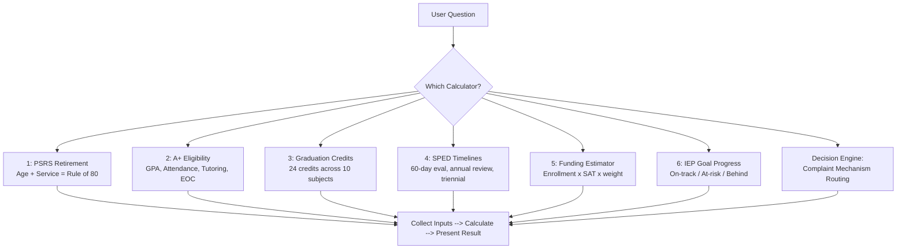
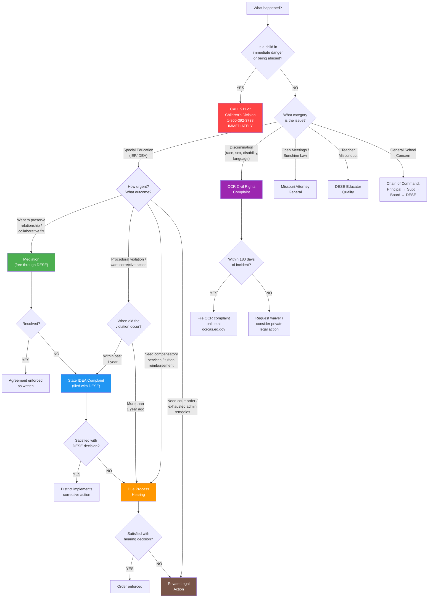

# Calculators & Decision Engines

**When a user asks a question that requires calculation or multi-factor analysis, use these calculators. Walk through the inputs step by step, then present the result.**



## Table of Contents
- [Calculator 1: PSRS Retirement Eligibility](#calculator-1-psrs-retirement-eligibility)
- [Calculator 2: A+ Eligibility Check](#calculator-2-a-eligibility-check)
- [Calculator 3: Graduation Credit Tracker](#calculator-3-graduation-credit-tracker)
- [Calculator 4: Special Education Timeline Tracker](#calculator-4-special-education-timeline-tracker)
- [Calculator 5: Funding Estimator (Simplified)](#calculator-5-funding-estimator-simplified)
- [Calculator 6: IEP Goal Progress Tracker](#calculator-6-iep-goal-progress-tracker)
- [Decision Engine: Which Complaint Mechanism?](#decision-engine-which-complaint-mechanism)

---

## Calculator 1: PSRS Retirement Eligibility

### Inputs Needed
1. Current age
2. Years of creditable PSRS service
3. Planned retirement date (optional)

### Calculation
```
Rule of 80:     age + service ≥ 80 AND age ≥ 48
Age/Service:    age ≥ 60 AND service ≥ 5
Early:          age ≥ 55 AND service ≥ 5 (reduced benefit)
25-and-out:     service ≥ 25 (reduced if age + service < 80)
```

### How to Present
1. Calculate current Rule of 80 sum: `age + service = ___`
2. If ≥ 80 and age ≥ 48: "You're eligible now under Rule of 80."
3. If < 80: "You need ___ more points. At 1 point per year, that's approximately ___ years from now (age ___)."
4. Check age/service: if age ≥ 60 and service ≥ 5, note this path too.
5. Check early retirement: if age ≥ 55 and service ≥ 5, note reduced benefit option.
6. Benefit estimate: `years × 2.5% × estimated final average salary`
7. Always say: "Contact PSRS directly (psrs-peers.org / 573-634-5290) for an official estimate."
8. Flag WEP/GPO if they mention Social Security from other work.

### Example
> Teacher, age 53, 28 years of service.
> Rule of 80: 53 + 28 = 81 ✓ (and age ≥ 48 ✓)
> **Eligible NOW under Rule of 80.**
> Also eligible under 25-and-out (28 years ≥ 25) — full benefit since Rule of 80 is met.
> Estimated benefit: 28 × 2.5% = 70% of final average salary.

---

## Calculator 2: A+ Eligibility Check

### Inputs Needed
1. Is the school an A+ designated school?
2. How many consecutive years has the student attended?
3. Current cumulative GPA (unweighted)
4. Current cumulative attendance percentage
5. Tutoring/mentoring hours completed
6. Any citizenship concerns? (drug offense, felony/misdemeanor)
7. FAFSA completed or plan to complete?
8. Algebra I EOC score (Proficient/Advanced, or approved alternative)

### Decision Logic
```
School designated A+?          → NO = ineligible (school must apply to DESE)
Attended 3+ consecutive years? → NO = may still qualify if enrolled entire HS career
GPA ≥ 2.5?                    → NO = calculate what's needed to reach 2.5
Attendance ≥ 95%?             → NO = calculate remaining allowed absences
Tutoring ≥ 50 hours?          → NO = calculate hours still needed + identify opportunities
Citizenship clear?             → CONCERN = consult A+ coordinator for specific disqualifiers
FAFSA complete?               → NO = FAFSA opens Oct 1, priority deadline Feb 1
Algebra I EOC Proficient+?    → NO = retake options, alternative assessments
```

### How to Present
For each requirement: ✅ Met or ⚠️ Not yet met + specific action to fix.
Always end with: "Meet with your A+ coordinator at [school] to verify your status."

### Recovery Calculations
**GPA recovery:** If current GPA is below 2.5, calculate approximate grades needed:
- "You need approximately [X] semester hours at [Y] grade average to bring your cumulative GPA to 2.5."
- Credit recovery for failed courses can help (replacing an F with a passing grade raises GPA).

**Attendance recovery:** If below 95%:
- Calculate: (days attended / days enrolled) × 100 = current %
- Calculate: maximum additional absences to stay at or above 95%
- "You've been absent ___ days out of ___ enrolled. To maintain 95%, you can miss approximately ___ more days for the rest of high school."

---

## Calculator 3: Graduation Credit Tracker

### Inputs Needed
Collect credits earned by subject area (can work from a transcript or self-report):

| Subject | Required | Earned | In Progress | Remaining |
|---------|----------|--------|-------------|-----------|
| ELA | 4.0 | | | |
| Math | 3.0 | | | |
| Science | 3.0 | | | |
| Social Studies | 3.0 | | | |
| Fine Arts | 1.0 | | | |
| Practical Arts | 1.0 | | | |
| PE | 1.0 | | | |
| Health | 0.5 | | | |
| Personal Finance | 0.5 | | | |
| Electives | 7.0 | | | |
| **TOTAL** | **24.0** | | | |

### Calculation
For each subject: `remaining = required - earned - in_progress`
Flag any subject where remaining > 0 and available semesters may not be sufficient.

### How to Present
1. Subject-by-subject status (✅ complete, 🔄 in progress, ⚠️ need more)
2. Total credits earned vs. total needed
3. Semesters remaining × credits per semester = capacity
4. If short: recommend specific courses or credit recovery
5. Check additional requirements: CPR, Constitution, EOC participation
6. If applicable: A+ eligibility overlay (see Calculator 2)

---

## Calculator 4: Special Education Timeline Tracker

### Inputs Needed
1. Date of referral
2. Date parent consent for evaluation was received
3. Date evaluation was completed
4. Date eligibility was determined
5. Date IEP was developed
6. Date of last annual review
7. Date of last triennial reevaluation
8. Student's date of birth (for transition and age of majority)

### Timeline Checks
```
Evaluation: consent received + 60 calendar days = deadline → was eval completed on time?
IEP development: eligibility + 30 calendar days = deadline → was IEP developed on time?
Annual review: last IEP date + 365 days = next review due → is it overdue?
Triennial: last eval date + 3 years = next eval due → is it due soon?
Transition: if student ≥ 16 (or will be by next IEP) → transition must be in IEP
Age of majority: DOB + 17 years = notification due (1 year before 18th birthday)
```

### How to Present
Traffic-light status for each timeline:
- 🟢 On time / compliant
- 🟡 Coming due within 30 days
- 🔴 Overdue or noncompliant

Always provide: the specific date of the deadline and the number of days remaining or past due.

---

## Calculator 5: Funding Estimator (Simplified)

### Purpose
Help administrators estimate state aid impact of enrollment changes.

### Simplified Formula
```
Estimated State Aid Change = ΔEnrollment × SAT × avg_weight_factor
```
Where:
- ΔEnrollment = change in ADA
- SAT = current State Adequacy Target per WADA (verify current value with DESE)
- avg_weight_factor = approximate weighting (typically 1.3-1.5 for a mixed population)

### Caveats
- This is a rough estimate only
- Actual formula is far more complex (local effort deduction, hold harmless, tier calculations)
- Always verify with DESE's School Finance office or the district's financial consultant
- Use for planning conversations, NOT for budget commitments

---

## Calculator 6: IEP Goal Progress Tracker

### Purpose
Help parents, teachers, and case managers determine whether a student is on track to meet IEP goals before the next annual review.

### Inputs Needed
1. **Number of IEP goals** being tracked
2. **Current progress %** for each goal (0-100)
3. **Date of last IEP** (when goals were written)
4. **Next annual review date**

### Calculation

```
For each goal:
  total_days      = next_review_date - last_iep_date
  elapsed_days    = today - last_iep_date
  pct_year_elapsed = (elapsed_days / total_days) × 100

  expected_progress = pct_year_elapsed   (assumes linear progress)
  progress_ratio    = current_progress / expected_progress

  Status:
    progress_ratio ≥ 0.85  → ON TRACK
    progress_ratio 0.50-0.84 → AT RISK
    progress_ratio < 0.50   → BEHIND

  Gap = expected_progress - current_progress
  Remaining rate needed = (100 - current_progress) / remaining_days
  Current rate          = current_progress / elapsed_days
```

### How to Present

For each goal, display:

| Field | Value |
|-------|-------|
| Goal # | [number and brief description] |
| IEP Year Progress | [pct_year_elapsed]% of the year has elapsed |
| Current Progress | [current_progress]% |
| Expected Progress | [expected_progress]% |
| Status | ON TRACK / AT RISK / BEHIND |
| Gap | [gap]% behind expected (or ahead) |

Then provide an overall summary:
- Count of goals on track, at risk, and behind
- Overall readiness rating

### Recommendations by Status

**ON TRACK** -- Continue current supports. Document progress for the annual review.

**AT RISK** -- Consider:
- Requesting a progress monitoring meeting (parents can request at any time)
- Adjusting instructional strategies or increasing service intensity
- Adding supplementary aids or supports
- Increasing data collection frequency to identify trends

**BEHIND** -- Strongly consider:
- Requesting an IEP team meeting to review and revise the goal or services
- Discussing whether the goal is still appropriate or needs to be rewritten
- Evaluating whether additional evaluations are needed
- Discussing compensatory services if the district failed to provide FAPE
- Documenting concerns in writing to the IEP team

### Worked Example

> **Student:** Jaylen, 4th grade, has 3 IEP goals
> **Last IEP date:** September 15, 2025
> **Next annual review:** September 15, 2026
> **Today's date:** April 3, 2026
>
> **Time calculation:**
> - Total days in IEP year: 365
> - Days elapsed: 200 (Sept 15 to Apr 3)
> - % of year elapsed: 200 / 365 = **54.8%**
>
> | Goal | Description | Current % | Expected % | Ratio | Status | Gap |
> |------|------------|-----------|------------|-------|--------|-----|
> | 1 | Reading fluency: 120 wpm | 60% | 54.8% | 1.09 | ON TRACK | +5.2% ahead |
> | 2 | Math computation: 2-digit multiplication | 35% | 54.8% | 0.64 | AT RISK | -19.8% behind |
> | 3 | Written expression: 5-sentence paragraph | 20% | 54.8% | 0.37 | BEHIND | -34.8% behind |
>
> **Summary:** 1 of 3 goals on track, 1 at risk, 1 behind.
>
> **Recommendations for Goal 2 (AT RISK):**
> Jaylen needs to gain 65% progress in the remaining 165 days (0.39%/day) compared to his current rate of 0.175%/day. Request a progress monitoring meeting to discuss increasing math intervention frequency or adjusting the instructional approach.
>
> **Recommendations for Goal 3 (BEHIND):**
> Jaylen needs to gain 80% progress in 165 days (0.48%/day) vs. current rate of 0.10%/day -- nearly 5x his current pace. This goal likely needs to be revised. Request an IEP team meeting to discuss: Is the goal appropriate? Are services being delivered as written? Should the team consider compensatory services for the gap?

---

## Decision Engine: Which Complaint Mechanism?

### Inputs
1. What is the issue? (special education, discrimination, open meetings, safety, abuse, general)
2. Against whom? (school, district, individual, board)
3. What outcome is desired? (investigation, corrective action, legal ruling, policy change)
4. How long ago did the violation occur?
5. How urgent is the situation?
6. What is your budget for resolution?

### Routing Logic
See SKILL.md SS8, Decision Tree 5 for the full interactive version.

### Decision Tree Flowchart



### Quick Reference Table

| Issue | File With | Timeline |
|-------|----------|----------|
| Special education (IDEA) | DESE: state complaint (60 days) or due process (45 days) | 1 year (state) / 2 years (due process) |
| Discrimination (race, sex, disability) | OCR (180 days from incident) | 180 days |
| Sunshine Law violation | Missouri Attorney General | Varies |
| Teacher misconduct | DESE Educator Quality | Report promptly |
| Child abuse/neglect | Children's Division: 1-800-392-3738 (IMMEDIATELY) | Immediate |
| General school concern | Principal -> superintendent -> board -> DESE | No deadline |

### Detailed Complaint Mechanism Routing Table

---

#### 1. State IDEA Complaint (filed with DESE)

| Attribute | Detail |
|-----------|--------|
| **Filed with** | Missouri DESE, Office of Special Education |
| **Filing deadline** | Within **1 year** of the alleged violation |
| **Cost** | **Free** |
| **Resolution timeline** | DESE must resolve within **60 calendar days** (extensions possible for exceptional circumstances) |
| **What it covers** | Any IDEA procedural or substantive violation: failure to evaluate, IEP not implemented, inadequate services, improper placement, failure to provide FAPE, procedural errors (missing timelines, no parent participation) |
| **Possible outcomes** | Corrective action plan, compensatory services ordered, staff training required, policy changes, monitoring |
| **How to file** | Written complaint to DESE describing violation, facts, proposed resolution; include child's name, school, description of the problem, and supporting documents |

**When to use:** The district missed a timeline, failed to follow the IEP, denied a service, or committed a clear procedural violation within the past year. Best for systemic issues or when you have documentation of a straightforward violation.

| Pros | Cons |
|------|------|
| Free to file | Limited to violations within the past year |
| No attorney needed | DESE investigates (you do not present evidence at a hearing) |
| 60-day resolution is relatively fast | Less control over the process than a hearing |
| Can address systemic issues district-wide | Remedies may be less robust than due process |
| DESE can order corrective action | District may appeal or slow-walk implementation |

---

#### 2. Due Process Hearing

| Attribute | Detail |
|-----------|--------|
| **Filed with** | DESE (administered by Administrative Hearing Commission) |
| **Filing deadline** | **2-year statute of limitations** from when you knew or should have known about the violation (no strict filing window like the state complaint) |
| **Cost** | **Potentially expensive** -- attorney fees, expert witnesses, preparation time; however, prevailing parents may recover attorney fees from the district |
| **Resolution timeline** | **45 calendar days** from end of the 30-day resolution period (total ~75 days); expedited hearings available for discipline matters (20 school days) |
| **What it covers** | Any dispute regarding identification, evaluation, placement, or provision of FAPE under IDEA |
| **Possible outcomes** | Compensatory education, tuition reimbursement for private placement, change in placement, additional services, independent educational evaluation at public expense, attorney fee reimbursement |
| **How to file** | Written request to DESE with child's information, description of the problem, and proposed resolution; triggers a mandatory 30-day resolution session before hearing |

**When to use:** You need a legally binding decision, the stakes are high (e.g., reimbursement for private school, significant compensatory services), the violation is older than 1 year, or you have already tried other avenues without success.

| Pros | Cons |
|------|------|
| Most powerful IDEA remedy available | Expensive (attorney strongly recommended) |
| Legally binding decision | Adversarial -- can damage school relationship |
| Can award compensatory services and reimbursement | Time-consuming preparation |
| 2-year lookback period | Stressful for families |
| Prevailing party can recover attorney fees | Burden of proof is on the filing party in MO |
| Can be appealed to federal court | Resolution session required first (30 days) |

---

#### 3. OCR Civil Rights Complaint

| Attribute | Detail |
|-----------|--------|
| **Filed with** | U.S. Department of Education, Office for Civil Rights (OCR) -- Kansas City regional office for Missouri |
| **Filing deadline** | Within **180 calendar days** of the discriminatory act (waiver possible for good cause) |
| **Cost** | **Free** |
| **Resolution timeline** | Varies; OCR aims to resolve within **180 days** but complex cases take longer; early complaint resolution (ECR) may be faster |
| **What it covers** | Discrimination based on disability (Section 504 / ADA), race/national origin (Title VI), sex (Title IX); includes harassment, denial of accommodations, accessibility barriers, retaliation |
| **Possible outcomes** | Resolution agreement with the district, policy changes, staff training, individual remedies (compensatory services, revised 504 plan), monitoring |
| **How to file** | Online at ocrcas.ed.gov, by mail, or by email to OCR.KansasCity@ed.gov |

**When to use:** The issue involves discrimination -- a student was treated differently because of disability, race, sex, or national origin. Particularly useful for Section 504 issues (which IDEA complaints do not cover) and systemic discrimination.

| Pros | Cons |
|------|------|
| Free and no attorney needed | 180-day filing deadline is strict |
| Federal investigation carries weight | Slower than state complaint |
| Covers Section 504 (beyond IDEA) | Less control over outcome |
| Can address systemic discrimination | OCR may decline to investigate |
| Resolution agreements are enforceable | Cannot order monetary damages |
| Protects against retaliation | Does not cover IDEA-specific procedural issues |

---

#### 4. Mediation

| Attribute | Detail |
|-----------|--------|
| **Filed with** | Request through DESE; a neutral mediator is assigned |
| **Filing deadline** | **No deadline** -- available at any time a dispute exists |
| **Cost** | **Free** (DESE provides and pays for the mediator) |
| **Resolution timeline** | Typically completed within **30 days** of both parties agreeing to mediate |
| **What it covers** | Any dispute related to IDEA identification, evaluation, placement, or FAPE; also available for non-IDEA matters if both parties agree |
| **Possible outcomes** | Legally binding written agreement (enforceable in court); can include any remedy both parties agree to -- services, evaluations, placement changes, compensatory education, policy changes |
| **How to file** | Contact DESE to request mediation; both parties must agree to participate |

**When to use:** You want to resolve a disagreement collaboratively, preserve the working relationship with the school, or reach a creative solution. Excellent first step before escalating to a complaint or hearing.

| Pros | Cons |
|------|------|
| Free | Both parties must agree (district can refuse) |
| Fast (often 1-2 sessions) | No admission of fault by either party |
| Preserves parent-school relationship | No investigation of wrongdoing |
| Confidential | If it fails, you have spent time without resolution |
| Flexible -- creative solutions possible | Power imbalance if district has attorney and parent does not |
| Legally binding agreement | Cannot force systemic change |
| No adversarial proceeding | |

---

#### 5. Private Legal Action (Federal or State Court)

| Attribute | Detail |
|-----------|--------|
| **Filed with** | Federal district court or Missouri state court |
| **Filing deadline** | Within **90 days** of the due process hearing decision (for IDEA appeals); other statutes vary |
| **Cost** | **Expensive** -- requires an attorney; prevailing parents may recover fees under IDEA |
| **Resolution timeline** | **Months to years** depending on court docket |
| **What it covers** | Appeals of due process decisions, Section 1983 claims, ADA/504 claims, state tort claims; must generally exhaust IDEA administrative remedies first for IDEA-related claims |
| **Possible outcomes** | Court order, injunctive relief, compensatory damages (under ADA/504), attorney fees, reversal or modification of hearing decision |
| **How to file** | Through an attorney; file a complaint in the appropriate court |

**When to use:** Administrative remedies have been exhausted and the family needs a court order, or the claim involves damages beyond what IDEA administrative proceedings can provide (e.g., ADA discrimination damages).

| Pros | Cons |
|------|------|
| Full judicial review | Must exhaust administrative remedies first (IDEA) |
| Can award monetary damages (ADA/504) | Expensive -- attorney required |
| Legally binding court order | Very slow (months to years) |
| Precedent-setting | Highly adversarial |
| Attorney fee recovery if prevailing | Emotionally and financially draining |
| Broadest range of remedies | Uncertain outcome |

---

### "Which Should I Choose?" Decision Guide

Answer these four questions to find your best starting point:

#### Question 1: What happened?

| If the issue is... | Start with... |
|---------------------|--------------|
| IEP not being followed | Mediation, then State Complaint |
| Evaluation was denied or delayed | State Complaint |
| Child was suspended/expelled improperly (IDEA) | Due Process (expedited) |
| Need private school reimbursement | Due Process |
| 504 plan denied or not followed | OCR Complaint |
| Racial/sex discrimination or harassment | OCR Complaint |
| Want compensatory services (past denial of FAPE) | Due Process |
| General dissatisfaction with school response | Chain of command, then Mediation |
| Sunshine Law violation | Missouri Attorney General |
| Child abuse or immediate safety concern | 911 / Children's Division -- do not use complaint mechanisms |

#### Question 2: Who is responsible?

| Responsible party | Best mechanism |
|-------------------|---------------|
| Individual teacher (service delivery) | Start with principal; escalate to State Complaint if systemic |
| IEP team / school building | Mediation first, then State Complaint |
| District administration or policy | State Complaint (systemic) or OCR (if discrimination) |
| School board | Formal board complaint, then State Complaint or OCR |

#### Question 3: What outcome do you want?

| Desired outcome | Best mechanism |
|-----------------|---------------|
| Fix the problem going forward | Mediation |
| Corrective action + compliance monitoring | State Complaint |
| Compensatory services for past harm | Due Process |
| Money (tuition reimbursement, damages) | Due Process or Private Legal Action |
| Policy change across the district | State Complaint or OCR |
| Federal investigation | OCR |
| Court order | Private Legal Action |

#### Question 4: What are your constraints?

| Constraint | Recommendation |
|------------|---------------|
| No money for an attorney | Mediation (free) or State Complaint (free) or OCR (free) |
| Need resolution fast | Mediation (30 days) or State Complaint (60 days) |
| Violation happened > 1 year ago | Due Process (2-year SOL) or OCR (if within 180 days) |
| Want to preserve relationship with school | Mediation |
| District refuses to cooperate | State Complaint or Due Process |
| Already tried mediation and it failed | State Complaint or Due Process |
| Already lost at due process | Private Legal Action (appeal within 90 days) |

### Recommended Escalation Path

For most special education disputes, follow this sequence. You can enter at any step depending on urgency:

```
Step 1: Informal resolution
   ↓ (if unresolved after 2-4 weeks)
Step 2: Mediation (free, ~30 days)
   ↓ (if unresolved or district refuses)
Step 3: State IDEA Complaint (free, 60 days)
   ↓ (if unsatisfied with outcome or need stronger remedy)
Step 4: Due Process Hearing (~75 days, attorney recommended)
   ↓ (if unsatisfied with hearing decision)
Step 5: Private Legal Action (appeal within 90 days)
```

**Important note:** You can file a State Complaint and request Due Process at the same time. They are independent processes. If both are filed on the same issue, the due process hearing decision takes precedence.

### Guardrails

- **Never advise which specific mechanism to file.** Present the options and let the family decide.
- **Always recommend consulting a special education advocate or attorney** for due process or legal action.
- **Missouri Protection & Advocacy:** disabilityrightsmo.org / 1-800-392-8667 (free help for disability rights)
- **MPACT (Missouri Parents Act):** missouriparentsact.org / 1-800-743-7634 (free parent training and information)
- If the user describes **abuse, neglect, or immediate danger**, stop the decision engine and direct them to call 911 or Children's Division (1-800-392-3738) immediately.
