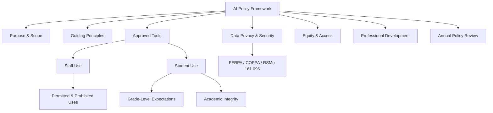

# District AI Acceptable Use Policy — Template

**District:** ___________________________________
**Board Policy Code:** ___ (suggested: IIBGA or local coding)
**Adopted:** ___________________________________
**Last Revised:** ___________________________________

## Table of Contents
- [Section 1: Purpose & Scope](#section-1-purpose-scope)
- [Section 2: Guiding Principles](#section-2-guiding-principles)
- [Section 3: Approved AI Tools](#section-3-approved-ai-tools)
- [Section 4: Staff Use of AI](#section-4-staff-use-of-ai)
  - [Permitted Uses](#permitted-uses)
  - [Prohibited Uses](#prohibited-uses)
  - [Required Practices](#required-practices)
- [Section 5: Student Use of AI](#section-5-student-use-of-ai)
  - [Grade-Level Expectations](#grade-level-expectations)
  - [Academic Integrity](#academic-integrity)
  - [Student AI Literacy](#student-ai-literacy)
- [Section 6: Data Privacy & Security](#section-6-data-privacy-security)
- [Section 7: Equity & Access](#section-7-equity-access)
- [Section 8: Professional Development](#section-8-professional-development)
- [Section 9: Transparency & Communication](#section-9-transparency-communication)
- [Section 10: Policy Review](#section-10-policy-review)
- [Section 11: Definitions](#section-11-definitions)

---

## Section 1: Purpose & Scope

### Purpose
[District name] recognizes that artificial intelligence (AI) tools are increasingly integrated into education and daily life. This policy establishes expectations for the responsible, safe, and equitable use of AI technologies by students, staff, and administrators to enhance teaching and learning while protecting student privacy, maintaining academic integrity, and ensuring human oversight.

### Scope
This policy applies to:
- All generative AI tools (e.g., ChatGPT, Claude, Gemini, Copilot, and similar)
- Adaptive learning platforms with AI capabilities
- AI-powered administrative tools
- AI features embedded in existing district-adopted platforms
- Use on district-owned devices and networks, AND personal devices used for school purposes

### Alignment
This policy aligns with:
- Missouri DESE AI Guidance for Local Education Agencies (Version 1.0, 2025-26)
- District technology Acceptable Use Policy (Policy ___)
- District academic integrity policy (Policy ___)
- Missouri SB 68 (electronic communication device restrictions)
- FERPA, COPPA, RSMo 161.096 (student data privacy)

---

## Section 2: Guiding Principles

1. **Human oversight:** All AI-generated content must be reviewed by a qualified human before use in instruction, communication, or decision-making.
2. **Enhancement, not replacement:** AI tools supplement human teaching and relationships — they do not replace them.
3. **Privacy first:** Student personally identifiable information (PII) must never be entered into public AI tools.
4. **Equity:** AI tools must be accessible to all students and must not reinforce bias or widen achievement gaps.
5. **Transparency:** AI use must be disclosed. Students, staff, and families should know when and how AI is being used.
6. **Academic integrity:** Students must demonstrate their own understanding. AI assistance must be disclosed per assignment expectations.
7. **Continuous learning:** This policy will be reviewed and updated annually as AI technology evolves.

---

## Section 3: Approved AI Tools

The district maintains an approved list of AI tools vetted for privacy, security, accuracy, and educational value. Only tools on the approved list may be used for instruction or with student data.

**Approved Tool List Location:** [District intranet/shared drive path]
**Approval Process:** Requests for new AI tools must be submitted to [Technology Director/Committee] for privacy and security review before classroom use.

| Category | Approved Tools | Grade Level |
|----------|---------------|-------------|
| Teacher productivity | [List] | Staff only |
| Adaptive learning | [List] | [Specify] |
| Student-facing generative AI | [List — if any] | [Specify; minimum age 13] |

**Unapproved tools:** Staff and students may not use AI tools not on the approved list for school-related purposes involving student data.

---

## Section 4: Staff Use of AI

### Permitted Uses
- Lesson planning, activity design, and resource creation
- Generating differentiated materials at multiple levels
- Creating assessment items (with human review for accuracy and alignment)
- Drafting communications (with human review before sending)
- Analyzing de-identified student data for instructional planning
- Professional learning and skill development

### Prohibited Uses
- Entering student PII (names, IDs, grades, IEP data, health info, behavioral records) into public AI tools
- Using AI to generate IEP goals, 504 accommodations, or evaluation reports without specialist review and customization
- Using AI to make disciplinary decisions without human review
- Using AI-generated content without reviewing for accuracy, bias, and appropriateness
- Using AI to evaluate teacher performance without human evaluator judgment
- Submitting AI-generated professional work as one's own without disclosure

### Required Practices
- Review all AI outputs for accuracy, bias, and alignment before use
- Disclose significant AI assistance in professional documents when appropriate
- Maintain student data privacy at all times
- Complete required AI professional development before using AI tools with students

---

## Section 5: Student Use of AI

### Grade-Level Expectations
| Grade Band | Permitted AI Use | Restrictions |
|-----------|-----------------|-------------|
| K-2 | Teacher-selected adaptive learning tools only | No student access to generative AI chatbots |
| 3-5 | Teacher-directed adaptive tools; AI-assisted practice; no independent generative AI use | Teacher supervises all AI interactions |
| 6-8 | Curriculum-embedded AI tools; teacher-guided generative AI use with disclosure | Students must verify AI outputs; AI use declared per assignment |
| 9-12 | Broader AI use as a learning tool with disclosure; AI literacy integrated into coursework | Original thinking demonstrated; AI use documented per assignment policy |

### Academic Integrity
- Students must disclose AI assistance according to assignment-specific instructions
- Submitting AI-generated work as one's own without disclosure is a violation of the academic integrity policy
- Teachers will specify AI expectations for each assignment: [Prohibited / Permitted with disclosure / Required]
- Consequences for AI-related academic integrity violations follow the existing academic integrity policy (Policy ___)

### Student AI Literacy
The district will integrate AI literacy into the curriculum aligned to Missouri Computer Science Standards, including:
- Understanding how AI works (age-appropriate)
- Evaluating AI outputs for accuracy and bias
- Responsible and ethical AI use
- AI career awareness

---

## Section 6: Data Privacy & Security

- **No student PII in public AI tools.** This includes names, student IDs, grades, test scores, IEP/504 information, health information, behavioral records, and any other personally identifiable information.
- **Vendor agreements:** All AI tools accessing student data must have FERPA-compliant data privacy agreements on file with the district.
- **COPPA compliance:** AI tools used by students under 13 must comply with COPPA. The district provides consent on behalf of parents for approved educational tools.
- **RSMo 161.096:** AI vendors must not use student data for commercial purposes.
- **Data entered into AI tools:** Staff may enter de-identified data, curriculum content, and non-PII instructional materials. When in doubt, consult [Technology Director].
- **Data breach:** Any suspected data breach involving AI tools must be reported immediately to [Technology Director] per the district data breach response plan.

---

## Section 7: Equity & Access

- The district will provide equitable access to approved AI tools for all students through district-provided devices and networks.
- AI tools will be evaluated for accessibility (WCAG 2.1 compliance) before adoption.
- AI tools will be monitored for bias in content, recommendations, and outputs.
- Students will not be advantaged or disadvantaged based on personal AI tool access outside of school.
- AI detection tools will not be used as sole evidence of academic dishonesty due to documented bias and unreliability.

---

## Section 8: Professional Development

Before using AI tools with students, staff must complete:
- [ ] District AI orientation (overview of this policy, approved tools, privacy requirements)
- [ ] Prompt engineering basics (effective, responsible use of generative AI)
- [ ] Subject-specific AI integration training (provided by department/grade-level teams)

Ongoing PD:
- Annual AI policy refresher
- Emerging tools and practices updates
- AI literacy curriculum training for teachers delivering AI content to students

---

## Section 9: Transparency & Communication

- This policy will be published on the district website and included in the student/parent handbook.
- Parents/guardians will be notified annually about AI tools used in classrooms.
- Parents may contact [designated contact] with questions or concerns about AI use.
- The district will host information sessions for parents on AI in education as needed.

---

## Section 10: Policy Review

This policy will be reviewed and updated **annually** by the district AI Task Force (or Technology Committee) to reflect:
- New AI tools and capabilities
- Updated DESE, state, or federal guidance
- Stakeholder feedback
- Emerging risks and best practices
- Changes in Missouri law

**Next review date:** ___________________________________

---

## Section 11: Definitions

- **Artificial Intelligence (AI):** technology that can perform tasks typically requiring human intelligence, including generating text, images, code, and analysis
- **Generative AI:** AI that creates new content (text, images, code) based on user prompts (e.g., ChatGPT, Claude, Gemini)
- **Adaptive learning platform:** educational software that adjusts content and difficulty based on student performance
- **Student PII:** personally identifiable information as defined by FERPA (34 CFR §99.3)
- **Public AI tool:** AI service available to the general public without a district-managed agreement (e.g., free ChatGPT, Gemini)
- **Approved AI tool:** AI service vetted and approved by the district for privacy, security, and educational value
