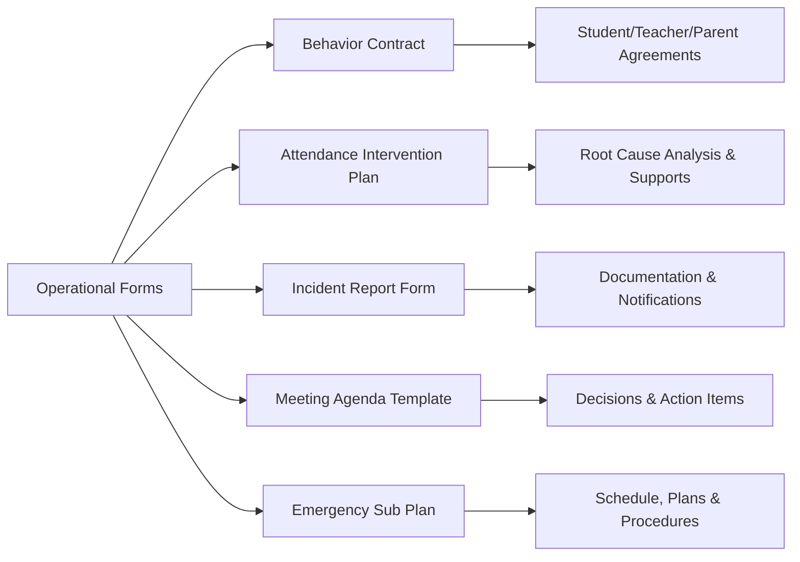

# Operational Forms

## Behavior Contract

**Student:** ___________________________ **Grade:** _____ **Date:** _______________
**Teacher/Staff:** ___________________________ **Parent:** ___________________________

### Behavior Concern
_______________________________________________________________________________

### Goal
_______________________________________________________________________________

### Student Agrees To
1. _______________________________________________________________________________
2. _______________________________________________________________________________
3. _______________________________________________________________________________

### Teacher/School Agrees To
1. _______________________________________________________________________________
2. _______________________________________________________________________________

### Parent Agrees To
1. _______________________________________________________________________________

### Positive Reinforcement (When goals are met)
_______________________________________________________________________________

### Consequence (When goals are not met)
_______________________________________________________________________________

### Check-In Schedule
☐ Daily ☐ Weekly ☐ Other: _______________

### Review Date
_______________

| Signature | Name | Date |
|-----------|------|------|
| Student | | |
| Teacher/Staff | | |
| Parent/Guardian | | |
| Administrator | | |

---

## Attendance Intervention Plan

**Student:** ___________________________ **Grade:** _____ **Date:** _______________
**School:** ___________________________ **Counselor/Team Lead:** ___________________________

### Current Attendance Data
| Metric | Value |
|--------|-------|
| Days enrolled | |
| Days attended | |
| Days absent (excused) | |
| Days absent (unexcused) | |
| Attendance rate | % |
| Chronic absence threshold (10%) | |
| A+ threshold (95%) | |

### Root Cause Analysis
☐ Medical/health ☐ Mental health ☐ Transportation ☐ Housing instability
☐ Family responsibilities ☐ Bullying/safety ☐ Academic frustration
☐ School avoidance/anxiety ☐ Employment ☐ Substance use ☐ Legal/court
☐ Other: _______________________________________________________________________________

### Barriers Identified
1. _______________________________________________________________________________
2. _______________________________________________________________________________

### Interventions
| Intervention | Responsible | Start Date | Check Date |
|-------------|------------|-----------|-----------|
| | | | |
| | | | |
| | | | |

### Supports Offered
☐ Counseling referral ☐ Transportation assistance ☐ Alarm clock/wake-up call
☐ Mentor assignment ☐ Schedule modification ☐ Academic support/tutoring
☐ Health referral ☐ Housing referral ☐ Community agency referral: ___
☐ Family meeting ☐ Home visit ☐ Other: ___

### Monitoring Plan
| Week | Attendance Status | Notes | Staff Initials |
|------|------------------|-------|---------------|
| 1 | | | |
| 2 | | | |
| 3 | | | |
| 4 | | | |

### Escalation
If no improvement after ___ weeks: ☐ Re-convene team ☐ Adjust plan ☐ Family meeting
☐ Referral to juvenile office ☐ Referral to Children's Division ☐ Other: ___

| Signature | Name | Date |
|-----------|------|------|
| Student | | |
| Parent/Guardian | | |
| Counselor/Lead | | |

---

## Incident Report Form

**School:** ___________________________ **Date of Incident:** _______________
**Time:** _______________ **Location:** ___________________________
**Reported by:** ___________________________ **Report Date:** _______________

### Students Involved
| Name | Grade | Role (involved/witness) |
|------|-------|------------------------|
| | | |
| | | |

### Staff Involved/Responding
| Name | Role |
|------|------|
| | |

### Incident Description
*What happened? Be specific, factual, and chronological.*
_______________________________________________________________________________
_______________________________________________________________________________
_______________________________________________________________________________

### Injuries
☐ None ☐ Yes — describe: _______________________________________________
**Medical attention provided:** ☐ No ☐ First aid ☐ Nurse ☐ EMS called

### Notifications
| Person | Method | Date/Time |
|--------|--------|-----------|
| Parent/Guardian of Student 1 | ☐ Phone ☐ In person ☐ Email | |
| Parent/Guardian of Student 2 | ☐ Phone ☐ In person ☐ Email | |
| Administration | ☐ Phone ☐ In person ☐ Email | |
| Law enforcement | ☐ Called ☐ SRO ☐ N/A | |
| DESE (if required under RSMo 160.261) | ☐ Yes ☐ N/A | |
| Children's Division (if abuse/neglect) | ☐ Yes ☐ N/A | Ref#: ___ |

### Category
☐ Physical altercation ☐ Verbal threat ☐ Bullying ☐ Harassment
☐ Weapons ☐ Substance (drugs/alcohol) ☐ Vandalism ☐ Theft
☐ Sexual incident ☐ Self-harm ☐ Medical emergency
☐ Other: _______________

### Immediate Actions Taken
_______________________________________________________________________________

### Consequence / Outcome
| Student | Consequence | Dates |
|---------|-----------|-------|
| | | |

### Follow-Up Needed
☐ Counseling referral ☐ Restorative conference ☐ FBA/BIP review
☐ IEP/504 team meeting ☐ Parent conference ☐ Safety plan
☐ Other: _______________

**Report completed by:** ___________________________ **Date:** _______________
**Administrator review:** ___________________________ **Date:** _______________

---

# Meeting Agenda Template

**Meeting:** ___________________________
**Date:** _______________ **Time:** _______________ **Location:** _______________
**Facilitator:** ___________________________ **Notetaker:** ___________________________

## Attendees
| Name | Role |
|------|------|
| | |
| | |

## Agenda

| # | Topic | Time | Lead | Action Needed |
|---|-------|------|------|--------------|
| 1 | Welcome / norms review | min | | |
| 2 | | min | | ☐ Info ☐ Discussion ☐ Decision |
| 3 | | min | | ☐ Info ☐ Discussion ☐ Decision |
| 4 | | min | | ☐ Info ☐ Discussion ☐ Decision |
| 5 | Action items / next steps | min | | |

## Decisions Made
1. _______________________________________________________________________________
2. _______________________________________________________________________________

## Action Items
| Action | Owner | Due Date |
|--------|-------|----------|
| | | |

## Next Meeting: _______________

---

# Emergency Substitute Teacher Plan

**Teacher:** ___________________________ **Room:** _____ **Date:** _______________

## Class Schedule
| Period | Time | Subject/Course | Room |
|--------|------|---------------|------|
| 1 | | | |
| 2 | | | |
| 3 | | | |
| 4 | | | |
| 5 | | | |
| 6 | | | |

## Seating Charts: ☐ On desk ☐ In sub folder ☐ Projected ☐ Posted

## Students to Watch For
| Student | Notes (medical, behavioral, IEP accommodation — brief) |
|---------|-------|
| | |

## Lesson Plans by Period
*(Keep each plan simple and self-contained — assume the sub has no context)*

**Period ___:** _______________________________________________________________________________
**Period ___:** _______________________________________________________________________________
**Period ___:** _______________________________________________________________________________

## Emergency Procedures
- **Fire:** exit via ___; assemble at ___
- **Tornado:** go to ___
- **Lockdown:** lock door, lights off, students away from door/windows
- **Medical:** call office (ext ___), send student with buddy

## Key People
| Person | Role | Location/Extension |
|--------|------|--------------------|
| Neighbor teacher | Help if needed | Room ___ / ext ___ |
| Administrator | Discipline referrals | Office / ext ___ |
| Nurse | Medical | ext ___ |
| Office | Attendance, supplies | ext ___ |

## End of Day
☐ Lock room ☐ Return keys to ___ ☐ Leave notes for teacher about: _______________
