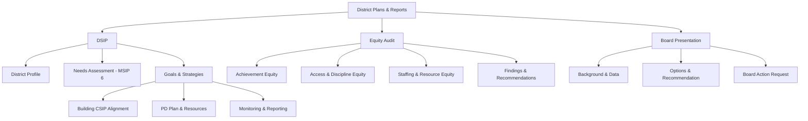

# District School Improvement Plan (DSIP) Template

**District:** ___________________________ **Superintendent:** ___________________________
**School Year:** _______________ **Board Adopted:** _______________

---

## 1. District Profile
| Metric | Value |
|--------|-------|
| Total enrollment | |
| Number of schools | |
| % Free/Reduced Lunch | |
| % Students with IEPs | |
| % English Learners | |
| Graduation rate (4-yr cohort) | |
| APR score | |
| Accreditation status | |

## 2. Mission, Vision, Values
**Mission:** _______________________________________________________________________________
**Vision:** _______________________________________________________________________________
**Core Values:** _______________________________________________________________________________

## 3. Needs Assessment Summary (Data-Driven)
| MSIP 6 Standard | Current Performance | Target | Gap |
|-----------------|-------------------|--------|-----|
| 1. Academic Achievement | | | |
| 2. Subgroup Achievement | | | |
| 3. College & Career Readiness | | | |
| 4. Attendance | | | |
| 5. School Quality/Climate | | | |

## 4. District Goals (3-5 year)

### Goal 1: ___________________________
| Element | Detail |
|---------|--------|
| MSIP 6 alignment | |
| Measurable target | |
| Strategies | |
| Evidence base | |
| Resources/budget | |
| Responsible | |
| Timeline | |
| Progress metrics | |

*(Repeat for Goals 2-5)*

## 5. How Building CSIPs Align
| School | CSIP Goal 1 | CSIP Goal 2 | DSIP Alignment |
|--------|-------------|-------------|----------------|
| | | | |

## 6. Professional Development Plan (District-Wide)
| PD Priority | Aligned to Goal | Audience | Timeline | Provider |
|-------------|----------------|----------|----------|---------|
| | | | | |

## 7. Resource Allocation
| Goal | Funding Source | Amount |
|------|--------------|--------|
| | | |

## 8. Monitoring & Reporting Schedule
| Review Point | Data Reviewed | Who Reviews | Decision Rules |
|-------------|--------------|------------|---------------|
| | | | |

## 9. Stakeholder Engagement Evidence
| Group | Method | Date | Key Input |
|-------|--------|------|-----------|
| | | | |

---

## Equity Audit Template

**District/School:** ___________________________ **Date:** _______________
**Audit Team Lead:** ___________________________

### 1. Academic Achievement Equity
| Metric | White | Black | Hispanic | IEP | ELL | FRL | Gap? |
|--------|-------|-------|----------|-----|-----|-----|------|
| ELA proficiency % | | | | | | | |
| Math proficiency % | | | | | | | |
| Graduation rate | | | | | | | |
| ACT composite avg | | | | | | | |

### 2. Access & Opportunity Equity
| Program | White % | Black % | Hispanic % | IEP % | ELL % | FRL % | Proportionate? |
|---------|---------|---------|-----------|-------|-------|-------|---------------|
| AP/IB enrollment | | | | | | | |
| Gifted identified | | | | | | | |
| Dual credit | | | | | | | |
| CTE concentrator | | | | | | | |
| Extracurricular | | | | | | | |

### 3. Discipline Equity
| Metric | White | Black | Hispanic | Male | Female | IEP | 504 | Disproportionate? |
|--------|-------|-------|----------|------|--------|-----|-----|------------------|
| Referral rate (per 100) | | | | | | | | |
| ISS rate (per 100) | | | | | | | | |
| OSS rate (per 100) | | | | | | | | |
| Expulsion rate | | | | | | | | |

### 4. Staffing Equity
| Metric | District | School A | School B | School C |
|--------|---------|----------|----------|----------|
| % experienced teachers (5+ yr) | | | | |
| % certified in content | | | | |
| Teacher turnover rate | | | | |
| Staff diversity (% non-white) | | | | |

### 5. Resource Equity
| Resource | Highest-poverty school | Lowest-poverty school | Equitable? |
|----------|----------------------|----------------------|-----------|
| Per-pupil spending | | | |
| Class size avg | | | |
| Technology (student:device) | | | |
| Counselor ratio | | | |
| Facility condition | | | |

### 6. Climate Equity (Survey Data Disaggregated)
| Climate Domain | White | Black | Hispanic | IEP | ELL | Gap > 10pts? |
|---------------|-------|-------|----------|-----|-----|-------------|
| Safety | | | | | | |
| Belonging | | | | | | |
| Engagement | | | | | | |
| Teacher-student relationships | | | | | | |

### 7. Policy Review
| Policy | Reviewed for disparate impact? | Findings |
|--------|-------------------------------|----------|
| Discipline code | ☐ | |
| Grading policy | ☐ | |
| Attendance policy | ☐ | |
| Gifted identification | ☐ | |
| AP/advanced course access | ☐ | |

### 8. Findings & Recommendations
| Finding | Recommendation | Priority | Responsible | Timeline |
|---------|---------------|----------|------------|---------|
| | | | | |

---

## Board Presentation Outline

**Topic:** ___________________________
**Presenter:** ___________________________
**Board Meeting Date:** _______________
**Estimated Time:** ___ minutes

### Slide 1: Title + Purpose
- What is this about? (one sentence)
- Why is it before the board? (information / discussion / action required)

### Slide 2: Background
- Context the board needs (2-3 bullet points max)
- How did we get here?

### Slide 3: Data
- Key data points that support the recommendation
- Visual: chart, table, or comparison
- Source cited

### Slide 4: Options/Recommendation
| Option | Pros | Cons | Cost |
|--------|------|------|------|
| A | | | |
| B | | | |
| Recommended | | | |

### Slide 5: Impact
- Who is affected? Students / Staff / Community / Budget
- Timeline for implementation
- Risks and mitigation

### Slide 6: Ask
- What do you need from the board? (approve / direct staff / table for further study)
- Next steps if approved
- Questions?

### Appendix (leave-behind, not presented)
- Detailed data tables
- Legal citations
- Peer district comparisons
- Public comment summary (if applicable)
