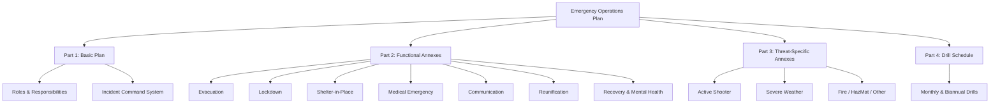

# School Emergency Operations Plan (EOP) — Outline

**Building:** ___________________________ **Principal:** ___________________________
**District:** ___________________________ **Last Updated:** _______________

*Based on FEMA Guide for Developing High-Quality School EOPs and RSMo 160.660*

---

## Part 1: Basic Plan

### 1.1 Purpose & Scope
- Purpose of this plan
- Hazards/threats addressed
- Scope (who, what, when, where)

### 1.2 Situation Overview
- Building description (enrollment, floors, exits, square footage)
- Hours of operation
- Surrounding area (roads, businesses, hazards)
- Historical incidents

### 1.3 Planning Assumptions
- Emergency can occur without warning
- Initial response falls to building staff
- Outside help may take [X] minutes to arrive

### 1.4 Roles & Responsibilities
| Role | Primary Person | Backup |
|------|---------------|--------|
| Incident Commander | | |
| Communications Lead | | |
| Operations (student accountability) | | |
| Medical / First Aid | | |
| Reunification Lead | | |
| Special Needs Coordinator | | |
| Media / Parent Communication | | |

### 1.5 Direction & Control
- Incident Command System (ICS) structure
- Transfer of command to emergency services
- Decision authority for evacuation, lockdown, shelter-in-place, dismissal

---

## Part 2: Functional Annexes

### 2.1 Evacuation
- Primary and secondary evacuation routes (attach maps)
- Assembly areas (primary and alternate)
- Student accountability procedures
- Persons needing assistance (mobility, medical, sensory)
- Reunification trigger

### 2.2 Lockdown
- Announcement protocol (plain language)
- Door lock procedures
- Barricade guidance
- Communication protocol during lockdown
- All-clear verification process

### 2.3 Shelter-in-Place
- When used (external hazard: chemical, weather, armed person outside)
- Procedures by location (classrooms, gym, cafeteria, outdoors)
- Ventilation shutdown procedures (HVAC)

### 2.4 Reverse Evacuation
- When used (outdoor threat, weather escalation)
- Re-entry procedures
- Accountability after re-entry

### 2.5 Drop/Cover/Hold (Earthquake)
- Immediate response
- Post-shake evacuation
- Building assessment before re-entry

### 2.6 Medical Emergency
- First aid/CPR-trained staff locations
- AED locations (list and map)
- Bleeding control kit locations
- EMS access points
- Student medical alert list (confidential — nurse maintains)

### 2.7 Communication
- Internal: PA, radios, text/app
- External: robocall/text to parents, website, social media
- Media: designated spokesperson, staging area
- DESE/law enforcement notification

### 2.8 Accounting for All Persons
- Classroom roster check (teacher responsibility)
- Reporting missing/extra students
- Visitor log integration
- Off-site students (field trips, CTE, work-based learning)

### 2.9 Reunification
- Reunification site: ___________________________
- Backup site: ___________________________
- Reunification process (Standard Reunification Method)
- ID verification and authorized pickup
- Student tracking documentation
- Special needs considerations
- Mental health support at reunification site

### 2.10 Recovery & Mental Health
- Crisis response team activation
- Counseling availability (acute and ongoing)
- Return-to-learning plan
- Staff debriefing and support
- Community resource coordination

---

## Part 3: Threat/Hazard-Specific Annexes

Complete a specific annex for each applicable hazard:

| Annex | Applicable? | Last Drill | Last Review |
|-------|-----------|-----------|------------|
| Active shooter / armed intruder | ☐ | | |
| Tornado / severe weather | ☐ | | |
| Earthquake | ☐ | | |
| Fire | ☐ | | |
| Bomb threat | ☐ | | |
| Hazardous materials | ☐ | | |
| Pandemic / disease outbreak | ☐ | | |
| Flooding | ☐ | | |
| Utility failure | ☐ | | |
| Bus accident | ☐ | | |
| Student/staff death | ☐ | | |
| Intruder (unarmed) | ☐ | | |
| Missing student | ☐ | | |

---

## Part 4: Drill Schedule

| Drill Type | Required Frequency | Scheduled Dates | Completed |
|-----------|-------------------|----------------|-----------|
| Fire | Monthly | | |
| Tornado | 2x/year | | |
| Earthquake | 2x/year | | |
| Lockdown | 2x/year | | |
| Bus evacuation | 1x/year | | |

---

## Appendices

- [ ] A: Building floor plans with evacuation routes, AED locations, fire extinguishers, shut-offs
- [ ] B: Emergency contact list (district admin, law enforcement, fire, EMS, hospital, DESE, utilities)
- [ ] C: Staff assignments (who does what by name)
- [ ] D: Student special needs roster (medical, mobility, behavioral — CONFIDENTIAL)
- [ ] E: Reunification site MOU
- [ ] F: Media statement templates
- [ ] G: After-action review template

---

**Annual Review Date:** _______________
**Reviewed by:** ___________________________
**Approved by (Superintendent):** ___________________________
