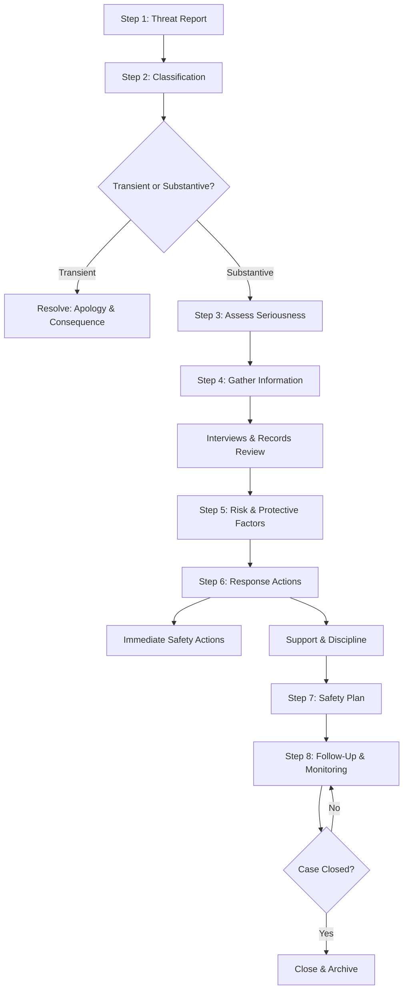

# Threat Assessment Documentation Form

*Aligned to Comprehensive School Threat Assessment Guidelines (CSTAG — Dr. Dewey Cornell)*
*CONFIDENTIAL — Maintain in secure threat assessment files*

**Date of Report:** _______________ **Time:** _______________
**School:** ___________________________ **Reporting Staff Member:** ___________________________
**Student of Concern:** ___________________________ **Grade:** _____ **DOB:** _______________

---

## Step 1: Threat Report

**How was the threat communicated?**
☐ Verbal statement ☐ Written ☐ Social media ☐ Drawing/artwork ☐ Gesture ☐ Other: _______________

**Exact words/actions (quote directly):**

_______________________________________________________________________________

_______________________________________________________________________________

**Target(s) identified:** ☐ Specific person(s): ___________________________ ☐ General/non-specific ☐ Self

**Witnesses:** _______________________________________________________________________________

**Context (what was happening before/during the threat):**

_______________________________________________________________________________

---

## Step 2: Threat Classification

### Is the threat TRANSIENT or SUBSTANTIVE?

**Transient threat** (expression of frustration, not serious intent):
☐ Student can explain it was not a real threat
☐ Statement made in jest, anger, or frustration without intent
☐ Student can articulate alternative meaning
☐ No planning, preparation, or means

**→ If transient:** resolve with apology, clarification, and appropriate consequence. **STOP HERE.**

**Substantive threat** (intent, planning, or sustained concern):
☐ Specific and plausible
☐ Repeated or sustained
☐ Involves a weapon or plan to acquire one
☐ Student cannot or will not retract convincingly
☐ Others perceive the threat as serious
☐ Evidence of planning or preparation

**→ If substantive:** continue to Step 3.

---

## Step 3: Substantive Threat Assessment

### Seriousness Level

**Serious substantive threat:**
☐ Threat to hit, fight, or harm — but no weapon or detailed plan
☐ Could result in injury but not likely lethal

**Very serious substantive threat:**
☐ Threat involving a weapon
☐ Threat of killing, sexual assault, or severe injury
☐ Detailed plan with specific method, time, or place
☐ Evidence of preparation (acquiring weapon, researching methods, writing manifesto)

---

## Step 4: Information Gathering

### Student Interview
| Question | Response |
|----------|---------|
| What happened? | |
| What did you mean? | |
| How were you feeling? | |
| What do you want to happen? | |
| Do you have access to weapons? | |
| Have you been thinking about hurting yourself or others? | |

### Target Interview
| Question | Response |
|----------|---------|
| What happened from your perspective? | |
| Has anything like this happened before? | |
| Are you afraid? Why/why not? | |
| Is there anything else we should know? | |

### Records Review
| Source | Reviewed? | Relevant Findings |
|--------|----------|------------------|
| Discipline history | ☐ | |
| Attendance records | ☐ | |
| Academic records | ☐ | |
| IEP/504 (if applicable) | ☐ | |
| Prior threat assessments | ☐ | |
| Social media (if available) | ☐ | |
| Law enforcement records (SRO) | ☐ | |

### Parent/Guardian Contact
**Parent contacted:** ☐ Yes ☐ No (document reason if no)
**Date/time:** _______________ **By whom:** ___________________________
**Parent response/information:**

_______________________________________________________________________________

---

## Step 5: Risk Factors & Protective Factors

### Risk Factors Present
☐ Access to weapons
☐ History of violence or aggression
☐ History of threats
☐ Substance use
☐ Mental health concerns (depression, psychosis, trauma)
☐ Recent significant loss or grievance
☐ Social isolation or rejection
☐ Fascination with violence or previous attacks
☐ Detailed planning or preparation
☐ Family instability or abuse
☐ Bullying victimization
☐ Suicidal ideation or self-harm

### Protective Factors Present
☐ Strong family support
☐ Positive peer relationships
☐ Connected to trusted adult at school
☐ Engaged in school activities
☐ Receiving mental health services
☐ Cooperative and willing to engage in safety planning
☐ No access to weapons
☐ Stable home environment

---

## Step 6: Response Actions

### Immediate Safety Actions
☐ Target notified and safety plan established
☐ Target's parents notified
☐ Student of concern's parents notified
☐ Student removed from setting (specify: ___________________________)
☐ Law enforcement notified (☐ SRO ☐ Local police ☐ Not warranted)
☐ Weapon search conducted (☐ Locker ☐ Backpack ☐ Vehicle ☐ N/A)
☐ Supervision increased

### Support Actions
☐ Mental health assessment referral
☐ Counseling initiated
☐ IEP/504 team convened (if applicable — MDR may be required)
☐ Safety plan developed (see below)
☐ Community mental health referral
☐ FBA/BIP initiated or revised

### Disciplinary Actions
☐ In-school consequence: ___________________________
☐ Short-term suspension: ___ days
☐ Long-term suspension recommended (hearing required)
☐ Alternative placement recommended
☐ Other: ___________________________

---

## Step 7: Safety Plan

| Element | Plan Detail |
|---------|------------|
| Supervision modifications | |
| Schedule modifications | |
| Check-in schedule (who, when) | |
| Counseling plan | |
| Parent communication plan | |
| Conditions for return to normal schedule | |
| Monitoring duration | |

---

## Step 8: Follow-Up

| Date | Action | By Whom | Outcome |
|------|--------|---------|---------|
| | | | |
| | | | |
| | | | |

**Case closed:** ☐ Yes — Date: _______________ ☐ Ongoing

---

## Threat Assessment Team Members

| Name | Role | Present at Assessment? |
|------|------|----------------------|
| | Administrator | ☐ |
| | School Counselor | ☐ |
| | School Psychologist | ☐ |
| | SRO / Law Enforcement | ☐ |
| | Teacher | ☐ |
| | Other: _______________ | ☐ |

**Team Lead Signature:** ___________________________ **Date:** _______________
